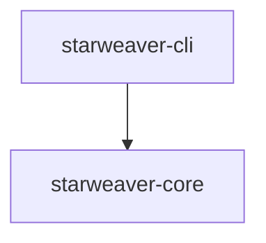

# Starweaver Agent SDK

Starweaver is a Rust monorepo for building an agent SDK, command-line tooling, and planned runtime/platform capabilities.

The repository starts with a minimal executable workspace and keeps planned architecture in `spec/` until crate boundaries have clear responsibilities and validation paths.

## Workspace



Current workspace members:

- `crates/starweaver-core` — shared SDK identity and early core primitives
- `crates/starweaver-cli` — `starweaver` command-line entry point

Planned areas are tracked in `spec/`:

- Model layer
- Runtime graph and executor
- Context, state, events, and message bus
- Filesystem, shell, resources, and sandbox mapping
- Tool definitions and execution
- Agent facade and lifecycle extensions
- CLI workflows
- Claw runtime services
- Agent platform capabilities

## Specs

Specs live under `spec/` and capture product and architecture decisions before new crates or public APIs are introduced.

Start with:

- `spec/README.md`
- `spec/01-runtime-architecture.md`
- `spec/02-model-layer.md`
- `spec/03-agent-runtime.md`
- `spec/04-context-state-environment.md`
- `spec/05-crate-plan.md`

## Development

Install pre-commit hooks:

```bash
make install
```

Run the core local checks:

```bash
make ci
```

Run repository-wide hooks:

```bash
make lint
```

Run the CLI:

```bash
make run-cli
```

Useful commands:

| Command          | Description                                |
| ---------------- | ------------------------------------------ |
| `make fmt`       | Format Rust code                           |
| `make fmt-check` | Check Rust formatting                      |
| `make clippy`    | Run clippy for all targets and features    |
| `make check`     | Run cargo check and clippy                 |
| `make test`      | Run workspace tests                        |
| `make build`     | Build the workspace                        |
| `make lint`      | Run pre-commit hooks across the repository |
| `make ci`        | Run formatting, check, clippy, and tests   |
| `make run-cli`   | Run the `starweaver` CLI                   |

## Repository

Git remote target:

```bash
git@github.com:Wh1isper/starweaver.git
```
