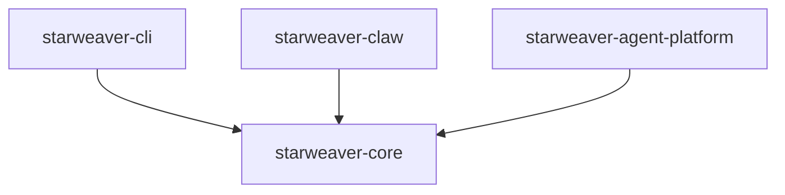

# Starweaver Agent SDK

Starweaver is a Rust monorepo for building agent SDK primitives, command-line tooling, runtime services, and agent platform foundations.

The repository starts with a minimal workspace and keeps the early surface focused on repository automation, CI, and command entry points.

## Workspace



Workspace members:

- `crates/starweaver-core` — core SDK primitives and shared abstractions
- `crates/starweaver-cli` — `starweaver` command-line entry point
- `crates/starweaver-claw` — runtime service foundations
- `crates/starweaver-agent-platform` — agent platform foundations

## Development

Install pre-commit hooks:

```bash
make install
```

Run the core local checks:

```bash
make ci
```

Run the CLI:

```bash
make run-cli
```

Useful commands:

| Command          | Description                                |
| ---------------- | ------------------------------------------ |
| `make fmt`       | Format Rust code                           |
| `make fmt-check` | Check Rust formatting                      |
| `make clippy`    | Run clippy for all targets and features    |
| `make check`     | Run cargo check and clippy                 |
| `make test`      | Run workspace tests                        |
| `make build`     | Build the workspace                        |
| `make lint`      | Run pre-commit hooks across the repository |
| `make ci`        | Run formatting, check, clippy, and tests   |
| `make run-cli`   | Run the `starweaver` CLI                   |

## Repository

Git remote target:

```bash
git@github.com:Wh1isper/starweaver.git
```
