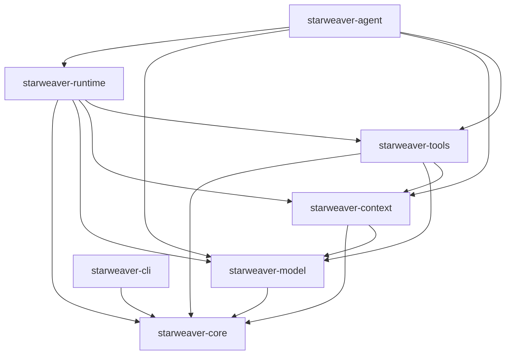
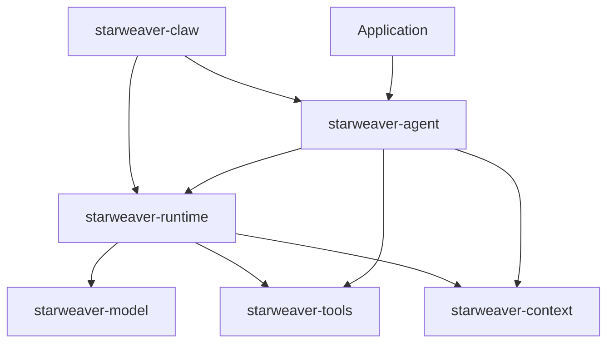

# Starweaver Agent SDK

Starweaver is a Rust workspace for building a provider-neutral agent SDK. The design borrows core agent ideas from [Pydantic AI](https://github.com/pydantic/pydantic-ai) and application runtime patterns from [ya-mono](https://github.com/Wh1isper/ya-mono), then expresses them as Rust-native layers for models, tools, runtime state, SDK applications, and durable service execution.

## Status

The current workspace has a tested v2 foundation:

- provider-neutral model messages, settings, profiles, native tool request definitions, protocol clients, and HTTP transport
- replay-validated wire mappers for OpenAI Chat Completions, OpenAI Responses, Anthropic Messages, Gemini generateContent, and Bedrock Converse
- core `Agent::run` with static and dynamic instructions, message history, semantic retry, typed stream events, durable executor checkpoints, and capability hooks
- function tool registry, reusable toolsets, prefixed toolsets, MCP toolset foundations, tool metadata, grouped tool instructions, prepare-tools hooks, approval/deferred control-flow metadata, per-tool retry budgets, and runtime tool execution loop
- structured JSON output schemas, typed structured result parsing, output validators, output functions, and semantic output retry
- deterministic `TestModel` and `FunctionModel` adapters plus a global production-request guard for application tests
- scoped agent override builder for replacing models, tools, settings, instructions, output schemas, validators, capabilities, executors, and policies in tests
- usage limits for request, input-token, output-token, total-token, tool-call, and cost budgets
- message history continuation with all/new message helpers and history processors for compaction, filtering, and system prompt reinjection
- `AgentContext` with typed dependencies, state export/restore, event bus, message bus, usage ledger, and runtime integration
- capability bundles that compose hooks, tools, instructions, settings, output validators/functions, history processors, and usage limits
- ergonomic `starweaver-agent` builder, `AgentApp`, SDK-level subagent registry, and test helpers

## Workspace



Current workspace members:

- `crates/starweaver-core` — shared SDK identity, IDs, metadata, and usage primitives
- `crates/starweaver-model` — model protocol, settings, profiles, provider mappers, transport, retry, and aliases
- `crates/starweaver-context` — AgentContext, resumable state, state store, event bus, message bus, and usage ledger
- `crates/starweaver-tools` — function tool schema, toolsets, tool registries, execution context, MCP foundations, and tool return handling
- `crates/starweaver-runtime` — core agent loop, tool loop, semantic retry, message history, executor checkpoints, context integration, and capability hooks
- `crates/starweaver-agent` — ergonomic SDK facade, `AgentBuilder`, `AgentApp`, and SDK subagent registry
- `crates/starweaver-cli` — `starweaver` command-line entry point

Planned crates remain in `spec/` until their boundaries are stable:

- `starweaver-environment` for filesystem, shell, resources, and sandbox mapping
- `starweaver-claw` for durable sessions and service runtime
- `starweaver-platform` for hosted orchestration capabilities

## Layering



- Model, tool schema, capability hooks, and the core agent loop live in the foundation crates.
- Tool implementations, subagent protocols, and application policies live in the SDK layer.
- Durable sessions, interruption, resume, SSE, and AGUI belong to the service runtime layer.

## Quick Example

```rust
use std::sync::Arc;
use starweaver_agent::AgentBuilder;

let agent = AgentBuilder::new(Arc::new(model))
    .instruction("Answer concisely.")
    .build();

let result = agent.run("What is the capital of France?").await?;
println!("{}", result.output);
```

With tools:

```rust
use std::sync::Arc;
use starweaver_agent::{AgentBuilder, FunctionTool, ToolContext, ToolRegistry, ToolResult};

let lookup = FunctionTool::new(
    "lookup",
    Some("Lookup a value".to_string()),
    serde_json::json!({
        "type": "object",
        "properties": {"query": {"type": "string"}},
        "required": ["query"]
    }),
    |_ctx: ToolContext, args: serde_json::Value| async move {
        Ok(ToolResult::new(serde_json::json!({"value": args["query"]})))
    },
);

let tools = ToolRegistry::new().with_tool(Arc::new(lookup));
let agent = AgentBuilder::new(Arc::new(model))
    .instruction("Use tools for lookups.")
    .tool_registry(tools)
    .build();

let result = agent.run("Look up Paris").await?;
println!("{}", result.output);
```

With an SDK app and subagent registry:

```rust
use std::sync::Arc;
use starweaver_agent::{AgentBuilder, SubagentConfig};
use starweaver_context::AgentContext;

let child = Arc::new(AgentBuilder::new(Arc::new(child_model)).build());
let app = AgentBuilder::new(Arc::new(parent_model))
    .subagent(SubagentConfig::new("research", child))
    .build_app();

let parent = app.run("Plan the answer.").await?;
let mut context = AgentContext::default();
let research = app
    .subagents()
    .delegate("research", "Gather supporting facts.", &mut context)
    .await?;
```

With structured output:

```rust
use std::sync::Arc;
use starweaver_agent::{AgentBuilder, OutputSchema};

let schema = OutputSchema::new(
    "answer",
    serde_json::json!({
        "type": "object",
        "properties": {"answer": {"type": "string"}},
        "required": ["answer"]
    }),
);

let agent = AgentBuilder::new(Arc::new(model))
    .output_schema(schema)
    .build();

let result = agent.run("Answer as JSON.").await?;
println!("{}", result.structured_output.unwrap()["answer"]);
```

With deterministic tests and scoped overrides:

```rust
use std::sync::Arc;
use starweaver_agent::{AgentBuilder, TestModel};

let agent = AgentBuilder::new(Arc::new(production_model)).build();
let test_agent = agent
    .override_config()
    .model(Arc::new(TestModel::with_text("test response")))
    .build();

let result = test_agent.run("hello").await?;
assert_eq!(result.output, "test response");
```

## Documentation

User-facing docs live under `docs/` and include runnable Rust examples. The published site uses mdBook with `book.toml` and `docs/SUMMARY.md`; `make docs-build` also writes `sitemap.xml` and `robots.txt` into the generated `book/` directory.

Start with:

- `docs/index.md`
- `docs/agent.md`
- `docs/models.md`
- `docs/tools.md`
- `docs/output.md`
- `docs/testing.md`

Validate docs examples and build the static site with:

```bash
python3 scripts/check-docs-examples.py
make docs-build
```

## Specs

Specs live under `spec/` and capture product and architecture decisions before public APIs stabilize. Working notes, design comparisons, implementation evidence, and release-preparation reminders live under `memos/`.

Start with:

- `spec/README.md`
- `spec/core/README.md`
- `spec/core/01-agent-loop.md`
- `spec/core/02-model-provider-replay.md`
- `spec/core/05-pydantic-ai-feature-map.md`
- `spec/sdk/README.md`
- `spec/sdk/02-environment-provider.md`
- `spec/sdk/05-ya-agent-sdk-integration-map.md`
- `spec/ops/01-ci-readiness.md`
- `memos/implementation-todo.md`

## Development

Install pre-commit hooks:

```bash
make install
```

Run the core local checks:

```bash
make ci
```

Useful commands:

| Command             | Description                                                |
| ------------------- | ---------------------------------------------------------- |
| `make fmt`          | Format Rust code                                           |
| `make fmt-check`    | Check Rust formatting                                      |
| `make check`        | Run cargo check and clippy                                 |
| `make replay-check` | Run model replay and request-parameter compatibility tests |
| `make docs-check`   | Compile Rust examples from docs                            |
| `make docs-build`   | Build the mdBook documentation site                        |
| `make test`         | Run workspace tests                                        |
| `make build`        | Build the workspace                                        |
| `make lint`         | Run pre-commit hooks across the repository                 |
| `make run-cli`      | Run the `starweaver` CLI                                   |

## License

BSD-3-Clause
