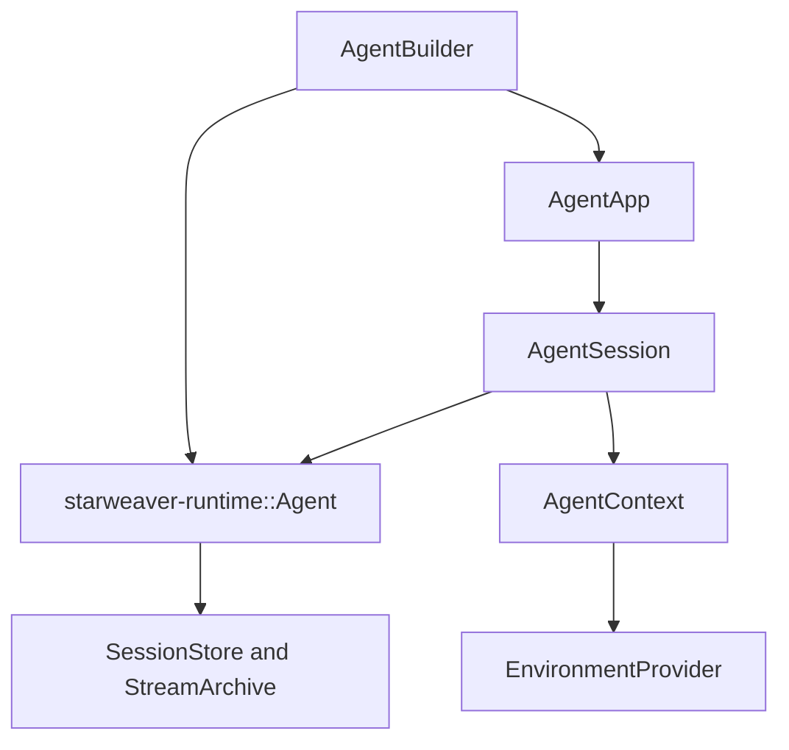

# Agent SDK

`starweaver-agent` is the application-facing SDK crate. It re-exports the stable pieces most
applications need while keeping lower-level crates available for advanced integrations.

## Main types

| Type                  | Purpose                                                                                    |
| --------------------- | ------------------------------------------------------------------------------------------ |
| `AgentBuilder`        | Configure model, instructions, tools, output, policy, capabilities, and subagents.         |
| `AgentApp`            | Application wrapper for sessions, subagent registry, and app-level helpers.                |
| `AgentSession`        | Multi-turn object that owns `AgentContext` next to a runtime agent.                        |
| `AgentContext`        | Run/session evidence: ids, history, dependencies, notes, state, usage, events, and config. |
| `AgentRuntimeBuilder` | Durable runtime builder for session stores, stream archives, and environment restore.      |
| `SubagentRegistry`    | Application-owned delegation registry for named child agents.                              |

## SDK layers



## Builder shape

```rust
use std::sync::Arc;

use starweaver_agent::{AgentBuilder, AgentRuntimePolicy, TestModel, UsageLimits};

# async fn example() -> Result<(), starweaver_agent::AgentError> {
let agent = AgentBuilder::new(Arc::new(TestModel::with_text("ok")))
    .agent_identity("support", "Support Agent")
    .instruction("Answer with the support policy.")
    .usage_limits(UsageLimits {
        request_limit: Some(4),
        ..UsageLimits::default()
    })
    .policy(AgentRuntimePolicy {
        max_steps: 8,
        ..AgentRuntimePolicy::default()
    })
    .build();

let result = agent.run("hello").await?;
assert_eq!(result.output, "ok");
# Ok(())
# }
```

## Runtime capabilities

Capabilities are extension hooks around the runtime loop. Use them for host policy, request
preparation, tool filtering, output validation, usage snapshots, trace recording, and custom
sideband events.

Common SDK capability sources:

- `default_filter_capabilities` for context compaction and media upload preparation.
- `EnvironmentContextCapability` for filesystem/shell context injection.
- `SkillDiscoveryCapability` for scanned skill packages.
- Custom `AgentCapability` implementations for product policy.

## First-party bundles

`starweaver-agent` includes bundles that can be attached without making the runtime crate depend
on product-specific implementations:

- `filesystem_tools()` for list, view, glob, grep, and file mutation helpers.
- `shell_tools()` for provider-scoped shell execution and background process handles.
- `task_tools()` for model-visible task tracking.
- `skill_tools(...)` for discovered skill packages.
- `host_operation_tools()` for host-backed search, scrape, download, and media adapters.
- `live_mcp_toolset(...)` for host-backed live MCP discovery and calls.

## Choosing the entry point

- Use `AgentBuilder::build()` for a reusable runtime agent.
- Use `AgentBuilder::build_app()` for app-owned sessions and subagents.
- Use `AgentRuntimeBuilder` when you need durable stores, stream archives, environment restore, or service runtime wiring.
- Use direct APIs such as `model_request` and `tool_call` when you want Starweaver's protocol mapping without the full agent loop.
