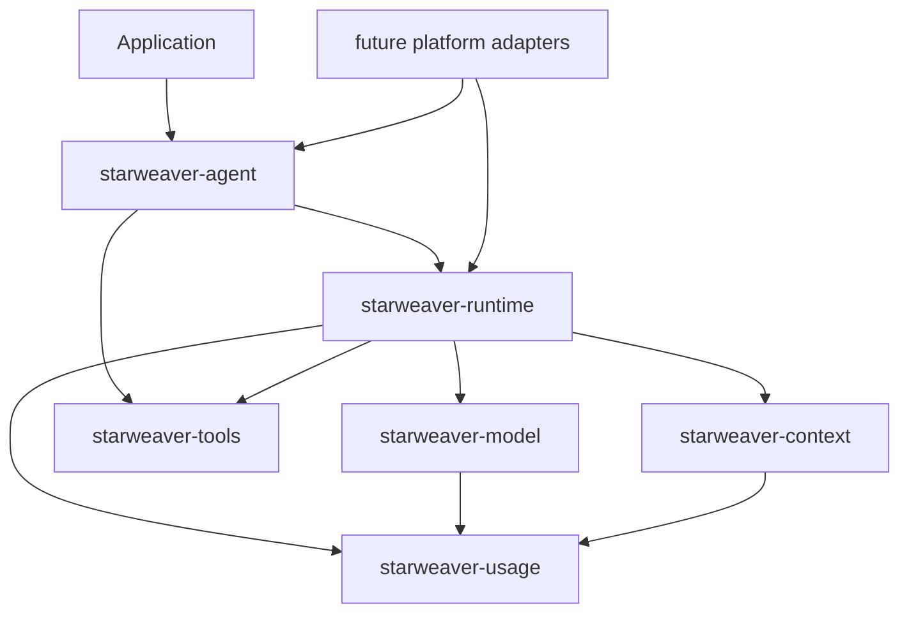

# Starweaver

Starweaver is a Rust agent SDK with provider-neutral model protocols, a checkpointable runtime, reusable tool schema, standalone usage accounting, and an application-facing SDK layer.

The project keeps Rust crate boundaries explicit:



## Current foundation

- `starweaver-usage` provides usage accounting, usage limits, snapshot contracts, and optional USD pricing estimates.
- `starweaver-model` provides canonical messages, provider profiles, request settings, protocol clients, replay-tested provider mappers, and deterministic test models.
- `starweaver-tools` provides tool definitions, function tools, toolsets, prefixed toolsets, registries, retry metadata, approval/deferred metadata, and MCP foundations.
- `starweaver-runtime` provides the core agent loop, output validation, tool loop, usage-limit enforcement, usage snapshot events, stream records, capability hooks, context integration, and executor checkpoints.
- `starweaver-agent` provides the SDK builder, app wrapper, facade re-exports, and SDK-level subagent registry.

## First run

```rust
use std::sync::Arc;

use starweaver_agent::{AgentBuilder, TestModel};

# async fn example() -> Result<(), starweaver_agent::AgentError> {
let agent = AgentBuilder::new(Arc::new(TestModel::with_text("Paris")))
    .instruction("Answer concisely.")
    .build();

let result = agent.run("What is the capital of France?").await?;
assert_eq!(result.output, "Paris");
# Ok(())
# }
```

## Documentation map

- [Install](install.md)
- [Testing](testing.md)
- [CLI](cli.md)
- [Agents](agent.md)
- [Models](models.md)
- [Direct APIs](direct.md)
- [Tools](tools.md)
- [Structured output](output.md)
- [Message history](message-history.md)
- [Dependencies](dependencies.md)
- [Capabilities](capabilities.md)
- [Graph inspection](graph.md)
- [Durability](durability.md)
- [Session and stream contracts](session-stream.md)
- [SDK apps](sdk-app.md)
- [Subagents](subagents.md)
- [MCP](mcp.md)
