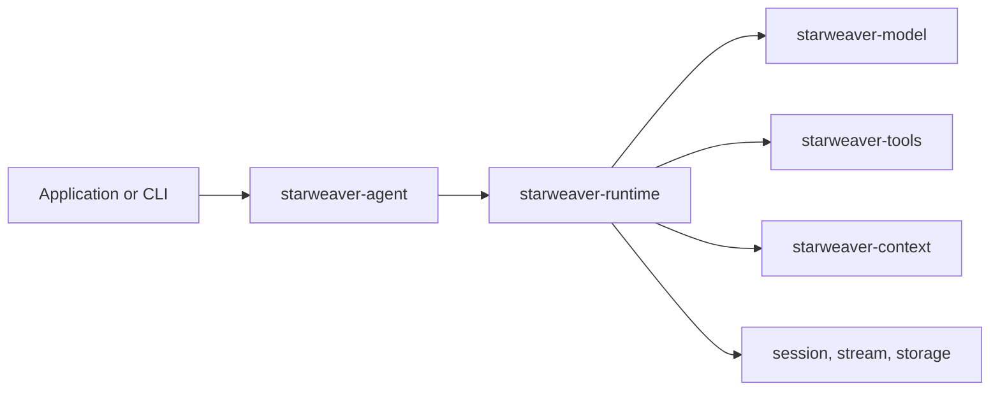

# Starweaver

Starweaver is a Rust agent SDK for local-first agent products. It combines a typed SDK facade,
a deterministic runtime loop, provider-neutral model and tool contracts, structured output,
durable session evidence, first-party environment tools, and a CLI surface.

Use it when you want application code to own the runtime contract instead of hiding the agent loop
behind provider-specific request formats.

## What you can build

- SDK agents with static and dynamic instructions.
- In-process Python agents and Python tool injection over the Rust runtime.
- Provider-neutral model integrations and deterministic test models.
- Typed function tools, toolsets, MCP-backed tools, and host-backed tools.
- Structured JSON output with typed parsing and validation retry.
- Multi-turn sessions with `AgentContext`, usage, dependencies, notes, and resumable state.
- Subagent registries for application-owned delegation.
- Durable runtimes with checkpoints, display streams, replay records, and SQLite adapters.
- Local CLI workflows with profiles, launcher dispatch, install/update, and display JSONL.

## Learning path

01. [Install](install.md): install from release artifacts or run from source.
02. [Quickstart](quickstart.md): build and run your first agent.
03. [Agent SDK](agent-sdk.md): understand the SDK surface and crate boundaries.
04. [Python SDK](python-sdk.md): inject Python tools into the same runtime.
05. [Python Tools](python/tools.md): add in-process Python tools and toolsets.
06. [Python Examples](python/examples.md): run complete Python examples.
07. [Tools](tools.md): add Rust typed function tools and toolsets.
08. [Structured Output](output.md): return JSON with schemas and typed parsing.
09. [Session and Stream Contracts](session-stream.md): integrate durable product surfaces.
10. [Release](release.md): prepare and publish Starweaver releases.

## Stability

The public surface focuses on SDK foundations, deterministic testing, tool/runtime contracts, local
CLI workflows, and release automation. Some host integration surfaces are intentionally explicit:
live external resources, product-specific service transports, and hosted platform adapters remain
integration points rather than hidden defaults.
