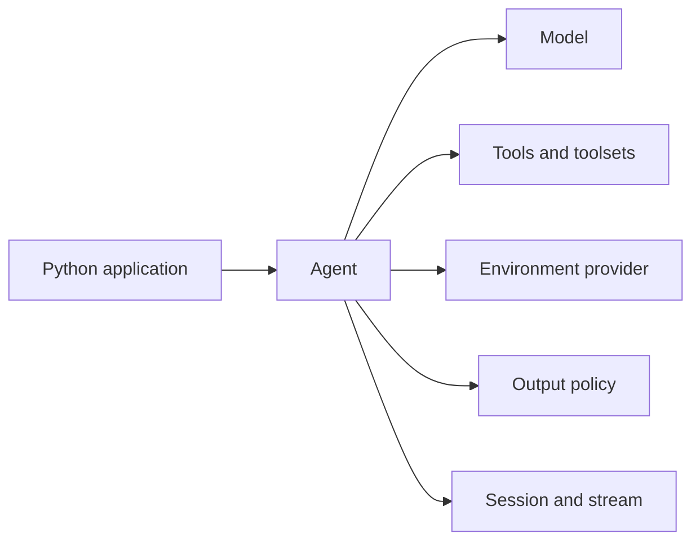

# Python SDK

The `starweaver` Python package is an in-process SDK facade over the
Starweaver Rust runtime. Python owns ergonomic adapters for agents, tools,
models, sessions, resources, and tests; Rust remains the source of truth for
the agent loop, model request preparation, tool scheduling, retry policy,
HITL state, stream records, usage, and trace boundaries.

Use the Python SDK when application code is Python but the runtime contract
must stay the same as the Rust SDK. Python tools are injected directly through
PyO3 as native Starweaver runtime tools. They do not use MCP, stdio, or a
sidecar binary protocol.

Result and stream evidence keeps the canonical Rust JSON available while
exposing typed helpers for common application code. `RunResult.usage`,
`RunResult.usage_snapshot`, `RunResult.trace_metadata`,
`StreamEvent.usage_record`, and `StreamEvent.usage_snapshot` wrap usage and
trace records without changing `raw_state` or `StreamEvent.raw`.

## Install From A Checkout

Local development uses `uv` from the repository root. The repository default
interpreter is Python 3.13 through `.python-version`; supported package targets
are CPython 3.11 through 3.13.

```bash
make py-sync
make py-test
```

## First Agent

`create_agent()` builds a reusable agent facade. `TestModel` is deterministic
and does not call an external provider.

```python
import asyncio

from starweaver import create_agent
from starweaver.testing import TestModel


async def main() -> None:
    agent = create_agent(model=TestModel.text("ready"))
    result = await agent.run("Say ready")
    assert result.output == "ready"


asyncio.run(main())
```

The main learning path is feature-oriented. Each page introduces one surface,
then shows how it composes with the rest of the SDK:

- [Agents](python/agents.md): `create_agent()`, sessions, per-run overrides,
  and stream lifecycle.
- [Tools](python/tools.md): `@tool`, `BaseTool`, Pydantic arguments, control
  flow, retry, timeout, and parallel execution.
- [Toolsets](python/toolsets.md): static groups, `AbstractToolset`,
  `FunctionToolset`, durable ID validation, lifecycle policy and reports,
  dynamic factories, native wrapper combinators including metadata wrappers,
  tool search, tool proxy, environment-backed tools, and capability bundles.
- [Models](python/models.md): deterministic models, production providers,
  Codex OAuth, request params, and model settings.
- [Structured Output](python/output.md): `OutputSchema`, `OutputPolicy`,
  validators, output functions, and media output gates.
- [Sessions and Streams](python/sessions-streams.md): state export, archives,
  canonical stream records, native SQLite session/replay/archive stores,
  durable `AgentRuntime` store binding, active control, and HITL resume.
- [Environments and Skills](python/environments-skills.md): virtual/local
  providers, file and shell facades, resource authority, first-party
  environment tools, and native skill packages.
- [Resources and Media](python/media.md): `ResourceRef`, `ResourceRegistry`,
  media upload callbacks, and runtime media capabilities.
- [Testing](python/testing.md): deterministic models, callback models,
  example patterns, and local package gates.
- [Examples](python/examples.md): complete runnable examples, including a
  provider smoke test against a configured local OAuth profile.
- [Stability and Known Gaps](python/stability.md): explicit boundaries that
  should not be mistaken for final API design.

## Composition Model

Python applications should compose Starweaver through small, explicit units:



The same objects can be attached at different scopes. Agent-level defaults are
reused by every run. Per-run options override one invocation without mutating
the agent. Session-level state keeps message history, message-bus records,
pending HITL state, and resumable runtime state.

## Stream Boundary

`run_stream()` currently returns an `AgentRun` facade over Starweaver stream
records. The facade is an async iterator and exposes `recv()`, `join()`,
`result()`, `status()`, `recoverable_state()`, `interrupt()`, and active
message helpers. The stable contract to depend on is the canonical
`StreamEvent.raw` record shape and collected run result. Python live-control
ergonomics are intentionally documented as the current facade, not as a
separately frozen live-handle protocol.

Use [Sessions and Streams](python/sessions-streams.md) for the exact lifecycle
rules and [Stability and Known Gaps](python/stability.md) for the parts that
should remain easy to refactor.

## Local Gates

Run the Python package gate before sending Python SDK changes:

```bash
make py-check
```

After changing docs examples, run:

```bash
make docs-check
make docs-build
```
