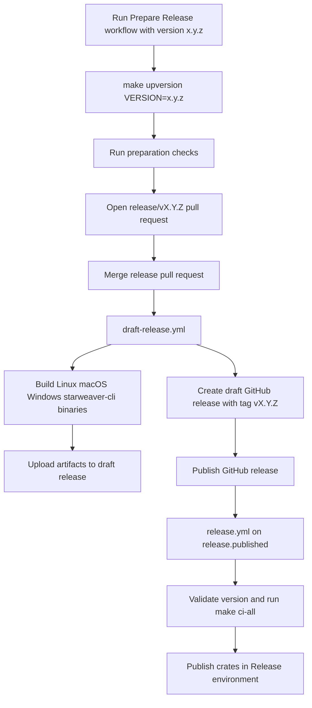

# Release

Starweaver releases use workspace-wide semver, an automated release-preparation pull request, draft GitHub Releases with binary artifacts, and crates.io publishing in dependency order after the draft is published.

## Release flow



## Prepare a release

Run the `Prepare Release` GitHub Actions workflow and enter a semver version such as `0.2.0`.

```bash
gh workflow run prepare-release.yml -f version=0.2.0 -f run_full_ci=true
```

Configure `RELEASE_PR_TOKEN` as a repository secret when the generated release pull request should trigger the normal pull-request CI workflows. A fine-grained token with contents, pull-request, and issues write access can create the branch, open the pull request, and apply the release label. The workflow falls back to `GITHUB_TOKEN` for repositories that allow that behavior.

The workflow runs:

```bash
make upversion VERSION=0.2.0
make fmt-check
make check
make docs-build
```

When `run_full_ci` is enabled, it runs:

```bash
make ci-all
```

The workflow opens a pull request from `release/v0.2.0` with the version changes. Merge that pull request after CI passes.

## Draft release

When a `release/vX.Y.Z` pull request is merged into `main`, `draft-release.yml` validates the merged release commit, runs `make ci-all`, builds `starweaver-cli` binaries, creates a draft GitHub Release for tag `vX.Y.Z`, and uploads the binary archives to that draft release.

Review the draft release, release notes, target commit, and assets before publishing it.

## Local upversion

The same version update can be run locally:

```bash
make upversion VERSION=0.2.0
```

This runs `xtask upversion`, updates `Cargo.toml`, refreshes `Cargo.lock` with `cargo metadata`, and runs a locked workspace check.

## Publish

Publishing the draft GitHub Release triggers `release.yml` through `release.published`. The workflow checks out the release tag, verifies that the tag version matches `[workspace.package].version`, runs `make ci-all`, and publishes crates through the `Release` environment.

The release workflow publishes crates in dependency order:

1. `starweaver-core`
2. `starweaver-model`
3. `starweaver-context`
4. `starweaver-tools`
5. `starweaver-runtime`
6. `starweaver-agent`
7. `starweaver-cli`

Configure the GitHub environment named `Release` and store `CARGO_REGISTRY_TOKEN` there. The `publish-crates` job uses that environment, so environment protection rules can approve the crates.io publish step.

The publish step treats an already-published crate version as complete so a retry can continue the dependency chain.

## Local dry run

```bash
make publish-dry-run
```

The local dry run packages and verifies `starweaver-core`. Dependent crates can be dry-run after their internal Starweaver dependencies are available in the crates.io index. The release workflow publishes crates in order and retries each crate while the index catches up.

## Binary artifacts

The draft release workflow builds `starweaver-cli` artifacts for:

- `starweaver-cli` for `x86_64-unknown-linux-gnu`
- `starweaver-cli` for `x86_64-apple-darwin`
- `starweaver-cli` for `aarch64-apple-darwin`
- `starweaver-cli.exe` for `x86_64-pc-windows-msvc`

Artifacts are uploaded to the draft GitHub Release generated from the `vX.Y.Z` tag.
