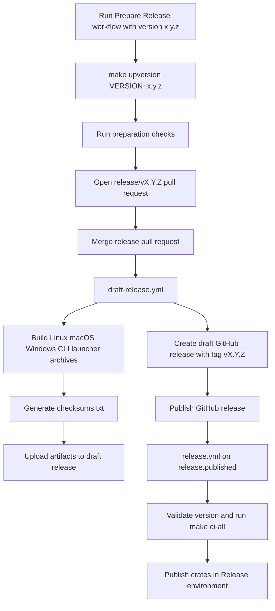

# Release

Starweaver releases use workspace-wide semver, an automated release-preparation pull request, draft GitHub Releases with binary artifacts, and crates.io publishing in dependency order after the draft is published.

## Release flow



## Prepare a release

Run the `Prepare Release` GitHub Actions workflow and enter a semver version such as `0.2.0`.

```bash
gh workflow run prepare-release.yml -f version=0.2.0 -f run_full_ci=true
```

Configure `RELEASE_PR_TOKEN` as a repository secret when the generated release pull request should trigger the normal pull-request CI workflows. A fine-grained token with contents, pull-request, and issues write access can create the branch, open the pull request, and apply the release label. The workflow falls back to `GITHUB_TOKEN` for repositories that allow that behavior.

The workflow runs:

```bash
make upversion VERSION=0.2.0
make fmt-check
make check
make docs-build
```

When `run_full_ci` is enabled, it runs:

```bash
make ci-all
```

The workflow opens a pull request from `release/v0.2.0` with the version changes. Merge that pull request after CI passes.

## Draft release

When a `release/vX.Y.Z` pull request is merged into `main`, `draft-release.yml` validates the merged release commit, runs `make ci-all`, builds CLI launcher binaries and Claw binaries, creates a draft GitHub Release for tag `vX.Y.Z`, and uploads binary archives plus `checksums.txt` to that draft release.

Review the draft release, release notes, target commit, install command, update command, alias behavior, and assets before publishing it.

## Local upversion

The same version update can be run locally:

```bash
make upversion VERSION=0.2.0
```

This runs `xtask upversion`, updates `Cargo.toml`, refreshes `Cargo.lock` with `cargo metadata`, and runs a locked workspace check.

## Publish

Publishing the draft GitHub Release triggers `release.yml` through `release.published`. The workflow checks out the release tag, verifies that the tag version matches `[workspace.package].version`, runs `make ci-all`, and publishes crates through the `Release` environment.

The release workflow publishes crates in dependency order:

1. `starweaver-core`
2. `starweaver-model`
3. `starweaver-context`
4. `starweaver-tools`
5. `starweaver-runtime`
6. `starweaver-agent`
7. `starweaver-cli`

Configure the GitHub environment named `Release` and store `CARGO_REGISTRY_TOKEN` there. The `publish-crates` job uses that environment, so environment protection rules can approve the crates.io publish step.

The publish step treats an already-published crate version as complete so a retry can continue the dependency chain.

## Local dry run

```bash
make publish-dry-run
```

The local dry run packages and verifies `starweaver-core`. Dependent crates can be dry-run after their internal Starweaver dependencies are available in the crates.io index. The release workflow publishes crates in order and retries each crate while the index catches up.

## Binary artifacts

The draft release workflow builds CLI archives for:

- `starweaver-cli-vX.Y.Z-x86_64-unknown-linux-gnu.tar.gz`
- `starweaver-cli-vX.Y.Z-x86_64-apple-darwin.tar.gz`
- `starweaver-cli-vX.Y.Z-aarch64-apple-darwin.tar.gz`
- `starweaver-cli-vX.Y.Z-x86_64-pc-windows-msvc.zip`

It also builds Claw archives for:

- `starweaver-claw-vX.Y.Z-x86_64-unknown-linux-gnu.tar.gz`
- `starweaver-claw-vX.Y.Z-x86_64-apple-darwin.tar.gz`
- `starweaver-claw-vX.Y.Z-aarch64-apple-darwin.tar.gz`
- `starweaver-claw-vX.Y.Z-x86_64-pc-windows-msvc.zip`

Unix archives contain:

```text
starweaver
starweaver-cli
sw
```

Windows CLI archives contain:

```text
starweaver.exe
starweaver-cli.exe
sw.exe
```

Unix Claw archives contain:

```text
starweaver-claw
```

Windows Claw archives contain:

```text
starweaver-claw.exe
```

The Claw binary build runs `pnpm test` and `pnpm build` in `crates/starweaver-claw/web` before `cargo build`, so the release binary embeds the current production console bundle.

The draft release also includes `checksums.txt` with SHA-256 checksums for all archives. `scripts/install.sh` downloads these artifacts, verifies checksums when present, installs `starweaver`, `starweaver-cli`, and `sw` for CLI installs, and installs `starweaver-claw` for Claw installs.

## Claw Docker image

`Dockerfile.starweaver-claw` builds a production service image with the same embedded web console path as release binaries:

```bash
make docker-build-claw
make docker-run-claw
```

The Docker build has three stages:

1. Node builds and tests `crates/starweaver-claw/web` with pnpm 10.30.3.
2. Rust builds `starweaver-claw` in release mode after the build script copies the generated web `dist` into `OUT_DIR` for `include_dir!`.
3. Debian slim runs `starweaver-claw start` as an unprivileged user on port 9042.

The image accepts build metadata through `YA_CLAW_SERVICE_VERSION`, `YA_CLAW_SERVICE_COMMIT`, `YA_CLAW_SERVICE_BUILD`, and `YA_CLAW_SERVICE_IMAGE` build args. The runtime exposes the values through `/api/v1/claw/info`.

`.github/workflows/claw-image.yml` validates image builds on pull requests that touch Claw, crate, Docker, or workflow inputs. It publishes `ghcr.io/<owner>/starweaver-claw:dev` on main and publishes release-tag plus `latest` images when a GitHub Release is published.

Local release smoke for CLI artifacts:

```bash
make cli-smoke
```

This builds the release CLI package and exercises launcher version, `sw cli version`, shell completion generation, setup, a deterministic run, session listing, and update dry-run behavior.

## Install and update commands

Latest install:

```bash
curl -fsSL https://raw.githubusercontent.com/Wh1isper/starweaver/main/scripts/install.sh | sh
```

Pinned install:

```bash
STARWEAVER_VERSION=v0.1.0 curl -fsSL https://raw.githubusercontent.com/Wh1isper/starweaver/main/scripts/install.sh | sh
```

Update CLI launcher binaries:

```bash
starweaver update
starweaver update cli
starweaver cli update
```

Update Claw binaries explicitly:

```bash
starweaver update claw
starweaver claw update
```

CLI update commands set `STARWEAVER_COMPONENTS=cli`; Claw update commands set `STARWEAVER_COMPONENTS=claw`. Claw is not updated automatically during CLI updates.
