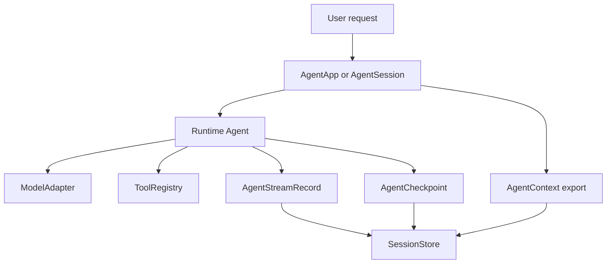

# SDK Apps

`AgentApp` keeps application-facing protocols above the core runtime. It wraps a runtime agent and carries SDK-level registries such as subagents.

```rust
use std::sync::Arc;

use starweaver_agent::{AgentBuilder, TestModel};

# async fn example() -> Result<(), starweaver_agent::AgentError> {
let app = AgentBuilder::new(Arc::new(TestModel::with_text("planned")))
    .instruction("Plan before answering.")
    .build_app();

let result = app.run("plan").await?;
assert_eq!(result.output, "planned");
assert_eq!(app.subagents().subagents().len(), 0);
# Ok(())
# }
```

Use `build()` when only the core runtime agent is needed. Use `build_app()` when the application needs SDK protocols such as subagent delegation or session management.

Set SDK identity when hosts need stable attribution in context registries, usage ledgers, display streams, or subagent parent records. The configured identity is used for default sessions and direct runs that create their own context; caller-provided contexts keep their own identity.

```rust
use std::sync::Arc;

use starweaver_agent::{AgentBuilder, TestModel};

# async fn example() -> Result<(), starweaver_agent::AgentError> {
let app = AgentBuilder::new(Arc::new(TestModel::with_text("ok")))
    .agent_identity("support-main", "Support Main")
    .build_app();

let session = app.session();
assert_eq!(session.context().agent_id.as_str(), "support-main");
assert_eq!(
    session.context().agent_registry["support-main"].agent_name,
    "Support Main"
);
# Ok(())
# }
```

## Sessions

`AgentSession` keeps an `AgentContext` next to the app's runtime agent. Use it for multi-turn applications that need message history, usage, state, events, typed dependencies, and export/restore through one SDK object.

During each run, `AgentContext` also records compact-restore inputs: `user_prompts` for the current effective request, `previous_assistant_response_reference` for resolving references in that request, and accumulated `steering_messages`. These fields round-trip through exported state so compact restore can reconstruct `<context-restored>`, `<previous-assistant-reference>`, `<original-request>`, and `<user-steering>` without guessing from history.

```rust
use std::sync::Arc;

use starweaver_agent::{AgentBuilder, FunctionModel, Usage};
use starweaver_model::ModelResponse;

# async fn example() -> Result<(), starweaver_agent::AgentError> {
let model = FunctionModel::new(|_messages, _settings, _info| {
    Ok(ModelResponse {
        usage: Usage {
            requests: 1,
            ..Usage::default()
        },
        ..ModelResponse::text("ok")
    })
});
let app = AgentBuilder::new(Arc::new(model)).build_app();
let mut session = app.session();

let first = session.run("hello").await?;
let second = session.run("again").await?;

assert_eq!(first.output, "ok");
assert_eq!(second.output, "ok");
assert_eq!(session.context().usage.requests, 2);
# Ok(())
# }
```

Hosts that meter external services can add cumulative non-model usage to the
same snapshot ledger. Updates with the same external source and usage id replace
the prior entry instead of double-counting it.

```rust
use std::sync::Arc;

use starweaver_agent::{AgentBuilder, PricingEstimate, TestModel, Usage};
use starweaver_core::RunId;

# async fn example() -> Result<(), starweaver_agent::AgentError> {
let app = AgentBuilder::new(Arc::new(TestModel::with_text("ok"))).build_app();
let mut session = app.session();
session.context_mut().run_id = Some(RunId::from_string("run-usage"));

let snapshot = session.context_mut().update_external_usage_snapshot_entry(
    "embedding-cache",
    "Embedding cache",
    "cache-model",
    Usage {
        requests: 1,
        input_tokens: 8,
        total_tokens: 8,
        ..Usage::default()
    },
    Some(PricingEstimate::from_micros_usd(11)),
    Some("usage-cache-1".to_string()),
);

assert_eq!(snapshot.entries[0].source, "external");
assert_eq!(snapshot.model_usages["cache-model"].total_tokens, 8);
# Ok(())
# }
```

Pricing estimates are optional. Built-in model prices are release-bound,
best-effort snapshots; hosts that need exact contract billing should attach
their own `PricingEstimate` values to usage snapshot entries or enforce a
caller-owned `CostBudget`.

Use per-run options to add instructions, settings, request parameters, or tools for one run while preserving the reusable session agent.

```rust
use std::sync::Arc;

use starweaver_agent::{
    AgentBuilder, AgentRunOptions, FunctionTool, TestModel, ToolContext, ToolResult,
};

# async fn example() -> Result<(), starweaver_agent::AgentError> {
let run_tool = Arc::new(FunctionTool::new(
    "lookup",
    Some("Lookup run-scoped data".to_string()),
    serde_json::json!({"type": "object"}),
    |_ctx: ToolContext, args: serde_json::Value| async move { Ok(ToolResult::new(args)) },
));
let app = AgentBuilder::new(Arc::new(TestModel::with_text("done"))).build_app();
let mut session = app.session();

let result = session
    .run_with_options(
        "use the run tool",
        AgentRunOptions::new()
            .instruction("This instruction applies to this run.")
            .tool(run_tool),
    )
    .await?;

assert_eq!(result.output, "done");
# Ok(())
# }
```

Configure a dedicated compacting model when the default filters should summarize long history with a cheaper or safer model than the primary runtime model.

```rust
use std::sync::Arc;

use starweaver_agent::{AgentBuilder, ModelSettings, TestModel};

# async fn example() -> Result<(), starweaver_agent::AgentError> {
let app = AgentBuilder::new(Arc::new(TestModel::with_text("answer")))
    .compact_model(Arc::new(TestModel::with_text(
        "## Condensed conversation summary\n\n### Analysis\n\nSummary.",
    )))
    .compact_model_settings(ModelSettings {
        max_tokens: Some(1024),
        ..ModelSettings::default()
    })
    .build_app();

let mut session = app.session();
let result = session.run("hello").await?;
assert_eq!(result.output, "answer");
# Ok(())
# }
```

Restore a session from exported state when an application persists context between process lifetimes.

```rust
use std::sync::Arc;

use starweaver_agent::{AgentBuilder, FunctionModel, Usage};
use starweaver_model::ModelResponse;

# async fn example() -> Result<(), starweaver_agent::AgentError> {
let model = FunctionModel::new(|_messages, _settings, _info| {
    Ok(ModelResponse {
        usage: Usage {
            requests: 1,
            ..Usage::default()
        },
        ..ModelResponse::text("ok")
    })
});
let app = AgentBuilder::new(Arc::new(model)).build_app();
let mut session = app.session();
session.run("hello").await?;

let state = session.export_full_state();
let mut restored = app.session_from_state(state);
let result = restored.run("again").await?;

assert_eq!(result.output, "ok");
assert_eq!(restored.context().usage.requests, 2);
# Ok(())
# }
```

Owned runtimes can also restore an active environment provider from an exported provider state. `EnvironmentProviderFactoryRegistry::portable_defaults()` includes the virtual provider factory, including virtual process snapshots; local provider restore requires a host-supplied trusted policy factory. Hosts can pass a `ResourceRestoreFactoryRegistry` to `AgentRuntime::restore_environment_from_state_with_resources` when exported `ResourceRef` values need external restore or URI rewriting before provider restore.

```rust
use std::sync::Arc;

use starweaver_agent::{agent_runtime, EnvironmentProviderFactoryRegistry, TestModel};
use starweaver_environment::VirtualEnvironmentProvider;

# async fn example() -> Result<(), Box<dyn std::error::Error>> {
let environment = Arc::new(
    VirtualEnvironmentProvider::new("workspace")
        .with_file("README.md", "hello"),
);
let mut runtime = agent_runtime(Arc::new(TestModel::with_text("ok")))
    .environment(environment)
    .build();

let state = runtime.export_environment_state().await?.expect("environment state");
let factories = EnvironmentProviderFactoryRegistry::portable_defaults();
runtime.restore_environment_from_state(&factories, &state)?;

let restored = runtime.export_environment_state().await?.expect("environment state");
assert_eq!(restored.files["README.md"], "hello");
# Ok(())
# }
```

## HITL and deferred resume

When a run returns `RunStatus::Waiting` because tools require approval or deferred worker results, keep the `AgentSession` and resume through `AgentHitlResults`. The session stores the latest waiting `AgentRunState`, accepts original or normalized tool call ids, repairs pending tool returns, and continues the next model request without adding a new user prompt.

Use `AgentResult::has_pending_hitl()`, `pending_approvals()`, and
`pending_deferred_tools()` to drive approval UI without inspecting state field
names directly. The same helpers are available on `AgentRunState` for durable
restore paths.

Use `AgentBuilder::approval_required_tools([...])` when a whole app should require HITL approval for matching tool names, toolset names/ids, metadata bundles, or `"*"`. For lower-level composition, wrap a specific toolset with `ApprovalRequiredToolset`.

```rust
use starweaver_agent::{AgentHitlResults, AgentSession, ToolApprovalDecision};

# async fn example(mut session: AgentSession) -> Result<(), starweaver_agent::AgentHitlError> {
let result = session
    .resume_after_hitl(
        AgentHitlResults::new()
            .approval("call_123", ToolApprovalDecision::approved()),
    )
    .await?;

assert!(!result.messages.is_empty());
# Ok(())
# }
```

When approval UI collects additional user input, call
`preprocess_hitl_user_interactions` before resuming. The session finds the
pending tool call, runs the tool's user-input preprocessor, and builds
`AgentHitlResults` with replacement arguments and approval metadata.

```rust
use starweaver_agent::{AgentHitlUserInteraction, AgentSession};

# async fn example(mut session: AgentSession) -> Result<(), starweaver_agent::AgentHitlError> {
let hitl_results = session
    .preprocess_hitl_user_interactions([
        AgentHitlUserInteraction::approved("call_123")
            .with_user_input(serde_json::json!({"path": "safe.txt"})),
    ])
    .await?;

session.resume_after_hitl(hitl_results).await?;
# Ok(())
# }
```

Denying a tool call produces a model-visible error tool return and does not execute the tool. Deferred results are supplied by durable workers or host processes.

```rust
use starweaver_agent::{
    AgentHitlResults, AgentSession, DeferredToolResult, ToolApprovalDecision,
};

# async fn example(mut session: AgentSession) -> Result<(), starweaver_agent::AgentHitlError> {
let denied = AgentHitlResults::new()
    .approval("call_shell", ToolApprovalDecision::denied("not allowed"));
session.resume_after_hitl(denied).await?;

let completed = AgentHitlResults::new().deferred_result(
    DeferredToolResult::completed(
        "deferred_run_123_call_worker",
        serde_json::json!({"answer": "ready"}),
    ),
);
session.resume_after_hitl(completed).await?;

let failed = AgentHitlResults::new().deferred_result(
    DeferredToolResult::failed(
        "deferred_run_124_call_worker",
        serde_json::json!({"error": "worker failed"}),
    ),
);
session.resume_after_hitl(failed).await?;
# Ok(())
# }
```

For process restarts after a host has already collected decisions, inject results first, persist `session.export_full_state()`, restore the session, then call `resume_after_hitl(AgentHitlResults::new())`. Full state carries the pending tool returns that must be sent before the next model request.

If supplied HITL decisions cannot be applied, the session returns `AgentHitlError` and publishes a `hitl_decision_diagnostic` context event. The payload includes `error_kind` plus the relevant approval, deferred, decision, or tool-call id so stream and replay clients can display duplicate, unknown, missing, or invalid decisions without parsing error text.

## Smooth durable application shape

A production application can depend on `starweaver-agent` for the programming surface and bind durable service concerns through shared session storage contracts plus shared stream replay and display-message contracts.

`AgentRuntimeBuilder` can bind a `SessionStore`, optional `StreamArchive`, and optional `ReplayEventLog`. Store-backed runs persist session state, run records, checkpoints, raw stream records, display projections, pending approvals, deferred tools, and applied HITL decisions. Waiting runs can be loaded and resumed by session/run id through `resume_after_hitl_by_id`. Live stream handles can be joined and persisted through `finish_stream`; interrupted streams persist recoverable context state, cancelled run status, raw stream records observed before interruption, and replay terminal markers before returning the stream error.

```rust
use std::sync::Arc;

use starweaver_agent::{AgentRuntimeBuilder, InMemorySessionStore, TestModel};

# async fn example() -> Result<(), Box<dyn std::error::Error>> {
let store = Arc::new(InMemorySessionStore::new());
let mut runtime = AgentRuntimeBuilder::new(Arc::new(TestModel::with_text("ok")))
    .session_store(store)
    .build();

let result = runtime.run("hello").await?;
let session_id = runtime.durable_session_id().expect("durable session").clone();
let snapshot = runtime
    .resume_snapshot(&session_id, &result.state.run_id)
    .await?;

assert_eq!(snapshot.run.run_id, result.state.run_id);
# Ok(())
# }
```



Recommended shape for CLI and external services:

1. Build an agent through `AgentBuilder` and policies from application configuration.
2. Use `AgentRuntimeBuilder::session_store` for SDK-managed session/run persistence when the host wants a single durable path.
3. Use `stream_archive` and `replay_event_log` when the host needs replayable raw runtime records and display events. Replay transports can resume reconnecting clients from a `ReplayCursor`.
4. Hook node transitions with `AgentStreamEvent::NodeStart` and `AgentStreamEvent::NodeComplete` when the UI or service needs stable lifecycle boundaries.
5. Emit sideband progress through `AgentContext::publish_event`; streaming runs surface those events as `AgentStreamEvent::Custom`, and known event kinds can be classified with `AgentStreamEvent::sideband_event()`.
6. Use `resume_after_hitl_by_id` to load a waiting run, persist approval/deferred decisions, and continue from stored state.
7. Persist environment references and external resource state in the service layer alongside checkpoint ids. Portable virtual environment restore preserves provider-scoped `ResourceRef` values, and typed external references can be restored or rewritten through host-owned `ResourceRestoreFactoryRegistry` factories.

This keeps the SDK surface small for application programmers: `AgentBuilder`, `AgentRuntimeBuilder`, `AgentSession`, stream events, checkpoints, and direct APIs cover most durable app needs.

Live stream handles support both raising and non-raising completion. Use `join` or `finish_into_session` when errors should propagate, use `AgentRuntime::finish_stream` when a store-backed runtime should persist the completed or terminal live run, and use `complete` when the application needs a result/error/state/events envelope for recovery.

Use `try_stream`, `try_stream_with_stream_options`, or their run-option variants when host code may execute outside a Tokio runtime. These constructors return `AgentStreamError::RuntimeUnavailable` instead of panicking, while the existing `stream` helpers keep the compact in-runtime API.

Call `AgentStreamHandle::interrupt` to request cooperative cancellation. The runtime propagates the request through model request context, shared HTTP/SSE streams, and `ToolContext`, returns `AgentStreamError::Interrupted`, and preserves the latest recoverable context state. Retryable provider stream failures and clean closes without a final result reopen the incremental request and emit `model_stream_resume` sideband evidence. If a provider response emitted tool calls before the interruption, completion state appends synthetic error tool returns so exported history remains closed for the next request. `status()` returns a pollable `AgentStreamStatus` snapshot with run status, current error, cancellation, drop, receiver, and delivery-option fields. A timeout-backed task abort remains as a last resort for provider adapters or tools that ignore cancellation.

```rust
use std::sync::Arc;

use starweaver_agent::{AgentBuilder, TestModel};

# async fn example() -> Result<(), starweaver_agent::AgentStreamError> {
let app = AgentBuilder::new(Arc::new(TestModel::with_text("streamed"))).build_app();
let mut session = app.session();
let mut handle = session.stream("hello");

while handle.recv().await.is_some() {}

let completion = handle.complete().await;
assert!(completion.is_ok());
assert_eq!(completion.result.unwrap().result.output, "streamed");
assert!(completion.state.run_id.is_some());
# Ok(())
# }
```

Use `AgentStreamOptions` when the UI or transport needs explicit queue behavior. The default buffer drops the newest event when a receiver lags. `Backpressure` preserves every event by waiting for receiver capacity, and `close_receiver` lets the producer finish when the UI disconnects.

```rust
use std::sync::Arc;

use starweaver_agent::{
    AgentBuilder, AgentStreamDropPolicy, AgentStreamOptions, TestModel,
};

# async fn example() -> Result<(), starweaver_agent::AgentStreamError> {
let app = AgentBuilder::new(Arc::new(TestModel::with_text("streamed"))).build_app();
let mut session = app.session();
let mut handle = session.stream_with_stream_options(
    "hello",
    AgentStreamOptions::new()
        .buffer_size(16)
        .drop_policy(AgentStreamDropPolicy::Backpressure),
);

while handle.recv().await.is_some() {}

assert_eq!(handle.dropped_events(), 0);
let result = handle.join().await?;
assert_eq!(result.result.output, "streamed");
# Ok(())
# }
```

## Serializable Agent Specs

`AgentSpec` is the optional profile layer for CLI, service, and team configuration. Programmatic applications can keep using `AgentBuilder` directly; serialized specs resolve host-provided handles through `AgentSpecRegistry`.

```rust
use std::sync::Arc;

use starweaver_agent::{
    AgentSpec, AgentSpecRegistry, HostAdapterSpec, McpServerSpec, RetryPolicyPreset, TestModel,
};

# async fn example() -> Result<(), Box<dyn std::error::Error>> {
let spec = AgentSpec::from_yaml(r#"
name: helper
instructions:
  - Be concise
model:
  model_id: test
preset:
  retry_preset: quick
  retry:
    tool_retries: 2
output:
  retries: 1
host_adapters:
  - web
mcp_servers:
  - local
"#)?;
let registry = AgentSpecRegistry::new()
    .with_model("test", Arc::new(TestModel::with_text("ok")))
    .with_retry_preset(
        "quick",
        RetryPolicyPreset {
            max_steps: Some(4),
            output_retries: Some(1),
            tool_retries: Some(1),
            timeout_ms: None,
        },
    )
    .with_host_adapter(
        "web",
        HostAdapterSpec {
            kind: "search".to_string(),
            name: "fake".to_string(),
            metadata: serde_json::Map::new(),
        },
    )
    .with_mcp_server(
        "local",
        McpServerSpec {
            name: "local".to_string(),
            transport: "stdio".to_string(),
            metadata: serde_json::Map::new(),
        },
    );

let result = spec.builder(&registry)?.build().run("hello").await?;
assert_eq!(result.output, "ok");
# Ok(())
# }
```

Specs support named and inline policy sections for retry, approval, streaming, observability, environment, and durability. Retry, output, model, selected toolsets, selected subagents, registered skill roots, capability bundles, approval-required tools, and `approval_required`, `deferred`, `dynamic`, `dynamic_search`, `filtered`, and `renamed` toolset wrappers are executable through `AgentSpec::builder`. Hosts can register additional wrapper kinds with `AgentSpecRegistry::with_toolset_wrapper_factory` and resolve inner toolsets with `AgentSpecRegistry::resolve_toolset`. `AgentSpec::runtime_builder` can bind a registered environment provider from the resolved environment or workspace policy, and `SubagentConfig::from_agent_spec` applies the child spec's registered environment provider plus declared `inherit_hooks` / `inherit_capabilities` policy to delegated child contexts. Host adapters and MCP servers are stable names resolved by the host registry, which keeps live clients and credentials outside serialized files.
