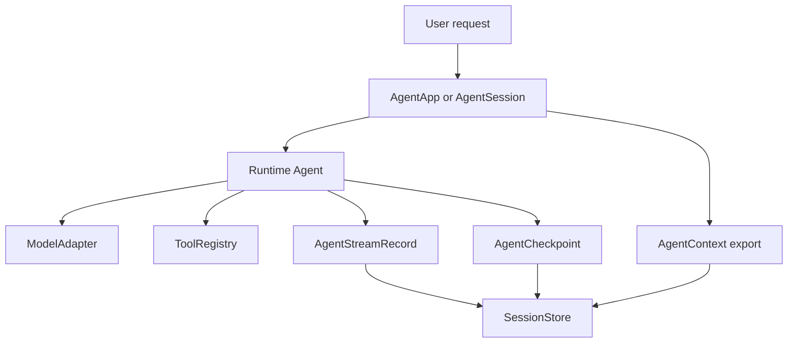

# SDK Apps

`AgentApp` keeps application-facing protocols above the core runtime. It wraps a runtime agent and carries SDK-level registries such as subagents.

```rust
use std::sync::Arc;

use starweaver_agent::{AgentBuilder, TestModel};

# async fn example() -> Result<(), starweaver_agent::AgentError> {
let app = AgentBuilder::new(Arc::new(TestModel::with_text("planned")))
    .instruction("Plan before answering.")
    .build_app();

let result = app.run("plan").await?;
assert_eq!(result.output, "planned");
assert_eq!(app.subagents().subagents().len(), 0);
# Ok(())
# }
```

Use `build()` when only the core runtime agent is needed. Use `build_app()` when the application needs SDK protocols such as subagent delegation or session management.

## Sessions

`AgentSession` keeps an `AgentContext` next to the app's runtime agent. Use it for multi-turn applications that need message history, usage, state, events, typed dependencies, and export/restore through one SDK object.

```rust
use std::sync::Arc;

use starweaver_agent::{AgentBuilder, FunctionModel, Usage};
use starweaver_model::ModelResponse;

# async fn example() -> Result<(), starweaver_agent::AgentError> {
let model = FunctionModel::new(|_messages, _settings, _info| {
    Ok(ModelResponse {
        usage: Usage {
            requests: 1,
            ..Usage::default()
        },
        ..ModelResponse::text("ok")
    })
});
let app = AgentBuilder::new(Arc::new(model)).build_app();
let mut session = app.session();

let first = session.run("hello").await?;
let second = session.run("again").await?;

assert_eq!(first.output, "ok");
assert_eq!(second.output, "ok");
assert_eq!(session.context().usage.requests, 2);
# Ok(())
# }
```

Use per-run options to add instructions, settings, request parameters, or tools for one run while preserving the reusable session agent.

```rust
use std::sync::Arc;

use starweaver_agent::{
    AgentBuilder, AgentRunOptions, FunctionTool, TestModel, ToolContext, ToolResult,
};

# async fn example() -> Result<(), starweaver_agent::AgentError> {
let run_tool = Arc::new(FunctionTool::new(
    "lookup",
    Some("Lookup run-scoped data".to_string()),
    serde_json::json!({"type": "object"}),
    |_ctx: ToolContext, args: serde_json::Value| async move { Ok(ToolResult::new(args)) },
));
let app = AgentBuilder::new(Arc::new(TestModel::with_text("done"))).build_app();
let mut session = app.session();

let result = session
    .run_with_options(
        "use the run tool",
        AgentRunOptions::new()
            .instruction("This instruction applies to this run.")
            .tool(run_tool),
    )
    .await?;

assert_eq!(result.output, "done");
# Ok(())
# }
```

Restore a session from exported state when an application persists context between process lifetimes.

```rust
use std::sync::Arc;

use starweaver_agent::{AgentBuilder, FunctionModel, Usage};
use starweaver_model::ModelResponse;

# async fn example() -> Result<(), starweaver_agent::AgentError> {
let model = FunctionModel::new(|_messages, _settings, _info| {
    Ok(ModelResponse {
        usage: Usage {
            requests: 1,
            ..Usage::default()
        },
        ..ModelResponse::text("ok")
    })
});
let app = AgentBuilder::new(Arc::new(model)).build_app();
let mut session = app.session();
session.run("hello").await?;

let state = session.export_state();
let mut restored = app.session_from_state(state);
let result = restored.run("again").await?;

assert_eq!(result.output, "ok");
assert_eq!(restored.context().usage.requests, 2);
# Ok(())
# }
```

## Smooth durable application shape

A production application can depend on `starweaver-agent` for the programming surface and compose durable service concerns through shared session storage contracts plus shared stream replay and display-message contracts.



Recommended shape for CLI and external services:

1. Build an agent through `AgentBuilder` and policies from application configuration.
2. Create an `AgentSession` per conversation and persist `session.export_state()` after each run.
3. Use `run_stream` for UI/SSE output and persist each `AgentStreamRecord` by sequence.
4. Hook node transitions with `AgentStreamEvent::NodeStart` and `AgentStreamEvent::NodeComplete` when the UI or service needs stable lifecycle boundaries.
5. Emit sideband progress through `AgentContext::publish_event`; streaming runs surface those events as `AgentStreamEvent::Custom`.
6. Install an `AgentExecutor` that writes every `AgentCheckpoint` and `AgentResumeEvidence` to the store.
7. Persist environment references, trace ids, and approval/deferred metadata in the service layer alongside checkpoint ids.

This keeps the SDK surface small for application programmers: `AgentBuilder`, `AgentSession`, stream events, checkpoints, and direct APIs cover most durable app needs.

## Serializable Agent Specs

`AgentSpec` is the optional profile layer for CLI, service, and team configuration. Programmatic applications can keep using `AgentBuilder` directly; serialized specs resolve host-provided handles through `AgentSpecRegistry`.

```rust
use std::sync::Arc;

use starweaver_agent::{
    AgentSpec, AgentSpecRegistry, HostAdapterSpec, McpServerSpec, RetryPolicyPreset, TestModel,
};

# async fn example() -> Result<(), Box<dyn std::error::Error>> {
let spec = AgentSpec::from_yaml(r#"
name: helper
instructions:
  - Be concise
model:
  model_id: test
preset:
  retry_preset: quick
  retry:
    tool_retries: 2
output:
  retries: 1
host_adapters:
  - web
mcp_servers:
  - local
"#)?;
let registry = AgentSpecRegistry::new()
    .with_model("test", Arc::new(TestModel::with_text("ok")))
    .with_retry_preset(
        "quick",
        RetryPolicyPreset {
            max_steps: Some(4),
            output_retries: Some(1),
            tool_retries: Some(1),
            timeout_ms: None,
        },
    )
    .with_host_adapter(
        "web",
        HostAdapterSpec {
            kind: "search".to_string(),
            name: "fake".to_string(),
            metadata: serde_json::Map::new(),
        },
    )
    .with_mcp_server(
        "local",
        McpServerSpec {
            name: "local".to_string(),
            transport: "stdio".to_string(),
            metadata: serde_json::Map::new(),
        },
    );

let result = spec.builder(&registry)?.build().run("hello").await?;
assert_eq!(result.output, "ok");
# Ok(())
# }
```

Specs support named and inline policy sections for retry, approval, streaming, observability, environment, and durability. Host adapters and MCP servers are stable names resolved by the host registry, which keeps live clients and credentials outside serialized files.
