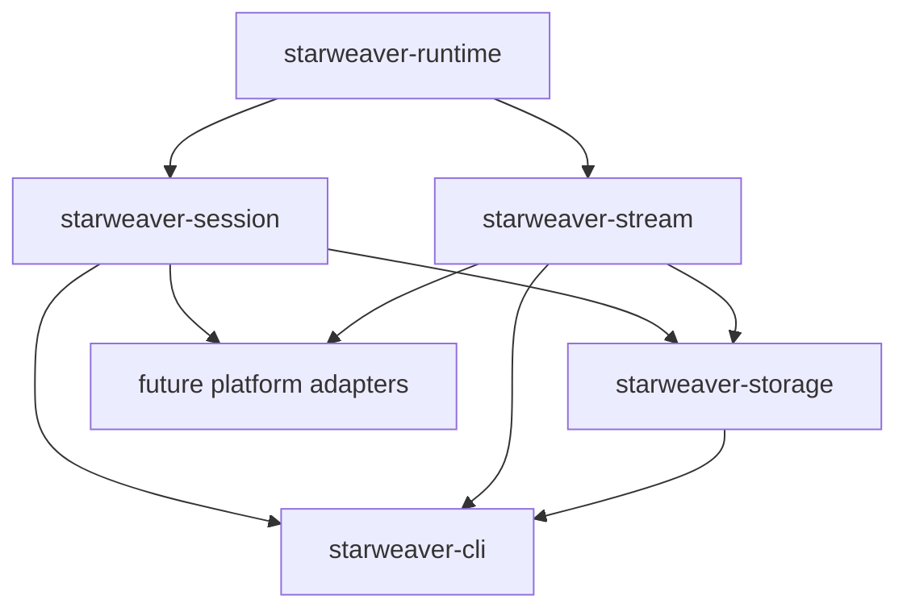

# Session and Stream Contracts

`starweaver-session` and `starweaver-stream` provide shared operational contracts for durable agent products. CLI, service hosts, SDK applications, and future platform adapters can reuse these crates while keeping storage state, display replay, and transport delivery as separate layers.



## Session records

`starweaver-session` owns serializable durable state:

- `InputPart`
- `SessionRecord`
- `RunRecord`
- `SessionStore`
- `SessionResumeSnapshot`
- `ApprovalRecord`
- `DeferredToolRecord`
- `CompactRunTrace`
- `CompactSessionTrace`
- environment and stream cursor references

The in-memory store is useful for tests and local single-process hosts. Persistent SQLite adapters live in `starweaver-storage`.

```rust
use starweaver_session::{InMemorySessionStore, SessionRecord, SessionStore};
use starweaver_core::SessionId;

# async fn example() -> Result<(), starweaver_session::SessionStoreError> {
let store = InMemorySessionStore::default();
let session_id = SessionId::from_string("session_docs");
store.save_session(SessionRecord::new(session_id.clone())).await?;
let loaded = store.load_session(&session_id).await?;
assert_eq!(loaded.session_id, session_id);
# Ok(())
# }
```

## Display and replay streams

`starweaver-stream` owns product-facing display and replay contracts:

- `DisplayMessage`
- `DisplayMessageKind`
- `DisplayMessageProjector`
- `ReplayEventLog`
- `ReplayTransport`
- `StreamArchive`
- `RealtimeCompactionBuffer`
- protocol envelopes and adapters

Display messages are the stable Starweaver wire protocol. CLI output can print one message per JSONL line, service transports can wrap the same message in SSE or WebSocket frames, and replay archives can reconstruct visible state from persisted messages.

```rust
use starweaver_core::{RunId, SessionId};
use starweaver_stream::{DisplayMessage, DisplayMessageKind};

let message = DisplayMessage::new(
    1,
    SessionId::from_string("session_docs"),
    RunId::from_string("run_docs"),
    DisplayMessageKind::RunStarted,
);
assert_eq!(message.schema, DisplayMessage::SCHEMA);
```

## SQLite storage

`starweaver-storage` provides concrete adapters for foundation storage:

- SQLite migration registry and status reporting
- `SqliteSessionStore`
- `SqliteReplayEventLog`
- `SqliteStreamArchive`

```rust
use starweaver_storage::{migrate_sqlite_database, sqlite_migration_status};

# fn example() -> Result<(), starweaver_session::SessionStoreError> {
let dir = tempfile::tempdir().expect("tempdir");
let database = dir.path().join("starweaver.sqlite3");
let applied = migrate_sqlite_database(&database)?;
assert_eq!(applied, vec!["20260605_000001_session_stream_store"]);
let status = sqlite_migration_status(&database)?;
assert!(status.current);
# Ok(())
# }
```

## Durable app shape

`SessionStore` persists session/run state, checkpoint evidence, approvals, deferred records, compact traces, and stable stream cursor references. `StreamArchive`, `ReplayEventLog`, and `ReplayTransport` handle raw runtime records, display messages, replay buffers, live subscriptions, compaction snapshots, and protocol envelopes.

Foundation crates keep these boundaries stable so CLI, SDK apps, service hosts, and platform adapters can select storage and transport implementations without changing runtime semantics.
