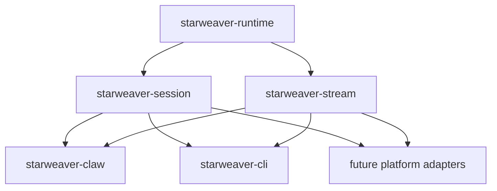

# Session and Stream Contracts

`starweaver-session` and `starweaver-stream` provide shared operational contracts for durable agent products. CLI, Claw, and future platform adapters can reuse these crates while keeping storage state, display replay, and transport delivery as separate layers.



## Session contracts

`starweaver-session` owns durable session state:

- `InputPart` for text, URLs, files, binary references, modes, and product commands
- `SessionRecord` and `RunRecord`
- `SessionStore` and `InMemorySessionStore`
- `SessionResumeSnapshot`
- `ApprovalRecord` and `DeferredToolRecord`
- `CheckpointRef`, `EnvironmentStateRef`, and `StreamCursorRef`
- `CompactRunTrace` and `CompactSessionTrace`
- `SessionStoreExecutor` for persisting runtime checkpoints through `AgentExecutor`

The in-memory store is useful for tests and local single-process hosts. Persistent adapters belong in product crates such as `starweaver-claw`.

```rust
use starweaver_session::{InMemorySessionStore, InputPart, RunRecord, SessionId, SessionRecord, SessionStore};
use starweaver_core::{ConversationId, RunId};

# async fn example() -> Result<(), starweaver_session::SessionStoreError> {
let store = InMemorySessionStore::new();
let session_id = SessionId::from_string("session-1");
let run_id = RunId::from_string("run-1");

store.save_session(SessionRecord::new(session_id.clone())).await?;

let mut run = RunRecord::new(
    session_id.clone(),
    run_id.clone(),
    ConversationId::from_string("conv-1"),
);
run.input = vec![InputPart::text("hello")];
store.append_run(run).await?;

let trace = store.compact_session_trace(&session_id).await?;
assert_eq!(trace.runs, 1);
# Ok(())
# }
```

## Stream contracts

`starweaver-stream` owns observable execution stream semantics:

- `DisplayMessage`, `DisplayMessageKind`, and `DisplayVisibility`
- `DisplayMessageProjector` and `DefaultDisplayMessageProjector`
- `ReplayScope`, `ReplayCursor`, `ReplayEvent`, and `ReplaySnapshot`
- `ReplayEventLog` and `InMemoryReplayEventLog`
- `StreamArchive` and `InMemoryStreamArchive`
- `ReplayTransport`, SSE envelopes, JSONL envelopes, and terminal markers
- `RealtimeCompactionBuffer` for compact replay snapshots

```rust
use serde_json::json;
use starweaver_core::{RunId, SessionId};
use starweaver_stream::{
    DisplayMessage, DisplayMessageKind, InMemoryReplayEventLog, ReplayEvent, ReplayEventKind,
    ReplayEventLog, ReplayScope,
};

# async fn example() -> Result<(), starweaver_stream::ReplayError> {
let log = InMemoryReplayEventLog::new();
let scope = ReplayScope::run("run-1");
let message = DisplayMessage::new(
    1,
    SessionId::from_string("session-1"),
    RunId::from_string("run-1"),
    DisplayMessageKind::AssistantTextDelta,
)
.with_payload(json!({"delta": "hello"}));

log.append(
    scope.clone(),
    ReplayEvent::new(scope.clone(), 1, ReplayEventKind::DisplayMessage(Box::new(message))),
).await?;

let replay = log.replay_after(&scope, None, None).await?;
assert_eq!(replay.len(), 1);
# Ok(())
# }
```

## Boundary model

`SessionStore` persists session/run state, checkpoint evidence, approvals, deferred records, compact traces, and stable stream cursor references. `StreamArchive`, `ReplayEventLog`, and `ReplayTransport` handle raw runtime records, display messages, replay buffers, live subscriptions, compaction snapshots, and protocol envelopes.

`starweaver-claw` re-exports the shared contracts today and is the host for concrete durable adapters and run coordination.
