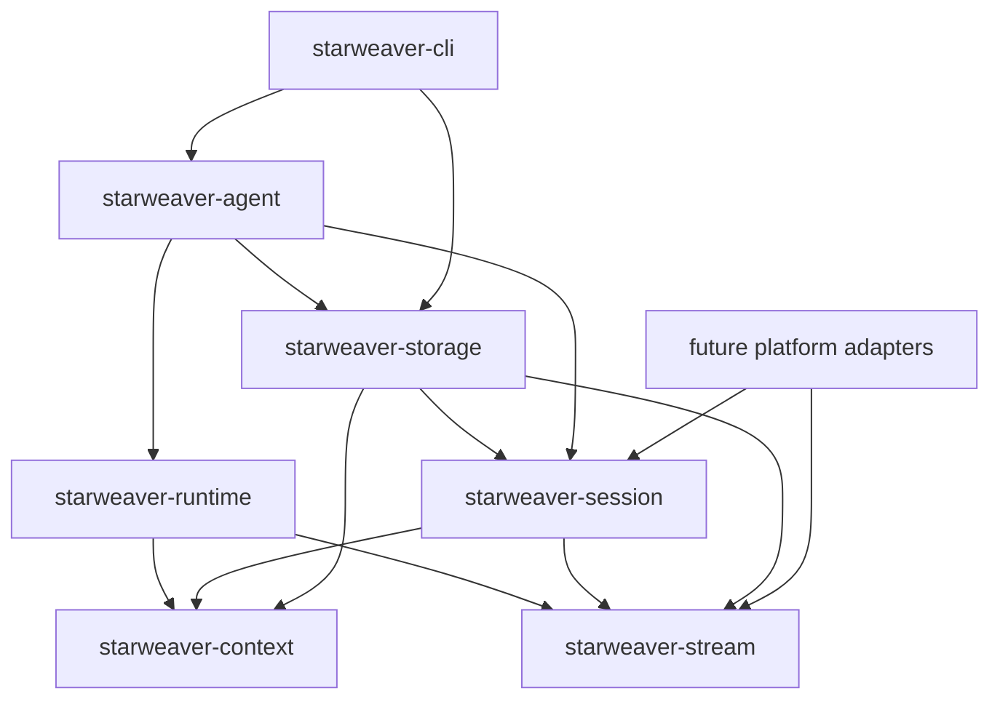

# Session and Stream Contracts

`starweaver-session` and `starweaver-stream` provide shared operational contracts for durable agent products. CLI, service hosts, SDK applications, and future platform adapters can reuse these crates while keeping storage state, display replay, and transport delivery as separate layers.



## Session records

`starweaver-session` owns serializable durable state:

- `InputPart`
- `SessionRecord`
- `RunRecord`
- `SessionStore`
- `SessionResumeSnapshot`
- `ApprovalRecord`
- `DeferredToolRecord`
- `CompactRunTrace`
- `CompactSessionTrace`
- environment and stream cursor references

The in-memory store is useful for tests and local single-process hosts. Persistent SQLite adapters live in `starweaver-storage`. Checkpointable `AgentRunState`, versioned `AgentCheckpoint` records, and the `AgentExecutor` callback contract live in `starweaver-context`; runtime emits checkpoints and preserves its existing compatibility exports. Session and storage therefore consume durable evidence contracts without depending on the complete runtime implementation.

```rust
use starweaver_session::{InMemorySessionStore, SessionRecord, SessionStore};
use starweaver_core::SessionId;

# async fn example() -> Result<(), starweaver_session::SessionStoreError> {
let store = InMemorySessionStore::default();
let session_id = SessionId::from_string("session_docs");
store.save_session(SessionRecord::new(session_id.clone())).await?;
let loaded = store.load_session(&session_id).await?;
assert_eq!(loaded.session_id, session_id);
# Ok(())
# }
```

## Display and replay streams

`starweaver-stream` owns typed raw execution records plus product-facing display and replay contracts:

- `AgentStreamEvent`
- `AgentStreamRecord`
- `AgentStreamSource`
- `AgentStreamSink`
- `DisplayMessage`
- `DisplayMessageKind`
- `DisplayMessageProjector`
- `ReplayEventLog`
- `ReplayTransport`
- `StreamArchive`
- `RealtimeCompactionBuffer`
- protocol envelopes and adapters

Display messages are the stable Starweaver wire protocol. CLI output can print one message per JSONL line, service transports can wrap the same message in SSE or WebSocket frames, and replay archives can reconstruct visible state from persisted messages. The cross-surface corpus at `spec/fixtures/stream/raw-display-replay-v1.json` freezes raw ordering and payloads, display terminal/source attribution, and replay cursor/terminal semantics; Rust stream, Python, CLI, and RPC tests all consume that one file.

Python sends every known canonical raw record through the native Rust projector. A malformed known kind is a decoding error and is never silently converted into a host event. Only a record whose event kind is outside the canonical stream vocabulary uses the lossless unknown-extension `HOST_EVENT` fallback.

The runtime emits the raw protocol owned by `starweaver-stream` and preserves compatibility re-exports from `starweaver-runtime`. Core run/model/tool events remain typed `AgentStreamEvent` variants. Context sideband events are carried as `AgentStreamEvent::Custom`; known application event kinds can be classified with `AgentStreamEvent::sideband_event()` into stable `AgentSidebandEventCategory` values such as `tool_search`, `skill`, `hitl`, `task`, `subagent`, `usage`, and `compact`.

Use `AgentStreamRecord::to_raw_json()` or
`AgentStreamResult::raw_json_records()` when a host or language binding needs
the stable raw record projection without reimplementing Rust enum
serialization.

The default display projector turns known sideband events into stable display-message kinds for renderer and replay clients. Covered sideband display events include `tools_unavailable`, `tool_search_loaded`, `tool_search_initialized`, `tool_search_refreshed`, `tool_search_invalidated`, `tool_search_failed`, `tool_search_no_match`, `skills_scanned`, `skill_activated`, `skills_reloaded`, `approval_requested`, `approval_resolved`, `hitl_resolved`, `hitl_decision_diagnostic`, `subagent_started`, `subagent_completed`, `subagent_failed`, compaction, handoff, steering, task snapshots, generic `task_*` events, `note_*` events, `file_*` events, `media_*` events, and `host_*` events. Generic sideband projections preserve the original context event kind in `metadata.starweaver_event_kind` so replay and UI adapters can route precise workflow events without parsing preview text.

Usage sideband events use kind `usage_snapshot` and carry the typed
`UsageSnapshot` payload. UI, replay, and transport clients should treat these
field names as stable: `run_id`, `latest_usage`, `total_usage`,
`estimate_pricing`, `entries`, `agent_usages`, `model_usages`, and
`model_estimate_pricing`.

```rust
use starweaver_core::{RunId, SessionId};
use starweaver_stream::{DisplayMessage, DisplayMessageKind};

let message = DisplayMessage::new(
    1,
    SessionId::from_string("session_docs"),
    RunId::from_string("run_docs"),
    DisplayMessageKind::RunStarted,
);
assert_eq!(message.schema, DisplayMessage::SCHEMA);
```

## SQLite storage

`starweaver-storage` provides concrete adapters for foundation storage:

- SQLite migration registry and status reporting
- `SqliteSessionStore`
- `SqliteReplayEventLog`
- `SqliteStreamArchive`

```rust
use starweaver_storage::{migrate_sqlite_database, sqlite_migration_status};

# fn example() -> Result<(), starweaver_session::SessionStoreError> {
let dir = tempfile::tempdir().expect("tempdir");
let database = dir.path().join("starweaver.sqlite3");
let applied = migrate_sqlite_database(&database)?;
assert!(!applied.is_empty());
let status = sqlite_migration_status(&database)?;
assert!(status.current);
# Ok(())
# }
```

## Atomic evidence and publication

`SessionStore::commit_run_evidence` is the atomic boundary for a run, its
per-run resumable context, checkpoints, HITL records, raw/display/replay
records, cursors, and optional environment evidence. Canonical SQLite commits
seal the complete bundle with a digest: an exact retry is idempotent and a
same-run retry with different evidence fails. Migrated runs without a historical
bundle digest receive a legacy-unsealed marker and cannot be overwritten by a
new first commit.

External stream sinks are deliberately outside the SQLite transaction. A commit
that targets an archive or replay log writes a transactional publication outbox
entry with the evidence. The runtime attempts archive and replay targets
independently, acknowledges each target only after complete delivery, and keeps
failed targets pending for `AgentRuntime::flush_pending_stream_publications`.
Sink implementations must therefore make repeated append delivery idempotent.
A sink failure after commit does not turn a completed model/tool run into an
execution retry.

Durable HITL continuation uses an exclusive resume claim. Validation occurs
before claiming; a preflight claim may be released, while a started claim cannot
be released and is consumed only by the atomic continuation commit. This policy
fails closed after an uncertain side effect: recovery may require operator
repair, but the store does not silently execute the approved tool twice.

## Durable app shape

`SessionStore` persists session/run state, checkpoint evidence, approvals, deferred records, compact traces, and stable stream cursor references. `StreamArchive`, `ReplayEventLog`, and `ReplayTransport` handle raw runtime records, display messages, replay buffers, live subscriptions, compaction snapshots, and protocol envelopes. Custom stores that do not implement transactional publication or exclusive HITL claims inherit fail-closed default methods; they can support ordinary persistence but cannot claim those durability guarantees until they implement the contracts.

Foundation crates keep these boundaries stable so CLI, SDK apps, service hosts, and platform adapters can select storage and transport implementations without changing runtime semantics.
