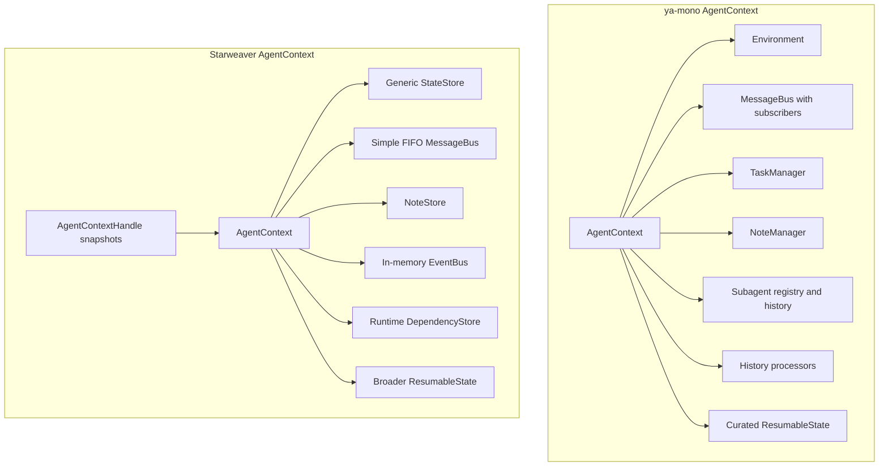
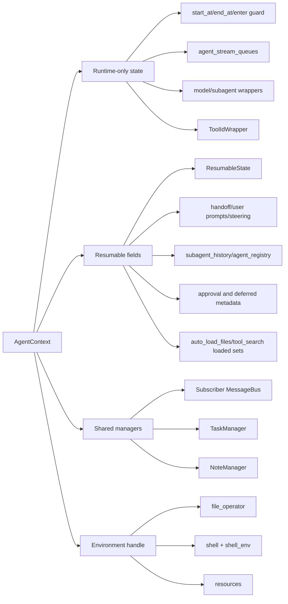

# AgentContext ya-mono Parity Report

Date: 2026-06-15

Last re-review: 2026-06-15 09:36 UTC

Reference revisions:

- Starweaver base commit: `28b0ec4`
- Starweaver workspace: includes uncommitted runtime/environment/CLI changes reviewed in this memo
- ya-mono reference checkout: `refs/ya-mono` at `85246f6` (`origin/main`)

Scope:

- Starweaver implementation: `crates/starweaver-context`, plus runtime and SDK integrations that mutate or consume `AgentContext`.
- ya-mono implementation: `refs/ya-mono/packages/ya-agent-sdk/ya_agent_sdk/context`, plus directly coupled filters for bus messages, handoff, runtime instructions, and auto-load files.

## Executive Summary

Starweaver's current `AgentContext` is not a faithful Rust port of ya-mono's `AgentContext`. It is a smaller Rust-native session object with some extra Starweaver-specific state (`conversation_id`, `message_history`, generic `StateStore`, `TraceContext`, `DependencyStore`) and many missing ya-mono runtime fields.

The largest gaps are not cosmetic field-name differences. Several ya-mono fields are backed by richer runtime data structures and lifecycle semantics that are either absent or degraded in Starweaver:

1. **Message bus is severely degraded**: ya-mono has an idempotent subscriber/cursor bus with targeted and broadcast delivery; Starweaver has a simple FIFO topic queue.
2. **Tasks are severely degraded**: ya-mono has a typed `TaskManager` with enum status, timestamps, dependency resolution, and export/import; Starweaver stores a `Vec<Task>` JSON snapshot in generic `StateStore`, with free-form string status and no automatic unblock.
3. **Subagent state is missing**: ya-mono tracks `subagent_history`, `agent_registry`, parent/child IDs, shared bus/task/note managers, stream queues, and wrappers. Starweaver only creates a child context with metadata and absorbs child usage/notes.
4. **Environment attachment is still not context-field parity, but the current workspace improved the integration path**: ya-mono context owns an `env` reference and exposes `file_operator`, `shell`, and `resources`. Starweaver now attaches an `EnvironmentHandle` and process shell through `DependencyStore` and injects environment context via a canonical `prepare_model_messages_with_context` capability, but this is still dependency-based rather than a typed `AgentContext` field or resumable ya-mono-style `env` surface.
5. **HITL/deferred-tool state is missing from context**: ya-mono persists approval lists and deferred tool metadata in `ResumableState`. Starweaver has approval/deferred concepts elsewhere, but not in `AgentContext` parity fields.
6. **Runtime lifecycle fields are missing or reduced**: ya-mono has `prepare_new_run`, async enter/exit guards, `start_at`/`end_at`, per-run queues, `ToolIdWrapper`, and forced instruction injection. Starweaver has only `started_at` and run-loop-managed state. The current workspace does move runtime context injection into a built-in canonical capability, which improves history stability but does not add the missing lifecycle fields.
7. **Resumable state semantics diverge**: ya-mono's exported state intentionally excludes model/tool config and excludes usage ledger unless requested. Starweaver exports model config, tool config, security, usage, and usage ledger by default, which risks persisting API keys and stale runtime policy.
8. **Model and tool config are only partially aligned**: Starweaver has many scalar config fields, but lacks ya-mono's model setting hooks, media-to-URL hooks, Pydantic-style extensibility, and validation behavior.

Conclusion: if the goal is to be fully aligned with ya-mono, Starweaver needs a deliberate `AgentContext` parity migration, not incremental patches to the existing fields.

## 2026-06-15 Re-review Update

The memo should **remain**. Re-review against current workspace evidence found that the core `starweaver-context` structs still do not include the missing ya-mono context and `ResumableState` fields. The following current workspace changes improve adjacent runtime behavior, but they do not complete field-level parity:

- `crates/starweaver-runtime/src/agent/runtime_helpers/runtime_context.rs` now implements runtime context injection as built-in capability `starweaver.runtime.context` through `prepare_model_messages_with_context`.
- `crates/starweaver-runtime/src/agent.rs` now appends that runtime context capability when resolving capability order.
- `crates/starweaver-runtime/src/agent/run_loop.rs` now copies canonical prepared model messages back into `state.message_history` and `context.message_history` before provider-only preparation.
- `crates/starweaver-agent/src/bundles/environment/handle.rs` now injects environment context through `prepare_model_messages_with_context` and stores `EnvironmentHandle` in `AgentContext.dependencies`; process-capable providers also attach shell handles through the same attachment path.
- `crates/starweaver-cli/src/runner.rs` now exports environment state separately into CLI artifacts.

These changes address part of the previous provider-only context-injection concern. They do not add typed `env`, `task_manager`, `message_bus` cursor semantics, `subagent_history`, `agent_registry`, approval/deferred state, `ToolIdWrapper`, or ya-mono-style curated `ResumableState` export behavior.

## Architecture Comparison

### ya-mono context architecture

ya-mono's context is a Pydantic `BaseModel` that acts as the dependency object passed into Pydantic AI runs. It is a mixed runtime/session object:

- Runtime-only fields are excluded from serialization with `Field(..., exclude=True)`.
- `ResumableState` stores a curated restore surface rather than the whole context.
- The context itself owns or exposes runtime objects such as environment, shell, file operator, resource registry, stream queues, wrappers, task manager, note manager, and message bus.
- History processors are constructed from the context and use context state directly.
- Subagent creation is context-native and preserves parent-child identity and shared managers.

Primary evidence:

- `refs/ya-mono/packages/ya-agent-sdk/ya_agent_sdk/context/agent.py:1092-1393` for `AgentContext` fields.
- `refs/ya-mono/packages/ya-agent-sdk/ya_agent_sdk/context/agent.py:915-1021` for `ResumableState` fields and restore behavior.
- `refs/ya-mono/packages/ya-agent-sdk/ya_agent_sdk/context/bus.py:60-327` for message bus structure.
- `refs/ya-mono/packages/ya-agent-sdk/ya_agent_sdk/context/tasks.py:12-210` for task manager structure.
- `refs/ya-mono/packages/ya-agent-sdk/ya_agent_sdk/context/note.py:10-78` for note manager structure.

### Starweaver context architecture

Starweaver's context is a serde-serializable Rust struct. It is closer to a durable run/session data object plus some helper methods:

- `AgentContext` stores canonical `message_history` and `conversation_id` directly.
- Restore is performed by copying fields from `ResumableState` into a new `AgentContext`.
- Tool mutation is mediated through `AgentContextHandle`, which holds a whole-context snapshot under `Arc<Mutex<_>>`.
- Runtime state is split across `AgentRunState`, `AgentContext`, tool dependencies, metadata keys, SDK filters/capabilities, session crates, and environment crates.
- Several ya-mono context concepts exist elsewhere, but not as `AgentContext` fields.
- Current uncommitted workspace changes add a built-in runtime-context capability and move environment context injection into the canonical `prepare_model_messages_with_context` path. This fixes part of the history-stability problem, but not field-level ya-mono parity.

Primary evidence:

- `crates/starweaver-context/src/agent_context.rs:21-82` for `AgentContext` fields.
- `crates/starweaver-context/src/resumable_state.rs:18-74` for `ResumableState` fields.
- `crates/starweaver-context/src/message_bus.rs:11-64` for message bus structure.
- `crates/starweaver-context/src/task.rs:7-67` and `crates/starweaver-agent/src/bundles/task/operations.rs:13-238` for task structure and operations.
- `crates/starweaver-runtime/src/agent/runtime_helpers/usage_limits.rs:28-44` for selective tool context absorption.

## ya-mono AgentContext Field-by-Field Parity

Legend:

- **Aligned**: Same concept and roughly equivalent behavior.
- **Partial**: Similar concept exists but behavior, type, or lifecycle differs.
- **Degraded**: A weaker data structure exists and loses ya-mono semantics.
- **Missing**: No clear Starweaver `AgentContext` equivalent.
- **Moved**: Implemented elsewhere or through metadata, not as context parity.

| ya-mono field                           | Starweaver status              | Starweaver equivalent                                                  | Alignment notes                                                                                                                                                                                                                                                                       |
| --------------------------------------- | ------------------------------ | ---------------------------------------------------------------------- | ------------------------------------------------------------------------------------------------------------------------------------------------------------------------------------------------------------------------------------------------------------------------------------- |
| `lifecycle_extensions`                  | Missing                        | None in `AgentContext`                                                 | ya-mono extensions participate in handoff lifecycle. Starweaver capability hooks exist in runtime, but this field and direct lifecycle callback list are absent.                                                                                                                      |
| `run_id`                                | Partial                        | `run_id: Option<RunId>`                                                | ya-mono always generates a string run ID. Starweaver allows `None` and run loop manages it.                                                                                                                                                                                           |
| `parent_run_id`                         | Moved/degraded                 | `metadata["parent_run_id"]` in `subagent_context`                      | ya-mono has a typed field used by usage snapshots and wrapper metadata. Starweaver stores only metadata for subagent contexts.                                                                                                                                                        |
| `provider_session_id`                   | Missing                        | None                                                                   | ya-mono builds stable provider headers from this or `run_id`. Starweaver has no context-level provider session field.                                                                                                                                                                 |
| `provider_thread_id`                    | Missing                        | None                                                                   | Same as `provider_session_id`.                                                                                                                                                                                                                                                        |
| `start_at`                              | Partial                        | `started_at: DateTime<Utc>`                                            | Starweaver records creation/start time only. ya-mono distinguishes enter time and end time.                                                                                                                                                                                           |
| `end_at`                                | Missing                        | None                                                                   | Starweaver cannot represent completed context elapsed time in the context itself.                                                                                                                                                                                                     |
| `deferred_tool_metadata`                | Missing                        | Deferred/approval records exist in runtime/session crates, not context | ya-mono persists per-tool-call deferred metadata in `ResumableState`. Starweaver context has no field.                                                                                                                                                                                |
| `handoff_message`                       | Moved/degraded                 | `state.metadata["starweaver_handoff"]` in named filters                | ya-mono keeps handoff state on context and exports it. Starweaver uses metadata-driven filters; no context field or restore parity.                                                                                                                                                   |
| `force_inject_instructions`             | Moved/degraded                 | `metadata["starweaver_force_inject_instructions"]`                     | ya-mono has a boolean field reset by the handoff filter. Starweaver checks metadata flags.                                                                                                                                                                                            |
| `env`                                   | Moved/partial                  | `EnvironmentHandle` stored in `dependencies` by `attach_environment`   | The current workspace attaches the active environment to `AgentContext.dependencies` and injects environment instructions through `EnvironmentContextCapability`. This improves runtime behavior but is still not a typed `AgentContext.env` field and is skipped from serialization. |
| `file_operator` property                | Moved/partial                  | Environment bundle/dependencies                                        | File access is available to tools through the environment provider, not as a direct `AgentContext.file_operator` property.                                                                                                                                                            |
| `shell` property                        | Moved/partial                  | Environment/process shell dependencies                                 | Process shell attachment exists through `attach_environment`/`attach_process_shell`, but not as a direct `AgentContext.shell` property or resumable field.                                                                                                                            |
| `resources` property                    | Moved/partial                  | `starweaver-environment` resource contracts and provider APIs          | Resource access is provider/dependency based, not a direct context property.                                                                                                                                                                                                          |
| `shell_env`                             | Missing                        | None                                                                   | ya-mono exports/restores shell environment overlays. Starweaver context has no shell env field.                                                                                                                                                                                       |
| `model_cfg`                             | Partial                        | `model_config`                                                         | Most scalar fields and capabilities exist, but Starweaver uses fixed Rust types, no `extra="allow"`, and different merge semantics.                                                                                                                                                   |
| `tool_config`                           | Partial                        | `tool_config`                                                          | Many scalar limits align, but media model settings and media-to-URL hooks are missing. Starweaver also persists this config in `ResumableState`, unlike ya-mono.                                                                                                                      |
| `usage_snapshot_entries`                | Partial                        | `usage_snapshot_entries`                                               | Ledger construction is similar. Export semantics differ: ya-mono excludes by default unless `include_usage_ledger=True`; Starweaver exports by default.                                                                                                                               |
| `shell_review_records`                  | Missing                        | None in context                                                        | ya-mono keeps recent shell review records for current-run safety context. Starweaver has shell review config but no context records field.                                                                                                                                            |
| `user_prompts`                          | Partial                        | `user_prompts: Option<Vec<ContentPart>>`                               | Same purpose for compact restore, but type differs from ya-mono's \`str                                                                                                                                                                                                               |
| `previous_assistant_response_reference` | Aligned                        | Same field                                                             | Both preserve the previous visible assistant response for compact restore.                                                                                                                                                                                                            |
| `steering_messages`                     | Partial                        | Same field name                                                        | Both accumulate steering. Starweaver only has first-class `steering` topic semantics, while ya-mono accumulates any user bus message.                                                                                                                                                 |
| `tool_id_wrapper`                       | Missing                        | None found                                                             | ya-mono normalizes provider tool call IDs across events, deferred requests, and history. Starweaver preserves provider IDs without this context-level normalizer.                                                                                                                     |
| `agent_stream_queues`                   | Missing/degraded               | `EventBus` and stream crates elsewhere                                 | ya-mono has async per-agent queues for sideband streaming. Starweaver context has an append-only `EventBus`; streaming projection is elsewhere.                                                                                                                                       |
| `need_user_approve_tools`               | Missing                        | Approval metadata/policies outside context                             | ya-mono persists tool approval requirements in `ResumableState`. Starweaver context lacks the field.                                                                                                                                                                                  |
| `need_user_approve_mcps`                | Missing                        | None                                                                   | No context-level MCP approval list.                                                                                                                                                                                                                                                   |
| `security`                              | Partial with semantic mismatch | `security`                                                             | Field exists, but Starweaver restores serialized security. ya-mono intentionally does not restore stale security policy into the context. Starweaver also lacks `ShellReviewConfig.model_settings`.                                                                                   |
| `subagent_history`                      | Missing                        | None in context                                                        | ya-mono persists subagent message history keyed by agent ID. Starweaver subagent contexts have isolated `message_history`, but parent context does not persist child histories.                                                                                                       |
| `agent_registry`                        | Missing/degraded               | Parent metadata only; SDK subagent registry elsewhere                  | ya-mono tracks agent ID/name/parent and renders known subagents. Starweaver does not have context-level registry or runtime-context rendering for known subagents.                                                                                                                    |
| `auto_load_files`                       | Moved/degraded                 | `AgentRunState.metadata["starweaver_auto_load_files"]`                 | ya-mono has resumable context field consumed by a filter. Starweaver uses metadata; no `ResumableState` parity field.                                                                                                                                                                 |
| `task_manager`                          | Degraded                       | Tasks in `StateStore` domain `"tasks"`                                 | ya-mono has typed `TaskManager`. Starweaver stores a task snapshot as JSON and exposes helper methods. See task section below.                                                                                                                                                        |
| `note_manager`                          | Partial                        | `NoteStore`                                                            | Same basic key/value purpose. ya-mono uses manager object shared by shallow copy; Starweaver clones note stores and only absorbs notes selectively.                                                                                                                                   |
| `tool_search_loaded_tools`              | Missing                        | None found                                                             | ya-mono restores dynamically loaded tools. Starweaver has no context-level field.                                                                                                                                                                                                     |
| `tool_search_loaded_namespaces`         | Missing                        | None found                                                             | Same as above.                                                                                                                                                                                                                                                                        |
| `injected_context_tags`                 | Missing/degraded               | Fixed filter logic and metadata                                        | ya-mono lets context declare tags stripped during handoff/compact. Starweaver does not carry this tuple on context.                                                                                                                                                                   |
| `context_manage_tool_names`             | Missing/degraded               | None                                                                   | ya-mono reminder names available context-management tools. Starweaver reminder is generic and not tool-aware.                                                                                                                                                                         |
| `tool_tags`                             | Missing                        | Tool metadata elsewhere                                                | ya-mono tracks active tool capability tags for filtering and inspection. Starweaver context lacks the field.                                                                                                                                                                          |
| `message_bus`                           | Degraded                       | `messages: MessageBus`                                                 | Same high-level idea, but Starweaver's bus is a simple FIFO queue with topic/payload. ya-mono has IDs, source/target, template, timestamp, cursors, subscribers, idempotent send/consume, broadcast delivery, and peek/pending APIs.                                                  |
| `model_wrapper`                         | Missing                        | Model wrappers/adapters elsewhere                                      | ya-mono context carries runtime wrapper callback and passes wrapper metadata. Starweaver context lacks this field and `get_wrapper_metadata`.                                                                                                                                         |
| `subagent_wrapper`                      | Missing                        | None                                                                   | No context-level async wrapper for subagent execution.                                                                                                                                                                                                                                |
| `self_fork_agent`                       | Missing                        | SDK subagent/self-fork concepts elsewhere, not context                 | No context field.                                                                                                                                                                                                                                                                     |
| `wrapper_metadata`                      | Missing/partial                | `metadata`, `trace_context`                                            | Starweaver has generic metadata and trace context, but no wrapper-specific metadata merge contract.                                                                                                                                                                                   |
| `_agent_id`                             | Aligned in concept             | `agent_id: AgentId`                                                    | Starweaver exposes a typed public agent ID instead of ya-mono private `_agent_id` property.                                                                                                                                                                                           |
| `_entered`, `_enter_lock`               | Missing                        | None                                                                   | ya-mono prevents concurrent/re-entrant context use. Starweaver has no equivalent on context.                                                                                                                                                                                          |
| `_subagent_state_lock`                  | Missing                        | None                                                                   | ya-mono uses it for subagent registry/id reservation. Starweaver lacks context-level shared subagent state.                                                                                                                                                                           |
| `_stream_queue_enabled`                 | Missing                        | None                                                                   | Starweaver event streaming is not controlled by a context-private queue flag.                                                                                                                                                                                                         |
| `_compact_depth`                        | Missing                        | Compact state elsewhere                                                | No context field.                                                                                                                                                                                                                                                                     |

## Starweaver AgentContext Fields Not Present in ya-mono

Starweaver also contains fields that ya-mono does not carry on `AgentContext`. These are not wrong by themselves, but they are not ya-mono parity.

| Starweaver field                | ya-mono equivalent                                                 | Assessment                                                                                                                                                                    |
| ------------------------------- | ------------------------------------------------------------------ | ----------------------------------------------------------------------------------------------------------------------------------------------------------------------------- |
| `conversation_id`               | None on context                                                    | Starweaver-specific session identity. Useful for Rust runtime/session architecture, but not a ya-mono field.                                                                  |
| `message_history`               | Pydantic AI run history; `subagent_history` only in exported state | Starweaver stores canonical main history in context. ya-mono does not export main history through `ResumableState`; it relies on agent run history and curated restore state. |
| `usage`                         | Usage ledger entries and Pydantic run usage                        | Starweaver keeps accumulated usage directly. ya-mono builds snapshots from `usage_snapshot_entries`; export defaults exclude ledger.                                          |
| `state: StateStore`             | No generic context store                                           | Starweaver generic JSON domains are flexible but untyped and unversioned. They currently host tasks.                                                                          |
| `events: EventBus`              | `agent_stream_queues` plus typed events                            | Starweaver event bus is an in-memory append-only vector. ya-mono streams through per-agent queues and typed event objects.                                                    |
| `trace_context`                 | wrapper metadata and event metadata                                | Starweaver-specific trace carrier. Useful, but not ya-mono `model_wrapper` parity.                                                                                            |
| `metadata`                      | Various explicit fields in ya-mono                                 | Starweaver often uses metadata keys where ya-mono has typed fields. This is flexible but loses discoverability and validation.                                                |
| `dependencies: DependencyStore` | Pydantic `deps` object is the context itself                       | Rust runtime DI mechanism. Not serializable and not a ya-mono field.                                                                                                          |

## ResumableState Parity

ya-mono `ResumableState` is a curated state transfer object. Starweaver `ResumableState` is closer to a broad serialized snapshot of `AgentContext`.

### ya-mono fields missing or degraded in Starweaver ResumableState

| ya-mono ResumableState field            | Starweaver status              | Notes                                                                                               |
| --------------------------------------- | ------------------------------ | --------------------------------------------------------------------------------------------------- |
| `subagent_history`                      | Missing                        | Starweaver has no subagent history map in state.                                                    |
| `user_prompts`                          | Partial                        | Present with different type.                                                                        |
| `previous_assistant_response_reference` | Present                        | Aligned in purpose.                                                                                 |
| `steering_messages`                     | Present                        | Aligned in purpose.                                                                                 |
| `handoff_message`                       | Missing                        | Starweaver handoff is metadata/filter-driven.                                                       |
| `shell_env`                             | Missing                        | No shell env overlay persistence.                                                                   |
| `deferred_tool_metadata`                | Missing                        | No context restore field for deferred tools.                                                        |
| `agent_registry`                        | Missing                        | No persisted known-subagent registry.                                                               |
| `need_user_approve_tools`               | Missing                        | No persisted approval tool list.                                                                    |
| `need_user_approve_mcps`                | Missing                        | No persisted MCP approval list.                                                                     |
| `security`                              | Present with semantic mismatch | Starweaver restores it; ya-mono intentionally keeps current runtime security when restoring.        |
| `auto_load_files`                       | Missing                        | Starweaver uses metadata in run state; not context state.                                           |
| `tasks`                                 | Degraded                       | Starweaver persists tasks indirectly through generic `StateStore`, not a typed task manager export. |
| `notes`                                 | Present                        | Same key/value content, different manager/store type.                                               |
| `tool_search_loaded_tools`              | Missing                        | No restore surface.                                                                                 |
| `tool_search_loaded_namespaces`         | Missing                        | No restore surface.                                                                                 |
| `usage_snapshot_entries`                | Present with semantic mismatch | Starweaver always exports ledger entries; ya-mono includes only when requested.                     |

### Starweaver ResumableState extra fields

| Starweaver ResumableState field | ya-mono status                | Risk                                                                                                       |
| ------------------------------- | ----------------------------- | ---------------------------------------------------------------------------------------------------------- |
| `agent_id`                      | Not in ya-mono exported state | Mostly harmless, but changes restore identity semantics.                                                   |
| `run_id`                        | Not in ya-mono exported state | ya-mono creates fresh run/session IDs; Starweaver can restore an old run ID.                               |
| `conversation_id`               | Not in ya-mono exported state | Starweaver-specific.                                                                                       |
| `message_history`               | Not in ya-mono exported state | This is a major architecture divergence. May be useful, but not ya-mono's curated restore model.           |
| `usage`                         | Not in ya-mono exported state | Risks stale accumulated billing state.                                                                     |
| `model_config`                  | Not in ya-mono exported state | Persists runtime model policy, contrary to ya-mono restore style.                                          |
| `tool_config`                   | Not in ya-mono exported state | Can persist API keys and runtime hooks/policy that ya-mono intentionally does not put in `ResumableState`. |
| `started_at`                    | Not in ya-mono exported state | Restored elapsed time can include offline time.                                                            |
| `state`                         | Not in ya-mono exported state | Generic unversioned JSON can preserve invalid domains.                                                     |
| `message_bus`                   | Not in ya-mono exported state | Starweaver bus itself is simple and lacks cursor semantics.                                                |
| `trace_snapshot`                | Not in ya-mono exported state | Starweaver-specific.                                                                                       |
| `metadata`                      | Not in ya-mono exported state | Persists arbitrary metadata flags that ya-mono models as explicit fields or runtime-only values.           |

## Config Parity

### ModelConfig

Starweaver's `ModelConfig` is mostly field-aligned with ya-mono's scalar config:

| ModelConfig field                        | Starweaver status | Notes                                                                                                                      |
| ---------------------------------------- | ----------------- | -------------------------------------------------------------------------------------------------------------------------- |
| `context_window`                         | Present           | Type differs: ya-mono \`int                                                                                                |
| `proactive_context_management_threshold` | Present           | ya-mono float `0.65`; Starweaver fixed-point `PerThousandRatio(650)`.                                                      |
| `compact_threshold`                      | Present           | ya-mono float `0.90`; Starweaver fixed-point.                                                                              |
| `cold_start_trim_seconds`                | Present           | Same default.                                                                                                              |
| `stream_resume_on_error`                 | Present           | Same default.                                                                                                              |
| `stream_resume_max_attempts`             | Present           | Same default, but ya-mono validates `ge=1`; Starweaver default type allows setting zero unless callers validate elsewhere. |
| `stream_resume_prompt`                   | Present           | Same concept.                                                                                                              |
| `max_images`                             | Present           | Same default.                                                                                                              |
| `max_videos`                             | Present           | Same default.                                                                                                              |
| `support_gif`                            | Present           | Same default.                                                                                                              |
| `max_image_bytes`                        | Present           | Same default.                                                                                                              |
| `split_large_images`                     | Present           | Same default.                                                                                                              |
| `image_split_max_height`                 | Present           | Same default.                                                                                                              |
| `image_split_overlap`                    | Present           | Same default.                                                                                                              |
| `capabilities`                           | Present           | Same enum variants exist.                                                                                                  |

Important differences:

- ya-mono's `ModelConfig` has `extra="allow"`, enabling subclass or extra-field experiments. Starweaver's Rust struct is closed.
- Starweaver `merge_from` overwrites most scalar fields and only conditionally merges option/capabilities fields. It cannot distinguish unset from intentionally default for non-option scalars.
- Starweaver persists `model_config` in `ResumableState`; ya-mono does not.

### ToolConfig

Common fields are mostly present, but parity is incomplete.

| ya-mono ToolConfig field             | Starweaver status           | Notes                                                                                                                                                                                                     |
| ------------------------------------ | --------------------------- | --------------------------------------------------------------------------------------------------------------------------------------------------------------------------------------------------------- |
| `skip_url_verification`              | Present                     | Same default `true`; both default to skipping SSRF URL verification unless callers opt in to stricter checks.                                                                                             |
| `enable_load_document`               | Present                     | Same default `false`.                                                                                                                                                                                     |
| `image_understanding_model`          | Present                     | Same concept: fallback model ID for image understanding.                                                                                                                                                  |
| `image_understanding_model_settings` | Missing                     | ya-mono stores model settings for the image understanding agent. Starweaver only stores the model ID.                                                                                                     |
| `video_understanding_model`          | Present                     | Same concept: fallback model ID for video understanding.                                                                                                                                                  |
| `video_understanding_model_settings` | Missing                     | ya-mono stores model settings for the video understanding agent. Starweaver only stores the model ID.                                                                                                     |
| `audio_understanding_model`          | Present                     | Same concept: fallback model ID for audio understanding.                                                                                                                                                  |
| `audio_understanding_model_settings` | Missing                     | ya-mono stores model settings for the audio understanding agent. Starweaver only stores the model ID.                                                                                                     |
| `google_search_api_key`              | Present with semantic drift | Starweaver has the field. ya-mono loads it from `ToolSettings` default factories at `ToolConfig` instantiation; Starweaver does not replicate that Pydantic settings behavior in the context config type. |
| `google_search_cx`                   | Present with semantic drift | Same as `google_search_api_key`; field exists but settings-loading behavior differs.                                                                                                                      |
| `tavily_api_key`                     | Present with semantic drift | Field exists; default source and secret-persistence behavior differ.                                                                                                                                      |
| `brave_search_api_key`               | Present with semantic drift | Field exists; default source and secret-persistence behavior differ.                                                                                                                                      |
| `pixabay_api_key`                    | Present with semantic drift | Field exists; default source and secret-persistence behavior differ.                                                                                                                                      |
| `rapidapi_api_key`                   | Present with semantic drift | Field exists; default source and secret-persistence behavior differ.                                                                                                                                      |
| `firecrawl_api_key`                  | Present with semantic drift | Field exists; default source and secret-persistence behavior differ.                                                                                                                                      |
| `view_max_text_file_size`            | Present                     | Default matches `10 * 1024 * 1024`.                                                                                                                                                                       |
| `view_relaxed_text_patterns`         | Present                     | ya-mono type is `Sequence[str]`; Starweaver stores `Vec<String>`. Semantics are intended to match.                                                                                                        |
| `view_relaxed_text_dynamic_patterns` | Present runtime-only        | Both exclude runtime dynamic relaxed patterns from persistence.                                                                                                                                           |
| `view_relaxed_text_file_size`        | Present                     | Default matches `50 * 1024 * 1024`.                                                                                                                                                                       |
| `view_relaxed_line_limit`            | Present                     | Default matches `5000`.                                                                                                                                                                                   |
| `view_relaxed_max_line_length`       | Present                     | Default matches `20000`.                                                                                                                                                                                  |
| `view_max_content_chars`             | Present                     | Default matches `60000`.                                                                                                                                                                                  |
| `view_relaxed_max_content_chars`     | Present                     | Default matches `250000`.                                                                                                                                                                                 |
| `edit_max_file_size`                 | Present                     | Default matches `20 * 1024 * 1024`.                                                                                                                                                                       |
| `grep_max_file_size`                 | Present                     | Default matches `10 * 1024 * 1024`.                                                                                                                                                                       |
| `view_max_inline_image_bytes`        | Present                     | Default matches `20 * 1024 * 1024`.                                                                                                                                                                       |
| `view_max_inline_video_bytes`        | Present                     | Default matches `50 * 1024 * 1024`.                                                                                                                                                                       |
| `view_max_inline_audio_bytes`        | Present                     | Default matches `50 * 1024 * 1024`.                                                                                                                                                                       |
| `fetch_stream_chunk_size`            | Present                     | Default matches `64 * 1024`.                                                                                                                                                                              |
| `fetch_max_inline_binary_bytes`      | Present                     | Default matches `30 * 1024 * 1024`.                                                                                                                                                                       |
| `download_max_concurrency`           | Partial                     | Same default `4`, but ya-mono validates and errors if below `1`; Starweaver normalizes/clamps when `normalize()` is called.                                                                               |
| `document_max_file_size`             | Present                     | Default matches `200 * 1024 * 1024`.                                                                                                                                                                      |
| `image_to_url_hook`                  | Missing                     | ya-mono supports runtime media-to-URL conversion hooks. Starweaver has no context config equivalent.                                                                                                      |
| `video_to_url_hook`                  | Missing                     | Missing.                                                                                                                                                                                                  |
| `audio_to_url_hook`                  | Missing                     | Missing.                                                                                                                                                                                                  |

Starweaver-only ToolConfig additions:

| Starweaver ToolConfig field        | ya-mono status                | Notes                                                                                                                                                      |
| ---------------------------------- | ----------------------------- | ---------------------------------------------------------------------------------------------------------------------------------------------------------- |
| `filesystem_output_truncate_limit` | Missing in ya-mono            | Starweaver-specific output shaping. Useful, but not ya-mono parity.                                                                                        |
| `grep_truncation_threshold`        | Missing in ya-mono            | Starweaver-specific grep truncation policy.                                                                                                                |
| `grep_truncated_line_max`          | Missing in ya-mono            | Starweaver-specific grep line truncation policy.                                                                                                           |
| `shell_output_truncate_limit`      | Missing in ya-mono            | Starweaver-specific shell output truncation policy.                                                                                                        |
| `cold_start_tool_return_limit`     | Missing in ya-mono ToolConfig | ya-mono models cold-start trimming primarily through model/history processing configuration. Starweaver adds a tool-return character limit to tool config. |

These Starweaver additions are reasonable product additions, but they do not improve ya-mono field parity.

### SecurityConfig and ShellReviewConfig

| Field                                 | Starweaver status | Notes                                                                                                          |
| ------------------------------------- | ----------------- | -------------------------------------------------------------------------------------------------------------- |
| `shell_review`                        | Present           | Same high-level concept.                                                                                       |
| `ShellReviewConfig.enabled`           | Present           | Same.                                                                                                          |
| `ShellReviewConfig.model`             | Present           | Same.                                                                                                          |
| `ShellReviewConfig.model_settings`    | Missing           | ya-mono can resolve preset names into model settings.                                                          |
| `ShellReviewConfig.on_needs_approval` | Present           | Same enum values.                                                                                              |
| `ShellReviewConfig.risk_threshold`    | Present           | Same enum values.                                                                                              |
| `ShellReviewConfig.system_prompt`     | Present           | Same.                                                                                                          |
| validation when enabled               | Missing           | ya-mono rejects enabled config without a model; Starweaver currently does not enforce this in the config type. |
| restore behavior                      | Divergent         | ya-mono intentionally does not restore stale security into a fresh context; Starweaver does.                   |

## Dependent Data Structure Parity

### MessageBus

ya-mono `MessageBus`:

- `BusMessage` fields: `id`, `content`, `source`, `target`, `template`, `timestamp`.
- Supports text and multimodal `UserContent`.
- Renders content with Jinja2 templates.
- Maintains `_messages`, `_message_ids`, `_cursors`, `_consumed_ids`, and `_maxlen`.
- Supports `subscribe`, `unsubscribe`, `send`, `consume`, `has_pending`, `peek`, and `clear`.
- Delivery is targeted or broadcast and idempotent per subscriber.

Starweaver `MessageBus`:

- `BusMessage` fields: `topic`, `payload`, `metadata`.
- `MessageBus` is a `VecDeque<BusMessage>`.
- Supports `enqueue`, `dequeue`, `len`, `has_topic`, and `is_empty`.
- Runtime steering consumes only topic `steering` and reinserts non-steering messages.

Assessment: **severe degradation**. Starweaver's bus cannot represent ya-mono's delivery model, message identity, subscribers, targeting, templates, timestamps, multimodal content, or idempotent retry behavior.

### TaskManager and tasks

ya-mono task structure:

- `TaskStatus` enum: `pending`, `in_progress`, `completed`.
- `TaskManager` owns a `dict[str, Task]` and `_next_id`.
- Completing a blocking task automatically removes it from blocked tasks' `blocked_by` lists.
- Export/import is typed through `TaskManager.export_tasks()` and `TaskManager.from_exported()`.

Task field parity:

| Task field    | Starweaver status | Notes                                                                                                                                                                      |
| ------------- | ----------------- | -------------------------------------------------------------------------------------------------------------------------------------------------------------------------- |
| `id`          | Present           | Same conceptual identifier. ya-mono `TaskManager` generates IDs from `_next_id`; Starweaver computes the next numeric ID from the current task vector.                     |
| `subject`     | Present           | Same task title purpose.                                                                                                                                                   |
| `description` | Present           | Same detailed description purpose.                                                                                                                                         |
| `active_form` | Present           | Same present-progress label purpose.                                                                                                                                       |
| `status`      | Degraded          | ya-mono uses `TaskStatus` enum. Starweaver uses a free `String`, so invalid statuses can be stored and rendered.                                                           |
| `owner`       | Present           | Same optional owner/assignee purpose.                                                                                                                                      |
| `blocks`      | Partial           | Field exists and update tools add reciprocal edges, but completion does not automatically unblock dependent tasks.                                                         |
| `blocked_by`  | Partial           | Field exists and update tools add reciprocal edges, but completed blockers are not removed from stored data. Runtime context only hides completed blockers at render time. |
| `metadata`    | Present           | Both support extra metadata. Starweaver uses repository-wide `Metadata` alias, ya-mono uses `dict[str, Any]`.                                                              |
| `created_at`  | Missing           | ya-mono records task creation timestamp. Starweaver has no field.                                                                                                          |
| `updated_at`  | Missing           | ya-mono updates this on task changes and dependency resolution. Starweaver has no field.                                                                                   |

Starweaver task structure:

- No `TaskManager`; tasks live as `TaskSnapshot { tasks: Vec<Task> }` serialized into `StateStore` domain `"tasks"`.
- Task operations update dependency edges but do not perform ya-mono's completion unblock behavior.
- Invalid task domain JSON silently degrades to an empty task list.
- Subagent context clones `state`, but `absorb_subagent_context` does not absorb state, so task changes inside a subagent context can be lost.

Assessment: **severe degradation**.

### NoteManager and NoteStore

ya-mono:

- `NoteManager.entries: dict[str, str]`.
- Methods: `set`, `get`, `delete`, `list_all`, `list_keys`, `export_notes`, `from_exported`.
- Shared between parent and subagent contexts through shallow `model_copy` semantics.

Starweaver:

- `NoteStore` is a `BTreeMap<String, String>` wrapper.
- Methods cover set/get/delete/list/export/import.
- Parent and child contexts clone note stores; parent absorbs child notes wholesale only through `absorb_subagent_context`.

Assessment: **partial parity**. Basic storage aligns, but sharing/concurrency semantics differ.

### Event and stream state

ya-mono:

- Uses `agent_stream_queues: dict[str, asyncio.Queue[AgentStreamEvent]]` for sideband stream events.
- `emit_event` is async and no-ops unless stream queues are enabled.
- Stream events carry agent identity through `StreamEvent` and `AgentInfo`.

Starweaver:

- `EventBus` is an append-only in-memory `Vec<AgentEvent>`.
- `AgentContext::publish_event` pushes to this vector.
- Runtime drains or streams events from context.
- `ResumableState` does not include `events`; restored contexts get a fresh event bus.

Assessment: **partial/degraded**. Starweaver has a useful event primitive, but it is not equivalent to ya-mono's per-agent stream queues or event lifecycle.

### ToolIdWrapper

ya-mono normalizes provider tool call IDs to stable `ya-*` IDs across:

- function tool call events,
- function tool result events,
- output tool result events,
- part start/end/delta events,
- deferred tool request IDs,
- historical messages.

Starweaver has no equivalent context field or normalizer found in Rust code. Provider adapters pass through tool call IDs such as OpenAI `call_id` and chat `tool_call_id`.

Assessment: **missing**. This is high risk for cross-provider resume and HITL/deferred tool matching.

### Environment access

ya-mono context directly exposes:

- `env`
- `file_operator`
- `shell`
- `resources`
- `shell_env`
- background shell status in runtime context

Starweaver has `starweaver-environment` and SDK environment bundles. In the current workspace, `attach_environment` stores an `EnvironmentHandle` in `AgentContext.dependencies`, also attaches a process shell when the provider supports it, and `EnvironmentContextCapability` injects provider-supplied environment instructions through the canonical `prepare_model_messages_with_context` hook. This is a meaningful improvement over the previous provider-only path because environment context can become part of canonical message history.

Remaining gaps:

- No typed `env` field on `AgentContext`.
- No direct `file_operator`, `shell`, or `resources` properties on `AgentContext`.
- `dependencies` are skipped from serialization, so environment attachment is not part of `ResumableState` parity.
- `shell_env` is still missing from context and resumable state.
- Runtime context still cannot render ya-mono-equivalent shell summaries from a direct `ctx.shell` field.

Assessment: **moved/partial**. Exact ya-mono parity still requires either explicit environment fields or a stable typed access API that mirrors the ya-mono contract and has a clear restore story.

### Runtime context rendering

Both render XML-like runtime context with:

- agent ID,
- current time,
- elapsed time,
- model context window,
- latest token usage,
- active tasks,
- note keys,
- pressure reminders.

Differences:

- ya-mono includes known subagents from `agent_registry`; Starweaver does not have an agent registry.
- ya-mono can include background shell process summaries from `ctx.shell`; Starweaver can attach process shell capabilities through dependencies, but runtime context rendering still does not read a direct `ctx.shell` field or render a ya-mono-equivalent shell summary.
- ya-mono reminder names active context-management tools from `context_manage_tool_names`; Starweaver reminder is generic.
- Starweaver's `render_runtime_context` always returns `Some`, so the `Option<String>` return type is not currently meaningful.
- Current workspace change: runtime context injection is now implemented as built-in capability `starweaver.runtime.context` in the canonical `prepare_model_messages_with_context` pipeline, and provider-bound preparation runs afterward. This improves canonical history stability versus the earlier direct run-loop injection, but the rendered content still lacks registry/tool-name/shell-summary parity.

Assessment: **partial parity, improved in current workspace**.

## Subagent Lifecycle Parity

ya-mono `create_subagent_context`:

- Reserves/registers subagent IDs with a lock.
- Sets `parent_run_id` as a typed field.
- Shares `env`, `message_bus`, `task_manager`, `note_manager`, `subagent_history`, and `agent_registry` through shallow copy semantics.
- Resets per-run fields such as timing, user prompts, steering messages, tool ID wrapper, tool tags, shell review records, and security copy.
- Allows wrappers and stream queues to associate events with agent IDs.

Starweaver `subagent_context`:

- Creates a child with a new `agent_id` and same `conversation_id`.
- Stores `parent_agent_id` and `parent_run_id` in `metadata`.
- Resets message history, user prompts, previous response reference, steering messages, events, and messages.
- Clones usage, usage ledger, model/tool/security config, state, notes, trace context, metadata, and dependencies.
- `absorb_subagent_context` copies back only usage, usage ledger, and notes.

Critical consequences:

- Child task changes are not absorbed because `state` is not copied back.
- Child bus messages are isolated because the child gets a new `MessageBus`.
- Child events are isolated because the child gets a new `EventBus`.
- There is no parent agent registry or subagent history map.
- There is no typed parent run ID for usage/wrapper metadata.

Assessment: **not aligned**.

## Tool Context Mutation Parity

Starweaver's tool mutation path uses `AgentContextHandle`:

- Runtime creates a handle from a cloned context before tool execution.
- Tools mutate the handle snapshot.
- Runtime absorbs only selected fields: `usage`, `notes`, `state`, and `events`.
- Runtime then rewrites the handle snapshot's `message_history`, `run_id`, and `trace_context` from the main context.

This is not how ya-mono context mutation works. In ya-mono, tools receive and mutate the actual Pydantic deps object, so context fields such as `auto_load_files`, `handoff_message`, note/task managers, message bus, and deferred metadata live on the same object graph.

Risk: any Starweaver tool mutation to fields outside the selective absorption list is lost. That includes `messages`, `metadata`, configs, security, dependencies, and any future fields unless absorption is updated.

## Highest-Risk Divergences

1. **Context restore can persist secrets and stale policy**

   - Starweaver stores `tool_config`, `model_config`, and `security` in `ResumableState`.
   - ya-mono does not persist tool/model config and explicitly avoids restoring stale security policy.

2. **Subagent work can lose state**

   - Starweaver does not absorb child `state`, `messages`, or `events`.
   - ya-mono shares managers and bus between parent and child contexts.

3. **Message bus cannot support ya-mono semantics**

   - No subscriber cursors, targets, broadcast, idempotent consume, or message identity.

4. **Task management is not a manager**

   - Free-form status and untyped JSON state can silently degrade.
   - No timestamps or completion unblock behavior.

5. **Tool call ID normalization is absent**

   - Cross-provider tool-call resume/HITL/deferred matching is weaker.

6. **HITL and deferred tool state is not context-resumable**

   - Approval lists and deferred metadata are not in Starweaver `AgentContext` or `ResumableState`.

7. **Environment is improved but still not context-native**

   - First-party tool bundles and canonical environment-context injection can work through `EnvironmentHandle` in dependencies.
   - The `AgentContext` API still does not match ya-mono's direct `env`/`file_operator`/`shell`/`resources` context contract, and `dependencies` are not serialized.

8. **Runtime metadata replaces typed fields**

   - Handoff, force instruction injection, auto-load files, and parent IDs are metadata-driven in Starweaver where ya-mono uses typed context fields.

## Recommended Alignment Plan

### Phase 1: Define the parity contract

Create a Rust parity spec for `AgentContext` that explicitly separates:

- **Serializable resumable fields**.
- **Runtime-only fields**.
- **Moved fields with intentional Rust equivalents**.
- **Fields intentionally rejected** with rationale.

Do not continue treating `Metadata` or `StateStore` as substitutes for typed ya-mono fields unless the spec records that decision.

### Phase 2: Add missing context primitives

Recommended Rust structures:

- `AgentInfo { agent_id, agent_name, parent_agent_id }`
- `TaskStatus` enum and `TaskManager`
- Subscriber/cursor-based `MessageBus`
- `BusMessage { id, content, source, target, template, timestamp }`
- `ToolIdWrapper`
- `SubagentState` or direct `subagent_history` and `agent_registry` fields
- `DeferredToolMetadata` and approval requirement fields
- `ContextLifecycleState` for `start_at`, `end_at`, enter guard, and per-run reset
- Decide whether `EnvironmentHandle` in `DependencyStore` is the intentional Rust equivalent of ya-mono `env`; if yes, document it as a first-class parity exception and add restore/re-attach contracts. If no, add typed environment fields or context-level `file_operator`, `shell`, and `resources` accessors.

### Phase 3: Align `ResumableState`

Change export/restore behavior to match ya-mono more closely:

- Add ya-mono fields currently missing: `subagent_history`, `handoff_message`, `shell_env`, `deferred_tool_metadata`, `agent_registry`, approval lists, `auto_load_files`, typed tasks, tool-search loaded sets.
- Add export options equivalent to ya-mono: `include_subagent`, `include_usage_ledger`, and alias `include_extra_usages` if API compatibility matters.
- Stop exporting `tool_config` by default, especially API keys.
- Stop restoring stale `security` policy unless explicitly requested.
- Decide whether `message_history`, `model_config`, `usage`, `state`, `trace_snapshot`, and `metadata` are Starweaver extensions or should move out of the ya-mono-compatible state object.

### Phase 4: Replace degraded stores

- Replace task JSON domain with typed `TaskManager`, or at minimum make `StateStore` hold a typed task manager wrapper with validation and migrations.
- Replace FIFO message bus with subscriber/cursor bus.
- Make note manager sharing semantics explicit. If cloning is retained, define deterministic parent/child merge rules.

### Phase 5: Update runtime filters and tools

Move metadata-driven behavior back into typed context fields where ya-mono has typed fields, or explicitly document each metadata key as an intentional Rust-only divergence:

- `handoff_message`
- `force_inject_instructions`
- `auto_load_files`
- `context_manage_tool_names`
- `injected_context_tags`
- `tool_tags`
- `parent_run_id`

Keep the current canonical capability placement for runtime/environment context injection, but update runtime context rendering to include:

- known subagents,
- background shell summary if shell is available,
- context-management tool names in pressure reminders,
- note guidance matching ya-mono.

### Phase 6: Add parity tests

Minimum tests:

01. `ResumableState` export default excludes usage ledger and tool/API config.
02. `include_usage_ledger=true` includes usage ledger.
03. Security restore does not overwrite fresh runtime security unless explicitly requested.
04. Message bus targeted/broadcast/idempotent consume behavior.
05. Task completion unblocks dependent tasks and preserves timestamps.
06. Subagent creation registers agent info and shares bus/task/note managers.
07. Subagent execution preserves/absorbs intended state exactly.
08. Tool ID wrapper normalizes IDs in events, deferred requests, and history.
09. Handoff restores context using typed `handoff_message`, original prompt, previous assistant reference, and steering messages.
10. Auto-load files round-trip through exported state.
11. Runtime context renders known subagents, active tasks, note keys, token pressure reminders, and background shell summary.

## Suggested Target Shape

## Bottom Line

Starweaver currently has a useful context foundation, but it is not ya-mono parity. The implementation has multiple places where ya-mono's typed runtime/session model has been collapsed into generic JSON stores, metadata flags, or separate runtime components. The most urgent fixes are message bus parity, typed task manager parity, subagent registry/history parity, explicit handoff/auto-load/deferred approval fields, and corrected `ResumableState` export semantics.

If the desired outcome is "完全对齐 ya-mono", the safest path is to implement a new parity-focused context layer and migrate existing Starweaver conveniences into explicit extensions rather than continuing to overload `StateStore` and `Metadata`.
