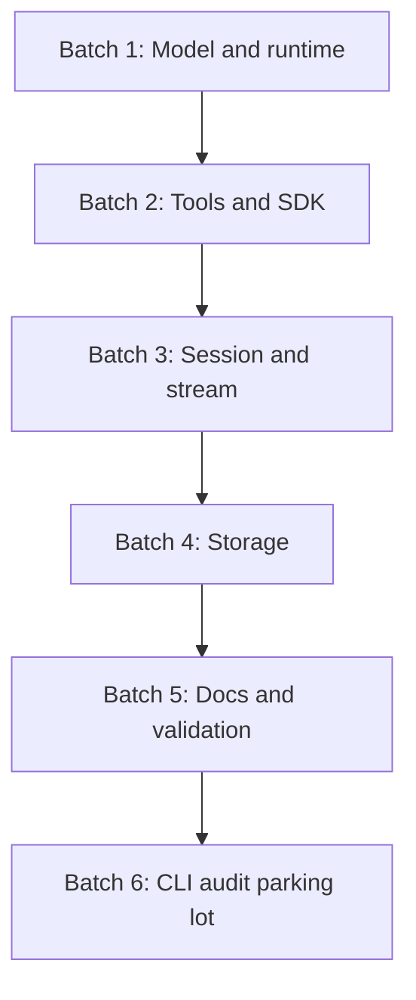

# Implementation Execution Plan 2026-06-07

The execution plan is now foundation-first. CLI parity audit is postponed until foundation gates stay stable.

## Principles

- Keep Starweaver-native contracts primary.
- Keep product-specific adapters outside foundation crates.
- Keep storage schema product-neutral.
- Validate each foundation slice with focused crate tests and docs examples.

## Batches



## Batch 1: Model and Runtime

Tasks:

- model wrappers and order tests
- request preparation snapshots
- provider stream delta fixtures
- capability hook ordering
- structured output retry diagnostics
- executor checkpoint evidence tests

Validation:

```bash
cargo test -p starweaver-model -p starweaver-runtime --locked
make replay-check
```

## Batch 2: Tools and SDK

Tasks:

- toolset combinators
- `AgentSpec` v2 YAML and registry tests
- first-party tool bundle boundaries
- live MCP host adapter seam
- filters and media helper tests

Validation:

```bash
cargo test -p starweaver-tools -p starweaver-agent -p starweaver-environment --locked
```

## Batch 3: Session and Stream

Tasks:

- session/run/checkpoint/approval/deferred records
- display/replay protocol tests
- UI adapter and sanitizer tests
- stream archive and replay log contracts
- compaction snapshots

Validation:

```bash
cargo test -p starweaver-session -p starweaver-stream --locked
```

## Batch 4: Storage

Tasks:

- product-neutral SQLite migration registry
- migration status reporting
- `SqliteSessionStore`
- `SqliteReplayEventLog`
- `SqliteStreamArchive`
- idempotency and round-trip tests

Validation:

```bash
cargo test -p starweaver-storage --locked
```

## Batch 5: Docs and Validation

Tasks:

- update README, AGENTS, CONTRIBUTING, docs, specs, and memos after structure changes
- ensure docs examples compile
- ensure scripts and install/update semantics match active release assets

Validation:

```bash
make fmt-check
make check
make test
make replay-check
make scripts-check
make docs-check
```

## Batch 6: CLI Audit Parking Lot

Postponed areas:

- live stdout streaming
- AGUI-compatible event adapter snapshots
- slash command parity
- TUI workflow parity
- config import/export and startup asset seeding
- shell environment isolation and review flows
- session-folder import/export

Validation after resuming:

```bash
cargo test -p starweaver-cli --locked
make scripts-check
```
