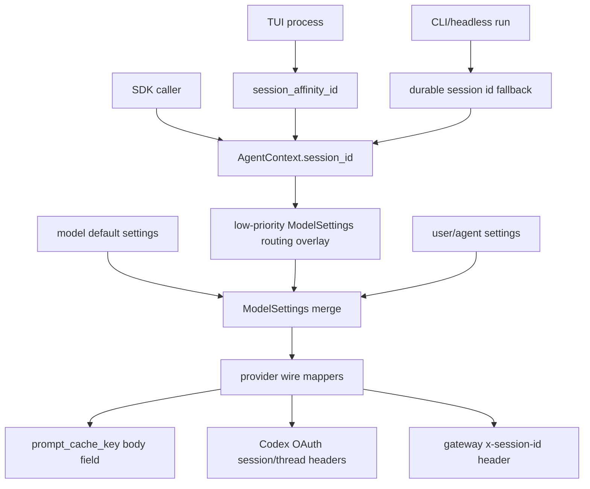

# ModelSettings Session Affinity and Provider Routing Status

> Date: 2026-06-16. Status: implemented for the current provider-alignment slice.

## Outcome

Session-affinity routing now flows through typed `ModelSettings` provider settings instead of treating durable session metadata as the primary provider-routing surface.

Implemented ownership:



## Landed Behavior

- `AgentContext` owns `session_id: Option<SessionId>` as a stable logical affinity value.
- `ResumableState` exports and restores `session_id` with serde defaults for backwards compatibility.
- `AgentSession::set_session_id` lets SDK and CLI callers set the logical affinity value explicitly.
- The runtime builds a low-priority `ModelSettings` overlay from `AgentContext.session_id` before provider mapping:
  - OpenAI Chat: `provider_settings.openai_chat.prompt_cache_key = sw_<session>` for OpenAI models that support automatic prompt-cache keys.
  - OpenAI Responses: `provider_settings.openai_responses.prompt_cache_key = sw_<session>` for OpenAI models that support automatic prompt-cache keys.
  - Codex OAuth Responses: `provider_settings.codex.session_id = <session>` and `provider_settings.codex.thread_id = <run_id>`.
  - Gemini and Bedrock gateway routing: `provider_settings.gateway.x_session_id = <session>` only when metadata `starweaver.gateway_session_affinity` is truthy.
- TUI creates one process-level `session_affinity_id` at startup and passes it to every run.
- TUI `/clear` and session reload preserve the process-level affinity id; durable session restore no longer implicitly changes provider routing affinity.
- Headless CLI uses explicit `starweaver.session_affinity_id` run metadata when present. If absent and the restored context does not already carry an affinity id, it falls back to the durable local session id for continuity.
- `starweaver.durable_session_id` is the canonical durable local session metadata key. `starweaver.session_id` remains only as a compatibility fallback for older routing/trace consumers.

## Typed Provider Settings

Implemented nested provider routing settings:

| Setting                                                     | Wire effect                                                                          |
| ----------------------------------------------------------- | ------------------------------------------------------------------------------------ |
| `provider_settings.openai_chat.prompt_cache_key`            | OpenAI Chat body `prompt_cache_key`                                                  |
| `provider_settings.openai_chat.prompt_cache_retention`      | OpenAI Chat body `prompt_cache_retention`                                            |
| `provider_settings.openai_responses.prompt_cache_key`       | OpenAI Responses body `prompt_cache_key`                                             |
| `provider_settings.openai_responses.prompt_cache_retention` | OpenAI Responses body `prompt_cache_retention`                                       |
| `provider_settings.codex.session_id`                        | Codex OAuth headers `session_id` and `session-id`                                    |
| `provider_settings.codex.thread_id`                         | Codex OAuth headers `thread_id`, `thread-id`, and `x-client-request-id`              |
| `provider_settings.gateway.x_session_id`                    | HTTP header `x-session-id`                                                           |
| `provider_settings.gateway.extra_headers`                   | gateway-scoped extra headers                                                         |
| `extra_headers`                                             | raw settings-level header override/extension, merged by case-insensitive header name |
| request-level HTTP headers                                  | final per-request header override/extension, merged by case-insensitive header name  |
| `extra_body`                                                | raw final body override/extension                                                    |

OpenAI prompt-cache settings support serde aliases `openai_prompt_cache_key` and `openai_prompt_cache_retention`.

## Override Rules

OpenAI prompt-cache key priority:

1. final raw `extra_body["prompt_cache_key"]`
2. typed OpenAI provider setting from user/default settings
3. runtime low-priority session-affinity overlay
4. legacy metadata fallback from `starweaver.prompt_cache_key`, `openai.prompt_cache_key`, `starweaver.session_id`, or `cli.session_id`
5. omit

Gateway `x-session-id` priority is case-insensitive by header name:

1. request-level HTTP headers
2. settings-level raw `extra_headers`
3. `provider_settings.gateway.extra_headers`
4. typed `provider_settings.gateway.x_session_id`
5. runtime low-priority session-affinity overlay when gateway affinity is opted in
6. adapter/config default headers
7. omit

Codex routing priority is case-insensitive by header name within each alias group:

1. explicit request headers `session_id`, `session-id`, `thread_id`, `thread-id`, and `x-client-request-id`; any explicit session alias suppresses generated session aliases, and any explicit thread alias suppresses generated thread aliases
2. Codex OAuth client `extra_headers`; any explicit session alias suppresses generated session aliases, and any explicit thread alias suppresses generated thread aliases
3. typed `provider_settings.codex.session_id` / `thread_id`
4. runtime low-priority session-affinity overlay
5. legacy metadata fallback
6. omit

Provider-specific headers remain scoped to Codex OAuth or explicit raw headers. Starweaver does not inject Codex session/thread headers as generic model HTTP headers.

## Validation

Focused validation run during implementation:

```bash
cargo check -p starweaver-cli --locked
cargo test -p starweaver-model --test request_parameters --locked
cargo test -p starweaver-model --test oauth_provider --locked
cargo test -p starweaver-model --test replay --locked
cargo test -p starweaver-runtime --test session_affinity --locked
cargo test -p starweaver-context --test context --locked
cargo test -p starweaver-cli --locked
```

Final repository validation:

```bash
make fmt-check
make check
make replay-check
make test
```

Covered regression cases:

- OpenAI Chat prompt-cache injection from runtime affinity.
- User settings overriding runtime affinity.
- Codex typed routing IDs, explicit request-header precedence, OAuth `extra_headers` precedence, and grouped alias suppression for partial explicit overrides.
- Gateway sticky routing opt-in for Gemini and Bedrock families, including case-insensitive final header precedence.
- Context export/restore of `session_id`.
- TUI clear/session restore preserving the process-level affinity id.
- CLI metadata preserving canonical durable id while keeping legacy `starweaver.session_id` fallback.
- OpenAI Responses omitting unsupported generic `seed` while OpenAI Chat and Gemini keep their supported seed mappings.

## Remaining Follow-ups

- Remove legacy metadata fallback in a future breaking/config migration after downstream consumers stop depending on `starweaver.session_id` for routing.
- Add a user-facing model settings guide once typed provider settings are stable enough for public docs.
- Add profile-level gateway affinity presets if multiple gateways require opt-in sticky routing by default.
