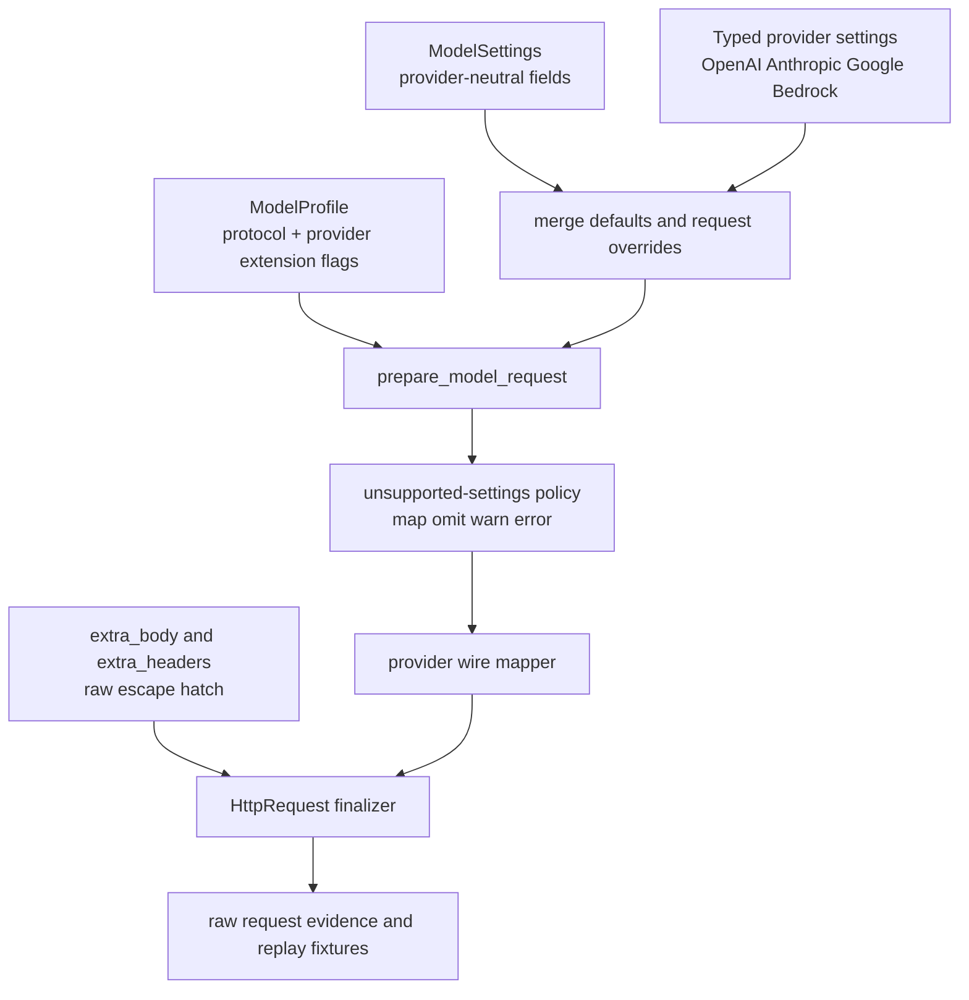

# Provider Parameter Alignment Gap and Rollout Plan

> Date: 2026-06-16. Scope: compare Pydantic AI's provider SDK parameter alignment against Starweaver's `ModelSettings`, `ModelProfile`, request preparation, and provider mappers. This memo prepares the implementation plan for aligning Starweaver with official provider contracts while preserving Starweaver's provider-neutral AST, injectable HTTP transport, replay fixtures, and raw JSON evidence model.

## Executive summary

Status update: the current implementation slice has landed typed provider settings, high-confidence provider parameter mappings, session-affinity routing, and focused regression coverage. The detailed gap matrix below remains useful as the original baseline and follow-up tracker; the "Current implementation status" section records what has moved from gap to implemented behavior.

Historical baseline before this slice: Starweaver already had a solid foundation for provider-neutral settings and profile-driven request preparation. Its `ModelSettings` covered nearly the same generic settings baseline as Pydantic AI: token limits, sampling controls, tool choice, timeouts, thinking, service tier, headers, and extra body. However, Pydantic AI had three alignment layers that Starweaver only partially modeled:

1. Provider-specific typed settings, such as `openai_store`, `openai_text_verbosity`, `anthropic_metadata`, `google_safety_settings`, and `bedrock_guardrail_config`.
2. Provider/model-specific profile flags, such as OpenAI `max_completion_tokens` support, Anthropic adaptive thinking support, Gemini tool-combination support, and Bedrock top-k/thinking variants.
3. Explicit unsupported-settings behavior, including warn-and-drop, omit, downgrade, or hard error.

The largest confirmed baseline gaps were:

- Starweaver defines `seed` but does not map it for OpenAI Chat or Gemini.
- OpenAI Chat maps `max_tokens` to legacy `max_tokens`; Pydantic AI maps it to `max_completion_tokens` when the model profile supports it.
- Starweaver sends OpenAI sampling parameters even when reasoning profiles may require dropping them.
- Starweaver's OpenAI Chat and Anthropic profiles claim native tool support that their mappers do not consume.
- Anthropic lacks native `tool_choice`, native `output_config.format` structured output, `parallel_tool_calls` mapping, typed metadata/service tier/container/betas/context settings, and native tool mapping.
- Gemini lacks `seed`, safety settings, labels, cache content, logprobs, service tier, and model-family thinking/tool-combination gates.
- Bedrock lacks typed guardrail/performance/request metadata/prompt variables/service tier/inference profile, top-k and thinking variant mapping, prompt-cache message mapping, and profile-gated `toolChoice` behavior.
- `NativeJsonObject` exists as a Starweaver output mode but is not mapped in provider output-schema code.
- `provider_options` semantics differ by provider and are not typed or validated.
- `ModelProfile` is currently mostly protocol-level; it lacks the provider/model-family knobs that Pydantic AI uses to avoid bad requests.

Recommendation at baseline was to proceed in phases. The current slice completed the high-confidence typed-settings, profile policy, request-mapping, session-affinity, and regression-test phases while preserving the follow-up tracker below for remaining model-family/schema work.

## Current implementation status

Implemented in the current slice:

- `ModelSettings.provider_settings` with typed nested settings for OpenAI Chat, OpenAI Responses, Anthropic, Google/Gemini, Bedrock, Codex OAuth routing, and Gateway sticky routing.
- Field-level merge semantics for nested provider settings, while keeping `provider_options`, `extra_body`, and `extra_headers` as raw escape hatches.
- OpenAI Chat mapping for official OpenAI `max_completion_tokens` by default, OpenAI-compatible `max_tokens` compatibility defaults, `seed`, `user`, `store`, `logprobs`, `top_logprobs`, `prediction`, `prompt_cache_key`, and `prompt_cache_retention`.
- OpenAI Responses mapping for `max_output_tokens` by default, `store`, `user`, `truncation`, `text.verbosity`, `context_management`, `include`, `prompt_cache_key`, `prompt_cache_retention`, and `thinking` as top-level `reasoning`; generic `seed` is intentionally omitted because Responses support is not confirmed.
- Profile policy `drop_sampling_parameters_when_reasoning` and mapper-level dropping of `temperature`, `top_p`, `top_k`, penalties, and `logit_bias` only when reasoning/thinking is active for OpenAI Chat, OpenAI Responses, and Anthropic defaults.
- Anthropic mapping for `tool_choice`, `parallel_tool_calls=false` through `disable_parallel_tool_use`, native JSON schema output via `output_config.format`, adaptive thinking effort, typed `metadata`, `betas` to `anthropic-beta`, `context_management`, `container`, and service tier.
- Gemini mapping for `seed`, typed `safetySettings`, `cachedContent`, `labels`, `responseLogprobs`, `logprobs`, and `serviceTier`.
- Bedrock mapping for `ToolChoice::None` by omitting `toolConfig`, Anthropic-family `top_k` and `thinking` passthrough, service tier, guardrails, performance config, request metadata, additional response paths, prompt variables, additional request fields, and inference profile routing through `modelId`.
- Output-schema mapping for `NativeJsonSchema` and `NativeJsonObject` across OpenAI Chat, OpenAI Responses, and Gemini; Anthropic native JSON schema maps to `output_config.format`.
- Profile/native-tool contract cleanup: OpenAI Chat and Anthropic default profiles no longer advertise native tools that the mappers do not consume.
- Session-affinity routing via `AgentContext.session_id` and low-priority typed `ModelSettings` overlays for OpenAI prompt cache, Codex OAuth session/thread IDs, and opt-in Gateway `x-session-id`.

Focused validation completed:

```bash
cargo check -p starweaver-cli --locked
cargo test -p starweaver-model --test request_parameters --locked
cargo test -p starweaver-model --test oauth_provider --locked
cargo test -p starweaver-model --test replay --locked
cargo test -p starweaver-runtime --test session_affinity --locked
cargo test -p starweaver-context --test context --locked
cargo test -p starweaver-cli --locked
```

Final repository validation completed:

```bash
make fmt-check
make check
make replay-check
make test
```

Remaining follow-ups after this slice:

- Add provider/model-family-specific profile extension structs for unsupported-setting policies beyond the current reasoning sampling-drop flag.
- Expand provider-specific JSON schema transformers for strict OpenAI, Gemini subsets, Bedrock subsets, and Anthropic limits.
- Add typed helper constructors for provider-native tools while keeping `NativeToolDefinition` for fast-moving provider features.
- Add Bedrock Nova-family and non-Anthropic-family top-k/thinking variants once profiles identify the target model family.
- Add cached-content stripping semantics for Gemini if `cachedContent` is used with system/tool content that providers require to be omitted.
- Migrate more parameter assertions into replay fixture JSON when the prepared-request fixture migration is complete.

## Evidence sources

### Pydantic AI source baseline

Primary source files reviewed from `pydantic/pydantic-ai` main branch:

- `pydantic_ai_slim/pydantic_ai/settings.py`
- `pydantic_ai_slim/pydantic_ai/profiles/__init__.py`
- `pydantic_ai_slim/pydantic_ai/profiles/openai.py`
- `pydantic_ai_slim/pydantic_ai/models/openai.py`
- `pydantic_ai_slim/pydantic_ai/profiles/anthropic.py`
- `pydantic_ai_slim/pydantic_ai/models/anthropic.py`
- `pydantic_ai_slim/pydantic_ai/profiles/google.py`
- `pydantic_ai_slim/pydantic_ai/models/google.py`
- `pydantic_ai_slim/pydantic_ai/providers/bedrock.py`
- `pydantic_ai_slim/pydantic_ai/models/bedrock.py`

Key extracted line anchors from Pydantic AI:

| Area                             | Source anchor                                                                                                                                               |
| -------------------------------- | ----------------------------------------------------------------------------------------------------------------------------------------------------------- |
| Generic `ModelSettings`          | `settings.py:81`, fields at `settings.py:90`, `107`, `128`, `148`, `161`, `174`, `185`, `219`, `233`, `247`, `261`, `271`, `286`, `298`, `323`, `339`       |
| Generic `ModelProfile`           | `profiles/__init__.py:42`, fields at `66`, `68`, `74`, `80`, `86`, `88`, `95`, `107`, `109`, `112`, `118`, `137`                                            |
| OpenAI profile knobs             | `profiles/openai.py:59`, `97`, `104`, `107`, `113`, `121`, `138`, `141`, `146`, `178`                                                                       |
| OpenAI settings                  | `models/openai.py:501`, `506`, `513`, `520`, `523`, `535`, `541`, `548`, `554`, `560`, `566`, `582`, `588`, `597`, `607`, `616`, `627`, `635`, `657`, `702` |
| OpenAI Chat mapping              | `models/openai.py:1008-1040`                                                                                                                                |
| OpenAI Responses mapping         | `models/openai.py:2388-2414`, reasoning translation at `2423-2449`                                                                                          |
| OpenAI unsupported handling      | `models/openai.py:439`, `474`, `995-997`, `2379-2380`, tool choice fallback around `4248`                                                                   |
| Anthropic profile knobs          | `profiles/anthropic.py:38`, `44`, `50`, `57`, `70`, `77`, `95`, budget map at `105-111`                                                                     |
| Anthropic settings               | `models/anthropic.py:281`, `286`, `292`, `298`, `307`, `313`, `322`, `333`, `352`, `358`, `369`, `400`, `408`, `418`                                        |
| Anthropic thinking and mapping   | `models/anthropic.py:646-660`, create args around `663-745`, tool choice around `1144`, forced choice fallback around `2766-2792`                           |
| Google profile knobs             | `profiles/google.py:22`, `28`, `38`, `61`, and capability cleanup around `77-86`                                                                            |
| Google settings                  | `models/google.py:241`, `246`, `252`, `258`, `264`, `270`, `286`, `296`, `306`, `316`, `319`                                                                |
| Google config mapping            | `models/google.py:843-980`                                                                                                                                  |
| Bedrock profile knobs            | `providers/bedrock.py:126`, `132-138`, `147`, `157`, `175`                                                                                                  |
| Bedrock settings                 | `models/bedrock.py:300`, `309`, `315`, `321`, `327`, `333`, `339`, `345`, `355`, `364`, `378`, `388`                                                        |
| Bedrock additional field mapping | `models/bedrock.py:712-775`, tool-choice gates around `885`, `927`, `1584-1590`                                                                             |

### Starweaver source baseline

Primary local source files reviewed:

- `crates/starweaver-model/src/settings.rs`
- `crates/starweaver-model/src/profile.rs`
- `crates/starweaver-model/src/request/prepare.rs`
- `crates/starweaver-model/src/providers/settings.rs`
- `crates/starweaver-model/src/providers/openai_chat.rs`
- `crates/starweaver-model/src/providers/openai_responses/request.rs`
- `crates/starweaver-model/src/providers/anthropic/request.rs`
- `crates/starweaver-model/src/providers/anthropic/settings.rs`
- `crates/starweaver-model/src/providers/gemini.rs`
- `crates/starweaver-model/src/providers/bedrock.rs`
- `crates/starweaver-model/src/providers/client/output_schema.rs`
- `crates/starweaver-model/src/providers/client/wire.rs`

Key local anchors:

| Area                               | Source anchor                                                                                                                  |
| ---------------------------------- | ------------------------------------------------------------------------------------------------------------------------------ |
| `ModelSettings` fields             | `settings.rs:10-68`                                                                                                            |
| `ToolChoice`                       | `settings.rs:151-173`                                                                                                          |
| `ThinkingSettings`                 | `settings.rs:177-192`                                                                                                          |
| `ServiceTier`                      | `settings.rs:197-206`                                                                                                          |
| `ModelProfile`                     | `profile.rs:185-232`                                                                                                           |
| Protocol default profiles          | `profile.rs:263-339`                                                                                                           |
| `StructuredOutputMode`             | `profile.rs:347-356`                                                                                                           |
| Request preparation                | `request/prepare.rs:18-68`, tool/native filtering at `92-177`, schema transform at `179-201`, output instructions at `203-235` |
| Common OpenAI-like settings        | `providers/settings.rs:7-75`                                                                                                   |
| OpenAI Chat request mapping        | `providers/openai_chat.rs:29-143`                                                                                              |
| OpenAI Responses request mapping   | `providers/openai_responses/request.rs:25-111`                                                                                 |
| Anthropic request/settings mapping | `providers/anthropic/request.rs:20-119`, `providers/anthropic/settings.rs:11-123`                                              |
| Gemini request mapping             | `providers/gemini.rs:40-121`, generation config at `197-258`, tools at `260-332`                                               |
| Bedrock request mapping            | `providers/bedrock.rs:29-190`, cache helpers at `261-339`                                                                      |
| Output schema mapping              | `providers/client/output_schema.rs:8-65`                                                                                       |
| Protocol wiring                    | `providers/client/wire.rs:20-82`                                                                                               |

## Pydantic AI baseline pattern

Pydantic AI's parameter alignment model has four layers:

1. Generic `ModelSettings` for cross-provider fields.
2. Provider-specific typed settings for official SDK/API extras.
3. Provider/model profile flags that capture model-family behavior and unsupported settings.
4. Adapter-level mapping that can send, transform, omit, downgrade, warn, or error.

Important design choices to borrow:

- Provider-specific fields are prefixed: `openai_*`, `anthropic_*`, `google_*`, `bedrock_*`.
- Provider-specific fields take precedence over generic fallbacks.
- Unified `thinking` is translated by provider/profile, not blindly sent.
- Unsupported parameters are not ignored accidentally; behavior is intentional.
- Model profiles are more specific than protocol families.
- JSON schema transformation is provider-specific and model-aware.
- Native tools and structured output combinations are profile-gated before the request is sent.

## Starweaver baseline state before this implementation slice

The following table is the original baseline captured before the current provider-alignment implementation slice. For the landed status, use the "Current implementation status" section above.

Starweaver had a strong generic layer:

| Generic setting       | Starweaver support         | Current mapping status                                                                                |
| --------------------- | -------------------------- | ----------------------------------------------------------------------------------------------------- |
| `max_tokens`          | `ModelSettings.max_tokens` | Mapped across all providers, but OpenAI Chat uses legacy `max_tokens`.                                |
| `temperature`         | present                    | Mapped for OpenAI, Anthropic, Gemini, Bedrock.                                                        |
| `top_p`               | present                    | Mapped for OpenAI, Anthropic, Gemini, Bedrock.                                                        |
| `top_k`               | present                    | Mapped for Anthropic/Gemini only.                                                                     |
| `timeout_ms`          | present                    | Transport-level HTTP timeout.                                                                         |
| `parallel_tool_calls` | present                    | Mapped only by OpenAI common settings.                                                                |
| `tool_choice`         | present                    | Mapped for OpenAI, Gemini, Bedrock; Anthropic only filters tools in preparation.                      |
| `seed`                | present                    | Not mapped in provider mappers.                                                                       |
| `stop_sequences`      | present                    | Mapped as OpenAI `stop`, Anthropic `stop_sequences`, Gemini `stopSequences`, Bedrock `stopSequences`. |
| `presence_penalty`    | present                    | Mapped for OpenAI and Gemini.                                                                         |
| `frequency_penalty`   | present                    | Mapped for OpenAI and Gemini.                                                                         |
| `logit_bias`          | present                    | Mapped only for OpenAI.                                                                               |
| `thinking`            | present                    | Mapped to OpenAI reasoning, Anthropic thinking, Gemini thinkingConfig; not mapped for Bedrock.        |
| `service_tier`        | present                    | Mapped only for OpenAI.                                                                               |
| `provider_replay`     | present                    | OpenAI Responses only.                                                                                |
| `provider_options`    | present                    | Provider-dependent raw JSON behavior.                                                                 |
| `extra_headers`       | present                    | Transport-level headers.                                                                              |
| `extra_body`          | present                    | Top-level body merge for all protocols.                                                               |

The largest structural gap is that Starweaver uses raw `provider_options` and `extra_body` for most provider-specific parameters, while Pydantic AI exposes typed provider settings and profile gates.

## Detailed baseline gap matrix

### Cross-cutting settings and profiles

| ID  | Gap                                                          | Current Starweaver evidence                                                                                                                                                  | Pydantic AI evidence                                                                                                                 | Risk                                                                      | Recommendation                                                                                                                                                                                |
| --- | ------------------------------------------------------------ | ---------------------------------------------------------------------------------------------------------------------------------------------------------------------------- | ------------------------------------------------------------------------------------------------------------------------------------ | ------------------------------------------------------------------------- | --------------------------------------------------------------------------------------------------------------------------------------------------------------------------------------------- |
| X1  | `seed` is defined but not mapped.                            | `settings.rs:35-37`; no provider mapper writes `seed`.                                                                                                                       | `settings.py:219`; OpenAI Chat maps `seed` at `models/openai.py:1023`; Google settings/mapping include seed via generic config path. | User sets deterministic seed and it is silently ignored.                  | Map `seed` for OpenAI Chat and Gemini. Do not map for providers without official support. Add replay fixtures.                                                                                |
| X2  | No explicit unsupported-settings policy.                     | `prepare_model_request` filters tools/native tools but does not track unsupported model settings beyond metadata for tool filtering.                                         | OpenAI drops unsupported settings via `openai_unsupported_model_settings`; Anthropic drops sampling settings for some models.        | API 400s or silent semantic mismatch.                                     | Add profile-driven `unsupported_settings` and `unsupported_setting_policy` with `omit`, `warn_metadata`, `error`, and provider-specific mapping hooks.                                        |
| X3  | Profile is mostly protocol-level, not model-family specific. | `ModelProfile::for_protocol` has only broad defaults.                                                                                                                        | Pydantic provider profiles contain model-family flags for OpenAI, Anthropic, Google, Bedrock.                                        | Incorrect params for model families, especially reasoning/Gemini/Bedrock. | Add provider-specific profile extension structs or enum-backed profile details. Keep protocol fields stable.                                                                                  |
| X4  | Provider-specific settings are untyped.                      | `provider_options: Option<Value>` and `extra_body` are escape hatches.                                                                                                       | Typed provider settings classes: `OpenAIChatModelSettings`, `AnthropicModelSettings`, `GoogleModelSettings`, `BedrockModelSettings`. | Hard to validate, document, or fixture exact official params.             | Introduce typed provider options while retaining raw escape hatches. In Rust, prefer nested structs under `ModelSettings.provider` or protocol-specific settings attached to `ProviderAlias`. |
| X5  | `NativeJsonObject` output mode exists but is not mapped.     | `StructuredOutputMode::NativeJsonObject` exists in `profile.rs:351`; `output_schema.rs` only handles `OutputMode::NativeJsonSchema`.                                         | Pydantic maps JSON object mode where supported, e.g. OpenAI Chat `response_format={'type': 'json_object'}`.                          | User can select a mode that does nothing provider-native.                 | Implement JSON object mapping for OpenAI Chat/Responses where official docs support it, or remove support flags until implemented.                                                            |
| X6  | JSON schema transformer is too limited.                      | Only `JsonSchemaTransformer::InlineDefinitions`.                                                                                                                             | Pydantic has provider-specific transformers for OpenAI strict, Gemini, Bedrock, etc.                                                 | Tool/output schemas may produce provider 400s.                            | Add provider-specific schema transformers: OpenAI strict, Anthropic structured-output limits, Gemini subset, Bedrock subset.                                                                  |
| X7  | Native tool profile and mapper wiring are inconsistent.      | OpenAI Chat and Anthropic profiles list native tools; mappers do not accept `native_tools`.                                                                                  | Pydantic intersects profile native tools with model adapter support.                                                                 | Native tools can survive preparation then be dropped by mapper silently.  | Either wire native tools into mappers or remove unsupported native tools from those profiles. Add test asserting no profile advertises native tools that the adapter drops.                   |
| X8  | `provider_options` semantics vary by provider.               | OpenAI merges top-level, Anthropic filters internal then merges top-level, Gemini only accepts `google_generation_config.*`, Bedrock maps to `additionalModelRequestFields`. | Pydantic uses typed provider settings plus `extra_body`.                                                                             | Users cannot predict how provider options behave.                         | Document and formalize provider option namespaces. Prefer typed settings for known fields; keep `extra_body` for final raw override.                                                          |

### OpenAI Chat Completions

| ID     | Gap                                                                                                                                          | Starweaver current behavior                                                                                                                                  | Pydantic AI / official-contract behavior                                                                                                                                                                    | Priority | Proposed fix                                                                                                                                                                           |
| ------ | -------------------------------------------------------------------------------------------------------------------------------------------- | ------------------------------------------------------------------------------------------------------------------------------------------------------------ | ----------------------------------------------------------------------------------------------------------------------------------------------------------------------------------------------------------- | -------- | -------------------------------------------------------------------------------------------------------------------------------------------------------------------------------------- |
| OAI-C1 | `max_tokens` should map to `max_completion_tokens` for modern Chat models.                                                                   | `apply_common_settings` writes `max_tokens`.                                                                                                                 | Pydantic checks `openai_chat_supports_max_completion_tokens` and sends `max_completion_tokens` when true.                                                                                                   | P0       | Add profile flag or HTTP config for OpenAI Chat max-token parameter. Default to `max_completion_tokens` for OpenAI official Chat, retain legacy `max_tokens` for compatible providers. |
| OAI-C2 | `seed` is not sent.                                                                                                                          | Field exists but no mapper writes it.                                                                                                                        | Pydantic sends `seed` to Chat.                                                                                                                                                                              | P1       | Add `seed` to OpenAI common settings only for Chat if official Responses does not support it. Add fixture.                                                                             |
| OAI-C3 | Missing typed OpenAI Chat settings: `user`, `store`, `prediction`, `logprobs`, `top_logprobs`, prompt-cache fields, continuous stream usage. | Some can be raw `provider_options`/metadata; no typed settings.                                                                                              | Pydantic exposes `openai_user`, `openai_store`, `openai_prediction`, `openai_logprobs`, `openai_top_logprobs`, `openai_prompt_cache_key`, `openai_prompt_cache_retention`, `openai_continuous_usage_stats`. | P1/P2    | Add typed OpenAI settings or a typed OpenAI provider options struct. Keep raw overrides.                                                                                               |
| OAI-C4 | Sampling params are not dropped for reasoning models that reject them.                                                                       | Common settings always sends `temperature`, `top_p`, penalties, `logit_bias` if set.                                                                         | Pydantic drops sampling params when reasoning is active and profile says sampling is unsupported.                                                                                                           | P1       | Add OpenAI profile flags for reasoning support and sampling compatibility. Apply warn/drop metadata before mapping.                                                                    |
| OAI-C5 | No `system` vs `developer` role profile.                                                                                                     | Chat mapper always writes role `system`.                                                                                                                     | Pydantic profile has `openai_system_prompt_role` and multiple-system-message support.                                                                                                                       | P2       | Add OpenAI Chat profile fields for system prompt role and multiple system message handling.                                                                                            |
| OAI-C6 | OpenAI Chat profile advertises native tools but mapper ignores `native_tools`.                                                               | `ModelProfile::for_protocol(OpenAiChatCompletions)` includes native tool kinds; `wire.rs` calls `OpenAiChatAdapter::build_request` with only function tools. | Pydantic gates native tools per adapter.                                                                                                                                                                    | P0       | Remove native tools from OpenAI Chat default profile, or implement specific Chat native tool mapping for official supported tools.                                                     |
| OAI-C7 | No provider-specific unsupported settings list for OpenAI-compatible providers.                                                              | Compatible providers can receive unsupported OpenAI fields through common mapper.                                                                            | Pydantic profiles expose `openai_unsupported_model_settings`.                                                                                                                                               | P1       | Add `unsupported_settings` profile field or OpenAI-specific profile extension. Use presets for compatible providers.                                                                   |

### OpenAI Responses

| ID     | Gap                                                                                                                                      | Starweaver current behavior                                                                                                 | Pydantic AI / official-contract behavior                                        | Priority | Proposed fix                                                                                                                                                                       |
| ------ | ---------------------------------------------------------------------------------------------------------------------------------------- | --------------------------------------------------------------------------------------------------------------------------- | ------------------------------------------------------------------------------- | -------- | ---------------------------------------------------------------------------------------------------------------------------------------------------------------------------------- |
| OAI-R1 | Missing typed Responses settings: `truncation`, `text.verbosity`, `context_management`, include variants, `store`, `user`, top logprobs. | Some possible via `provider_options`/`extra_body`; no typed representation except `provider_replay` and `thinking.summary`. | Pydantic exposes these as `openai_*` settings and maps them explicitly.         | P1       | Add typed `OpenAiResponsesSettings` or typed `ProviderSettings::OpenAiResponses`. Start with `store`, `user`, `truncation`, `text_verbosity`, `context_management`, include flags. |
| OAI-R2 | Prompt cache key/retention is metadata-driven rather than a typed OpenAI setting.                                                        | `request_options.rs` can derive prompt cache metadata from session metadata and explicit extra body.                        | Pydantic exposes `openai_prompt_cache_key` and `openai_prompt_cache_retention`. | P2       | Keep metadata auto-routing, but add typed explicit settings with higher priority than metadata-derived values.                                                                     |
| OAI-R3 | No unsupported/sampling-drop policy for reasoning.                                                                                       | Common settings may send sampling params with reasoning.                                                                    | Pydantic invokes `_drop_sampling_params_for_reasoning` for Responses.           | P1       | Same fix as OpenAI Chat, but specific to Responses official profile.                                                                                                               |
| OAI-R4 | Native tools are generic and not strongly typed.                                                                                         | `NativeToolDefinition` passes arbitrary tool type/config through.                                                           | Pydantic has typed `openai_native_tools`.                                       | P2       | Keep generic native tool for extensibility, but add helper constructors/typed wrappers for OpenAI web/file/code/MCP/image/tool-search.                                             |
| OAI-R5 | No profile flags for encrypted reasoning support, phase support, or vLLM compatibility quirks.                                           | `provider_replay.include_encrypted_reasoning` always adds include when requested.                                           | Pydantic profile has OpenAI-specific flags.                                     | P2       | Add profile gates for encrypted reasoning include and known compatible-provider quirks.                                                                                            |

### Anthropic Messages

| ID    | Gap                                                                                                                                                                                                | Starweaver current behavior                                                                                                 | Pydantic AI / official-contract behavior                                                                            | Priority | Proposed fix                                                                                                                                                                                                           |
| ----- | -------------------------------------------------------------------------------------------------------------------------------------------------------------------------------------------------- | --------------------------------------------------------------------------------------------------------------------------- | ------------------------------------------------------------------------------------------------------------------- | -------- | ---------------------------------------------------------------------------------------------------------------------------------------------------------------------------------------------------------------------- |
| ANT-1 | No native `tool_choice` mapping.                                                                                                                                                                   | `prepare.rs` filters tools for `Tools`/`ToolOrOutput`; `anthropic/settings.rs` only writes `tools`.                         | Pydantic maps Anthropic `tool_choice`, with forced-choice fallback when unsupported.                                | P0       | Implement Anthropic `tool_choice` mapping: `auto`, `none`, `any`, named tool. Add profile flag for forced tool choice support and fallback behavior.                                                                   |
| ANT-2 | No native structured output mapping via `output_config.format`.                                                                                                                                    | `output_schema.rs` does nothing for Anthropic.                                                                              | Anthropic docs and Pydantic support `output_config.format`.                                                         | P0       | Set `supports_json_schema_output=true` for model profiles that support it, map `NativeJsonSchema` to `output_config.format`, add strict/schema transformer handling.                                                   |
| ANT-3 | Profile advertises native `CodeExecution` but mapper ignores `native_tools`.                                                                                                                       | Anthropic profile includes `CodeExecution`; `wire.rs` passes only function tools.                                           | Pydantic supports Anthropic server tools and code execution with version/profile settings.                          | P1       | Either remove native tool support from default Anthropic profile or wire Anthropic native/server tools. Prefer implementing typed native tool mapping with fixtures.                                                   |
| ANT-4 | `parallel_tool_calls` is not mapped.                                                                                                                                                               | Only OpenAI common writes it.                                                                                               | Pydantic maps Anthropic parallel behavior through `disable_parallel_tool_use` in `tool_choice` semantics.           | P1       | Map `parallel_tool_calls=false` to Anthropic disable parallel tool use where official API supports it.                                                                                                                 |
| ANT-5 | Missing typed Anthropic settings: metadata, service tier, cache messages/top-level cache, betas, speed, container, context management, task budget, code execution version, eager input streaming. | Some cache options in `provider_options`; others raw only.                                                                  | Pydantic exposes `anthropic_*` settings.                                                                            | P1/P2    | Add typed Anthropic settings incrementally: metadata, service_tier, betas, context_management first; cache_messages and native tools next.                                                                             |
| ANT-6 | Thinking mapping lacks Pydantic-style effort/budget resolution and model gating.                                                                                                                   | If mode is absent, Starweaver uses `enabled` and budget default 1024; adaptive writes `output_config.effort`.               | Pydantic maps unified levels to budgets or adaptive effort based on profile; errors for disallowed budget thinking. | P1       | Add Anthropic profile flags: supports adaptive thinking, supports effort, supports xhigh effort, disallows budget thinking, disallows sampling. Implement translator from Starweaver unified effort to provider shape. |
| ANT-7 | Sampling settings are never profile-dropped.                                                                                                                                                       | `temperature`, `top_p`, `top_k` always sent if set.                                                                         | Pydantic drops these for profiles that disallow sampling.                                                           | P1       | Add Anthropic profile policy and metadata warning/drop.                                                                                                                                                                |
| ANT-8 | Default `max_tokens` differs from Pydantic AI.                                                                                                                                                     | Starweaver default is 1024.                                                                                                 | Pydantic default is 4096 for Anthropic.                                                                             | P2       | Decide whether to change default or keep Starweaver's conservative default. If changed, add fixture and release note.                                                                                                  |
| ANT-9 | `bedrock_cache_messages` / `anthropic_cache_messages` style cache controls are not fully mapped for messages.                                                                                      | Anthropic has instruction/tool cache support; message cache support key exists in internal filter but no mapping was found. | Pydantic supports cache messages and automatic cache.                                                               | P2       | Add cache message block insertion and fixture.                                                                                                                                                                         |

### Gemini / Google

| ID    | Gap                                                                                                                            | Starweaver current behavior                                                                     | Pydantic AI / official-contract behavior                                                                      | Priority | Proposed fix                                                                                                                                        |
| ----- | ------------------------------------------------------------------------------------------------------------------------------ | ----------------------------------------------------------------------------------------------- | ------------------------------------------------------------------------------------------------------------- | -------- | --------------------------------------------------------------------------------------------------------------------------------------------------- |
| GEM-1 | `seed` is not mapped.                                                                                                          | Field exists but `gemini.rs` generation config does not write seed.                             | Pydantic maps generic `seed` into GenerateContent config.                                                     | P1       | Add `generationConfig.seed` if official current API supports it. Add fixture.                                                                       |
| GEM-2 | Missing typed Google settings: safety settings, labels, video resolution, cached content, logprobs/top logprobs, service tier. | Only `google_generation_config.*` provider option prefix is supported.                          | Pydantic exposes `google_*` settings and maps them.                                                           | P1/P2    | Add typed Google settings or documented provider option namespace. Start with safety settings and cached content because they affect request shape. |
| GEM-3 | Thinking translation is not model-family gated.                                                                                | Starweaver writes both `thinkingBudget` and `thinkingLevel` if provided.                        | Pydantic uses `thinking_budget` for Gemini 2.5, `thinking_level` for Gemini 3+, and handles always-on models. | P1       | Add Google profile flags: supports thinking level, thinking always enabled. Translate unified thinking accordingly.                                 |
| GEM-4 | Tool-combination capability is not profile-gated.                                                                              | Starweaver can send function tools, native tools, and output schema without combination policy. | Pydantic downgrades or errors for pre-Gemini-3 unsupported tool combinations.                                 | P1       | Add profile flag for tool combination support; fallback to prompted output or error for explicit native output.                                     |
| GEM-5 | Cached content stripping is absent.                                                                                            | Starweaver does not model cached content.                                                       | Pydantic strips system/tools/tool_config when `google_cached_content` is set and warns.                       | P2       | If adding cached content, implement stripping semantics and metadata warning.                                                                       |
| GEM-6 | Server-side tool invocation support is not gated.                                                                              | Native tool outputs are generic.                                                                | Pydantic gates `include_server_side_tool_invocations`.                                                        | P2       | Add profile flag if Starweaver models this behavior.                                                                                                |
| GEM-7 | Output schema field naming should be revalidated.                                                                              | Starweaver writes `generationConfig.responseSchema`.                                            | Pydantic SDK uses `response_json_schema`/GenerateContent config abstraction.                                  | P2       | Cross-check official Gemini REST docs and fixtures. Keep if replay fixtures confirm REST shape.                                                     |

### Bedrock Converse

| ID    | Gap                                                               | Starweaver current behavior                                                                                   | Pydantic AI / official-contract behavior                                                                                                                                                    | Priority | Proposed fix                                                                                                                                                         |
| ----- | ----------------------------------------------------------------- | ------------------------------------------------------------------------------------------------------------- | ------------------------------------------------------------------------------------------------------------------------------------------------------------------------------------------- | -------- | -------------------------------------------------------------------------------------------------------------------------------------------------------------------- |
| BED-1 | `top_k` is not mapped.                                            | Bedrock mapper ignores `settings.top_k`.                                                                      | Pydantic maps top-k by model-family variant: Anthropic `top_k`, Nova `inferenceConfig.topK`, otherwise omit.                                                                                | P1       | Add Bedrock profile `top_k_variant` and map into `additionalModelRequestFields`.                                                                                     |
| BED-2 | `thinking` is not mapped.                                         | Bedrock mapper ignores `settings.thinking`.                                                                   | Pydantic maps thinking by variant: Anthropic, OpenAI, Qwen, or omit.                                                                                                                        | P1       | Add Bedrock profile `thinking_variant`, `supports_adaptive_thinking`, `supports_effort`; map into `additionalModelRequestFields`.                                    |
| BED-3 | `service_tier` is not mapped.                                     | Starweaver ignores `service_tier`.                                                                            | Pydantic maps to Bedrock `serviceTier`, omitting `auto`.                                                                                                                                    | P1       | Map `ServiceTier::{Default,Flex,Priority}` to `serviceTier`; omit `Auto`.                                                                                            |
| BED-4 | Missing typed Bedrock settings.                                   | Only provider options to `additionalModelRequestFields`, plus extra-body `additionalModelResponseFieldPaths`. | Pydantic exposes guardrails, performance config, request metadata, additional response paths, prompt variables, additional request fields, cache settings, service tier, inference profile. | P1/P2    | Add typed Bedrock settings or documented `bedrock_*` provider options. Start with guardrail, performance, request metadata, additional response paths, service tier. |
| BED-5 | `ToolChoice::None` maps to `auto`.                                | Bedrock maps `Auto` and `None` both to `{auto:{}}`.                                                           | Pydantic omits tools/toolChoice for `none` because Bedrock lacks native none.                                                                                                               | P0       | Change `ToolChoice::None` to omit `toolConfig` or clear tools during preparation for Bedrock. Add fixture.                                                           |
| BED-6 | Tool choice support is not profile-gated.                         | Starweaver always sends `toolChoice` when tools and setting exist.                                            | Pydantic sends only if `bedrock_supports_tool_choice`.                                                                                                                                      | P1       | Add Bedrock profile flag and fallback behavior.                                                                                                                      |
| BED-7 | Strict tool definition/caching support is not profile-gated.      | Tool schemas are sent without strict/profile gates; cache tools supported only via provider options.          | Pydantic gates strict and caching by profile and local SDK capability.                                                                                                                      | P2       | Add strict support after schema transformer work. Add cache support flags.                                                                                           |
| BED-8 | Prompt cache message support key is filtered but not implemented. | `is_internal_bedrock_option` includes `bedrock_cache_messages`; mapper only handles instructions and tools.   | Pydantic supports message cache points.                                                                                                                                                     | P2       | Implement message cache insertion or stop filtering unsupported key.                                                                                                 |
| BED-9 | Native structured output is not mapped.                           | `output_schema.rs` does nothing for Bedrock.                                                                  | Pydantic maps native structured output to `outputConfig` where available.                                                                                                                   | P2       | Add profile-gated Bedrock output config support after official contract verification.                                                                                |

## Confirmed non-gaps or intentional differences

| Topic                              | Decision                                                                                                                                                                                |
| ---------------------------------- | --------------------------------------------------------------------------------------------------------------------------------------------------------------------------------------- |
| OpenAI Responses `seed`            | Do not treat as a confirmed gap until official Responses API support is verified. Pydantic AI does not map generic `seed` in the Responses create call snippet reviewed.                |
| `provider_replay`                  | Starweaver-specific and valuable. It should remain as a Starweaver-native server-state/replay abstraction rather than mirroring Pydantic AI exactly.                                    |
| Generic `NativeToolDefinition`     | Keep it. Pydantic AI has typed native tools, but Starweaver's generic shape is useful for fast-moving provider tools. Add typed helpers rather than replacing the generic escape hatch. |
| Raw `extra_body`                   | Keep it as final override and gateway escape hatch. The gap is lack of typed known fields and validation, not the existence of raw escape hatches.                                      |
| `timeout_ms` vs Pydantic `timeout` | Starweaver's integer millisecond representation is Rust/transport-friendly and acceptable.                                                                                              |

## Review passes

### Review pass 1: Generic settings parity

Compared Pydantic AI `ModelSettings` with Starweaver `ModelSettings`.

Result: Starweaver covers the generic baseline. Confirmed gaps are not missing generic fields but missing provider-specific mapping for fields that already exist (`seed`, `service_tier`, `parallel_tool_calls`, `top_k`, `thinking`).

### Review pass 2: Provider-specific settings parity

Compared Pydantic AI provider-specific settings classes with Starweaver's `provider_options` and provider mappers.

Historical result: Starweaver did not have typed provider-specific settings. Most provider-specific params could only be expressed as raw JSON through `provider_options` or `extra_body`, and the behavior differed per provider. The current implementation slice added `ModelSettings.provider_settings` with typed nested provider settings while preserving raw escape hatches.

### Review pass 3: Profile capability consistency

Compared Pydantic AI provider profiles with Starweaver `ModelProfile::for_protocol` and mapper signatures.

Result: Starweaver profiles are too broad. Two concrete profile/mapper mismatches are confirmed: OpenAI Chat and Anthropic advertise native tool families that their mappers do not consume. Bedrock lacks model-family profile knobs for top-k/thinking/tool-choice behavior.

### Review pass 4: Mapper behavior and testability

Checked how current Starweaver mappers serialize fields and how existing replay tests cover behavior.

Result: The current replay tests are a good foundation, but they mainly cover existing behavior. New gaps should be fixed fixture-first: add expected provider request fixtures before each mapper change.

## Rollout plan

### Phase 0: Contract scaffolding before behavior changes

Goal: make gaps visible and prevent regressions.

Tasks:

1. Add a provider parameter matrix test file under `crates/starweaver-model/tests/` that asserts known `ModelSettings` field support per protocol.
2. Add a profile-to-mapper consistency test: every `supported_native_tools` kind in a default profile must either be mapped by that protocol adapter or be filtered before mapper invocation.
3. Add fixture naming convention for parameter alignment fixtures:
   - `openai_chat/max_completion_tokens.json`
   - `openai_chat/seed.json`
   - `anthropic/tool_choice_named.json`
   - `anthropic/structured_output_native.json`
   - `gemini/seed.json`
   - `bedrock/top_k_anthropic_variant.json`
4. Add a small `memos` or `spec` table that maps each public `ModelSettings` field to supported protocols.

Acceptance:

- Existing `make replay-check` passes.
- New parameter matrix tests fail only for expected TODO entries or use explicit `#[ignore]`/TODO metadata if introduced first.

### Phase 1: Correct unsafe or misleading behavior

Goal: fix behavior where user intent is currently ignored or profile metadata is wrong.

Implementation order:

1. Fix `ToolChoice::None` for Bedrock so tools are omitted rather than sent with `{auto:{}}`.
2. Remove native tools from OpenAI Chat and Anthropic default profiles unless mapper support is added in the same change.
3. Add OpenAI Chat `max_completion_tokens` mapping with a compatibility override for OpenAI-compatible providers.
4. Add OpenAI Chat `seed` mapping.
5. Add Gemini `seed` mapping if official REST shape is confirmed.

Acceptance:

- Replay fixtures prove exact request JSON.
- Existing request parameter tests still pass.
- Any profile default change has a focused test.

### Phase 2: Anthropic first-class parameter alignment

Goal: bring Anthropic closer to official Messages API and Pydantic AI's SDK alignment.

Implementation order:

1. Add Anthropic `tool_choice` mapper and profile flag for forced tool choice.
2. Add Anthropic native structured output mapping to `output_config.format` and update supported profile defaults only for models/presets that support it.
3. Add Anthropic `parallel_tool_calls=false` mapping to provider shape if official API support is confirmed.
4. Add Anthropic typed settings for `metadata`, `service_tier`, `betas`, and `context_management`.
5. Add Anthropic thinking translator with profile flags for adaptive thinking, effort, xhigh support, disallowed budget thinking, and disallowed sampling settings.
6. Add Anthropic native/server tool mapping or remove default native tool support until implemented.

Acceptance:

- Fixtures cover text, tool choice, structured output, thinking, and cache behavior.
- Unsupported sampling behavior is explicit and visible in prepared request metadata or errors.

### Phase 3: OpenAI typed settings and reasoning policy

Goal: keep OpenAI mappers aligned to official OpenAPI while retaining raw request evidence.

Implementation order:

1. Add typed OpenAI settings for `store`, `user`, `logprobs`, `top_logprobs`, prompt cache key/retention, Responses `truncation`, `text_verbosity`, `context_management`, and include flags.
2. Add OpenAI profile flags for reasoning support and sampling-parameter policy.
3. Add OpenAI-compatible provider unsupported-settings list support.
4. Add typed helper constructors for OpenAI native tools while keeping `NativeToolDefinition`.

Acceptance:

- OpenAI OpenAPI drift check validates known mapped fields.
- Replay fixtures cover Chat and Responses typed settings.
- Reasoning + sampling behavior is covered for official OpenAI and at least one compatible-provider profile.

### Phase 4: Gemini and Bedrock model-family variants

Goal: avoid invalid requests for provider families whose request shape varies by model.

Gemini tasks:

1. Add typed Google settings for safety settings, cached content, labels, logprobs, and service tier.
2. Add Google profile flags for thinking level, always-on thinking, tool combination, server-side tool invocation support.
3. Add cached-content stripping semantics if `google_cached_content` is implemented.

Bedrock tasks:

1. Add Bedrock profile fields: `supports_tool_choice`, `top_k_variant`, `thinking_variant`, `supports_adaptive_thinking`, `supports_effort`, `supports_prompt_caching`, `supports_tool_caching`.
2. Map `top_k`, `thinking`, and `service_tier` by profile.
3. Add remaining typed Bedrock settings and model-family gates beyond landed guardrails, performance, request metadata, additional response fields, prompt variables, additional request fields, and inference profile routing.
4. Add message cache point support or stop filtering cache-message options.

Acceptance:

- Bedrock fixtures for Anthropic-family and Nova-family top-k variants.
- Gemini fixtures for thinking budget vs thinking level variants.
- Explicit fallback/error behavior for unsupported combinations.

### Phase 5: Schema transformer expansion

Goal: reduce provider 400s from schema subset mismatches.

Tasks:

1. Add OpenAI strict schema transformer.
2. Add Anthropic structured output schema validation/transform policy.
3. Add Gemini schema transformer.
4. Add Bedrock schema transformer.
5. Add fixtures for strict tool schemas and structured output schemas per provider.

Acceptance:

- Schema transformer tests cover `$defs`, `additionalProperties`, unsupported constraints, `const`/`enum`, unsupported formats, and description-preserving downgrades.

## Implementation design options

### Option A: Extend `ModelSettings` directly with all provider-specific fields

Pros:

- Simple serialization.
- Discoverable in one struct.

Cons:

- `ModelSettings` becomes very large.
- Provider-specific fields pollute provider-neutral API.
- Harder to maintain stable public API.

Recommendation: avoid as the main strategy.

### Option B: Add nested typed provider settings

Example shape:

```rust
pub struct ModelSettings {
    // existing provider-neutral fields
    pub provider_settings: ProviderSettings,
}

pub struct ProviderSettings {
    pub openai: Option<OpenAiSettings>,
    pub anthropic: Option<AnthropicSettings>,
    pub google: Option<GoogleSettings>,
    pub bedrock: Option<BedrockSettings>,
}
```

Pros:

- Keeps generic settings clean.
- Supports provider-specific typed fields and docs.
- Preserves raw `provider_options` and `extra_body` for escape hatches.

Cons:

- Slightly more API surface.
- Needs merge semantics and serde compatibility decisions.

Recommendation: preferred for known provider-specific parameters.

### Option C: Attach provider settings to `ProviderAlias` / presets only

Pros:

- Avoids per-request public API expansion.
- Good for model-family defaults and profile quirks.

Cons:

- Does not help users set per-request provider-specific params cleanly.
- Still needs runtime override path.

Recommendation: use in combination with Option B for defaults/profile behavior.

### Option D: Keep only `provider_options` and document namespaces

Pros:

- Minimal code change.
- Maximum flexibility.

Cons:

- Does not satisfy parameter alignment or validation goals.
- Hard to test and discover.

Recommendation: keep as fallback only.

## Proposed target architecture



Design rules:

- Generic `ModelSettings` remains provider-neutral.
- Typed provider settings are optional and prefixed in serde names.
- Provider-specific typed settings win over generic fields where both apply.
- `provider_options` remains but is treated as an escape hatch, not the primary alignment surface.
- `extra_body` remains the final raw override.
- Profile gates happen before mapper output is finalized.
- Every mapper behavior change starts with a replay fixture.

## Immediate next pull request proposal

The first implementation PR proposal was:

1. Add provider parameter matrix tests and documentation comments.
2. Fix profile/mapper native tool mismatch by removing native tools from OpenAI Chat and Anthropic default profiles, unless we choose to implement mapper support immediately.
3. Add OpenAI Chat `max_completion_tokens` support with compatibility override.
4. Add OpenAI Chat `seed` fixture and mapping.
5. Fix Bedrock `ToolChoice::None` behavior.

Why this PR first:

- It addresses confirmed gaps with low ambiguity.
- It reduces misleading behavior.
- It establishes the fixture-first workflow for later Anthropic/Gemini/Bedrock work.

## Validation commands

For each implementation slice:

```bash
cargo test -p starweaver-model --test replay --test request_parameters --locked
cargo test -p starweaver-model --test stream_replay --locked
make replay-check
```

After broader mapper/profile changes:

```bash
make check
make test
```

## Completion criteria for this alignment workstream

The workstream should be considered complete when:

1. Every `ModelSettings` field has an explicit support matrix by protocol.
2. Every default `ModelProfile.supported_native_tools` entry is consumed or intentionally filtered by its protocol mapper.
3. Known provider-specific settings are typed or explicitly documented as raw escape-hatch only.
4. Unsupported settings have explicit provider/profile behavior.
5. OpenAI request fields are checked against official OpenAPI schema for Chat and Responses.
6. Anthropic request fields are traceable to official API reference or official SDK examples.
7. Gemini and Bedrock model-family variants have profile gates for fields known to vary by model.
8. Replay fixtures cover every mapped parameter that affects provider JSON.
