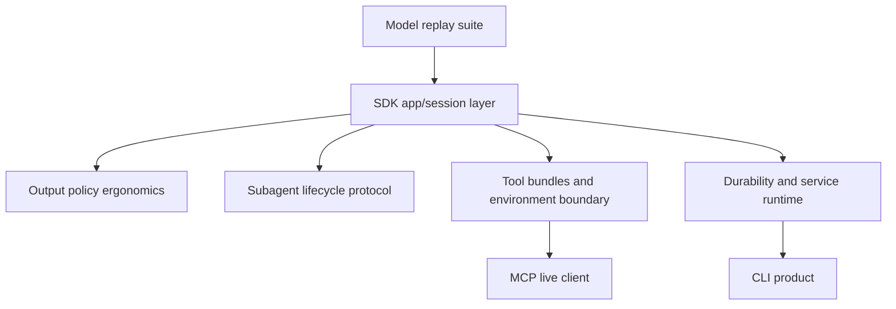

# SDK Implementation Roadmap

This memo tracks the implementation plan for deepening the Starweaver Agent SDK foundation. It is a working plan; stable architecture boundaries remain in `spec/`.

## Implementation Notes

Current migration direction:

- keep replay tests fixture-driven before broad SDK changes
- migrate ya-agent-sdk behavior by copying tests and adapting them to Rust boundaries
- place cross-layer primitives in `starweaver-core` when runtime, SDK, service, and CLI all need them
- keep app composition, ergonomic builders, and application registries in `starweaver-agent`

Landed slices:

- model replay harness and fixtures under `crates/starweaver-model/tests/fixtures/`
- OpenAI Chat text, tool call, and tool return history fixture tests
- OpenAI Responses, Anthropic, Gemini, and Bedrock text/native request fixtures for existing replay coverage
- model request parameter serialization tests covering tools, native tools, output schema, HTTP overrides, extra body, and metadata
- model settings/profile tests covering merge precedence, provider capability contracts, and structured output request mapping for OpenAI Responses and Gemini
- `AgentId` moved to `starweaver-core` and re-exported through `starweaver-context`
- `TaskId` added to `starweaver-core` and used by `SubagentTask`
- `AgentSession` added to `starweaver-agent` with run, stream, context, and export/restore APIs
- `SubagentSpec` added to `starweaver-core` as the serializable config contract
- subagent markdown frontmatter parsing added to `starweaver-agent` with file and directory loaders
- `NoteStore` added to `starweaver-context` with export/restore and note-key context instruction rendering
- `SubagentLifecycleEvent` added to `starweaver-core` and emitted by SDK delegation start, completion, and missing-subagent failure paths

## Current Evidence

Starweaver already has a model replay foundation:

- `crates/starweaver-model/tests/replay.rs`
  - OpenAI Chat request/response replay
  - OpenAI Responses request/tool-call replay
  - OpenAI Responses native tool mapping
  - Anthropic Messages request/response replay
  - Gemini generateContent request/response replay
  - Bedrock Converse request/response replay
  - canonical message serialization round trip
- `crates/starweaver-model/tests/client.rs`
  - injectable HTTP client
  - custom headers
  - extra body fields
  - endpoint override
  - retry policy
  - output schema mapping
  - provider alias registry
- `crates/starweaver-model/tests/request_parameters.rs`
  - `ModelRequestParameters` serialization round trip
  - native tool serialization round trip
  - output schema serialization round trip
  - settings merge precedence
  - provider profile capability contracts
  - structured output request mapping for OpenAI Responses and Gemini
- `crates/starweaver-model/tests/request_guard.rs`
  - production request guard
- `crates/starweaver-model/tests/test_models.rs`
  - deterministic `TestModel`
  - `FunctionModel`
  - tool-call helper
- `crates/starweaver-model/tests/native_mcp.rs`
  - provider-native MCP request mapping

Pydantic AI has a broader provider test pattern that Starweaver should adapt:

- cassette utilities that inspect recorded request/response bodies
- provider-specific suites for OpenAI, OpenAI Responses, Anthropic, Bedrock, and Gemini
- inline snapshot assertions for canonical messages, provider metadata, usage, and streamed events
- request parameter serialization tests
- model settings precedence tests
- profile/schema transformer tests
- streaming chunk and delta tests
- native tool request mapping tests
- provider error and retry tests

## Roadmap Overview



## Phase 1: Model Replay and Provider Correctness

Goal: bring `starweaver-model` closer to a provider-grade compatibility layer.

### 1.1 Fixture Layout

Add a stable fixture structure:

```text
crates/starweaver-model/tests/fixtures/
  openai_chat/
  openai_responses/
  anthropic/
  gemini/
  bedrock/
```

Each fixture should include:

- canonical input history
- model settings
- request parameters
- expected provider request JSON
- provider response JSON
- expected canonical response
- expected usage
- expected provider metadata

### 1.2 Replay Harness

Add a shared replay harness for provider mappers:

- load JSON fixtures
- build provider request
- compare canonicalized JSON
- parse provider response
- compare canonical response summary
- assert usage, finish reason, provider metadata, tool calls, and native tool parts

Suggested module:

```text
crates/starweaver-model/tests/support/replay.rs
```

### 1.3 Provider Coverage

Add fixture-based cases for:

- OpenAI Chat
  - text response
  - tool calls
  - tool returns in history
  - structured output request format
  - provider metadata
  - refusal/content-filter style errors
- OpenAI Responses
  - text response
  - function calls
  - native web search
  - native MCP
  - reasoning/thinking item shape when supported
  - output text deltas in stream fixture
- Anthropic Messages
  - text response
  - tool use
  - tool result in history
  - system prompt mapping
  - stop reason mapping
  - usage mapping
- Gemini generateContent
  - text response
  - function calls
  - tool config mapping
  - safety/finish reason mapping
  - usage metadata mapping
- Bedrock Converse
  - text response
  - tool use
  - tool result
  - system mapping
  - stop reason mapping
  - usage mapping

### 1.4 Request Parameters and Settings

Add tests inspired by Pydantic AI model request/settings suites:

- `ModelRequestParameters` serialization round trip
- native tools serialization round trip
- output schema serialization round trip
- settings merge precedence
- request parameter merge precedence
- profile capability behavior by protocol family

### 1.5 Streaming Fixtures

Add stream event fixture tests for:

- text deltas
- tool-call argument deltas
- tool-call completion
- usage at end of stream
- provider error during stream
- cancellation/close behavior where modeled

### 1.6 Error and Retry Fixtures

Add tests for:

- provider status errors
- malformed response errors
- retryable transport errors
- retry exhaustion
- rate limit status handling
- production request guard interaction with protocol clients

## Phase 2: SDK App and Session Layer

Goal: make `starweaver-agent` the natural application entrypoint.

Deliverables:

- `AgentSession`
- `AgentApp::session()`
- `AgentApp::session_with_context(context)`
- `AgentApp::session_from_state(state)`
- `AgentSession::run(...)`
- `AgentSession::run_stream(...)`
- `AgentSession::context()`
- `AgentSession::context_mut()`
- `AgentSession::export_state()`

Tests:

- session keeps context across runs
- usage accumulates across runs
- state export/restore works through SDK APIs
- typed dependencies are available to tools in session runs
- stream events work through session APIs

Docs:

- update `docs/sdk-app.md`
- update `docs/dependencies.md`
- update `docs/message-history.md`

## Phase 3: Output Policy Ergonomics

Goal: make output configuration feel like a first-class SDK policy.

Deliverables:

- SDK-level `OutputPolicy` builder or equivalent
- text output helper
- JSON schema output helper
- typed output helper
- validator registration helpers
- output function registration helpers
- retry configuration helper

Tests:

- typed structured output through SDK API
- validator retry through SDK API
- output function through SDK API
- docs examples compile

## Phase 4: Subagent Lifecycle Protocol

Goal: evolve `SubagentTask` and `SubagentResult` into a lifecycle-aware protocol.

Deliverables:

- task ID
- optional timeout policy
- optional retry policy
- cancellation signal shape
- lifecycle events
- parent-child event propagation
- parent-child usage propagation
- durable polling extension point

Tests:

- task metadata appears in events
- parent usage accumulates
- lifecycle events are emitted in order
- missing subagent errors are typed
- cancellation/timeout policy behavior after runtime support exists

## Phase 5: Tool Bundles and Environment Boundary

Goal: prepare first-party environment-backed tool bundles.

Deliverables:

- environment trait design in code when call sites stabilize
- filesystem bundle skeleton
- shell bundle skeleton
- approval policy shape
- deterministic test fakes

Tests:

- bundle registration
- approval metadata
- deterministic filesystem fake
- deterministic shell fake

## Phase 6: MCP Live Client

Goal: evolve static MCP foundations into live toolsets.

Deliverables:

- MCP client traits
- protocol message types
- stdio transport
- HTTP transport
- `tools/list`
- `tools/call`
- live `McpToolset` discovery
- resource and prompt APIs

Tests:

- protocol serialization
- local test server
- stdio lifecycle
- HTTP transport with injectable client
- runtime tool call through live MCP toolset

## Phase 7: Durability and Service Runtime

Goal: make checkpoint and context state usable by a durable runtime.

Deliverables:

- session model
- checkpoint persistence contract
- event replay contract
- interruption and resume contract
- storage adapter skeletons
- streaming service contract

Tests:

- checkpoint serialization
- session restore
- interrupted run resume
- event replay
- storage adapter behavior

## Phase 8: CLI Product

Goal: build the local CLI product over stable SDK, environment, and service runtime boundaries.

Deliverables:

- local run command
- model/profile config
- project/global config
- session commands
- approval prompts
- workspace binding
- diagnostics and inspection commands

Tests:

- command tests
- config tests
- deterministic local run tests
- session inspect tests
- approval flow tests

## Immediate Planning Decision

The next implementation batch should start with Phase 1. It hardens the model boundary that every SDK, runtime, MCP, service, and CLI layer depends on.

Concrete next migration slice:

1. Add parent-child context derivation tests for subagent dependencies, notes, usage, and message bus policy.
2. Continue migrating ya-agent-sdk toolset inheritance tests into Rust.
3. Add subagent tool selection policy structs after tests define required and optional inherited tool behavior.
4. Add lifecycle wrappers or trace hooks once wrapper semantics have a Rust-native shape.
5. Continue moving shared IDs, policy envelopes, and serializable contracts into `starweaver-core` when multiple crates consume them.
