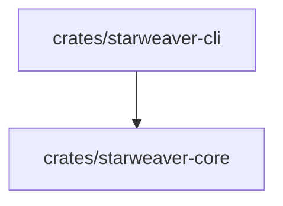

# Repository Scaffold

## Purpose

`starweaver-agent-sdk` is a Rust monorepo for developing Starweaver, an agent SDK inspired by practical lessons from the Python implementation in `ya-mono` and by a closer study of Pydantic AI concepts.

The initial repository focuses on:

- Rust workspace initialization
- CI and local validation commands
- pre-commit integration
- a minimal CLI entry point
- a place for specs before crate boundaries harden

## Current Workspace

Current members:

- `crates/starweaver-core` — shared SDK identity and early core primitives
- `crates/starweaver-cli` — `starweaver` command-line entry point

## Planned Areas

Planned areas describe likely product and architecture directions. They are tracked in specs before dedicated crates are added.

- Core abstractions — agent, model, tool, context, event, state, and runtime interfaces
- CLI — local developer workflows and command entry points
- Claw runtime — service runtime, sessions, workspace execution, storage, and operations
- Agent platform — higher-level orchestration and hosted platform capabilities

## Boundary Rule

Add a workspace crate when a planned area has:

1. a spec with responsibilities and scope
2. one or more concrete call sites or integration paths
3. local validation commands that cover the new boundary
4. README or spec updates explaining how the crate fits the workspace

## Repository Automation

The repository uses:

- `Makefile` for local commands
- `.pre-commit-config.yaml` for formatting and repository hygiene
- `.github/workflows/ci.yml` for GitHub CI
- `rust-toolchain.toml` and `rustfmt.toml` for Rust toolchain consistency
