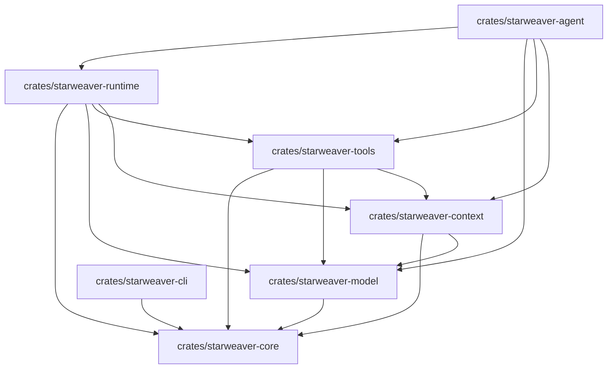

# 00 - Repository

## Motivation

The repository is the shared home for the Starweaver Agent SDK, its runtime kernel, user-facing documentation, design specs, and future product extensions. The layout should keep foundational crates stable while leaving room for service and CLI products to grow as SDK consumers.

## Workspace Shape

## Repository Areas

| Area       | Role                                                                                |
| ---------- | ----------------------------------------------------------------------------------- |
| `crates/`  | Rust workspace crates and crate-local tests                                         |
| `docs/`    | user-facing guides with compiled Rust examples                                      |
| `spec/`    | architecture baseline and crate boundary decisions                                  |
| `memos/`   | working notes, comparisons, implementation snapshots, and release-preparation notes |
| `scripts/` | repository automation and validation helpers                                        |
| `.github/` | CI workflows                                                                        |

## Governance

Repository changes should preserve three sources of truth:

1. `spec/` defines stable architecture and crate ownership.
2. `docs/` explains user-facing behavior with runnable examples.
3. local and CI commands validate code, tests, and docs examples.

## Crate Graduation Rule

A planned area can become a crate when it has:

- a spec section with ownership and dependency direction
- concrete call sites or integration paths
- a public module skeleton
- tests covering the first stable boundary
- workspace validation through existing commands
- documentation or spec updates explaining its role

## Automation

The repository uses:

- `Makefile` for local commands
- `.pre-commit-config.yaml` for formatting and repository hygiene
- `.github/workflows/ci.yml` for GitHub CI
- `rust-toolchain.toml` and `rustfmt.toml` for Rust toolchain consistency
