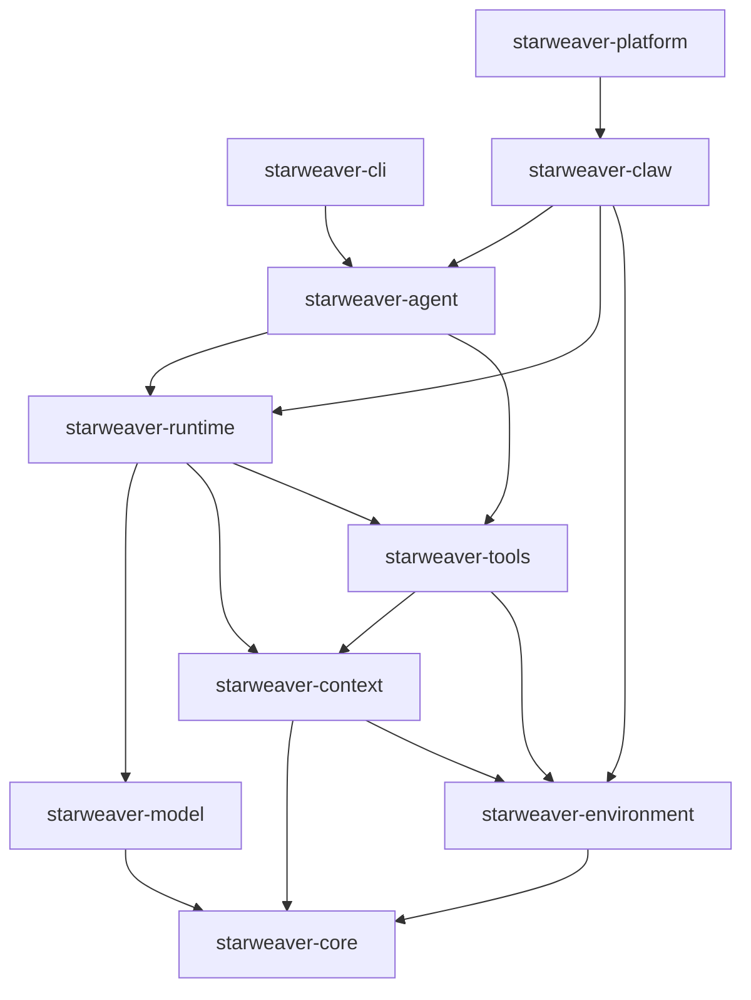
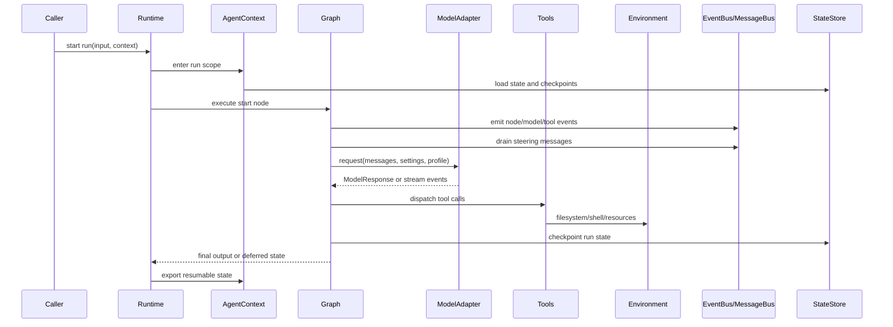

# 01 - Runtime Architecture

## Goal

Starweaver starts from the runtime layer: model-agnostic message history, provider adapters, a graph-based agent loop, built-in custom events, a steering message bus, lifecycle-wide `AgentContext`, resumable `StateStore`, and an `Environment` that maps filesystem and shell access into safe runtime capabilities.

The architecture combines three references:

- Pydantic AI's `ModelMessage`, `ModelSettings`, `ModelProfile`, model adapter, and graph-loop design.
- Pydantic AI PR 5578's enqueue flow for injecting messages into an active run.
- `ya-mono`'s built-in `AgentContext`, sideband event stream, message bus, state export, and environment abstractions.

## Design Principles

- Message history is a provider-neutral protocol boundary.
- Model adapters translate Starweaver messages and request parameters into provider wire formats.
- Runtime state is explicit, inspectable, checkpointable, and resumable.
- Custom events and steering messages are built into the loop from the first runtime design.
- Filesystem and shell access flow through `Environment`, with policy and sandbox boundaries as runtime concepts.
- Crates graduate from specs when they have stable responsibilities, call sites, and validation paths.

## Planned Crate Map



## Crate Responsibilities

| Crate                    | Responsibility                                                                                                                        | Graduation trigger                                |
| ------------------------ | ------------------------------------------------------------------------------------------------------------------------------------- | ------------------------------------------------- |
| `starweaver-core`        | IDs, errors, timestamps, usage types, serialization helpers, result aliases                                                           | Needed by two or more runtime crates              |
| `starweaver-model`       | `ModelMessage`, `ModelRequest`, `ModelResponse`, content parts, stream events, `ModelSettings`, `ModelProfile`, `ModelAdapter` traits | First provider adapter or test model lands        |
| `starweaver-context`     | `AgentContext`, `StateStore`, lifecycle metadata, buses, usage ledger, state export/import                                            | Runtime loop needs context across nodes and tools |
| `starweaver-environment` | Filesystem, shell, process, resource registry, sandbox and virtual path interfaces                                                    | Tools need filesystem/shell capabilities          |
| `starweaver-tools`       | Tool definitions, schemas, dispatch, validation, approval, toolsets                                                                   | First built-in toolset lands                      |
| `starweaver-runtime`     | Agent graph, executor abstraction, node lifecycle, event bus, message bus drain, checkpoints                                          | First `AgentRun` loop lands                       |
| `starweaver-agent`       | High-level builder, presets, runtime assembly, default capabilities                                                                   | Public SDK entrypoint lands                       |
| `starweaver-cli`         | Developer CLI and local runtime entrypoints                                                                                           | Existing minimal CLI evolves                      |
| `starweaver-claw`        | Service runtime, sessions, storage, workspace execution, streaming APIs                                                               | Durable service design lands                      |
| `starweaver-platform`    | Hosted platform APIs and orchestration                                                                                                | Platform service design lands                     |

## Runtime Layers

```mermaid
flowchart LR
    input[Run input]
    ctx[AgentContext]
    graph[Agent graph]
    adapter[ModelAdapter]
    provider[Model provider]
    tools[Tools]
    env[Environment]
    events[EventBus]
    messages[MessageBus]
    store[StateStore]

    input --> ctx
    ctx --> graph
    graph --> adapter
    adapter --> provider
    graph --> tools
    tools --> env
    graph --> events
    graph --> messages
    ctx --> store
    ctx --> events
    ctx --> messages
    ctx --> env
```

## Runtime Flow



## Reference Evidence

| Reference                                          | Observed idea                                                                                                                      | Starweaver decision                                                                       |
| -------------------------------------------------- | ---------------------------------------------------------------------------------------------------------------------------------- | ----------------------------------------------------------------------------------------- |
| Pydantic AI `messages.py`                          | `ModelRequest` and `ModelResponse` form a serializable history with parts, usage, provider metadata, run IDs, and conversation IDs | Keep message history as a first-class neutral protocol                                    |
| Pydantic AI `settings.py` and `profiles/*`         | Settings are per-request knobs; profiles describe model/provider capabilities and format quirks                                    | Split runtime options into `ModelSettings` and capability facts into `ModelProfile`       |
| Pydantic AI `_agent_graph.py` and `pydantic_graph` | Agent execution benefits from typed graph nodes, state, deps, and persistence                                                      | Use graph semantics for the loop and add a native executor boundary                       |
| Pydantic AI PR 5578                                | Enqueued messages steer active runs and are drained between graph nodes                                                            | Model this as `MessageBus` plus runtime drain policies                                    |
| `ya-mono` `AgentContext`                           | Context carries runtime identity, environment, sideband streams, usage, message bus, notes, tasks, and resumable state             | Make `AgentContext` a built-in dependency for tools, hooks, model adapters, and executors |
| `ya-mono` environment                              | Environment owns filesystem, shell, resources, and lifecycle                                                                       | Make `Environment` required for filesystem and shell mapping                              |

## Implementation Sequence

1. Specify runtime and message types in docs.
2. Add crate manifests with placeholder modules after the specs settle.
3. Implement `starweaver-model` with test adapter and serde round trips.
4. Implement `starweaver-context` with in-memory `StateStore`, `EventBus`, and `MessageBus`.
5. Implement `starweaver-environment` with local filesystem and shell backends.
6. Implement `starweaver-runtime` with graph executor and model/tool loop.
