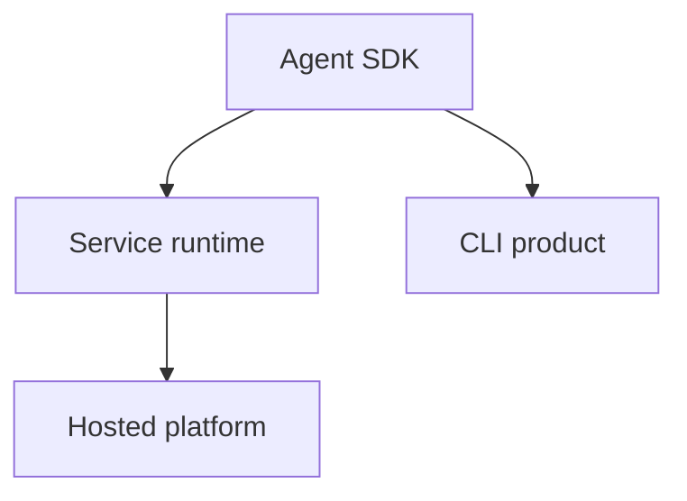
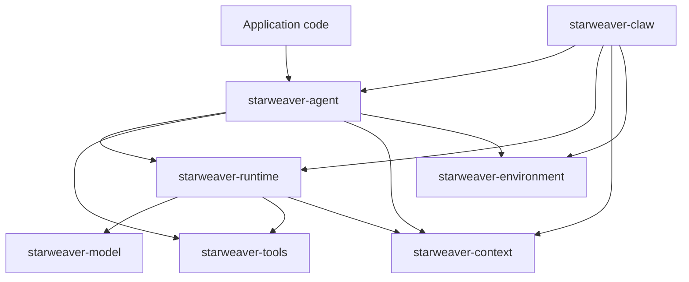
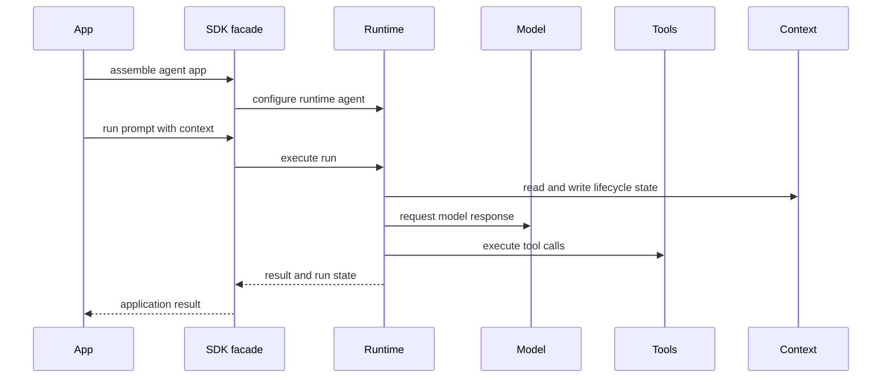

# 01 - SDK Vision and Boundaries

## Motivation

Starweaver is an agent SDK for reliable, composable, and inspectable agent applications. The SDK should give application developers a clear public surface while keeping model protocol, runtime execution, tool contracts, context state, and durability boundaries independently testable.

## Product Layers

| Layer           | Purpose                                                                                 |
| --------------- | --------------------------------------------------------------------------------------- |
| Agent SDK       | build, test, compose, and run agents in Rust applications                               |
| Service runtime | persist sessions, resume execution, stream events, and bind workspaces                  |
| CLI product     | provide local agent runs, configuration, session operations, approvals, and diagnostics |
| Hosted platform | orchestrate service runtime capabilities across users and projects                      |

## Ownership Boundary

## Layer Responsibilities

| Crate                    | Responsibility                                                                                   |
| ------------------------ | ------------------------------------------------------------------------------------------------ |
| `starweaver-core`        | shared IDs, metadata, usage primitives, and envelopes                                            |
| `starweaver-model`       | provider-neutral messages, model settings, profiles, adapters, transports, and test models       |
| `starweaver-tools`       | tool definitions, toolsets, execution primitives, metadata, and MCP foundations                  |
| `starweaver-context`     | lifecycle context, dependencies, state, events, messages, and usage                              |
| `starweaver-runtime`     | deterministic run loop, model/tool/output transitions, retries, limits, streams, and checkpoints |
| `starweaver-agent`       | public SDK facade, builders, app protocols, subagents, presets, and tool bundle assembly         |
| `starweaver-environment` | filesystem, shell, resources, sandbox abstractions, and policy-backed environment backends       |
| `starweaver-claw`        | sessions, persistence, interruption, resume, event replay, SSE, and AGUI adapters                |
| `starweaver-cli`         | local CLI product over SDK and service runtime contracts                                         |

## Design Principles

- Public APIs prefer typed builders, traits, and explicit async boundaries.
- Provider behavior is isolated behind model adapters and profiles.
- Runtime state is inspectable, testable, streamable, and checkpointable.
- Tool definitions are separated from environment-backed execution policy.
- Context separates serializable state from process-local dependencies.
- SDK applications compose models, tools, output policy, context, capabilities, and subagents through one coherent surface.
- Service runtimes persist and resume stable runtime evidence.

## SDK Contract

## Stable Decisions

- `starweaver-agent` is the public SDK entrypoint.
- `starweaver-runtime` stays focused on deterministic loop mechanics.
- Tool bundles and environment-backed integrations live above the runtime kernel.
- Subagents are an SDK application protocol.
- Durable service behavior builds on checkpoint and context boundaries.
- CLI product work follows SDK app/session maturity, environment policy, and service runtime boundaries.
