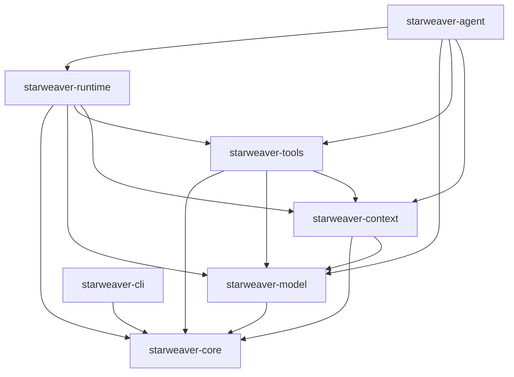
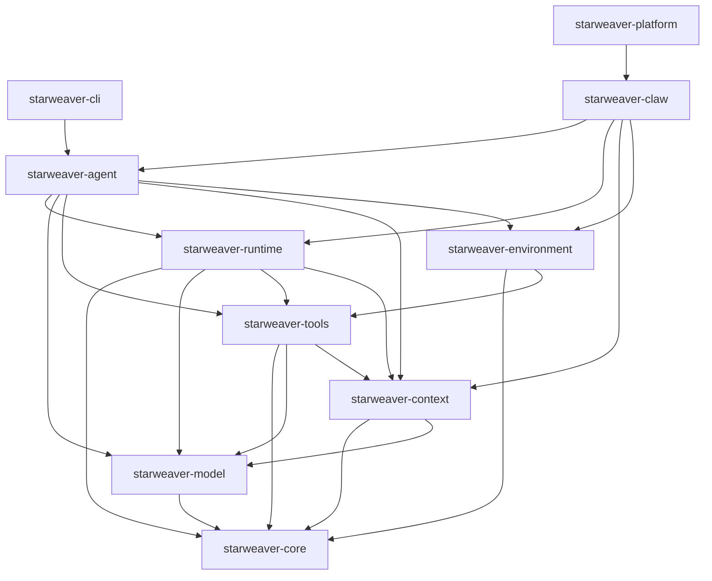
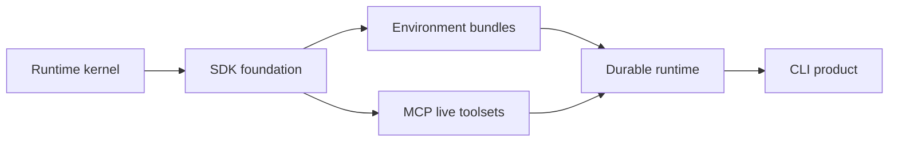

# 02 - Crate Map

## Motivation

The crate map keeps the workspace understandable as the SDK grows. Each crate should have a clear responsibility, a clear dependency direction, and a clear graduation path from architecture to public API.

## Current Workspace

## Target Workspace

## Crate Roles

| Crate                    | Role                                                                       |
| ------------------------ | -------------------------------------------------------------------------- |
| `starweaver-core`        | foundational shared types                                                  |
| `starweaver-model`       | model protocol, provider adapters, transport, profiles, and test models    |
| `starweaver-context`     | lifecycle context, dependencies, state, events, messages, and usage        |
| `starweaver-tools`       | tool schema, toolsets, execution primitives, metadata, and MCP foundations |
| `starweaver-runtime`     | deterministic agent loop, retries, streams, limits, and checkpoints        |
| `starweaver-agent`       | public SDK facade, app wrapper, subagents, presets, and bundles            |
| `starweaver-environment` | filesystem, shell, resources, sandbox, and policy abstractions             |
| `starweaver-cli`         | local CLI product over SDK and service runtime contracts                   |
| `starweaver-claw`        | durable service runtime                                                    |
| `starweaver-platform`    | hosted orchestration                                                       |

## Dependency Rules

- Foundational crates depend inward toward `starweaver-core`.
- Runtime depends on model, tools, and context.
- SDK depends on runtime and foundational crates.
- Product crates depend on SDK and service boundaries.
- Environment-backed tool implementations are assembled through SDK layers.

## Feature Groups

| Feature      | Crates                                | Purpose                            |
| ------------ | ------------------------------------- | ---------------------------------- |
| `serde`      | all core crates                       | serialization                      |
| `test-utils` | model, context, tools, runtime, agent | deterministic tests and fixtures   |
| `stream`     | model, runtime, agent, claw           | model/runtime/app streaming        |
| `local-env`  | environment, agent, cli               | local filesystem and shell bundles |
| `sandbox`    | environment, claw                     | workspace isolation                |
| `sqlite`     | context, claw                         | local durable state                |
| `postgres`   | context, claw                         | service durable state              |
| `mcp`        | tools, agent                          | MCP toolsets and live clients      |

## Milestones

1. Runtime kernel: model protocol, agent loop, tools, output, context, usage, and checkpoints.
2. SDK foundation: public builder, app wrapper, output policy, subagents, and bundle boundaries.
3. Environment bundles: filesystem, shell, resources, policy, and approval-aware tools.
4. MCP live toolsets: discovery, calls, transports, resources, prompts, and protocol errors.
5. Durable runtime: sessions, persistence, interruption, resume, event replay, and streaming.
6. CLI product: local runs, configuration, sessions, approvals, diagnostics, and workspace workflows built over stable SDK and service contracts.

## Graduation Criteria

A new crate can enter the workspace when it has:

- documented ownership and dependency direction
- concrete call sites or integration paths
- public module skeleton with docs
- tests for the first stable boundary
- workspace validation through Makefile and CI commands
