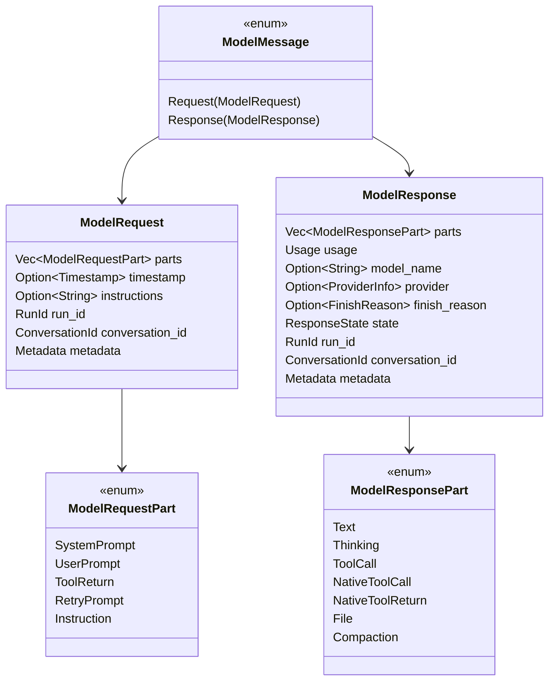
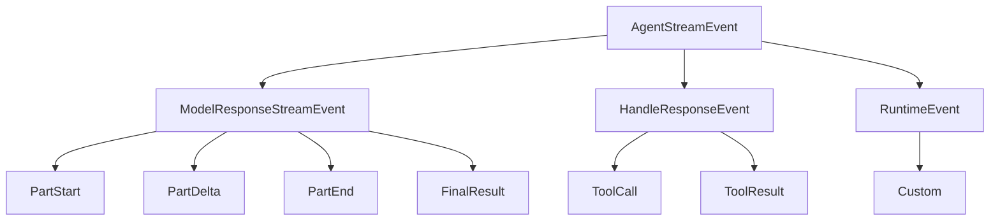

# 02 - Model Layer

## Goal

The model layer provides the stable middle layer between message history and provider-specific APIs.

It owns:

- provider-neutral message history
- request and response parts
- streaming response events
- model settings for generation controls
- model profiles for provider/model capabilities
- adapter traits for request, stream, token counting, and compaction

## Message History

Starweaver's message history should mirror the useful shape of Pydantic AI's `ModelMessage` while staying idiomatic to Rust.



## Request Parts

| Part               | Purpose                                                                |
| ------------------ | ---------------------------------------------------------------------- |
| `SystemPromptPart` | Developer/system instructions with optional dynamic reference metadata |
| `UserPromptPart`   | Text or multimodal user content                                        |
| `ToolReturnPart`   | Result from a tool call                                                |
| `RetryPromptPart`  | Validation or retry feedback sent back to the model                    |
| `InstructionPart`  | Structured instruction fragments for caching and policy placement      |

## Response Parts

| Part                   | Purpose                                                         |
| ---------------------- | --------------------------------------------------------------- |
| `TextPart`             | Natural-language model output                                   |
| `ThinkingPart`         | Reasoning/thinking content with provider signature metadata     |
| `ToolCallPart`         | Function tool call with ID and arguments                        |
| `NativeToolCallPart`   | Provider-native tool invocation                                 |
| `NativeToolReturnPart` | Provider-native tool result carried in response stream/history  |
| `FilePart`             | Binary media returned by model                                  |
| `CompactionPart`       | Provider or runtime compaction summary to round-trip in history |

## Stream Events

Pydantic AI separates model response stream events from response-handling events. Starweaver should keep that split and add custom runtime events in `starweaver-runtime`.



Model-layer events:

- `PartStartEvent`
- `PartDeltaEvent`
- `PartEndEvent`
- `FinalResultEvent`

Response-handling events:

- `ToolCallEvent`
- `ToolResultEvent`
- `OutputToolCallEvent`
- `OutputToolResultEvent`

Runtime-layer events appear in `spec/03-agent-runtime.md`.

## ModelSettings

`ModelSettings` is the per-request generation configuration. It is serializable, mergeable, and provider-neutral.

Recommended initial fields:

| Field                 | Meaning                                           |
| --------------------- | ------------------------------------------------- |
| `max_tokens`          | Maximum generated tokens                          |
| `temperature`         | Sampling temperature                              |
| `top_p`               | Nucleus sampling                                  |
| `top_k`               | Top-k sampling                                    |
| `timeout`             | Request timeout                                   |
| `parallel_tool_calls` | Allow multiple tool calls per response            |
| `tool_choice`         | Tool availability or forcing policy               |
| `seed`                | Best-effort deterministic seed                    |
| `stop_sequences`      | Provider-neutral stop strings                     |
| `presence_penalty`    | Presence penalty where supported                  |
| `frequency_penalty`   | Frequency penalty where supported                 |
| `thinking`            | Unified reasoning/thinking level                  |
| `service_tier`        | Unified latency/cost tier                         |
| `provider_options`    | Typed escape hatch for provider-specific settings |

Merge order:

1. model default settings
2. agent default settings
3. runtime/capability step settings
4. run-call settings
5. tool or node-local overrides

Later layers override earlier layers field by field.

## ModelProfile

`ModelProfile` is capability metadata and request-shaping policy for a model or model family.

Recommended initial fields:

| Field                                | Meaning                                        |
| ------------------------------------ | ---------------------------------------------- |
| `supports_tools`                     | Function/tool calling support                  |
| `supports_json_schema_output`        | Native schema-constrained output support       |
| `supports_json_object_output`        | JSON object mode support                       |
| `supports_image_output`              | Image generation/return support                |
| `supports_inline_system_prompts`     | System prompt placement flexibility            |
| `supports_thinking`                  | Configurable thinking support                  |
| `thinking_always_enabled`            | Reasoning cannot be disabled                   |
| `thinking_tags`                      | Text tags for local thinking extraction        |
| `ignore_streamed_leading_whitespace` | Streaming cleanup rule                         |
| `supported_native_tools`             | Native tool types accepted by provider/model   |
| `default_structured_output_mode`     | Tool/native/prompted structured-output default |
| `json_schema_transformer`            | Schema compatibility transformer               |
| `message_normalization`              | Provider-specific history normalization policy |

`ModelProfile` describes behavior. `ModelSettings` requests behavior.

## ModelAdapter Trait

```rust
#[async_trait]
pub trait ModelAdapter: Send + Sync {
    fn model_name(&self) -> &str;
    fn provider_name(&self) -> Option<&str>;
    fn profile(&self) -> &ModelProfile;
    fn default_settings(&self) -> Option<&ModelSettings>;

    async fn request(
        &self,
        messages: Vec<ModelMessage>,
        settings: Option<ModelSettings>,
        params: ModelRequestParameters,
        context: ModelRequestContext,
    ) -> Result<ModelResponse, ModelError>;

    async fn request_stream(
        &self,
        messages: Vec<ModelMessage>,
        settings: Option<ModelSettings>,
        params: ModelRequestParameters,
        context: ModelRequestContext,
    ) -> Result<BoxStream<'static, Result<ModelResponseStreamEvent, ModelError>>, ModelError>;

    async fn count_tokens(
        &self,
        messages: &[ModelMessage],
        settings: Option<&ModelSettings>,
        params: &ModelRequestParameters,
    ) -> Result<Usage, ModelError>;

    async fn compact_messages(
        &self,
        request: ModelRequestContext,
        instructions: Option<String>,
    ) -> Result<ModelResponse, ModelError>;
}
```

## Adapter Pipeline

```mermaid
flowchart LR
    history[ModelMessage history]
    normalize[prepare_messages]
    settings[merge ModelSettings]
    profile[apply ModelProfile]
    params[prepare request parameters]
    wire[provider wire request]
    response[ModelResponse]

    history --> normalize
    normalize --> settings
    settings --> profile
    profile --> params
    params --> wire
    wire --> response
```



Adapter responsibilities:

- normalize message history for the active profile
- merge settings consistently
- apply structured-output and tool-mode defaults
- transform schemas where provider requires it
- map provider request/response formats
- preserve provider metadata for round trips
- emit model stream events in canonical form

## Test Adapter

The first implementation should be a deterministic `TestModelAdapter`.

It should support:

- fixed text responses
- scripted tool calls
- scripted streaming deltas
- usage accounting
- message capture for assertions
- profile overrides for capability tests

The test adapter is the validation anchor before external providers land.
