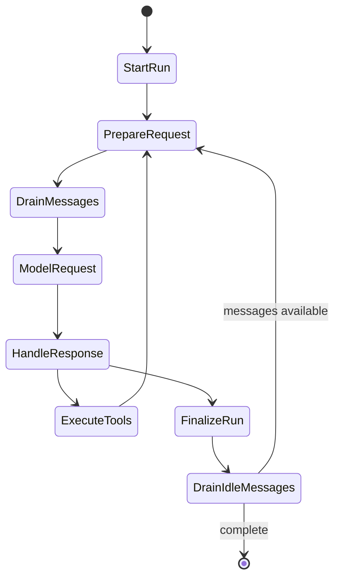
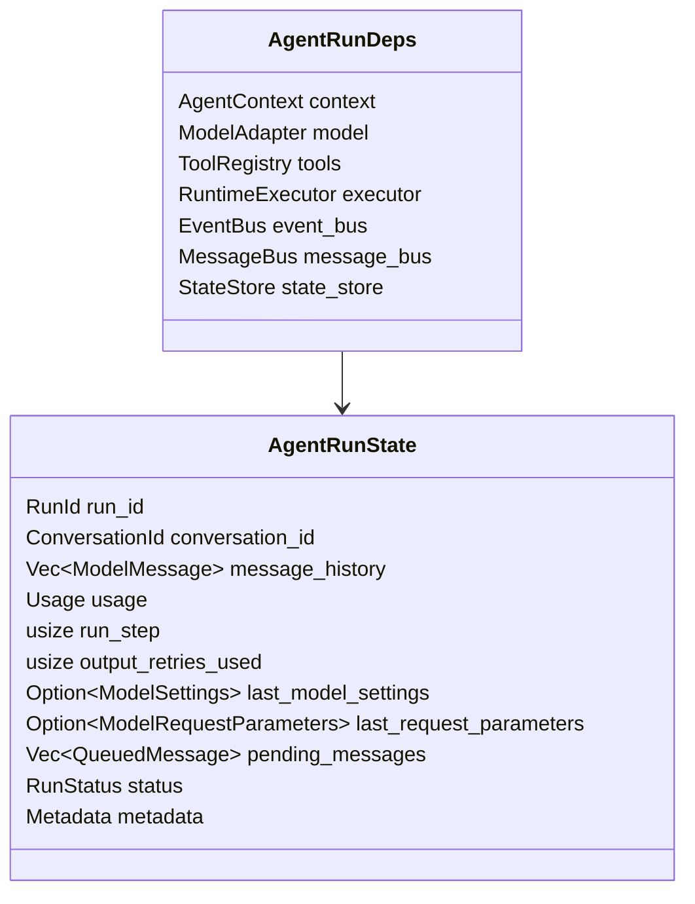
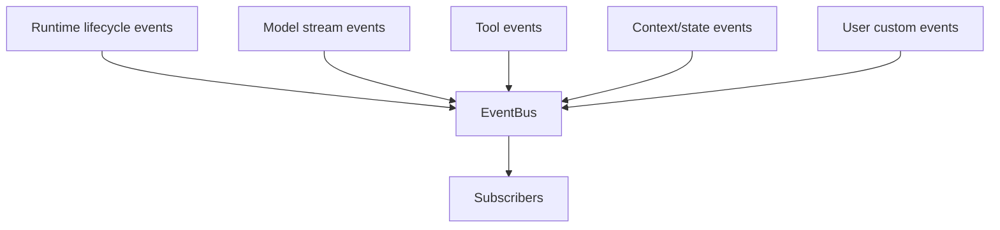
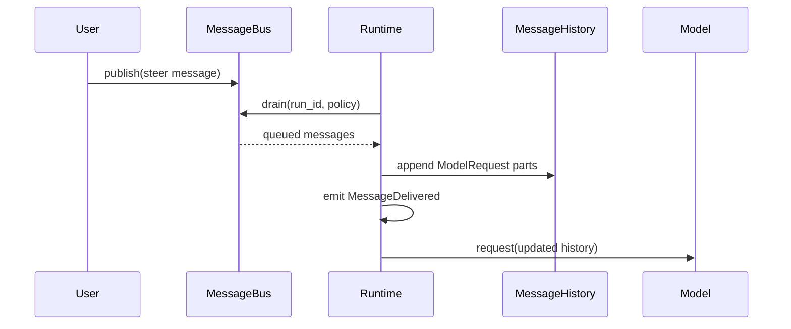
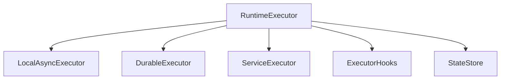
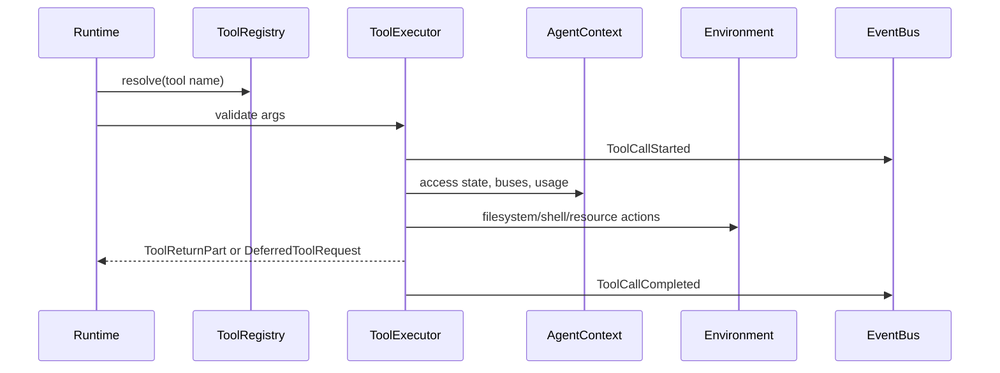

# 03 - Agent Runtime

## Goal

The agent runtime executes an agent loop as a graph with native support for:

- custom events through `EventBus`
- steering and cross-agent communication through `MessageBus`
- executor backends as a first-class abstraction
- checkpointing and recovery through `StateStore`
- lifecycle-wide access to `AgentContext`
- filesystem and shell access through `Environment`

Pydantic AI's graph structure is a strong base. Starweaver adds runtime-native buses and executor assumptions from the beginning.

## Graph Shape



Initial node set:

| Node                 | Responsibility                                                            |
| -------------------- | ------------------------------------------------------------------------- |
| `StartRunNode`       | Enter context, load state, resolve input and model settings               |
| `PrepareRequestNode` | Build next `ModelRequest`, apply instructions and history processors      |
| `DrainMessagesNode`  | Drain `MessageBus` items into history based on policy                     |
| `ModelRequestNode`   | Call `ModelAdapter` and stream canonical model events                     |
| `HandleResponseNode` | Detect final output, tool calls, retries, deferred work                   |
| `ExecuteToolsNode`   | Validate and execute tool calls through `ToolExecutor`                    |
| `FinalizeRunNode`    | Produce output, export state, emit completion events                      |
| `CheckpointNode`     | Persist graph, context, message, and usage state at configured boundaries |

## Runtime State



`AgentRunState` is the checkpointable state owned by the loop. `AgentContext` is the lifecycle object shared across runtime, tools, adapters, and application code.

## EventBus

`EventBus` is the sideband stream for typed runtime events. It carries framework events and user-defined events.



Recommended initial event groups:

| Group          | Events                                                                            |
| -------------- | --------------------------------------------------------------------------------- |
| Run lifecycle  | `RunStarted`, `RunCompleted`, `RunFailed`, `RunCancelled`                         |
| Node lifecycle | `NodeStarted`, `NodeCompleted`, `NodeFailed`                                      |
| Model stream   | `PartStart`, `PartDelta`, `PartEnd`, `FinalResult`                                |
| Tool lifecycle | `ToolCallStarted`, `ToolCallCompleted`, `ToolCallFailed`, `ToolApprovalRequested` |
| Context        | `ContextUpdated`, `UsageUpdated`, `StateCheckpointed`, `StateRestored`            |
| Message bus    | `MessageQueued`, `MessageDelivered`, `MessageConsumed`                            |
| Environment    | `ShellStarted`, `ShellOutput`, `ShellCompleted`, `FileChanged`                    |
| Custom         | application-defined payloads with stable type IDs                                 |

`EventBus` contract:

- events have `event_id`, `run_id`, `conversation_id`, `timestamp`, `kind`, and `payload`
- subscribers can filter by run, kind, source, and cursor
- runtime emits events before and after important state transitions
- custom events never mutate message history by themselves
- event serialization is versioned

## MessageBus

`MessageBus` is the control and steering channel. It injects content into future model turns.

It combines `ya-mono`'s Redis Streams-style subscriber cursor model with PR 5578's enqueue/drain semantics.



Message fields:

| Field        | Meaning                                                       |
| ------------ | ------------------------------------------------------------- |
| `id`         | idempotency key                                               |
| `source`     | user, agent, tool, scheduler, bridge, system                  |
| `target`     | agent ID or broadcast                                         |
| `content`    | text, multimodal content, request part, or full model message |
| `priority`   | `asap`, `when_idle`, `deferred`                               |
| `template`   | optional render policy for text content                       |
| `created_at` | creation timestamp                                            |
| `metadata`   | application-defined metadata                                  |

Drain policies:

| Policy      | Behavior                                                                                      |
| ----------- | --------------------------------------------------------------------------------------------- |
| `asap`      | inject before the next model request; redirect finalization into one more request when needed |
| `when_idle` | inject when the agent would otherwise finish                                                  |
| `deferred`  | wait for explicit runtime instruction or external acknowledgement                             |

Message delivery invariants:

- idempotent publish by message ID
- idempotent consume per subscriber/run
- delivered messages are persisted in history or checkpoint state
- `MessageDelivered` event includes final history indices
- message injection is serialized between graph nodes
- external threads or processes publish through executor-safe handles

## Executor Abstraction

The executor is a runtime-native boundary from the first design pass.



`RuntimeExecutor` responsibilities:

- drive graph nodes
- schedule tool calls and background jobs
- enforce cancellation and deadlines
- coordinate checkpoints
- expose safe handles for event and message publication
- map runtime tasks onto local async tasks, durable workflows, or service workers

Executor trait sketch:

```rust
#[async_trait]
pub trait RuntimeExecutor: Send + Sync {
    async fn run_node(&self, node: RuntimeNode, ctx: AgentContextHandle) -> Result<NodeOutcome, RuntimeError>;
    async fn spawn_task(&self, task: RuntimeTask) -> Result<TaskHandle, RuntimeError>;
    async fn checkpoint(&self, checkpoint: RuntimeCheckpoint) -> Result<(), RuntimeError>;
    async fn cancel(&self, run_id: RunId, reason: CancellationReason) -> Result<(), RuntimeError>;
}
```

Initial executors:

| Executor             | Use case                                                        |
| -------------------- | --------------------------------------------------------------- |
| `LocalAsyncExecutor` | CLI, tests, local tools                                         |
| `DurableExecutor`    | workflow engines such as DBOS/Temporal/Prefect through adapters |
| `ServiceExecutor`    | Claw service runtime with queued runs, supervisors, and workers |

## Tool Execution

Tool execution belongs in `starweaver-tools`, driven by `starweaver-runtime`.

Flow:



Tool execution invariants:

- tool calls receive `AgentContext`
- filesystem and shell tools use `Environment`
- tool results become `ModelRequestPart`s
- tool failures can become retry prompts or terminal errors by policy
- human approval and deferred tools are first-class tool outcomes
- tool events are emitted for UI and service streaming

## Checkpoints

Checkpoint boundaries:

- run start
- before model request
- after model response
- after tool execution batch
- after message bus delivery
- run finalization
- cancellation/error boundary

Checkpoint content:

- `AgentRunState`
- `AgentContext` export
- `StateStore` snapshots or references
- resource state from `Environment`
- event cursor and message bus cursor metadata

## Runtime Policies

Initial policy dimensions:

| Policy               | Meaning                                            |
| -------------------- | -------------------------------------------------- |
| `max_steps`          | run-step limit                                     |
| `max_output_retries` | output validation retry limit                      |
| `usage_limits`       | token/request/cost budget                          |
| `tool_approval`      | human approval policy                              |
| `shell_policy`       | command review and allowed execution modes         |
| `checkpoint_policy`  | checkpoint frequency and durability                |
| `message_policy`     | bus drain priority and finalization redirect rules |
| `event_policy`       | buffering, backpressure, and subscriber behavior   |

## Open Design Questions

- Exact graph representation: typed enum nodes, trait objects, or generated graph builder.
- Stream event storage format for durable replay.
- Provider-native compaction and local compaction coordination.
- Cross-process `MessageBus` implementation for service mode.
- Tool execution concurrency defaults.
