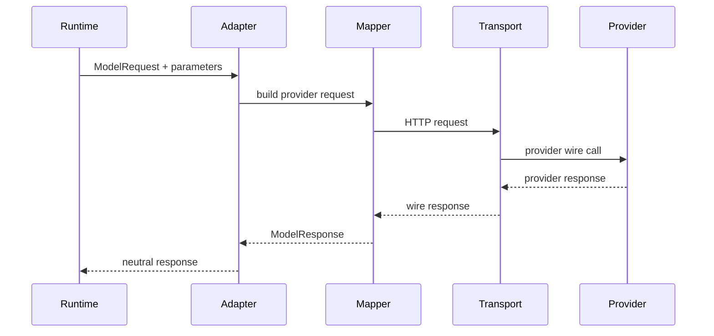
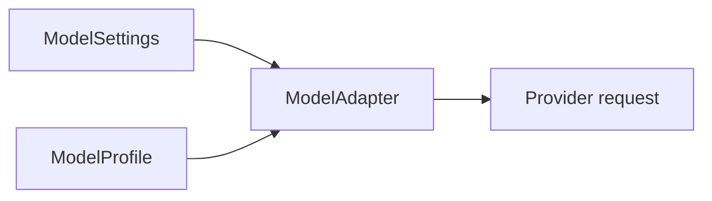

# 03 - Model and Transport

## Motivation

The model layer is the provider boundary of the SDK. It should let the runtime speak one protocol while adapters handle provider-specific request shapes, response parsing, capabilities, and transport behavior.

A clean model layer makes agent runs testable, replayable, and portable across providers.

## Ownership

`starweaver-model` owns:

- provider-neutral messages and content parts
- model request and response envelopes
- stream event shapes
- request settings and merge behavior
- model profiles and capability facts
- adapter traits and request context
- provider protocol clients and mappers
- injectable transport
- deterministic test models

## Protocol Flow

## Message History

Model history is a neutral record of the conversation. It should preserve:

- message role and ordering
- text and structured content parts
- tool-call boundaries
- provider metadata needed for replay
- usage records
- run and conversation identifiers

## Settings and Profiles

`ModelSettings` carries per-request choices such as temperature, token budget, timeout, seed, headers, and provider-specific extras.

`ModelProfile` carries capability facts such as streaming support, tool-call support, structured output behavior, native tool support, and provider quirks.

## Transport Boundary

Transport should be injectable and observable. The model layer should support:

- endpoint overrides
- custom headers
- extra body fields
- timeout overrides
- gateway routing
- audit metadata
- deterministic transport tests

Runtime and SDK code should treat transport as a model-layer concern.

## Testing Boundary

Test models are part of the model layer. They should support deterministic text, structured output, tool calls, and usage fixtures.

Production request guards should make application tests explicit about network access.

## Acceptance Gates

- neutral message serialization round-trips
- provider mapper fixtures cover request and response shapes
- transport injection is covered by tests
- test adapters cover deterministic text, structure, and tool calls
- production request guard is covered by tests
