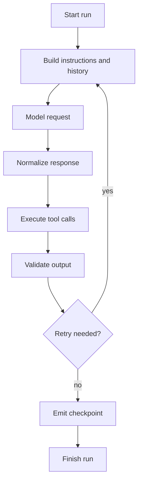
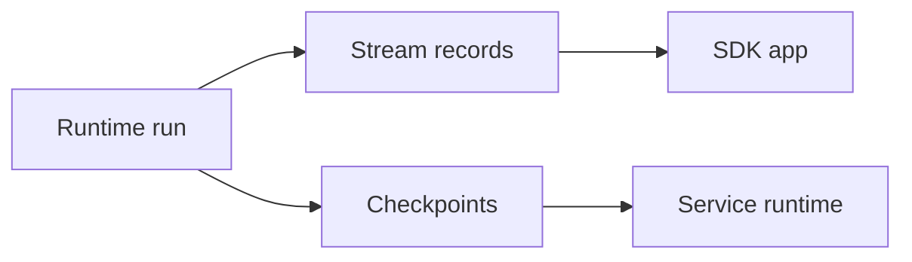

# 04 - Agent Runtime Loop

## Motivation

The runtime is the deterministic kernel of the SDK. It should execute agent runs through explicit transitions, record stable boundaries, and expose enough state for testing, streaming, and future durability.

The runtime should stay focused on execution semantics. Public assembly, application policies, tool bundles, sessions, and CLI behavior live above it.

## Ownership

`starweaver-runtime` owns:

- agent run state and result types
- graph transition semantics
- instruction assembly
- model request boundaries
- tool execution boundaries
- output parsing, validation, and retry
- message history continuation
- history processors
- usage limits
- stream records
- capability hooks
- executor checkpoints
- scoped test overrides

## Loop Shape

## Runtime Transitions

| Transition | Responsibility                                                    |
| ---------- | ----------------------------------------------------------------- |
| start      | create run scope and initial state                                |
| prepare    | assemble instructions, settings, history, tools, and capabilities |
| model      | call the model adapter through neutral protocol                   |
| tool       | execute provider-neutral tool calls                               |
| output     | parse and validate final output                                   |
| retry      | convert validation/tool feedback into the next model turn         |
| checkpoint | emit stable execution evidence                                    |
| finish     | return accepted output and final state                            |

## Tool Boundary

The runtime executes provider-neutral tool calls. It should record tool-call boundaries and retry decisions while leaving environment-backed implementation policy to SDK layers.

## Output Boundary

The runtime handles text output, structured output, validators, output functions, and semantic retry. SDK builders can provide ergonomic wrappers over these primitives.

## Stream and Checkpoint Boundary

Runtime stream records describe visible execution progress. Checkpoints describe durable execution evidence.

## Invariants

- Provider wire formats stay in `starweaver-model`.
- Tool schema and tool results stay in `starweaver-tools`.
- Environment policy stays above runtime.
- Runtime transitions are deterministic under deterministic models and tools.
- Checkpoints are emitted at semantic boundaries.

## Acceptance Gates

- deterministic run-loop tests
- tool loop tests
- output retry tests
- usage limit tests
- stream record tests
- checkpoint tests
- scoped override tests
