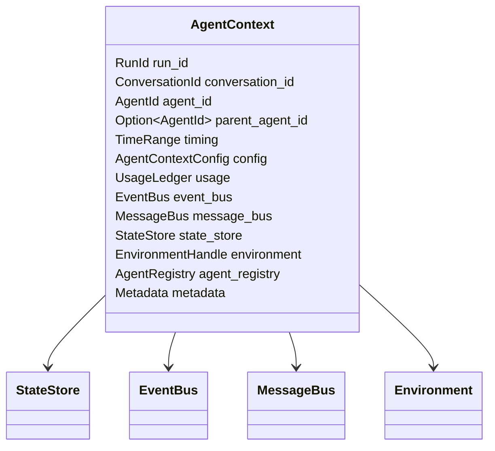
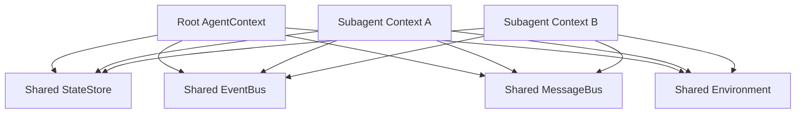
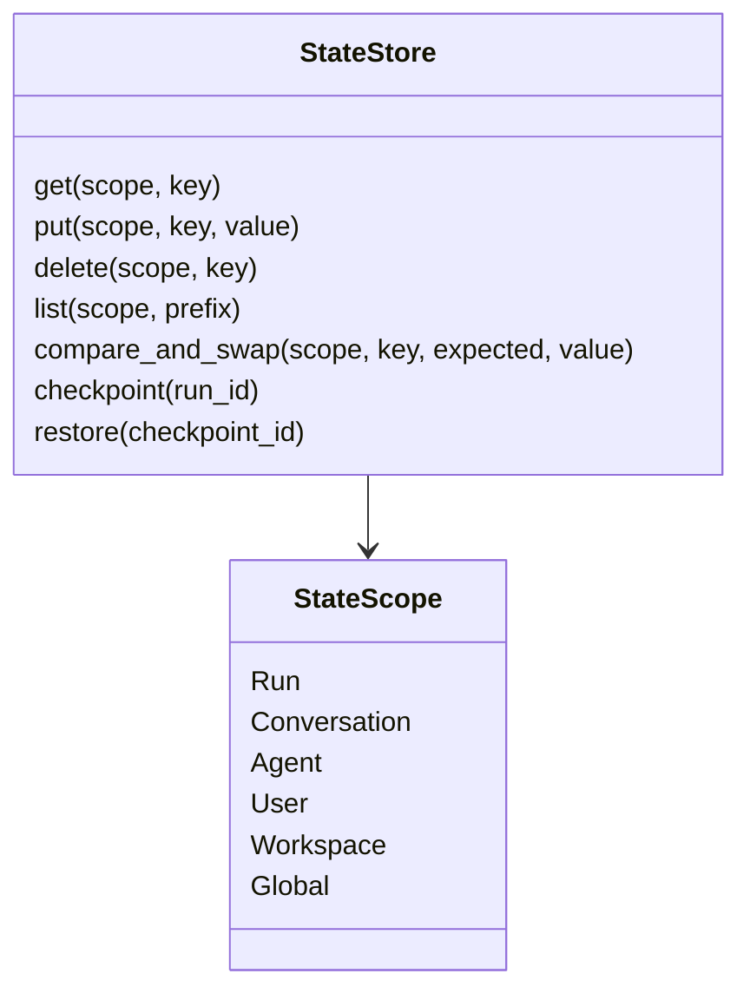
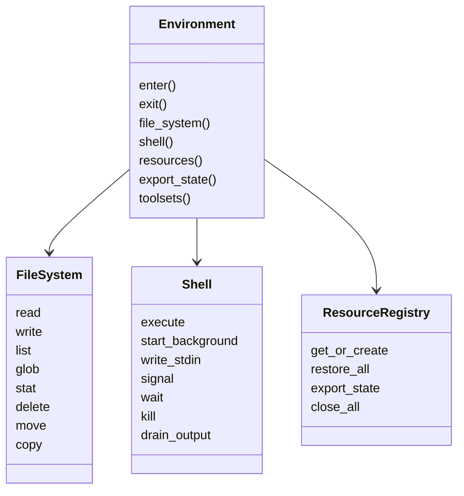

# 04 - Context, State, and Environment

## Goal

Starweaver makes `AgentContext`, `StateStore`, and `Environment` built-in runtime primitives.

This is an opinionated choice. The project targets practical agent runtimes where tools, model requests, background work, UI, service storage, filesystem, and shell execution need shared lifecycle state.

## AgentContext

`AgentContext` is the lifecycle object carried through model calls, tools, hooks, events, and executors.



Core fields:

| Field                     | Meaning                                                 |
| ------------------------- | ------------------------------------------------------- |
| `run_id`                  | Unique run ID                                           |
| `conversation_id`         | Stable conversation lineage ID                          |
| `agent_id`                | Current agent identity, such as `main` or a subagent ID |
| `parent_agent_id`         | Parent identity for subagents                           |
| `started_at` / `ended_at` | Runtime timing                                          |
| `metadata`                | Structured application metadata                         |
| `usage_ledger`            | Model/tool/subagent usage accounting                    |
| `event_bus`               | Sideband events                                         |
| `message_bus`             | Steering and cross-agent communication                  |
| `state_store`             | Persistent typed state                                  |
| `environment`             | Filesystem, shell, resources, and sandbox access        |
| `agent_registry`          | Active agent and subagent metadata                      |

## Context Scopes



Subagent contexts should inherit shared infrastructure and create scoped identity:

- shared `EventBus`
- shared `MessageBus`
- shared `StateStore` unless isolated by policy
- shared `Environment` unless sandboxed by policy
- isolated `agent_id`, `parent_agent_id`, local metadata, and local history views

## StateStore

`StateStore` is the typed persistence layer exposed through `AgentContext`.

It generalizes `ya-mono`'s note/task/resumable-state behavior into a single runtime abstraction.



State scopes:

| Scope          | Lifetime                                   |
| -------------- | ------------------------------------------ |
| `run`          | current execution attempt                  |
| `conversation` | message-history lineage across runs        |
| `agent`        | current agent/subagent identity            |
| `workspace`    | filesystem/shell workspace binding         |
| `user`         | user-level durable preferences or memories |
| `global`       | process/service-level state                |

Initial built-in state domains:

| Domain        | Purpose                                              |
| ------------- | ---------------------------------------------------- |
| `notes`       | key-value recall surfaced by keys in runtime context |
| `tasks`       | task graph with status and dependencies              |
| `usage`       | usage ledger and cost accounting                     |
| `messages`    | message history and checkpoints                      |
| `resources`   | environment resource state                           |
| `approvals`   | pending and completed human approval decisions       |
| `tool_search` | loaded tools/namespaces and discovery state          |
| `runtime`     | run status, checkpoint IDs, cancellation state       |

## StateStore Backends

| Backend               | Use case                            |
| --------------------- | ----------------------------------- |
| `InMemoryStateStore`  | tests and local ephemeral runs      |
| `FileStateStore`      | CLI sessions and local resumability |
| `SqliteStateStore`    | local service and single-node Claw  |
| `PostgresStateStore`  | hosted or multi-worker service      |
| `CompositeStateStore` | split state domains across backends |

StateStore guarantees:

- typed serialization with versioned envelopes
- compare-and-swap for concurrent service runtimes
- export/import for resumable sessions
- checkpoint references for graph/executor recovery
- prefix listing for notes, tasks, and resources
- migration hooks for schema evolution

## EventBus and MessageBus on Context

`AgentContext` exposes ergonomic APIs:

```rust
impl AgentContext {
    pub async fn emit_event<E: RuntimeEvent>(&self, event: E) -> Result<EventId>;
    pub async fn publish_message(&self, message: BusMessage) -> Result<MessageId>;
    pub async fn consume_messages(&self, policy: MessageDrainPolicy) -> Result<Vec<BusMessage>>;
    pub async fn checkpoint(&self, reason: CheckpointReason) -> Result<CheckpointId>;
}
```

The runtime owns drain timing. Tools and external controllers publish messages; the graph decides when those messages become history.

## Environment

`Environment` maps agent capabilities to filesystem, shell, process, and resource backends.

It is required for filesystem and shell tools. Runtime products can provide local, sandboxed, remote, or service-backed environments.



## Filesystem Mapping

`FileSystem` should support local and virtual paths.

Concepts:

| Concept          | Meaning                                                            |
| ---------------- | ------------------------------------------------------------------ |
| `workspace_root` | default project/workspace directory                                |
| `allowed_paths`  | directories visible to the agent                                   |
| `tmp_dir`        | runtime-managed scratch space                                      |
| `virtual_path`   | stable path exposed to model/tool UX                               |
| `mount_set`      | service-side mapping from logical roots to actual paths or volumes |
| `path_policy`    | read/write/delete permission boundaries                            |

Filesystem operations:

- read text and bytes with offsets and limits
- stream large files
- write and append files
- list directories with type metadata
- glob and grep through policy-aware traversal
- stat, mkdir, move, copy, delete
- produce environment context instructions with file tree summaries

## Shell Mapping

`Shell` should support foreground and background execution.

Concepts:

| Concept              | Meaning                                       |
| -------------------- | --------------------------------------------- |
| `default_cwd`        | default working directory                     |
| `allowed_cwds`       | allowed working directories                   |
| `default_timeout`    | execution timeout                             |
| `environment`        | environment variables and inheritance policy  |
| `review_policy`      | command approval and safety policy            |
| `sandbox_policy`     | local, container, remote, or denied execution |
| `background_process` | managed long-running process                  |
| `output_buffer`      | bounded stdout/stderr buffers                 |

Shell operations:

- execute command with timeout and cwd validation
- start background process
- stream or drain background output
- write stdin and close stdin
- wait, kill, and signal process
- export process metadata and completed results
- emit shell events through `EventBus`

## Environment Backends

| Backend                | Purpose                                                |
| ---------------------- | ------------------------------------------------------ |
| `LocalEnvironment`     | local CLI and tests                                    |
| `SandboxEnvironment`   | container or microVM execution                         |
| `RemoteEnvironment`    | RPC-backed filesystem/shell                            |
| `CompositeEnvironment` | split filesystem, shell, and resources across backends |
| `ReadOnlyEnvironment`  | browsing and analysis with read-only filesystem policy |

## Context Injection

The runtime should inject concise context blocks before model requests.

Built-in blocks:

- `runtime-context`: run ID, time, usage, active tasks, available state keys
- `environment-context`: workspace roots, visible files, shell policy, platform metadata
- `message-bus`: delivered steering messages when they enter history
- `project-guidance`: repository guidance when configured by CLI/service
- `user-rules`: user-level preferences when configured by CLI/service

Historical injected blocks should be tagged so compaction can strip stale copies and regenerate fresh blocks.

## Resumability

Exported context state should include:

- message history references or snapshots
- state domains selected by policy
- usage ledger
- outstanding approvals and deferred tools
- message bus cursors and pending messages
- event cursors where durable replay is enabled
- environment resource state
- subagent registry and subagent history references

## Security and Policy

Environment and shell policy are core runtime contracts.

Policy dimensions:

| Policy            | Meaning                                      |
| ----------------- | -------------------------------------------- |
| `path_policy`     | allowed read/write/delete roots              |
| `shell_policy`    | allow, deny, review, or sandbox commands     |
| `network_policy`  | network access for tools and shell           |
| `resource_policy` | resource creation and persistence limits     |
| `approval_policy` | human approval requirements                  |
| `secret_policy`   | secret redaction and environment inheritance |
| `artifact_policy` | user-facing file export rules                |

## Implementation Notes

- `AgentContext` should use handles or Arcs internally so tool calls can clone references cheaply.
- `StateStore` should be async from the start because service backends are likely.
- `Environment` should expose capability presence explicitly, so tools can show availability and helpful errors.
- Background processes should be bounded by output buffer size and process count.
- Context export should support compact, full, and checkpoint modes.
