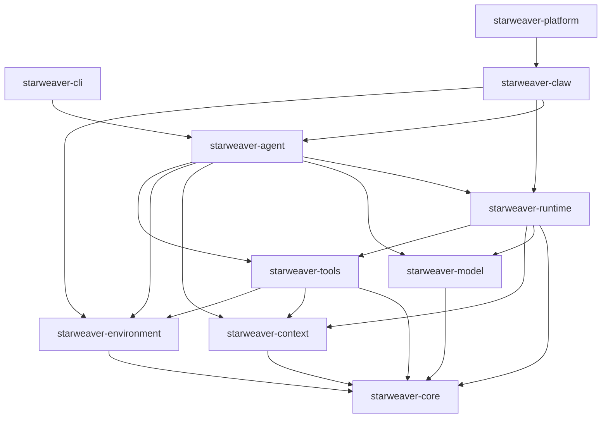

# 05 - Crate Plan

## Goal

This document converts the runtime architecture into a crate roadmap. It is a planning document only; code implementation follows after the specs are reviewed.

## Current Workspace

Current implemented crates:

- `starweaver-core`
- `starweaver-cli`

These remain minimal until the runtime specs settle.

## Target Workspace

## Crate Details

### `starweaver-core`

Foundational types shared by all crates.

Initial modules:

- `id`: `RunId`, `ConversationId`, `AgentId`, `EventId`, `MessageId`, `CheckpointId`
- `time`: timestamp helpers and clock trait
- `error`: shared error envelope and categories
- `metadata`: serializable metadata map
- `usage`: request/run usage and cost placeholders
- `serde`: versioned envelope helpers

### `starweaver-model`

Provider-neutral model protocol and adapters.

Initial modules:

- `message`: `ModelMessage`, `ModelRequest`, `ModelResponse`
- `part`: request/response parts
- `stream`: model response stream events
- `settings`: `ModelSettings` and merge logic
- `profile`: `ModelProfile` and profile registry
- `adapter`: `ModelAdapter`, `ModelRequestContext`, `ModelRequestParameters`
- `test_model`: deterministic test adapter

### `starweaver-context`

Runtime context, buses, and state.

Initial modules:

- `agent_context`: lifecycle-wide `AgentContext`
- `state_store`: state trait and in-memory backend
- `event_bus`: sideband typed event bus
- `message_bus`: steering and cross-agent bus
- `state_domains`: notes, tasks, usage, approvals, runtime state
- `export`: resumable state import/export

### `starweaver-environment`

Filesystem, shell, processes, and resources.

Initial modules:

- `environment`: environment trait and lifecycle
- `filesystem`: filesystem trait, local backend, virtual paths
- `shell`: shell trait, foreground/background execution
- `process`: process handles and output buffers
- `resources`: resource registry and resumable resources
- `policy`: path, shell, network, secret, and artifact policies
- `sandbox`: sandbox abstraction for local container or remote backends

### `starweaver-tools`

Tool model and built-in toolsets.

Initial modules:

- `definition`: tool definition and schema metadata
- `registry`: tool registry and namespacing
- `executor`: validation, dispatch, retry, and approval flow
- `toolset`: grouped tools and dynamic availability
- `builtin`: filesystem, shell, context, task, note, web, subagent placeholders

### `starweaver-runtime`

Agent loop, graph, executor, checkpoints, and policy.

Initial modules:

- `graph`: node definitions and graph runner
- `run`: `AgentRun`, `AgentRunState`, run result
- `executor`: runtime executor trait and local executor
- `checkpoint`: checkpoint model and store integration
- `policy`: runtime, message, event, and retry policies
- `history`: history processors, compaction hooks, context injection
- `stream`: unified stream over model, tool, runtime, and custom events

### `starweaver-agent`

High-level SDK entrypoint.

Initial modules:

- `builder`: assemble model, context, environment, tools, runtime policies
- `agent`: high-level `Agent` type
- `preset`: default toolsets and runtime presets
- `subagent`: subagent configuration and delegation
- `lifecycle`: lifecycle extension traits

### `starweaver-cli`

Developer CLI.

Initial modules:

- `commands`: local run, inspect, spec, config
- `config`: CLI config loading
- `local_runtime`: local runtime assembly

### `starweaver-claw`

Service runtime and durable sessions.

Initial modules after service spec:

- `session`: session model and lineage
- `run_queue`: queued run model
- `supervisor`: run supervisor and worker ownership
- `storage`: SQLite/Postgres storage adapters
- `streaming`: event replay and subscription APIs
- `workspace`: workspace binding and sandbox allocation

### `starweaver-platform`

Hosted platform capabilities after Claw stabilizes.

Initial modules after platform spec:

- `api`: service API contracts
- `tenant`: tenant/project/user abstractions
- `orchestration`: multi-agent and scheduled runtime orchestration

## Dependency Rules

- `starweaver-core` is the dependency root for shared foundational types.
- `starweaver-model` depends on `starweaver-core`.
- `starweaver-context` depends on `starweaver-core` and stores model messages through feature-gated types or generic envelopes.
- `starweaver-environment` depends on `starweaver-core`.
- `starweaver-tools` depends on context and environment.
- `starweaver-runtime` owns orchestration and depends on model, context, and tools.
- `starweaver-agent` is the ergonomic facade.
- `starweaver-cli`, `starweaver-claw`, and `starweaver-platform` are applications/service layers.

## Feature Flags

Recommended initial feature groups:

| Feature      | Crates                               | Purpose                    |
| ------------ | ------------------------------------ | -------------------------- |
| `serde`      | all core crates                      | serialization              |
| `test-utils` | model, context, environment, runtime | deterministic testing      |
| `local-env`  | environment, agent, cli              | local filesystem and shell |
| `sandbox`    | environment, claw                    | container/microVM mapping  |
| `sqlite`     | context, claw                        | local durable state        |
| `postgres`   | context, claw                        | service durable state      |
| `stream`     | runtime, agent, claw                 | event streaming            |

## Milestones

### Milestone 1: Model Protocol

- Add `starweaver-model`.
- Implement message, settings, profile, and test adapter.
- Add serialization round-trip tests.

### Milestone 2: Context and State

- Add `starweaver-context`.
- Implement `AgentContext`, in-memory `StateStore`, `EventBus`, and `MessageBus`.
- Add bus idempotency and state export tests.

### Milestone 3: Environment

- Add `starweaver-environment`.
- Implement local filesystem and shell traits with policy boundaries.
- Add path validation and shell lifecycle tests.

### Milestone 4: Runtime Loop

- Add `starweaver-runtime`.
- Implement local graph executor with model request and tool call loop.
- Add steering, event, checkpoint, and cancellation tests.

### Milestone 5: Agent Facade

- Add `starweaver-agent`.
- Implement builder, default runtime assembly, lifecycle extensions, and subagent skeleton.
- Add integration tests over test model and local environment.

### Milestone 6: CLI Runtime

- Expand `starweaver-cli`.
- Add local run command and runtime inspection commands.

## Acceptance Criteria for Adding a Crate

A new crate can be added when its PR includes:

1. crate manifest and workspace metadata
2. public module skeleton with docs
3. tests for the first stable boundary
4. README or spec update explaining the boundary
5. Makefile and CI coverage through existing workspace commands
