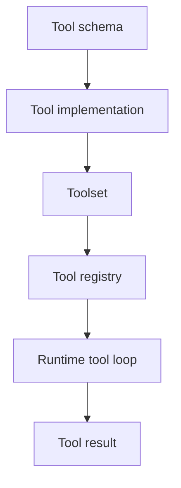
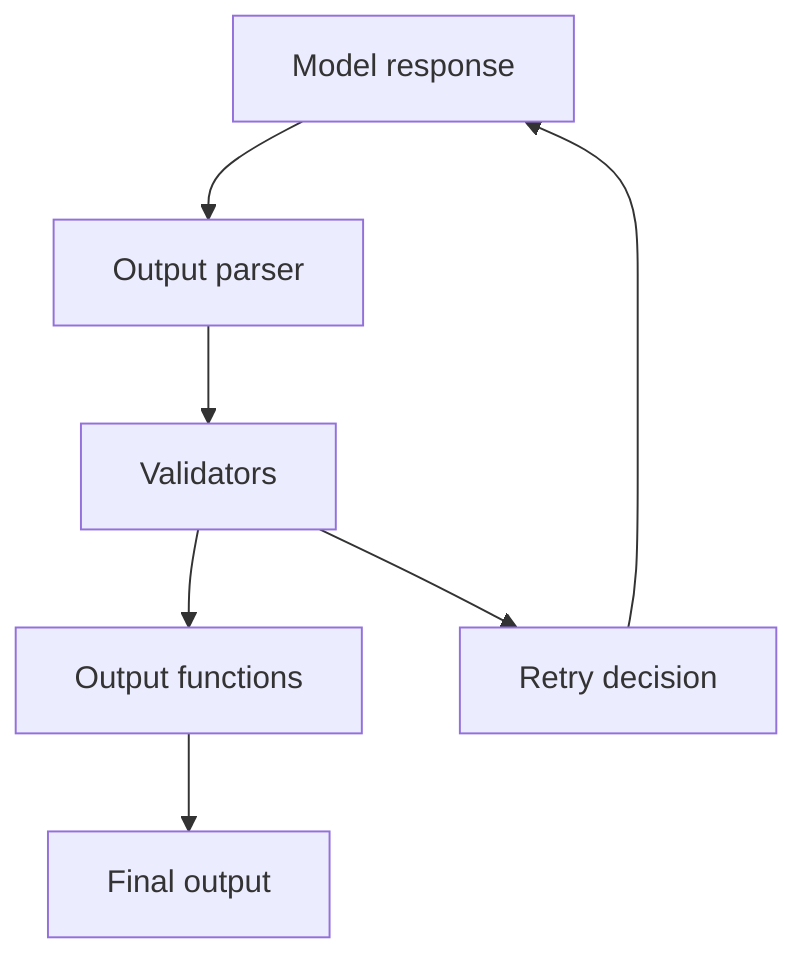

# 05 - Tools, Output, and Capabilities

## Motivation

Agents need controlled ways to act, validate answers, and extend runtime behavior. Starweaver models these concerns as tools, output policies, and capabilities with clear ownership across tools, runtime, and SDK layers.

## Ownership

| Area                                | Owner                                           |
| ----------------------------------- | ----------------------------------------------- |
| tool definitions and schemas        | `starweaver-tools`                              |
| toolsets, namespacing, and metadata | `starweaver-tools`                              |
| tool execution loop                 | `starweaver-runtime`                            |
| environment-backed tool bundles     | `starweaver-agent` and `starweaver-environment` |
| output parsing and validation       | `starweaver-runtime`                            |
| output policy ergonomics            | `starweaver-agent`                              |
| capability hooks and bundles        | runtime primitives, SDK assembly                |

## Tool Architecture

A tool has a name, schema, description, async execution path, result envelope, error mapping, and metadata for retry, approval, deferral, and audit.

## Toolsets

Toolsets group tools and instructions. They should support:

- static collections
- dynamic availability
- namespacing
- grouped instructions
- preparation hooks
- future search and discovery

## Output Architecture

Output policy should cover text, schema-based structured output, typed parsing, validators, output functions, and bounded retry.

## Capability Bundles

Capabilities compose runtime extensions:

- instructions
- tools and toolsets
- settings
- validators and output functions
- history processors
- usage limits
- lifecycle hooks

SDK presets can be expressed as capability bundles.

## Control-Flow Metadata

Tool metadata can describe approval or deferral needs. Runtime records the state. SDK and service layers decide how approval, polling, and resumed results are delivered.

## Acceptance Gates

- tool schema and registry tests
- toolset and namespacing tests
- tool retry and control-flow tests
- structured output tests
- validator and output function tests
- capability bundle tests
