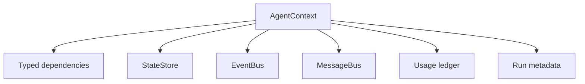
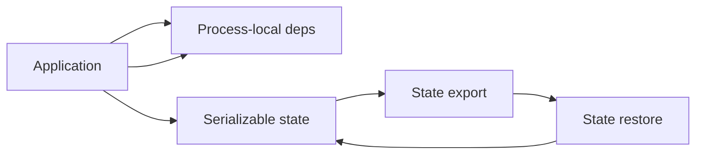

# 06 - Context, State, and Events

## Motivation

Agent applications need a lifecycle object that carries dependencies, state, events, messages, and usage across model calls, tools, subagents, and future sessions. Starweaver uses `AgentContext` as that lifecycle boundary.

## Ownership

`starweaver-context` owns:

- `AgentContext`
- typed dependency storage
- serializable state store
- event bus
- message bus
- usage ledger
- resumable state envelopes
- run and session metadata

## Context Shape

## State and Dependency Separation

Serializable state is data that can be exported, stored, restored, and replayed. Process-local dependencies are runtime handles or application values that must be reattached by the SDK or service layer.

## Event Bus

Events are sideband lifecycle records. They should describe run progress, tool activity, validation results, checkpoints, subagent activity, and custom application events.

## Message Bus

Messages are steering or coordination inputs. Runtime should drain them at stable graph boundaries.

## Usage Ledger

Usage should accumulate across model requests, tool calls, retries, subagents, and service sessions. Parent contexts should be able to account for nested work.

## Resumability

State export should carry serializable state and enough metadata for SDK or service layers to rehydrate dependencies, tools, models, and environments.

## Acceptance Gates

- typed dependency tests
- state store export/restore tests
- event bus tests
- message bus tests
- usage propagation tests
- runtime context integration tests
