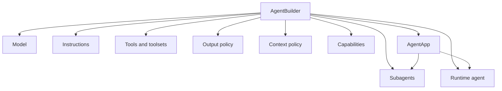
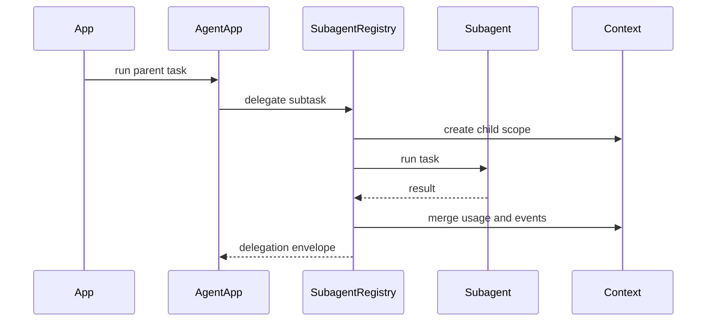

# 07 - Agent SDK

## Motivation

The SDK is the public face of Starweaver. It should let developers assemble agent applications without reaching into runtime internals while preserving access to typed primitives for advanced cases.

## Ownership

`starweaver-agent` owns:

- public facade exports
- `AgentBuilder`
- `AgentApp`
- output policy builders
- app/session entrypoints
- subagent protocol
- policy presets
- tool bundle assembly
- test ergonomics

## SDK Assembly

## AgentBuilder

The builder is the coherent assembly API for model, instructions, tools, output policy, context policy, history processors, capabilities, usage limits, executors, and subagents.

Common cases should be concise. Advanced composition should remain explicit.

## AgentApp

`AgentApp` is the application wrapper around a configured runtime agent. It should own app-level protocols such as context preparation, subagent delegation, streaming entrypoints, and future session helpers.

## Subagent Protocol

Subagents are named application participants registered at the SDK layer.

A delegation envelope should carry task input, metadata, runtime result, usage, and lifecycle events. Timeout, cancellation, retry, and durable polling can extend this protocol.

## Output Policy

The SDK should expose ergonomic APIs for text output, schema output, typed parsing, validators, output functions, and semantic retry configuration.

## Tool Bundles

SDK tool bundles should declare their tools, instructions, dependencies, environment requirements, approval policy, retry policy, and test fakes.

## Test Ergonomics

Tests should be able to assemble deterministic agents, override models and tools, inspect messages, and run docs examples through public SDK APIs.

## Acceptance Gates

- builder tests
- app wrapper tests
- subagent protocol tests
- output policy docs examples
- test helper examples
- docs example compilation
