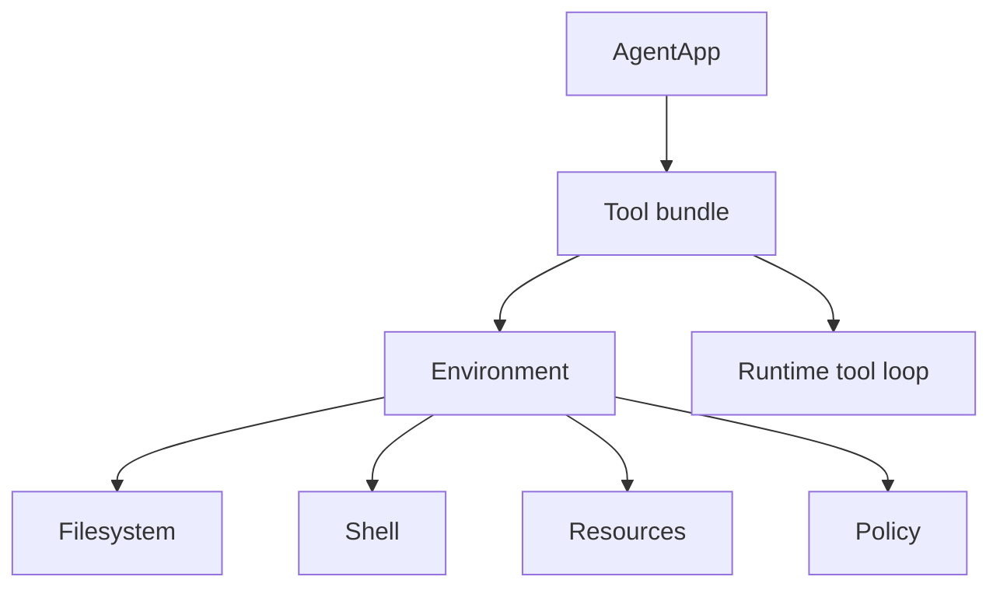
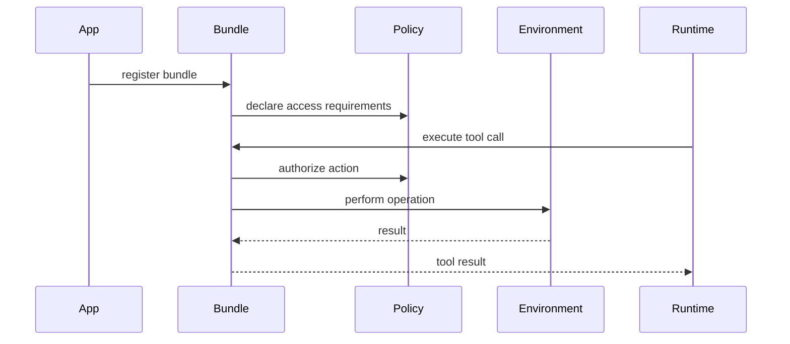

# 08 - Environment and Tool Bundles

## Motivation

Agent applications need safe access to filesystems, shells, resources, and external services. Starweaver keeps that access above the runtime kernel through environment abstractions and SDK tool bundles.

This boundary lets applications choose local, sandboxed, or remote execution policies without changing runtime semantics.

## Ownership

| Layer                    | Responsibility                                                        |
| ------------------------ | --------------------------------------------------------------------- |
| `starweaver-runtime`     | execute provider-neutral tool calls                                   |
| `starweaver-tools`       | define tool schemas, toolsets, metadata, and result envelopes         |
| `starweaver-agent`       | assemble tool bundles and application policies                        |
| `starweaver-environment` | define filesystem, shell, resources, sandbox, and policy abstractions |
| service runtimes         | bind environments to durable sessions and workspaces                  |

## Environment Architecture

## Environment Contracts

An environment should describe:

- workspace root and virtual paths
- filesystem operations
- shell execution and process lifecycle
- resource handles and resumable resources
- network, secret, artifact, path, and command policies
- local, sandboxed, or remote backend behavior

## Tool Bundle Contracts

A tool bundle should declare:

- tool definitions
- toolset instructions
- required environment capabilities
- approval rules
- retry behavior
- audit metadata
- deterministic test doubles

## Policy Flow

## First-Party Bundle Families

- filesystem tools
- shell tools
- resource tools
- web and search tools
- MCP tools
- media and artifact tools

## Graduation Criteria

Create `starweaver-environment` when multiple tool bundles need shared environment traits and policy enforcement. The first environment boundary should include trait definitions, one backend, one SDK bundle, tests, and docs.

## Acceptance Gates

- environment trait tests
- path and command policy tests
- bundle registration tests
- approval policy tests
- deterministic bundle fakes
- docs examples for first-party bundles
