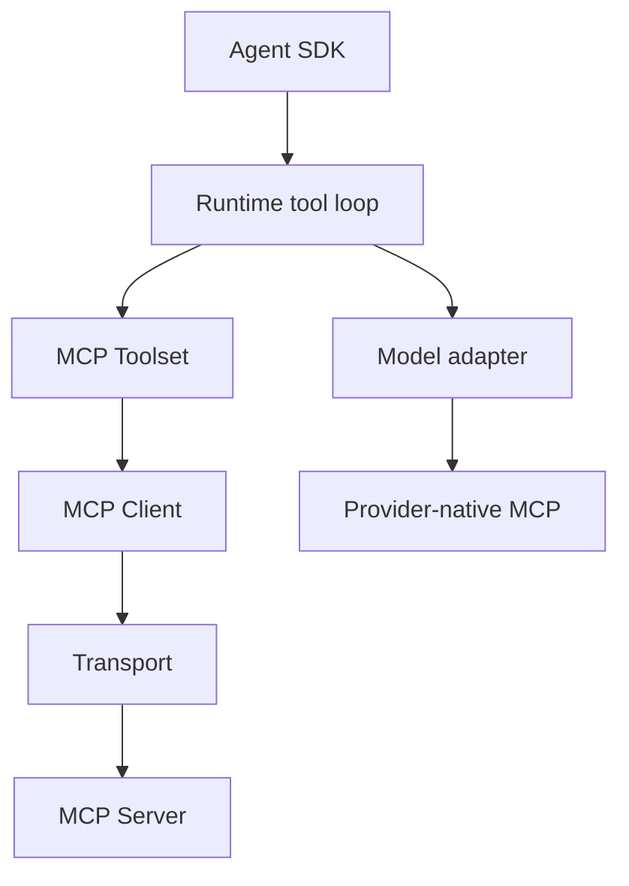

# 09 - MCP Strategy

## Motivation

MCP is a protocol boundary for dynamic tool discovery, tool calls, resources, prompts, sampling, and elicitation. Starweaver should integrate MCP through toolset abstractions while keeping provider-native MCP support and live client execution as separate paths.

## Ownership

| Layer                | Responsibility                                                                          |
| -------------------- | --------------------------------------------------------------------------------------- |
| `starweaver-tools`   | MCP protocol types, toolset integration, static definitions, and live client foundation |
| `starweaver-model`   | provider-native MCP request mapping                                                     |
| `starweaver-runtime` | execute MCP-backed tools through the normal tool loop                                   |
| `starweaver-agent`   | SDK policy, approval integration, and bundle ergonomics                                 |
| future MCP crate     | standalone protocol client after split criteria are met                                 |

## Architecture

## Live Client Contract

A live MCP client should cover:

- initialization and capability negotiation
- server instructions
- tool listing and tool calls
- resource listing and reads
- prompt listing and retrieval
- sampling and elicitation hooks
- cancellation, timeout, shutdown, and structured errors
- audit metadata and logs

## Toolset Contract

An MCP toolset should:

- discover tools from servers
- expose server instructions as toolset instructions
- execute calls through the runtime tool loop
- map protocol errors into tool errors
- preserve approval and deferred execution metadata
- refresh definitions under application policy

## Transport Contract

Transport implementations should be independently testable. Supported families include stdio, streamable HTTP, and SSE.

## Split Criteria

MCP can move to a dedicated crate when the protocol client includes multiple transports, tools, resources, prompts, advanced features, stable errors, and integration tests.

## Acceptance Gates

- protocol serialization tests
- transport tests without external services
- local test server in CI
- runtime integration test for MCP-backed tool calls
- provider-native MCP mapping tests
