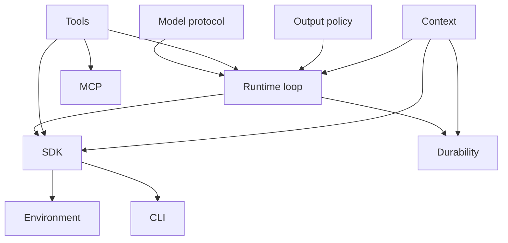

# 10 - Readiness and Capability Status

## Motivation

Readiness is an architecture gate. A capability is ready when its boundary is clear, its public shape is documented, and its behavior is covered by deterministic validation.

Phase notes and design comparisons live in `memos/`.

## Readiness Levels

| Level      | Meaning                                        | Evidence                                                          |
| ---------- | ---------------------------------------------- | ----------------------------------------------------------------- |
| planned    | boundary exists in specs                       | responsibility, dependencies, and success criteria are documented |
| foundation | first stable behavior exists                   | crate-local tests cover the boundary                              |
| integrated | capability participates in full agent runs     | runtime or SDK integration tests cover the path                   |
| ergonomic  | public API fits application usage              | docs examples compile and common cases are concise                |
| durable    | capability survives session/runtime boundaries | serializable state, checkpoints, or replay tests exist            |

## Capability Graph



## Acceptance Gates

### Model Protocol

- neutral message serialization round-trips
- provider mapper fixtures cover request and response shapes
- transport can be injected in tests
- test adapters cover deterministic behavior

### Runtime Loop

- deterministic model runs are tested
- tool-call boundaries are recorded
- output validation and retry are tested
- usage limits are enforced
- checkpoints are emitted at stable boundaries

### Tools and Output

- function tools expose schemas and results predictably
- toolsets support grouping and namespacing
- structured output supports parsing and validation
- retry behavior is bounded and testable

### Context and State

- typed dependencies are explicit
- serializable state can be exported and restored
- event and message buses are testable
- usage propagates through nested work

### SDK Layer

- application code builds agents through `starweaver-agent`
- docs examples compile
- app wrapper and subagent protocols are tested
- test overrides and deterministic models are ergonomic

### Environment and Tool Bundles

- environment traits have concrete SDK call sites
- policies are explicit and testable
- bundles provide deterministic test fakes

### Durability

- checkpoints are serializable
- session state can be restored by app or service layers
- interruption and resume semantics are defined at graph boundaries

## Validation Commands

```bash
make fmt-check
make check
make test
python3 scripts/check-docs-examples.py
make ci
```
