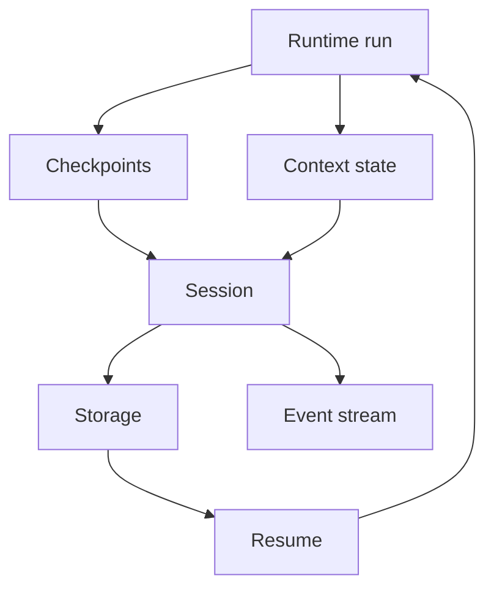
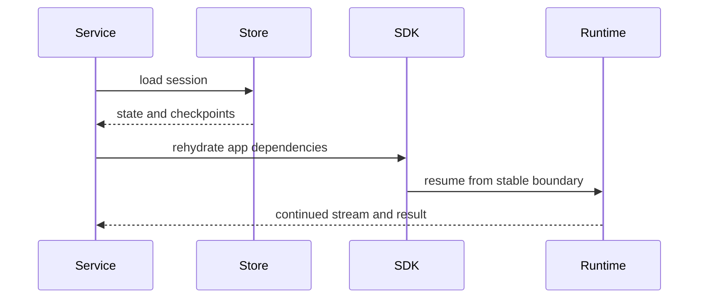

# 11 - Durability and Service Runtime

## Motivation

Durable agents need stable execution evidence, resumable state, and service-owned orchestration. Starweaver separates runtime checkpoint emission from service persistence and resume policy.

## Ownership

| Layer                | Responsibility                                                                   |
| -------------------- | -------------------------------------------------------------------------------- |
| `starweaver-runtime` | emit checkpoints and stream records at stable execution boundaries               |
| `starweaver-context` | hold serializable state, events, messages, and usage                             |
| `starweaver-agent`   | provide app/session ergonomics and restore helpers                               |
| `starweaver-claw`    | own durable sessions, storage, interruption, resume, event replay, SSE, and AGUI |

## Durability Architecture

## Checkpoint Contract

Checkpoints should record semantic boundaries:

- run start
- model request and response
- tool call start and result
- output validation
- retry decision
- deferred execution state
- run finish

## Session Contract

A durable session should track:

- session identity
- run lineage
- parent-child delegation lineage
- context state
- message history
- checkpoint stream
- event stream
- pending approvals or deferred tool calls
- workspace binding

## Resume Contract

Resume should rehydrate serializable state and reconnect process-local components through SDK or service policy:

## Interruption Contract

Interruption should occur at stable runtime boundaries. Supported directions include pause, cancel, wait for approval, wait for deferred result, and resume with external input.

## Streaming Contract

Service streams should expose runtime records, context events, checkpoints, subagent events, approval/deferred events, and final result envelopes.

## Acceptance Gates

- checkpoint serialization tests
- session restore tests
- interruption/resume tests
- event replay tests
- storage adapter tests
- streaming contract tests
