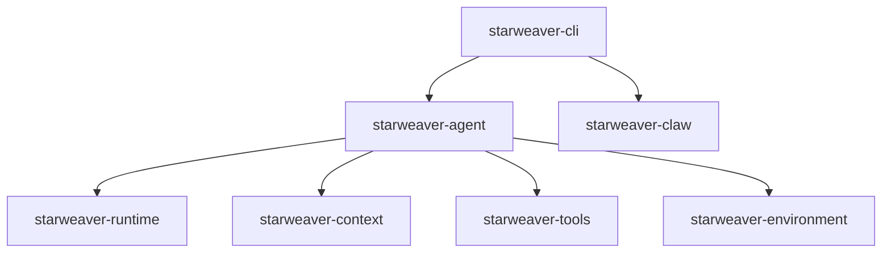
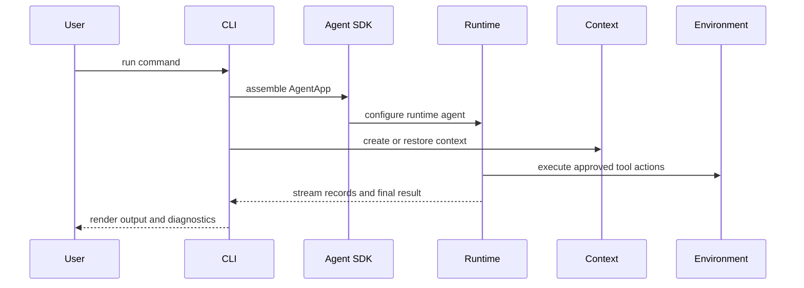

# 12 - CLI Product

## Motivation

The CLI is Starweaver's local product surface. It should let developers run agents, manage configuration, inspect sessions, approve actions, and operate workspace-bound tools through the same SDK and runtime contracts used by applications and services.

CLI design should follow the SDK architecture while giving Starweaver a practical, daily-use interface.

## Boundary

The CLI is a product layer over the SDK. It can also connect to service runtime APIs when durable sessions and workspace execution are available.

## Product Scope

The CLI should support:

- local agent runs
- model and profile selection
- project and global configuration
- session creation, listing, inspection, and restore
- workspace environment binding
- filesystem, shell, resource, and MCP tool bundles
- approval prompts and tool permission policy
- streaming output
- history, state, event, and checkpoint inspection
- diagnostics for model, tool, context, and runtime failures

## Architecture Flow

## Configuration Contract

CLI configuration should map cleanly to SDK concepts:

- model provider and profile
- model settings
- instructions
- tool bundles
- approval policy
- workspace/environment policy
- session storage
- output and streaming preferences

## Service Runtime Contract

When service runtime exists, the CLI should be able to:

- start or attach to durable sessions
- stream events from service runs
- resume interrupted runs
- answer approval requests
- inspect checkpoints and state
- manage workspace bindings

## Entry Gates

Build substantive CLI features after:

- `AgentApp` has stable context/session entrypoints
- first-party tool bundles exist
- output policy and subagent protocol are usable from SDK APIs
- environment policy has a clear local backend
- local validation remains green

## Acceptance Gates

- command tests
- configuration loading tests
- local run tests with deterministic models
- approval flow tests
- session inspect and restore tests
- docs or README usage
- CI coverage through workspace commands
