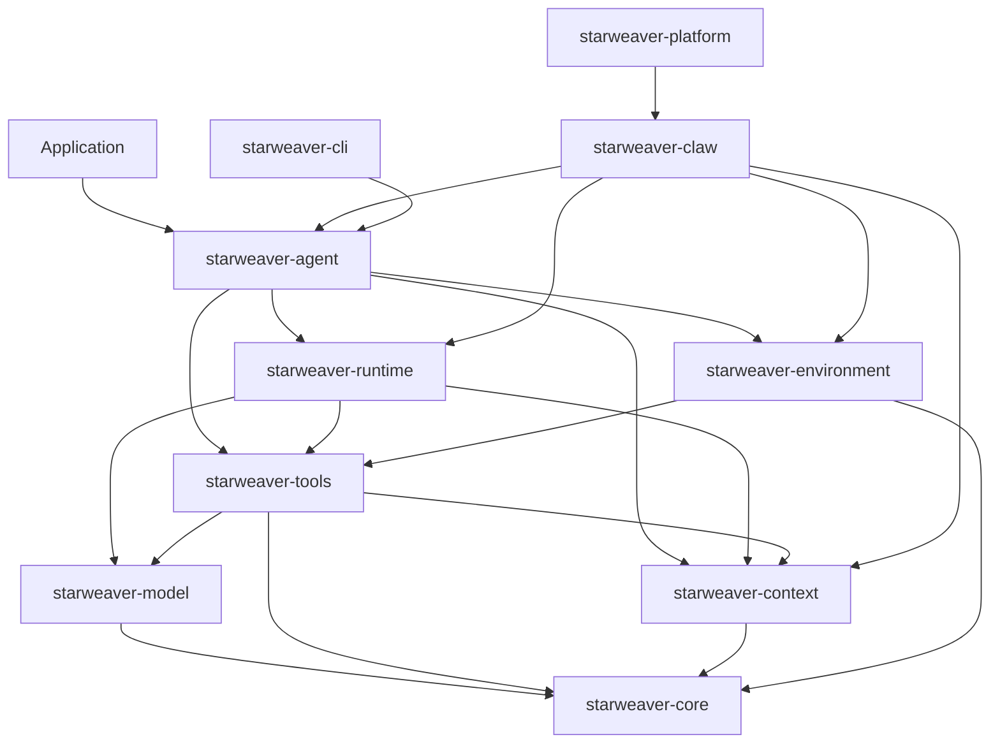

# Starweaver Architecture Specs

This directory defines Starweaver's long-lived architecture baseline. The specs describe product boundaries, runtime contracts, SDK responsibilities, and crate graduation rules before public APIs stabilize.

Working notes, design comparisons, implementation evidence, and release-preparation reminders live in `memos/`.

## Spec Map

### Foundation

- `00-repository.md` — repository role, workspace map, and governance rules
- `01-sdk-vision-and-boundaries.md` — SDK vision, product layers, and ownership boundaries
- `02-crate-map.md` — crate dependency map, graduation criteria, features, and milestones

### Runtime Kernel

- `03-model-and-transport.md` — provider-neutral model protocol and transport boundary
- `04-agent-runtime-loop.md` — deterministic agent loop, transitions, retries, streams, and checkpoints
- `05-tools-output-and-capabilities.md` — tools, toolsets, structured output, validators, and capability bundles
- `06-context-state-and-events.md` — lifecycle context, typed dependencies, state, events, messages, and usage

### SDK Layer

- `07-agent-sdk.md` — public SDK surface, app assembly, output policy, and subagent protocol
- `08-environment-and-tool-bundles.md` — environment abstraction, policies, and first-party tool bundles
- `09-mcp-strategy.md` — MCP protocol boundary, live client architecture, and split criteria

### Product Extensions

- `10-readiness-and-capability-status.md` — readiness levels and capability acceptance gates
- `11-durability-and-service-runtime.md` — session durability, interruption, resume, and streaming contracts
- `12-cli-product.md` — CLI product surface, configuration, local runs, sessions, approvals, and diagnostics

## System Shape

## Architecture Rules

- `starweaver-agent` is the public SDK entrypoint.
- `starweaver-runtime` owns deterministic execution semantics.
- `starweaver-model` owns provider protocol translation and transport behavior.
- `starweaver-tools` owns protocol-level tool definitions, toolsets, and MCP foundations.
- `starweaver-context` owns lifecycle state, typed dependencies, events, messages, and usage.
- Environment-backed tools are assembled above the runtime kernel.
- Service runtimes persist and resume runtime evidence through stable checkpoints.
- CLI product work builds on SDK app contracts, environment policy, and service runtime boundaries.

## Maintenance Rules

- Use English in spec files.
- Prefer mermaid diagrams for architecture flows.
- Keep `02-crate-map.md` as the dependency and graduation source of truth.
- Keep phase notes and implementation snapshots in `memos/`.
- Update `AGENTS.md` and `README.md` when spec structure, crate boundaries, or validation commands change.
