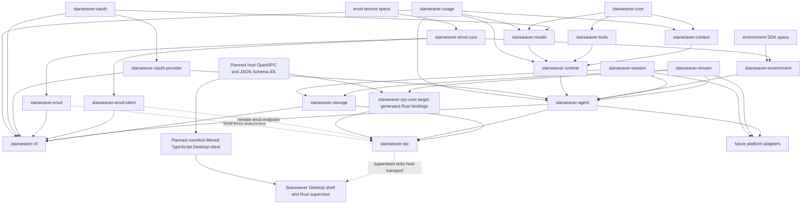

# Starweaver Specs

This directory records architecture and product decisions before APIs, crates, or workflows graduate into stable surfaces.

## Spec Map

Core foundation:

- `core/README.md` — core scope, contracts, and acceptance gates
- `core/01-agent-loop.md` — deterministic run loop, graph states, retries, streaming, and durable execution seam
- `core/02-model-provider-replay.md` — provider-neutral model protocol, replay fixtures, transport, settings, profiles, and CI gates
- `core/03-tools-output-capabilities.md` — tool schema, tool loop, structured output, output functions, validators, hooks, and capability bundles
- `core/04-context-state-executor.md` — AgentContext, StateStore, events, messages, notes, usage, checkpoints, and executor preparation
- `core/05-agent-foundation-feature-map.md` — non-normative Agent foundation design-coverage map across agents, providers, tools, output, streaming, and testing
- `core/06-message-request-abstractions.md` — Starweaver-native message AST, model request envelope, preparation pipeline, streaming parts, and provider boundary
- `core/07-versioned-protocol-contracts.md` — normative versioned durable envelopes, canonical input/lifecycle/cursor vocabularies, protocol identities, and fixture gates
- `core/08-boundaries-and-usage.md` — runtime/context/SDK/usage boundaries, usage snapshot pricing contract, and cleanup acceptance gates

SDK layer:

- `sdk/README.md` — SDK product boundary and application-facing contract
- `sdk/01-agent-sdk-app.md` — AgentBuilder, AgentApp, AgentSession, policy presets, app composition, and docs surface
- `sdk/02-environment-provider.md` — EnvironmentProvider, filesystem, shell, resources, environment state, policies, and sandbox mapping
- `sdk/03-first-party-tool-bundles.md` — filesystem, shell, search, media, task, skill, and tool-proxy bundles implemented through capabilities and context
- `sdk/04-subagents-skills.md` — serializable subagent specs, delegation lifecycle, inherited tools, skills, and nested coordination
- `sdk/05-sdk-integration-map.md` — SDK integration map for agents, context, filters, environment, toolsets, subagents, media, and presets
- `sdk/06-async-subagent-execution.md` — async-only model-visible delegation, steering, cancellation, bounded fan-in, host continuation, durability, and product lifetime policy
- `sdk/python/README.md` - Python SDK product contract, in-process tools, sessions, streams, active control, ecosystem integration, and validation

Agent SDK environment layer:

- `environment/README.md` — Starweaver Agent SDK environment layer, ownership rules, provider families, and envd relationship
- `environment/01-sdk-provider-contract.md` — `EnvironmentProvider`, process/shell extension traits, descriptors, capabilities, snapshots, and restore boundary
- `environment/02-tool-binding-and-envd-adapter.md` — environment-backed tool binding, `EnvdEnvironmentProvider`, CLI direct mode, host RPC attachments, and boundary rules

Envd service protocol:

- `envd/README.md` — standalone envd service architecture, ownership rules, implementation shape, and Starweaver reference integration
- `envd/01-service-interface-and-state.md` — envd service trait, environment state, mount state, process state, operation/effect records, and capability model
- `envd/02-implementations-and-modes.md` — local ephemeral mode, implementation-owned state lifecycle, RPC server mode, RPC client mode, and future sandbox/composite backends
- `envd/03-rpc-protocol.md` — JSON-RPC method groups, stdio/http transports, request/response envelopes, errors, streaming, and idempotency
- `envd/04-provider-and-host-integration.md` — reference Starweaver provider adapter, host RPC, session metadata, approval, and dependency boundaries
- `envd/05-api-backlog.md` — unfinished envd API work that should wait for a concrete implementation or call site

Readiness review:

- `alignment/README.md` — review source snapshot, document map, and high-level SDK findings
- `alignment/01-agent-core-abstractions.md` — core agent abstraction inventory
- `alignment/02-agent-sdk-surface-parity.md` — application SDK surface parity against Starweaver SDK surfaces
- `alignment/03-runtime-context-session-streaming.md` — runtime, context, state, message bus, durable session, and streaming alignment
- `alignment/04-tools-toolsets-hitl.md` — tools, toolsets, hooks, dynamic discovery, MCP, approval, and deferred execution
- `alignment/05-models-output-provider-alignment.md` — model settings, profiles, provider mapping, output modes, usage, and replay gates
- `alignment/06-subagents-environments-skills-media.md` — subagents, environments, resources, skills, media, tasks, notes, and host adapters
- `alignment/07-cli-concise-mode-ux.md` — CLI/TUI concise-mode semantic compression and rendering plan
- `alignment/08-starweaver-claw-sdk-additions.md` — Starweaver Claw layering map and non-blocking Rust/Python SDK additions
- `alignment/09-architecture-review.md` — cross-workspace architecture, security, durability, API, and improvement review baseline

Claw product specs:

- `claw/README.md` — Starweaver Claw product spec map and boundary
- `claw/01-reference-module-review.md` — module-by-module review of the Claw reference product runtime
- `claw/02-python-implementation-plan.md` — feasible product implementation plan for Starweaver Claw on `starweaver-python`
- `claw/03-parity-matrix.md` — capability-by-capability parity matrix and ownership split

Operations and products:

- `ops/README.md` — operational layer scope and readiness model
- `ops/00-product-boundaries.md` — normative independence and shared-library boundaries for CLI/TUI, standalone RPC, and envd
- `ops/01-ci-readiness.md` — replay CI, docs examples, feature coverage matrix, and release acceptance gates
- `ops/02-shared-execution-components.md` — shared session storage and stream protocol contracts
- `ops/03-durable-service-runtime.md` — durable sessions, stream archive, resume, interruption, service transports, display-message replay, and storage contracts
- `ops/04-cli-product.md` — CLI-first product surface, display-message rendering, launcher dispatch, GitHub install/update flow, and the planned hardened RPC component contract
- `ops/05-observability.md` — OpenTelemetry GenAI tracing, Langfuse-friendly OTLP export, nested agent/model/tool spans, and trace-to-session correlation
- `ops/06-json-rpc-host-protocol.md` — Starweaver-owned JSON-RPC host-control protocol, stdio/HTTP transport profiles, typed method/event/error contracts, replay subscriptions, projections, and idempotency
- `ops/07-session-search.md` — optional product-neutral session search, local SQLite/filesystem discovery, external index ingestion, and independent CLI/RPC integration
- `ops/08-agent-session-management.md` — agent-facing session query/control tools, query-only CLI policy, grant-gated RPC mutations, and lifecycle-safe run creation/steering/interruption
- `ops/09-rpc-idl-and-client-generation.md` — language-neutral OpenRPC/JSON Schema source, generated Rust server bindings, safe manifest-filtered TypeScript Desktop bridge/client, compatibility, migration, and validation

Desktop product specs:

- `desktop/README.md` — Desktop architecture baseline, ownership map, readiness prerequisites, and delivery phases
- `desktop/01-product-and-process-boundaries.md` — Desktop shell/supervisor ownership, per-workspace RPC children, stdio transport, and process lifetime
- `desktop/02-rpc-client-and-lifecycle.md` — client handshake, request discipline, replay recovery, run control, HITL, and required protocol additions
- `desktop/03-cli-migration-and-compatibility.md` — shared history, custom database discovery, OAuth/profile migration, continuation preflight, and version skew
- `desktop/04-workspaces-sessions-and-runs.md` — workspace routing, global history, run ownership, multi-window behavior, and bounded pagination
- `desktop/05-auth-interaction-and-security.md` — renderer isolation, OAuth, approval/clarification semantics, authority scopes, framing, and security gates
- `desktop/06-runtime-updates-and-release.md` — dedicated runtime channels, manifests, staging, compatibility, storage migration, activation, and rollback
- `desktop/07-ssh-remote-workspaces.md` — SSH execution domains, system OpenSSH transport, login-shell RPC bootstrap, account authority, remote provisioning, updates, and reconnect

`capabilities.toml` is the single source for current capability implementation status. `capability-status.md` is generated from it and is the normative human-readable status view. Feature maps, roadmaps, and backlogs are non-normative design views and must defer current status to that generated file. Implemented registry entries must name an owning workspace crate, normative spec, implementation paths, and contract-test evidence; `make capability-check` validates the registry, verifies those references, and rejects a stale generated status view.

## Target Architecture Shape

The diagram includes the accepted but unimplemented host-IDL generation target. Until its parity migration completes, handwritten Rust DTOs and the v1 corpus remain the RPC implementation baseline, and the Desktop foundation remains disconnected from RPC.

## Design Rules

- Core crates stay provider-neutral and product-neutral.
- `starweaver-usage` is a leaf accounting crate; usage data and optional pricing are not owned by `starweaver-core` or `starweaver-runtime`.
- Runtime contracts expose stable stream records, checkpoints, usage snapshot events, traces, and capability hooks.
- SDK ergonomics live in `starweaver-agent`; concrete environment resources live in `starweaver-environment`.
- `starweaver-environment` owns the Agent SDK environment provider contracts,
  provider registry, SDK state snapshots, and adapters.
- Envd is a standalone environment service/protocol; Starweaver can consume it
  through an envd-backed provider, and other agent runtimes can use envd through
  their own adapters.
- Envd has runtime-neutral core and client crates; the client must be usable
  without Starweaver's Agent SDK.
- Dynamic environment attachment management belongs to Starweaver host-control;
  it resolves host refs into run environment bindings without making envd a
  Starweaver-only protocol.
- Durable state is split between `starweaver-session`, `starweaver-stream`, and `starweaver-storage`.
- CLI/TUI and standalone RPC are independent product surfaces. Neither depends on, hosts, or routes execution through the other; both may independently consume shared storage, stream, environment, and envd abstractions.
- `starweaver-cli` owns local/headless command and TUI coordination.
- The accepted host-protocol target is a checked-in Starweaver OpenRPC/JSON Schema IDL as the structural wire source of truth. It will generate the Rust boundary owned by `starweaver-rpc-core` and the manifest-filtered TypeScript client consumed by Desktop; neither generated language surface is an independent protocol definition.
- `starweaver-rpc-core` currently owns handwritten typed JSON-RPC contracts plus framing/projection helpers. After parity migration it will own generated typed bindings plus narrow handwritten helpers; `starweaver-rpc` will implement that generated boundary while retaining handlers, authorization, subscriptions, coordination, and transports.
- Starweaver Desktop is a separate product with an implemented cross-platform shell foundation. Its planned TypeScript application client consumes IDL-derived safe bridge bindings, while its privileged Rust backend retains local child and SSH-hosted transport, routing, request identity, replay recovery, authority, safe projection, and runtime-update ownership. The renderer never sends arbitrary JSON-RPC or complete host params, links runtime/storage implementations, controls SSH directly, or reads local/remote shared storage.
- Platform adapters graduate from specs after responsibilities, call sites, and validation commands are clear.

## Current Priorities

- Establish the host IDL and generated Rust/TypeScript parity before connecting the Desktop shell foundation to an execution host.
- Close the RPC recovery, interaction, authorization, framing, pagination, and compatibility prerequisites recorded under `desktop/` before connecting the Desktop shell foundation to an execution host.
- Define the verified Desktop-managed RPC runtime update channel and a hardened product-neutral RPC component installer/update contract shared with `sw`/CLI and SSH provisioning, without linking Desktop to CLI-private handlers or configuration.
- Build envd as a standalone environment service with a reusable client crate.
- Keep Starweaver environment integration at the `EnvironmentProvider` adapter boundary.
- Keep unfinished envd API work in `envd/05-api-backlog.md` instead of reviving
  completed implementation plans.
