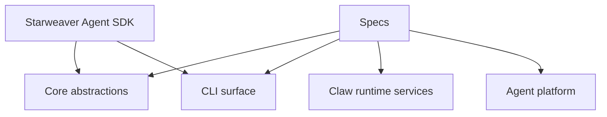

# Starweaver Specs

This directory holds product and architecture specs for Starweaver.

Specs are the place for planned modules, runtime boundaries, platform ideas, and SDK abstractions before they become workspace crates or public APIs. Keep implementation crates small until a spec has enough evidence to justify a stable boundary.

## Current Specs

- `00-repository.md` — repository scaffold, current workspace shape, and planned areas

## Planned Areas

Current crates provide a minimal executable base. Planned areas graduate into crates after specs define responsibilities, integration points, and validation paths.
