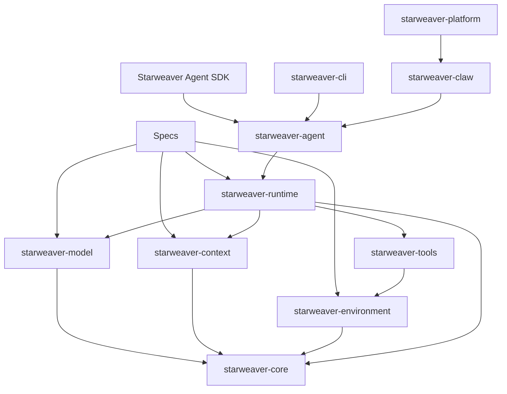

# Starweaver Specs

This directory holds product and architecture specs for Starweaver.

Specs are the place for planned modules, runtime boundaries, platform ideas, and SDK abstractions before they become workspace crates or public APIs. Keep implementation crates small until a spec has enough evidence to justify a stable boundary.

## Current Specs

- `00-repository.md` — repository scaffold, current workspace shape, and planned areas
- `01-runtime-architecture.md` — runtime-first architecture and crate responsibility map
- `02-model-layer.md` — message history, model settings, model profiles, and adapter layer
- `03-agent-runtime.md` — graph loop, executor, event bus, message bus, tool execution, and checkpoints
- `04-context-state-environment.md` — AgentContext, StateStore, EventBus, MessageBus, filesystem, shell, and environment mapping
- `05-crate-plan.md` — target workspace crates, dependency rules, feature flags, and milestones

## Planning Source Map

| Source                                             | Used for                                                                  |
| -------------------------------------------------- | ------------------------------------------------------------------------- |
| Pydantic AI `messages.py`                          | `ModelMessage`, request/response parts, stream events, provider metadata  |
| Pydantic AI `settings.py` and `profiles/*`         | `ModelSettings` and `ModelProfile` split                                  |
| Pydantic AI `_agent_graph.py` and `pydantic_graph` | typed graph loop, node execution, state/deps split                        |
| Pydantic AI PR 5578                                | enqueue/message delivery semantics for steering active runs               |
| `ya-mono` `ya_agent_sdk.context`                   | lifecycle-wide `AgentContext`, event stream, message bus, resumable state |
| `ya-mono` `ya_agent_environment`                   | filesystem, shell, resources, and environment lifecycle                   |
| `ya-mono` `ya-claw/spec`                           | durable service runtime and session/run split                             |

## Planned Runtime Crates

Current implemented crates provide a minimal executable base. Planned crates graduate after specs define responsibilities, integration points, and validation paths.

## Spec Rules

- Use English in spec files.
- Prefer mermaid diagrams for architecture flows.
- Update `AGENTS.md` when spec workflow or crate boundaries change.
- Update `00-repository.md` and `05-crate-plan.md` when workspace structure changes.
- Add implementation crates after the matching spec defines scope, dependencies, and acceptance criteria.
