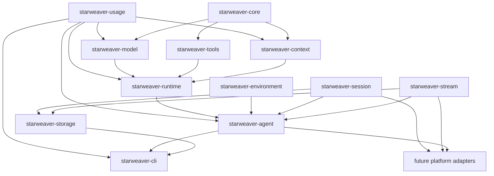

# Starweaver Specs

This directory records architecture and product decisions before APIs, crates, or workflows graduate into stable surfaces.

## Spec Map

Core foundation:

- `core/README.md` — core scope, contracts, and acceptance gates
- `core/01-agent-loop.md` — deterministic run loop, graph states, retries, streaming, and durable execution seam
- `core/02-model-provider-replay.md` — provider-neutral model protocol, replay fixtures, transport, settings, profiles, and CI gates
- `core/03-tools-output-capabilities.md` — tool schema, tool loop, structured output, output functions, validators, hooks, and capability bundles
- `core/04-context-state-executor.md` — AgentContext, StateStore, events, messages, notes, usage, checkpoints, and executor preparation
- `core/05-agent-foundation-feature-map.md` — Agent foundation feature coverage map across agents, providers, tools, output, streaming, and testing
- `core/06-message-request-abstractions.md` — Starweaver-native message AST, model request envelope, preparation pipeline, streaming parts, and provider boundary
- `core/07-agent-foundation-maturity-roadmap.md` — capability middleware, deferred tools, toolset combinators, AgentSpec v2, output modes, model wrappers, and UI adapter maturity roadmap
- `core/08-boundaries-and-usage.md` — runtime/context/SDK/usage boundaries, usage snapshot pricing contract, and cleanup acceptance gates

SDK layer:

- `sdk/README.md` — SDK product boundary and application-facing contract
- `sdk/01-agent-sdk-app.md` — AgentBuilder, AgentApp, AgentSession, policy presets, app composition, and docs surface
- `sdk/02-environment-provider.md` — EnvironmentProvider, filesystem, shell, resources, environment state, policies, and sandbox mapping
- `sdk/03-first-party-tool-bundles.md` — filesystem, shell, search, media, task, skill, and tool-proxy bundles implemented through capabilities and context
- `sdk/04-subagents-skills.md` — serializable subagent specs, delegation lifecycle, inherited tools, skills, and nested coordination
- `sdk/05-sdk-integration-map.md` — SDK integration map for agents, context, filters, environment, toolsets, subagents, media, and presets

Reference alignment:

- `alignment/README.md` — alignment source snapshot, document map, and high-level findings
- `alignment/01-pydantic-ai-core-abstractions.md` — Pydantic AI docs and implementation abstraction inventory
- `alignment/02-agent-sdk-surface-parity.md` — ya-agent-sdk application API parity against Starweaver SDK surfaces
- `alignment/03-runtime-context-session-streaming.md` — runtime, context, state, message bus, durable session, and streaming alignment
- `alignment/04-tools-toolsets-hitl.md` — tools, toolsets, hooks, dynamic discovery, MCP, approval, and deferred execution
- `alignment/05-models-output-provider-alignment.md` — model settings, profiles, provider mapping, output modes, usage, and replay gates
- `alignment/06-subagents-environments-skills-media.md` — subagents, environments, resources, skills, media, tasks, notes, and host adapters
- `alignment/07-gap-matrix-and-roadmap.md` — prioritized gap matrix and implementation roadmap

Operations and products:

- `ops/README.md` — operational layer scope and readiness model
- `ops/01-ci-readiness.md` — replay CI, docs examples, feature coverage matrix, and release acceptance gates
- `ops/02-shared-execution-components.md` — shared session storage and stream protocol contracts
- `ops/03-durable-service-runtime.md` — durable sessions, stream archive, resume, interruption, service transports, display-message replay, and storage contracts
- `ops/04-cli-product.md` — CLI-first product surface, display-message rendering, launcher dispatch, and GitHub install/update flow
- `ops/05-observability.md` — OpenTelemetry GenAI tracing, Langfuse-friendly OTLP export, nested agent/model/tool spans, and trace-to-session correlation
- `ops/07-cli-migration-roadmap.md` — foundation and CLI migration reference map with CLI audit postponed
- `ops/09-refactor-readiness.md` — code size budget, storage convergence, runtime/model/filter decomposition, and contract hardening

## Architecture Shape

## Design Rules

- Core crates stay provider-neutral and product-neutral.
- `starweaver-usage` is a leaf accounting crate; usage data and optional pricing are not owned by `starweaver-core` or `starweaver-runtime`.
- Runtime contracts expose stable stream records, checkpoints, usage snapshot events, traces, and capability hooks.
- SDK ergonomics live in `starweaver-agent`; concrete environment resources live in `starweaver-environment`.
- Durable state is split between `starweaver-session`, `starweaver-stream`, and `starweaver-storage`.
- CLI is the current product surface and stays focused on local/headless execution.
- Platform adapters graduate from specs after responsibilities, call sites, and validation commands are clear.

## Current Priorities

- Finish foundation crates: model, tools, context, runtime, agent, environment, session, stream, and storage.
- Keep CLI migration audit postponed until foundation work is stable.
- Keep service and platform adapters in specs until concrete product ownership is ready.
