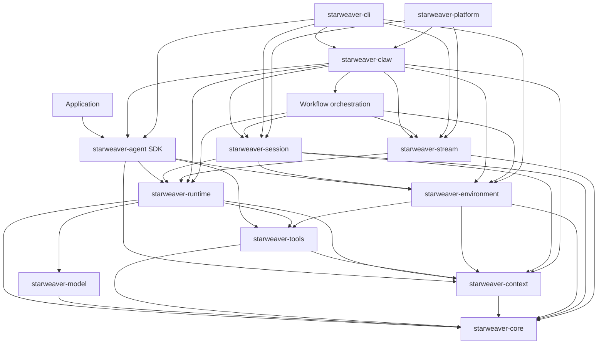

# Starweaver Architecture Specs

This directory defines Starweaver's long-lived architecture baseline. The new layout separates the core agent engine, the first-party SDK surface, and operational products so each layer can evolve with clear responsibilities and review gates.

Working evidence, reference comparisons, migration notes, and release TODOs live in `memos/`.

## Spec Map

### Core Agent Foundation

- `core/README.md` — core scope, contracts, and acceptance gates
- `core/01-agent-loop.md` — deterministic run loop, graph states, retries, streaming, and durable execution seam
- `core/02-model-provider-replay.md` — provider-neutral model protocol, replay fixtures, transport, settings, profiles, and CI gates
- `core/03-tools-output-capabilities.md` — tool schema, tool loop, structured output, output functions, validators, hooks, and capability bundles
- `core/04-context-state-executor.md` — `AgentContext`, `StateStore`, events, messages, notes, usage, checkpoints, and executor preparation
- `core/05-pydantic-ai-feature-map.md` — Pydantic AI feature coverage map across agents, providers, tools, output, streaming, and testing

### First-Party Agent SDK

- `sdk/README.md` — SDK product boundary and application-facing contract
- `sdk/01-agent-sdk-app.md` — `AgentBuilder`, `AgentApp`, `AgentSession`, policy presets, app composition, and docs surface
- `sdk/02-environment-provider.md` — `EnvironmentProvider`, filesystem, shell, resources, environment state, policies, and sandbox mapping
- `sdk/03-first-party-tool-bundles.md` — filesystem, shell, search, media, task, skill, and tool-proxy bundles implemented through capabilities and context
- `sdk/04-subagents-skills.md` — serializable subagent specs, delegation lifecycle, inherited tools, skills, and nested coordination
- `sdk/05-sdk-integration-map.md` — SDK integration map for agents, context, filters, environment, toolsets, subagents, media, and presets

### Operations, Durability, and Products

- `ops/README.md` — operational layer scope and readiness model
- `ops/01-ci-readiness.md` — replay CI, docs examples, feature coverage matrix, and release acceptance gates
- `ops/02-shared-execution-components.md` — shared session storage and stream protocol contracts for CLI and Claw
- `ops/03-durable-service-runtime.md` — durable sessions, SessionStore, stream archive, resume, interruption, SSE, display-message replay, and storage contracts
- `ops/04-cli-product.md` — CLI-first product surface with headless stdio display streams, session restore from display messages, AGUI-compatible rendering, launcher dispatch, and GitHub install/update flow
- `ops/05-observability.md` — OpenTelemetry GenAI tracing, Langfuse-friendly OTLP export, nested agent/model/tool spans, and trace-to-session correlation
- `ops/06-workflow-orchestration.md` — Claw-owned workflow definitions, runs, node runs, events, toolset, schedules, and workflow console semantics

## System Shape

## Layer Principles

- `starweaver-core` defines shared identifiers, metadata, usage, serializable envelopes, and cross-layer contracts.
- `starweaver-model` owns provider protocol translation, profiles, request settings, transports, replay fixtures, and production-request guards.
- `starweaver-tools` owns provider-neutral tool definitions, toolsets, execution context, tool metadata, retries, approval/deferred metadata, and MCP foundations.
- `starweaver-context` owns lifecycle context, typed dependencies, state, events, message bus, notes, usage, and exportable runtime evidence.
- `starweaver-runtime` owns deterministic agent loop semantics: model request, tool execution, output handling, retry, streaming, history, capability hooks, and checkpoint emission.
- `starweaver-agent` is the first-party SDK facade for app builders, sessions, presets, subagents, capabilities, environment-backed tool bundles, and policy ergonomics.
- `starweaver-environment` provides file, shell, process, resource, sandbox, and environment state abstractions through an `EnvironmentProvider` boundary.
- `starweaver-session` is the shared durable session crate for input parts, `SessionStore` traits, session/run records, resume snapshots, approvals, deferred records, and compact trace projections.
- `starweaver-stream` is the shared display and replay stream crate for display messages, replay event logs, replay transports, realtime compaction buffers, stream archives, and protocol envelopes used by CLI, Claw, and platform adapters.
- `starweaver-claw` persists and resumes sessions through concrete adapters over stable context, environment, event, checkpoint, trace, display-message, shared `SessionStore`, and stream contracts; it owns workflow orchestration resources, executor coordination, schedules, and workflow APIs.
- `starweaver-cli` is a product surface over the SDK, environment providers, shared session/stream contracts, CLI-owned config, and terminal renderers.
- `starweaver-platform` hosts external protocol adapters such as A2A and AGUI over SDK, service, session, display-message, event, stream, and trace contracts. Pydantic AI's A2A and AGUI examples serve as adapter demos for this layer.

## Reference Coverage Targets

The core layer tracks Pydantic AI concepts:

- agents, dependencies, outputs, capabilities, hooks, message history, direct runs
- model providers, settings, request parameters, profiles, native tools, thinking, retries, gateway routing
- function tools, advanced tools, toolsets, deferred tools, common tools, third-party tools, MCP
- streaming events, graph iteration, structured output, testing, and multi-agent patterns

The SDK layer tracks application-facing agent concepts:

- agent construction, streaming runs, context, resumable state, message bus, notes, tasks, usage snapshots
- lifecycle hooks, stream cancellation/resume, compaction, guards, model wrappers, presets
- environment providers, local/process/sandbox execution, virtual file operators, shell sandbox integration
- shared `SessionStore`-backed durable services, stream replay transports, run trace projection, session tools, execution records, and workspace binding evidence
- OpenTelemetry GenAI traces, external root trace propagation, Langfuse-friendly OTLP export, and nested subagent spans
- first-party toolsets, skill loading, media handling, tool proxy, subagents, unified delegation

## Maintenance Rules

- Use English in spec and memo files.
- Prefer mermaid diagrams for flows.
- Keep reference evidence and implementation snapshots in `memos/`.
- Update `AGENTS.md`, `README.md`, and CI when spec structure, validation commands, or crate boundaries change.
- Public APIs graduate from specs after their responsibilities, call sites, test fixtures, and docs examples are clear.
