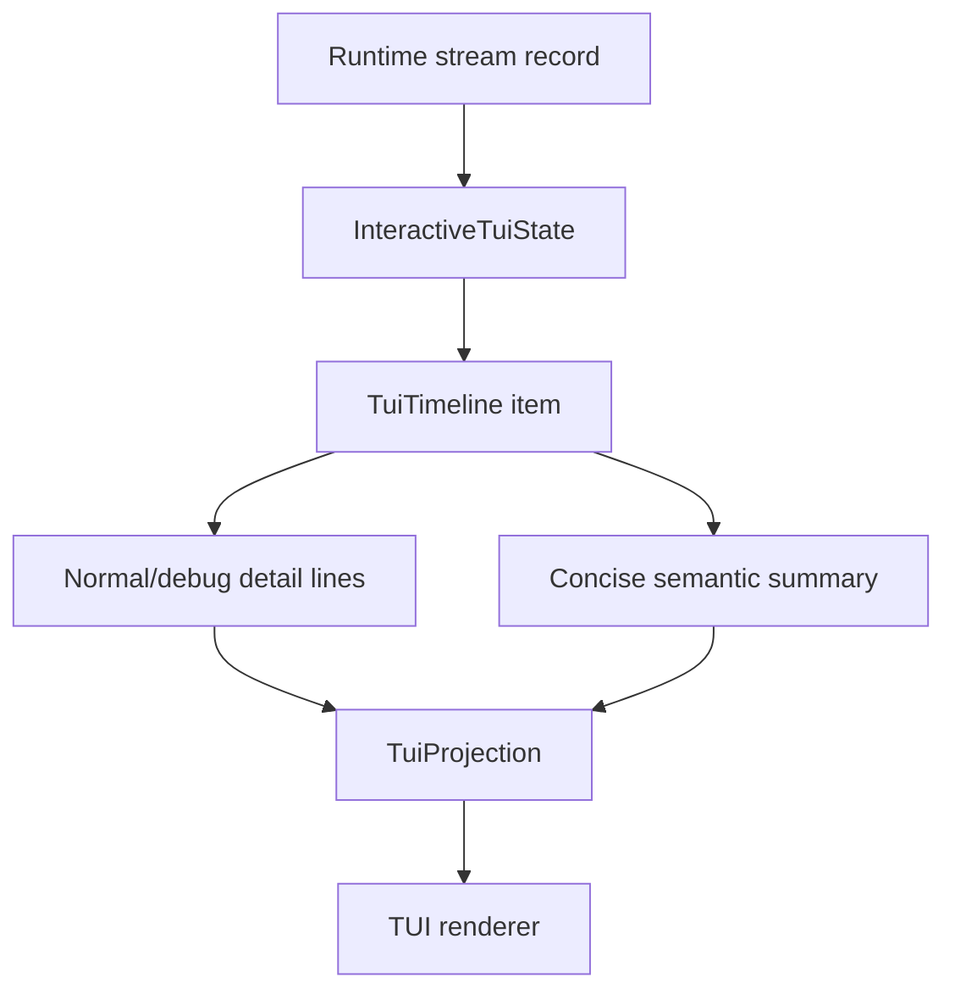
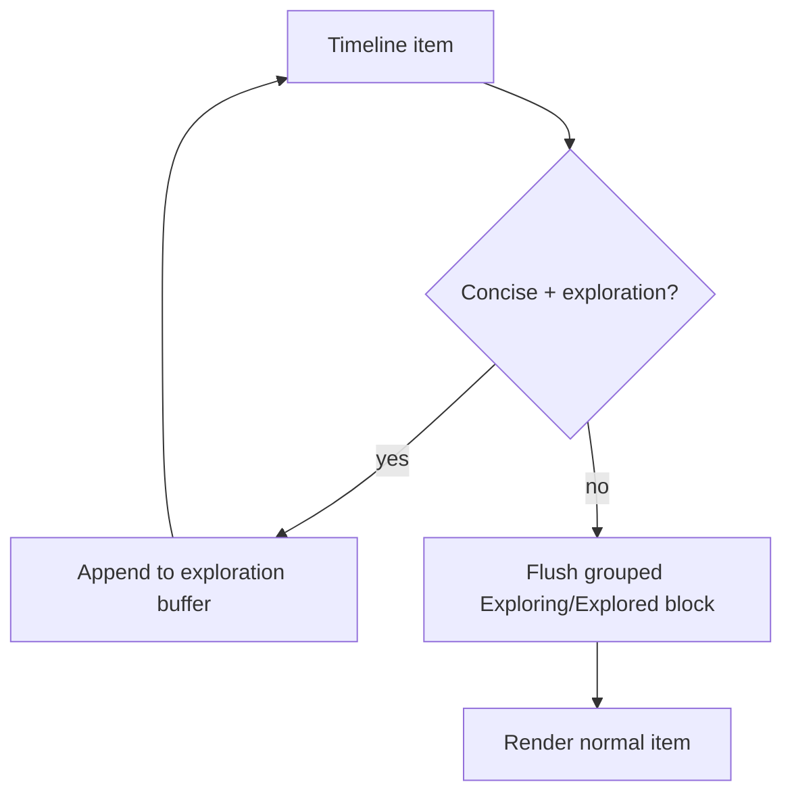

# CLI Concise Mode UX Plan

## Intent

Concise TUI rendering must preserve user trust while reducing transcript noise. The current implementation treats `concise` as an omission filter for ordinary tools. The target behavior is semantic compression: ordinary activity remains visible as compact evidence, while detailed outputs stay available in `normal`, `debug`, persisted stream records, and replay surfaces.

## Product Principle

`concise` means summarized, not hidden.

The primary transcript should answer these questions without forcing users to switch modes:

- What did the agent do?
- Did it inspect files, run commands, mutate files, call subagents, or request approval?
- Did anything fail?
- What is still running?

It should not show full tool payloads, long stdout/stderr, or large file excerpts by default. Assistant text and thinking remain live transcript content, not tool activity to be folded.

## Current Implementation Baseline

Relevant implementation files:

- `crates/starweaver-cli/src/tui/timeline.rs`
  - Owns `TuiTimeline`, `TuiProjection`, `ToolTimelineItem`, render-mode projection, adjacent exploration grouping, and semantic active-tool labels.
  - Concise projection keeps assistant text and thinking visible while summarizing ordinary tool activity.
- `crates/starweaver-cli/src/tui/state/streaming.rs`
  - Converts runtime stream records into timeline items.
  - Owns active model tail segmentation, tool-call insertion, tool-return completion, HITL panel updates, task panel updates, and tool visibility classification.
- `crates/starweaver-cli/src/tui/state/formatting.rs`
  - Owns shared text compaction, sanitization, and tool display helpers.
- `crates/starweaver-cli/src/tui/state/formatting/tool_returns.rs`
  - Owns detailed normal-mode tool-return rendering.
- `crates/starweaver-cli/src/tui/tests.rs`
  - Contains current concise-mode tests that assert ordinary tools are hidden.
- `docs/cli.md`
  - Currently documents concise mode as hiding ordinary tools.

Reference UX from Codex:

- `refs/codex/codex-rs/tui/src/exec_cell/render.rs`
  - Shows `Running` / `Ran` command summaries.
  - Groups read/list/search operations as `Exploring` / `Explored`.
  - Shows limited output head/tail for failures or important command output.
- `refs/codex/codex-rs/tui/src/history_cell/messages.rs`
  - Shows reasoning summaries as compact dim/italic content; this part is not copied because Starweaver concise mode keeps thinking streaming directly.
- `refs/codex/codex-rs/tui/src/history_cell/search.rs`
  - Shows web activity as `Searching the web` / `Searched the web`.
- `refs/codex/codex-rs/tui/src/history_cell/mcp.rs`
  - Shows tool activity as `Calling` / `Called` plus compact details.

## Target UX Contract

### Event Stream Contract

The live TUI transcript is event-order preserving. Runtime events update the timeline using only these model-content operations:

1. Append a new item at the timeline tail.
2. Append content to the current active model tail segment when the next model delta has the same kind and part index.
3. Finish the active model segment before inserting non-model transcript events such as tool calls, tool returns, context events, subagent cards, system notices, or run status lines.

A later text or thinking event must not update an older non-tail text/thinking item. If a tool, context event, subagent card, or different model-content kind appears between two deltas, the later delta creates a continuation segment after that intervening item. Projection can fold only adjacent compatible timeline items, such as neighboring exploration tools in concise mode; it must not reorder items or group across assistant text, thinking, mutation tools, subagents, summaries, compactions, or context boundaries.

`PartStart` updates status only and does not create empty transcript content. Text and thinking transcript items are created lazily when actual delta or final response content arrives. `FinalResult` fallback appends missing response parts in response order instead of extracting all text first.

### Render Modes

| Mode      | Contract                                                                                       |
| --------- | ---------------------------------------------------------------------------------------------- |
| `normal`  | Full user-facing transcript: assistant text, thinking, tool calls, and formatted tool returns. |
| `concise` | Assistant text and thinking stream normally; tool activity is summarized and folded.           |
| `debug`   | `normal` plus diagnostic identifiers and internal visibility/status details.                   |

### Concise Transcript Rules

| Event kind                | Concise behavior                                                                                 |
| ------------------------- | ------------------------------------------------------------------------------------------------ |
| User prompt               | Show as today.                                                                                   |
| Assistant text            | Show full assistant text as today.                                                               |
| Thinking/reasoning        | Stream normally, same as normal mode; never replace it with static `Thinking` / `Reasoned`.      |
| Ordinary read/search/list | Show one-line semantic activity; group adjacent exploration tools in the later grouping phase.   |
| Ordinary shell command    | Show `Running` / `Ran` summary with command preview; show short failure output on non-zero exit. |
| File mutation tools       | Always show concise mutation summary; include target path and operation count when possible.     |
| Generic ordinary tools    | Show `Called <tool>` / `Calling <tool>` plus argument preview when available.                    |
| Tool failures             | Always show summary plus short error/detail preview.                                             |
| Approval-required tools   | Show a concise decision-required summary plus bounded details; do not fall back to full payload. |
| Deferred tools            | Show deferred-call summary plus bounded details; do not fall back to full payload.               |
| Task-panel tools          | Keep footer/task panel behavior; also leave a compact task activity summary in transcript.       |
| Subagents                 | Show status line and final Markdown as today; keep the existing full display style.              |
| Summary/compaction        | Show as today; keep the existing full display style.                                             |
| Goal events               | Keep visible as important run-state events.                                                      |
| Other context events      | Continue hiding low-value generic events in concise unless reclassified as important.            |
| System notices            | Show info/warning/error notices as today.                                                        |

### Example Target Output

```text
User: review concise UX

Assistant:
  I will inspect the current implementation and compare Codex.

> Inspecting the TUI render mode path

Explored
  Search TuiRenderMode::Concise in crates/starweaver-cli/src/tui
  Read timeline.rs, streaming.rs, tests.rs
  Read refs/codex/codex-rs/tui/src/exec_cell/render.rs

Assistant:
  Current concise mode hides ordinary tool evidence. The target should summarize it.
```

For command failure:

```text
Ran cargo check -p starweaver-cli — failed exit 101
  error[E0425]: cannot find function `concise_tool_summary`
```

For mutation:

```text
Edited crates/starweaver-cli/src/tui/timeline.rs — 2 edits
Wrote docs/cli.md
```

## Architecture Plan

Keep the existing `TuiTimeline -> TuiProjection` architecture. Do not introduce Codex-style `HistoryCell` as a large rewrite. Add semantic summary metadata to existing timeline items and change concise projection rules.



### Data Model Changes

The timeline keeps event order as the source of truth. Model text/thinking streaming is represented by one active tail segment rather than type-specific current pointers.

```rust
struct ActiveModelSegment {
    item_id: TuiItemId,
    kind: ActiveModelSegmentKind,
    part_index: Option<usize>,
}
```

Only this active segment may receive further text. If it is not the timeline tail, or if the next event has a different kind or part index, the current segment is finished and a new item is appended.

Extend `ToolTimelineItem` with concise-rendering data. Keep normal-mode fields intact.

```rust
pub(super) struct ToolTimelineItem {
    pub call_id: String,
    pub name: String,
    pub args_preview: Option<String>,
    pub call_line: String,
    pub status: ToolActivityStatus,
    pub return_lines: Vec<String>,
    pub visibility: ToolVisibility,
    pub concise: ToolConciseSummary,
}

pub(super) struct ToolConciseSummary {
    pub line: String,
    pub detail_lines: Vec<String>,
    pub category: ToolSummaryCategory,
    pub importance: ToolSummaryImportance,
}

pub(super) enum ToolSummaryCategory {
    Exploration,
    Shell,
    Mutation,
    Task,
    Subagent,
    Generic,
}

pub(super) enum ToolSummaryImportance {
    Low,
    Normal,
    Important,
}
```

The exact enum names can be adjusted during implementation, but the separation is important:

- `category` enables future grouping.
- `importance` tells concise projection whether to show details beyond one line.
- `line` is always safe for concise display.
- `detail_lines` are bounded snippets for failures, mutations, approvals, or other important cases.

### Thinking Projection Changes

Keep thinking projection shared across render modes:

```rust
fn project_thinking(text: &str, streaming: bool, mode: TuiRenderMode, projection: &mut TuiProjection)
```

Behavior:

- `normal` / `debug`: current blockquote rendering.
- `concise`: the same blockquote rendering, including streaming deltas.
- Do not show a static `Thinking` placeholder while reasoning is streaming.
- Do not rewrite completed thinking as `Reasoned: ...`.

This keeps the live UI responsive: if the model is producing thinking tokens, the transcript visibly changes.

### Tool Summary Generation

Generate or refresh summaries at two points:

1. Tool call creation/update:
   - Initial line should represent active work, e.g. `Calling <tool> ...`, `Running <command>`, `Reading <path>`.
2. Tool return completion:
   - Final line should represent completed work, e.g. `Called <tool>`, `Ran <command>`, `Read <path>`, `Edited <path>`.
   - For failures, include a compact detail snippet.

Add helpers near existing formatting code, likely under `crates/starweaver-cli/src/tui/state/formatting/tool_summaries.rs` or inside `timeline.rs` if the first implementation is small.

Recommended module shape:

```text
crates/starweaver-cli/src/tui/state/formatting/tool_summaries.rs
  summarize_tool_call(...)
  summarize_tool_return(...)
  summarize_shell_tool(...)
  summarize_file_read_tool(...)
  summarize_mutation_tool(...)
  summarize_task_tool(...)
  summarize_generic_tool(...)
```

Use existing helpers where possible:

- `compact_status_text`
- `value_args_preview`
- `shell_command`
- `file_path_arg`
- `preview_lines`
- `tool_duration_label`
- `is_task_tool_name`

If private helpers in `tool_returns.rs` are needed, either move them to a shared formatting module or add small public(super) summary-specific variants. Avoid duplicating complex formatting logic unless the duplicate is intentionally simpler.

### Tool Classification Rules

| Category    | Tool names / detection                                                                  | Summary examples                                                          |
| ----------- | --------------------------------------------------------------------------------------- | ------------------------------------------------------------------------- |
| Exploration | `view`, `ls`, `glob`, `grep`, `search`, `scrape`, `fetch` when no write side effect     | `Read path`, `Listed path`, `Searched pattern in root`, `Fetched url`     |
| Shell       | `shell_exec`, `shell_wait`, `shell_status`, `shell_input`, `shell_signal`, `shell_kill` | `Running <cmd>`, `Ran <cmd>`, `Waited for <process>`, `Stopped <process>` |
| Mutation    | `edit`, `multi_edit`, `write`, future apply-patch style tools                           | `Edited path — 2 edits`, `Wrote path`, `Appended path`                    |
| Task        | `task_create`, `task_update`, `task_get`, `task_list`                                   | `Created task ...`, `Updated task ...`, `Listed tasks`                    |
| Generic     | Any other ordinary tool                                                                 | `Calling <name> <args>`, `Called <name>`                                  |
| Important   | Error, approval, deferred, mutation, shell failure                                      | Always show detail snippet when available.                                |

### Concise Projection Rules

Change `project_tool` from hide/show to render-mode-specific projection.

```rust
fn project_tool(tool: &ToolTimelineItem, mode: TuiRenderMode, projection: &mut TuiProjection) {
    update_active_tool_label(tool, projection);

    match mode {
        TuiRenderMode::Normal => project_tool_full(tool, projection, false),
        TuiRenderMode::Debug => project_tool_full(tool, projection, true),
        TuiRenderMode::Concise => project_tool_concise(tool, projection),
    }
}
```

`project_tool_concise`:

- Always render `tool.concise.line` for ordinary completed/running tools.
- Render `tool.concise.detail_lines` for important summaries.
- For `ApprovalRequired`, `Deferred`, and `ErrorImportant`, render the concise summary plus bounded detail lines.
- Do not fall back to full `Tool call:` / `Tool result:` payloads in concise mode for tools.
- For `TaskPanel`, render a compact activity line but keep detailed task list in the footer panel.

### Exploration Grouping Phase

Implement grouping after one-line summaries are stable.

First implementation can be projection-only:



Grouping contract:

- Group adjacent `ToolSummaryCategory::Exploration` tools.
- Running group header: `Exploring` if any item is running.
- Completed group header: `Explored` if all grouped items completed successfully.
- Failed group header: either split failed item out or use `Explored with errors` and show failed detail.
- Group body lines should be short and deduplicated where safe:
  - multiple `view` calls: `Read a.rs, b.rs`
  - search calls: `Search <pattern> in <root>`
- Do not group mutations, approvals, deferred tools, or failures with low-value exploration if that would hide importance.

This phase is optional for the first code change if time is limited, but the data model should be designed to support it.

## Implementation Phases

### Phase 1: Semantic Summaries Without Grouping

Goal: concise mode no longer hides ordinary tools.

Steps:

1. Add summary data to `ToolTimelineItem` and constructors in `streaming.rs`.
2. Add summary helper functions for tool calls and returns.
3. Update `update_tool_call` and `finish_tool_call` to refresh summaries.
4. Change `project_tool` so concise mode renders summary lines instead of returning early.
5. Keep thinking projection streaming in concise mode, matching normal blockquote behavior.
6. Keep normal/debug output byte-for-byte as close as possible to current behavior.
7. Update focused tests around render-mode reprojection.

Expected user-visible improvement:

- Existing ordinary tool activity leaves a compact transcript line.
- Errors and important control-flow remain visible.
- Footer active-tool label still works.

### Phase 2: Stronger Tool-Specific Summary Quality

Goal: concise summaries read like user-facing activity, not raw tool names.

Steps:

1. Improve shell summaries with command extraction and exit status.
2. Improve file summaries for `view`, `glob`, `grep`, `ls`, `fetch`, `scrape`.
3. Improve mutation summaries for `edit`, `multi_edit`, and `write`.
4. Add bounded detail snippets for failures.
5. Add snapshot-like tests for each tool category.

Expected examples:

```text
Read crates/starweaver-cli/src/tui/timeline.rs
Searched TuiRenderMode::Concise in crates/starweaver-cli/src/tui
Ran make check — failed exit 101
Edited crates/starweaver-cli/src/tui/timeline.rs — 2 edits
```

### Phase 3: Exploration Grouping

Goal: reduce transcript clutter for repeated read/search/list operations.

Steps:

1. Add projection-time grouping for adjacent `Exploration` summaries.
2. Deduplicate repeated reads by target label.
3. Keep failed exploration calls visible with detail lines.
4. Add tests for grouping boundaries:
   - exploration + exploration groups
   - exploration + assistant text flushes group
   - exploration + mutation flushes group
   - running exploration group shows `Exploring`
   - completed exploration group shows `Explored`

### Phase 4: Documentation and UX Copy

Goal: docs describe the new contract accurately.

Steps:

1. Update `docs/cli.md` display mode section.
2. Replace `concise hides ordinary tool calls` with semantic compression language.
3. Document that live TUI projection is event-order preserving and folds only adjacent compatible activity.
4. Mention that active tool labels reuse the same semantic concise summary line rather than raw tool payloads.
5. Mention that full evidence is preserved in normal/debug, stored replay records, and session replay.

### Phase 5: Validation

Recommended commands:

```bash
cargo test -p starweaver-cli tui::tests::render_modes_reproject_tool_visibility_and_active_tool_status
cargo test -p starweaver-cli tui::tests::concise_keeps_context_events_and_summarizes_approval_required_tools
cargo test -p starweaver-cli tui::tests::display_command_switches_mode_and_reprojects_existing_timeline
cargo test -p starweaver-cli tui::tests::subagent_output_is_full_markdown_in_normal_and_concise
make fmt-check
make check
```

If implementation touches shared stream/session contracts, also run:

```bash
make test
```

## Test Plan

### Replace Existing Hidden-Tool Assertions

Current tests assert ordinary tools disappear in concise mode. Replace with assertions that:

- normal mode shows full `Tool call` and `Tool result` lines.
- concise mode hides verbose `Tool result` detail lines for ordinary successes.
- concise mode shows summary line, e.g. `Called lookup {"query":"mode"}` or equivalent final copy.
- active running tool still appears in footer.
- switching back to normal reprojects the original full details.

### Add Category Tests

Add targeted tests for:

- concise thinking streams as blockquote
- concise shell success
- concise shell failure with bounded output
- concise view/read summary
- concise grep/search summary
- concise edit/write summary
- concise generic tool summary
- concise approval-required tool shows summary plus bounded detail without full payload
- concise deferred tool shows summary plus bounded detail without full payload
- concise task tool leaves summary and panel
- concise subagent output remains Markdown-rendered

### Add Grouping Tests in Phase 3

Add tests for:

- adjacent exploration tools grouped
- grouping stops at assistant text
- grouping stops at mutation
- failed exploration call remains important
- normal/debug remain ungrouped full detail

## Acceptance Criteria

Phase 1 is complete when:

- `concise` no longer drops ordinary tool activity from transcript.
- Ordinary successful tools render at least one concise summary line.
- Ordinary tool result bodies remain suppressed in concise unless important.
- Failed tools, approvals, deferred calls, and mutations remain visible through summaries and bounded details.
- Switching display modes reprojects existing timeline correctly.
- Existing normal/debug behavior remains intact except for intentional debug additions.
- Docs no longer describe concise as hiding ordinary tools.

Full plan is complete when:

- Exploration tools are grouped into `Exploring` / `Explored` blocks.
- Common first-party tools have semantic user-facing summary copy.
- Active tool labels use semantic concise summary copy.
- Text/thinking/tool/context/subagent events preserve timeline order through active tail segmentation.
- Tests cover all summary categories, grouping boundaries, and model-content ordering boundaries.
- `make fmt-check` and `make check` pass.

## Risks and Mitigations

| Risk                                               | Mitigation                                                                                     |
| -------------------------------------------------- | ---------------------------------------------------------------------------------------------- |
| Summary copy leaks too much raw payload            | Use compact previews, bounded line counts, and existing sanitization helpers.                  |
| Concise mode becomes too noisy                     | Add grouping and suppress detail lines for low-importance successful tools.                    |
| Normal/debug behavior regresses                    | Keep full detail fields untouched and add tests that switch modes back and forth.              |
| Summary helper duplicates detailed formatter logic | Share small path/command extraction helpers; keep concise formatting intentionally simpler.    |
| Task panel duplicates too much information         | Show one transcript summary line; keep task list details in footer panel.                      |
| Thinking projection appears stuck                  | Stream thinking blockquote content in concise mode; never replace it with static placeholders. |

## Non-Goals

- Replacing `TuiTimeline` with Codex-style `HistoryCell`.
- Changing runtime stream event contracts.
- Changing stored display message contracts.
- Adding interactive expand/collapse controls in this batch.
- Rendering full raw tool payloads inside concise mode.

## Future Extensions

- Add an explicit transcript/raw overlay command if the TUI needs a copy-friendly full evidence view.
- Add per-tool user preferences for concise detail verbosity.
- Add terminal styling for concise summary categories after the semantic contract stabilizes.
- Add structured display-message projections so Desktop can reuse the same summary model.
