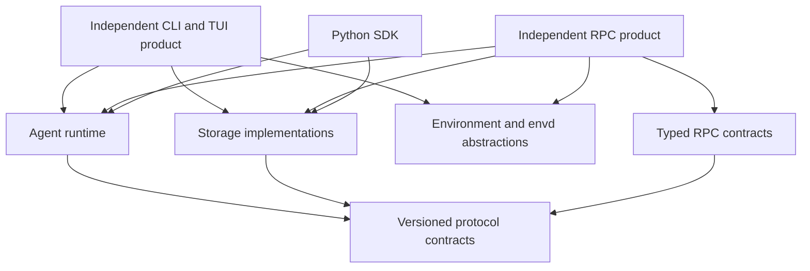

# Architecture and Implementation Review

Date: 2026-07-11

Status: accepted implementation and validation baseline

Scope: workspace architecture, normative specs, Rust implementation, Python SDK, CLI/RPC product surface, durability, and validation strategy.

## Executive Summary

Starweaver has a broad, working implementation and a strong functional test base. The workspace builds cleanly, strict Clippy checks pass, and the full Rust test suite passes. The main risk is not missing functionality. The main risk is that product breadth and public-contract growth have outpaced boundary hardening.

Three issues should block further feature expansion until they are addressed:

1. `ShellPolicy::allowed_programs` does not safely constrain commands executed through `shell -lc`; compound shell syntax can bypass the intended program allowlist.
2. The HTTP RPC server can bind to non-loopback addresses without server authentication, while exposing state-changing and execution-capable methods.
3. Shared SQLite durable operations update multiple records without a transaction, allowing partial checkpoint, cursor, run, or session state after failure.

The next architectural priority is consolidation, not another abstraction layer:

- converge the duplicate CLI and shared SQLite implementations;
- migrate RPC ownership out of CLI while keeping CLI/TUI and standalone RPC fully independent product surfaces over lower shared libraries;
- define versioned canonical run, input, stream, and durable-state contracts;
- split `AgentContext` into durable state, runtime state, and host capabilities;
- reduce the stable facade exposed by Rust and Python.

A big-bang rewrite is not recommended. The existing tests and public behavior should be used as characterization evidence while boundaries are moved incrementally.

## Review Baseline

The review used:

- workspace manifests and internal dependency metadata;
- `spec/`, including core, SDK, environment, envd, operations, alignment, Python, and Claw documents;
- critical Rust paths in runtime, environment, storage, stream, session, CLI, and RPC;
- the PyO3 extension and Python facade;
- current repository validation commands.

Validation executed on the review commit:

```text
make check: passed
make test: passed
```

The repository was clean before the review. No implementation code was changed by the review.

## Current Strengths

- The workspace has no Cargo dependency cycle.
- `unsafe_code` is forbidden and strict Clippy lints are enabled.
- Model/provider mapping, request replay, runtime behavior, stream projection, tools, and SDK composition have substantial functional test coverage.
- Model audit hooks omit payloads by default, and sensitive request fields have deliberate redaction behavior.
- OAuth persistence uses locking, temporary files, durable flushes, and private Unix permissions.
- Cooperative cancellation reaches model streams and tool execution.
- Trace spans use a drop guard to reduce lifecycle leaks on early returns.
- The specs contain many useful invariants and implementation references, even though their normative status needs consolidation.

## Architecture Snapshot

The workspace contains 20 packages and roughly 204,000 Rust and Python source/test lines. High-level crates have broad dependency fans:

- `starweaver-cli` directly depends on 16 Starweaver crates;
- `starweaver-agent` directly depends on 10 Starweaver crates;
- `starweaver-rpc` depends on the complete CLI crate;
- `starweaver-session` depends on runtime, context, and environment implementations;
- `starweaver-stream` depends on context, model, runtime, and usage;
- `starweaver-context` depends on the model protocol.

Several critical modules are already above 1,500 lines:

- `crates/starweaver-cli/src/runtime_coordinator.rs`
- `crates/starweaver-cli/src/rpc.rs`
- `crates/starweaver-model/src/providers/client/adapter_impl.rs`
- `crates/starweaver-agent/src/session.rs`
- `crates/starweaver-runtime/src/agent/run_loop.rs`
- `crates/starweaver-cli/src/runner.rs`
- `crates/starweaver-agent/src/subagent/registry.rs`

File size alone is not a defect, but these files also combine multiple lifecycle and ownership responsibilities. The repeated `too_many_lines`, `too_many_arguments`, and related allowances are evidence that the current decomposition is no longer containing change.

## Critical Findings

### C1. Shell allowlist bypass through compound shell syntax

Evidence:

- `crates/starweaver-environment/src/policy.rs:73-82`
- `crates/starweaver-environment/src/shell.rs:67-75`
- `crates/starweaver-environment/src/local_provider.rs:565-585`
- `crates/starweaver-environment/src/local_provider/process.rs:41-54`

The policy checks only the first whitespace-delimited token, while execution passes the full command to `shell -lc`. An allowlist containing `git` therefore also permits inputs such as:

```sh
git status; forbidden-command
git status && forbidden-command
git $(forbidden-command)
```

This is an authorization-boundary failure, not merely incomplete validation.

Required direction:

- introduce a structured direct-execution command with executable and argument fields;
- apply executable allowlists only to direct execution;
- make arbitrary shell execution a separate, explicitly dangerous capability;
- add process-group termination, output limits, concurrency limits, and secret-safe environment handling at the same boundary.

Acceptance evidence:

- compound-command bypass tests fail closed;
- an allowlisted direct executable cannot invoke a second executable through shell grammar;
- timeout/cancellation terminates descendants, not only the immediate shell;
- snapshots and stream records do not contain secret environment values.

### C2. Unauthenticated HTTP RPC can expose local execution authority

Evidence:

- `crates/starweaver-cli/src/args.rs:600-611`
- `crates/starweaver-cli/src/rpc/transport.rs:58-73`
- `crates/starweaver-cli/src/rpc/transport.rs:107-142`
- `crates/starweaver-cli/src/rpc.rs:219-272`

The server accepts an arbitrary bind host but has no server-side authentication. Exposed methods include session deletion, run start/cancel/steer, approval decisions, configuration and diagnostics reads, and shutdown. Downstream envd `authToken` values do not authenticate access to the Starweaver RPC server.

Required direction:

- reject non-loopback binds unless an explicit server authentication policy is configured;
- add bearer-token or operating-system-local transport authentication;
- separate read, run, approval, administration, and shutdown permissions;
- use a mature bounded HTTP transport or add strict connection, header, body, and idle limits;
- require TLS or an authenticated reverse proxy for non-loopback TCP.

Acceptance evidence:

- non-loopback bind without authentication is rejected;
- invalid credentials cannot call any state-changing method;
- read-only credentials cannot start runs or decide approvals;
- shutdown requires administrative authority;
- slow clients cannot consume unbounded threads.

### C3. Durable SQLite operations are not atomic

Evidence:

- `crates/starweaver-storage/src/session_store/impl_store.rs:138-193`
- `crates/starweaver-storage/src/session_store/impl_store.rs:217-255`
- `crates/starweaver-storage/src/stream_archive.rs:69-93`
- `crates/starweaver-storage/src/stream_archive.rs:134-157`

Logical durable operations span multiple SQL statements without a transaction. Examples include checkpoint insertion plus run update, stream insertion plus run/session cursor updates, and run status plus session-head updates.

A crash, disk-full error, serialization error, or failed statement can leave evidence that cannot be resumed consistently. In the worst case, a retry may repeat an external tool side effect because the checkpoint and run state disagree.

Required direction:

- replace multi-call CRUD composition with atomic domain operations;
- serialize a complete batch before opening its transaction;
- use `TransactionBehavior::Immediate` where write ordering matters;
- define idempotency keys and retry semantics for checkpoints, tool effects, and stream batches;
- run fault injection after each write boundary.

Acceptance evidence:

- every injected failure leaves either the complete old state or complete new state;
- run, session, checkpoint, and cursor records cannot disagree after database reopen;
- duplicate idempotency keys never publish a different live event from the persisted event.

## High-Priority Architecture Findings

### H1. Host/RPC ownership is inverted

Evidence:

- `spec/README.md:157`
- `spec/ops/02-shared-execution-components.md:28-31`
- `crates/starweaver-rpc/Cargo.toml:18-20`
- `crates/starweaver-cli/src/rpc.rs:123-319`

The intended architecture describes a standalone host-control process, but the implementation is:

```text
starweaver-rpc -> starweaver-cli
```

RPC dispatch, run coordination, storage access, and environment attachment management remain in the CLI product crate.

Target direction:



`starweaver-cli` and `starweaver-rpc` must not depend on each other. RPC method handlers, active-run state, authorization, and transport lifecycle move into `starweaver-rpc`; CLI/TUI retains its own coordinator. Product-neutral storage, stream, lifecycle, environment, and envd helpers move to their lower owning crates and can be reused independently.

### H2. CLI and shared storage maintain parallel databases

Evidence:

- `crates/starweaver-cli/src/local_store.rs`
- `crates/starweaver-cli/src/local_store/db.rs`
- `crates/starweaver-storage/`
- `crates/starweaver-cli/Cargo.toml`

The CLI directly owns `rusqlite`, schema, migrations, session persistence, replay, stream archives, and HITL records while `starweaver-storage` implements a second version. Fixes and migrations do not automatically reach both paths.

Target direction:

- one schema and migration registry;
- one set of atomic storage domain operations;
- product-specific CLI state stored above the shared contracts;
- the same store contract tests executed against memory, shared SQLite, and any CLI adapter;
- remove direct `rusqlite` ownership from CLI after migration compatibility is proven.

### H3. Canonical model input and durable input are different, with a JSON escape hatch

Evidence:

- `spec/core/06-message-request-abstractions.md:19-31`
- `crates/starweaver-model/src/message/request_parts.rs:79-145`
- `crates/starweaver-session/src/input.rs:43-112`
- `crates/starweaver-agent/src/runtime.rs:1070-1088`

`ContentPart` and `InputPart` are both presented as canonical at different layers. Several `ContentPart` variants are persisted through `InputPart::Mode { mode: "content_part", config: ... }`, even where an explicit durable variant exists.

Target direction:

- select one canonical input AST, or define a deliberately separate versioned durable wire AST;
- implement explicit, exhaustive, lossless conversions;
- remove undeclared secondary protocols hidden in generic `mode/config` fields;
- keep CLI commands and planning modes at the product edge rather than in the neutral session foundation.

### H4. `AgentContext` is a cross-layer state container

Evidence:

- `crates/starweaver-context/src/agent_context.rs:24-160`
- `crates/starweaver-context/src/resumable_state.rs:102-204`

The context combines identity, model history, subagent state, shell environment, approvals, tasks, notes, tool-search state, stream queues, configuration, usage, buses, traces, persistence fields, generic metadata, and runtime-only dependencies.

This creates a broad serialization surface and forces context, tools, runtime, session, stream, and product bundles to understand one mutable object.

Target decomposition:

- `RunIdentity`
- `ConversationState`
- `ModelHistory`
- `ToolRuntimeState`
- `HostCapabilities`
- `RuntimeEphemeralState`
- `DurableContextSnapshot`

Tools should receive narrow handles for required capabilities instead of a clone of the complete context.

### H5. Durable and wire records are not explicitly versioned

Evidence:

- `crates/starweaver-context/src/resumable_state.rs:102-204`
- `crates/starweaver-runtime/src/run.rs:28-76`
- `crates/starweaver-session/src/records.rs`
- `crates/starweaver-stream/src/`

Core serialized records rely on additive Serde defaults but do not carry a schema version or migration envelope. The repository has released multiple versions in a short period and exposes these records through SQLite, replay, RPC, and Python.

Target direction:

- wrap durable records in a versioned envelope;
- define migration and unknown-version behavior;
- keep golden fixtures from previous releases;
- verify old-read/new-write behavior during release;
- distinguish stable wire DTOs from mutable runtime state.

### H6. Duplicate lifecycle and stream concepts require manual mappings

Evidence:

- `crates/starweaver-runtime/src/run.rs:10-26`
- `crates/starweaver-session/src/records.rs:27-48`
- `crates/starweaver-agent/src/runtime.rs:1051-1058`
- `crates/starweaver-agent/src/lib.rs:90-115`

Runtime and durable session layers both publish `RunStatus`; the facade exports one directly and aliases the other. Similar duplication exists among runtime streams, durable cursors, replay events, display messages, and RPC projections.

Target direction:

- create one stable lifecycle vocabulary in a low-level protocol boundary;
- represent durable-only states such as `Queued` by composition rather than copying every runtime state;
- centralize exhaustive conversions and test every variant.

### H7. The runtime loop and product coordinators combine too many responsibilities

Evidence:

- `crates/starweaver-runtime/src/agent/run_loop.rs:252-1795`
- `crates/starweaver-cli/src/runtime_coordinator.rs`
- `crates/starweaver-cli/src/rpc.rs:121-319`

The run loop coordinates preparation, model calls, retries, provider-stream resume, tools, HITL, context mutation, usage, tracing, checkpoints, and terminal events. Product coordination and RPC dispatch show similar concentration.

Target direction:

Model the runtime as explicit phases:

```text
PrepareRun
PrepareRequest
CallModel
ClassifyResponse
PrepareTools
ExecuteTools
AwaitExternal
Finalize
FailOrCancel
```

Each phase should produce a transition. Lifecycle cleanup should be enforced by guards rather than duplicated across early-return paths.

### H8. Rust and Python facades expose too much as stable API

Evidence:

- `crates/starweaver-agent/src/lib.rs:62-142`
- `packages/starweaver-py/python/starweaver/__init__.py`

The Rust facade re-exports a large part of nearly every internal crate. The Python package exports approximately 148 top-level symbols while control, async, storage, and stream semantics are still evolving. Most public Rust records remain exhaustive public structs/enums.

Target direction:

- define a small stable prelude;
- move advanced protocols under explicit namespaces;
- mark extensible Rust enums/records `#[non_exhaustive]` where appropriate;
- prefer private fields plus builders for mutable configuration contracts;
- classify Python symbols as stable, provisional, or internal;
- add Rust semver checks and Python API snapshot checks to release validation.

### H9. Python duplicates canonical stream projection

Evidence:

- `packages/starweaver-py/python/starweaver/stream_adapter.py`
- `crates/starweaver-stream/src/`

The Python adapter reconstructs display/projection behavior already owned by Rust. This creates two implementations of event naming, terminal semantics, attribution, and metadata handling.

Target direction:

- expose the canonical Rust projection through the native extension;
- keep Python adapters limited to ergonomic wrappers and framework-specific formatting;
- run shared golden fixtures through Rust, Python, CLI, and RPC projections.

## Additional Implementation Risks

### Blocking work inside async APIs

`rusqlite`, `std::fs`, process handling, blocking channels, and thread joins are used in async-facing paths. This can stall model streaming, cancellation, and concurrent sessions.

Use a dedicated SQLite actor or blocking executor. Moving only the mutex to an async mutex does not make SQLite non-blocking.

Implementation evidence (2026-07-12): SQLite-backed async trait operations and local environment filesystem, search, and foreground process operations move owned work onto Tokio's blocking pool with `spawn_blocking`. This boundary is safe on current-thread runtimes and inside `LocalSet`; focused tests cover that execution context. SQLite transaction ownership remains synchronous inside one blocking task and never crosses an await point.

### Process-tree cancellation

Timeouts kill the immediate shell process but do not guarantee descendant termination. Use Unix process groups and Windows Job Objects, and record termination-requested separately from termination-confirmed.

### Unbounded process and file resources

Shell output is read without a hard byte limit, and ranged file reads can load the whole file before slicing. Add byte caps, truncation metadata, seek/take-based reads, and concurrency semaphores.

Implementation evidence (2026-07-12): Local process execution shares a configurable concurrency limiter, captures stdout and stderr under independent hard byte caps while continuing to drain pipes, and records truncation, total-byte, and drain-timeout metadata. Unix process groups and Windows Job Objects terminate contained descendants on timeout/cancellation. Unix containment is explicitly process-group scoped because an arbitrary shell can deliberately create a new session; bounded reader joins ensure such an escape cannot indefinitely retain the blocking worker or execution permit, while untrusted shell authority still requires an external sandbox. `LocalEnvironmentProvider` text and byte reads use bounded `take`, ranged byte reads seek without materializing the prefix, and sparse-range plus oversized-read contract tests cover the configurable cap.

### Secret-bearing process metadata

Process snapshots can retain caller-provided environment variable values. Execution environment and observable metadata must be separate; secret-like values should never be serialized by default.

### Cancellation token equality

`crates/starweaver-core/src/cancellation.rs:71-77` compares unrelated tokens by current cancellation state. Equality should represent identity using `Arc::ptr_eq`, or the type should not implement `Eq`.

### Migration checksum verification

Migration checksums are recorded but not used to reject modified applied migrations. A database can be reported current even when migration SQL differs from the recorded schema history.

### Replay persistence and live publication

A duplicate sequence must not persist one event while publishing a different event to live subscribers. Persistence success and publication should share an idempotent append result.

### RPC blocking and timeout semantics

`run.await` performs blocking receive work from an async dispatcher and applies the timeout independently to each received event, so total elapsed wait may exceed `timeoutMs`. Use an async notification primitive and a single absolute deadline.

## Spec Governance Findings

### Conflicting implementation status

Feature maps and backlogs disagree about implemented capabilities, including active environment changes and model wrappers. Specs cannot currently answer implementation status reliably.

Introduce a single capability registry containing:

```text
capability id
owner
stability
status
normative spec
implementation path
contract tests or fixtures
last verified release
```

Generate feature maps and backlog views from that source.

### Normative specs mix current and future behavior

`spec/ops/06-json-rpc-host-protocol.md` is approximately 2,681 lines and combines implemented v1 behavior, future transports, reserved fields, daemon ideas, and unfinished acceptance conditions.

Split it into:

1. implemented normative protocol;
2. conformance matrix and golden fixtures;
3. future RFCs.

Apply the same pattern to sandbox design and product-specific Claw plans.

### Environment ownership is duplicated

SDK, environment, envd, and host-control specs each restate parts of the provider contract and mapping. Make `spec/environment/01-sdk-provider-contract.md` the normative provider contract. SDK docs should describe composition; envd specs should describe the service; host specs should describe attachment wire behavior.

### Acceptance evidence is too broad

Many acceptance sections use `make test` or subjective statements instead of naming invariants and exact tests. Each stable contract should identify its owning type, invariant, fixture/test, validation command, and status.

### CI wording is inconsistent

The operations spec describes `make ci` as the full local gate, while coverage is included only through `make ci-all`. Either align the Makefile or correct the documented gate.

## Recommended Target Boundaries

The goal is not necessarily more crates. The goal is narrower ownership and enforceable dependency rules.

### Protocol contracts

Own stable, serializable, product-neutral types:

- identity and metadata;
- canonical input and content records;
- run lifecycle;
- checkpoint and resume references;
- stream/replay envelopes;
- durable version envelopes.

### Runtime

Own execution behavior only:

- state transitions;
- model and tool orchestration;
- retries and cancellation;
- lifecycle hooks;
- checkpoint emission.

Runtime should not own product storage, CLI state, or transport policy.

### Session and storage

Own durable records, atomic transitions, migrations, and adapters. They should depend on stable protocol DTOs rather than the complete runtime or environment implementation.

### Independent product coordination

CLI/TUI and standalone RPC each own their product coordination, active-run registry, configuration projection, and lifecycle. They may reuse lower-level run helpers, atomic storage operations, stream projections, and environment/envd adapters, but there is no shared product host service through which both execute.

`starweaver-rpc-core` owns typed wire contracts. `starweaver-rpc` owns RPC method handlers, authorization, subscriptions, and transports. `starweaver-cli` owns command/TUI coordination and does not expose RPC handlers.

### Agent SDK

Own ergonomic construction and first-party composition. It should expose a curated stable API rather than re-exporting every lower-level contract.

### Python SDK

Own Pythonic lifecycle and ergonomic wrappers. Canonical execution, persistence, and stream projection should remain in Rust unless a Python implementation is intentionally product-specific.

## Phased Improvement Plan

## Phase 0: Stop the highest-risk failure modes

Target: one focused release before adding new product capabilities.

1. Separate structured program execution from arbitrary shell execution.
2. Restrict unauthenticated RPC HTTP to loopback.
3. Make shared storage domain writes transactional.
4. Fix replay append idempotency and live-publication consistency.
5. Fix cancellation token identity semantics.
6. Verify migration checksums.
7. Add security and crash-consistency contract tests.

Exit criteria:

- all C1-C3 acceptance evidence passes;
- existing functional tests remain green;
- no persistent schema change is released without fixture compatibility evidence.

Implementation evidence (2026-07-11):

- `ProgramCommand` provides direct executable/argv execution; a non-empty shell allowlist rejects shell scripts and request-level environment overrides, and adversarial operator/PATH tests prove no fallback execution.
- `LocalEnvironmentProvider` canonicalizes physical read targets before enforcing allowed-root containment. Write and creation paths reject every pre-existing symlink component before directory creation or mutation, including provider-managed temporary files; Unix adversarial tests cover external-root reads, writes, shell cwd selection, temporary-file writes, and symlink-entry move/delete semantics. The local provider documents its intentionally non-sandboxed threat model: hosts needing resistance to a concurrent untrusted filesystem writer must use a sandboxed provider or exclusively controlled roots.
- Unauthenticated RPC HTTP rejects non-loopback binds, applies absolute request deadlines and connection limits, and bounds HTTP `run.await` even when the caller omits a timeout.
- Shared SQLite run/session, checkpoint, stream, cursor, archive, replay, and migration writes use immediate transactions and conflict-safe idempotency. Trigger-based failure tests prove rollback for run, checkpoint, and stream cursor bundles.
- Migration checksums are validated and backfilled inside the migration transaction.
- In-memory and SQLite stream/replay implementations reject same-sequence/different-payload conflicts consistently.
- Cancellation equality is cancellation-domain identity, and client-visible model errors use redacted public messages.
- `make fmt-check`, `make check`, `make test`, and `make docs-check` are the phase gate.

## Phase 1: Converge persistence and separate product ownership

1. Define atomic storage domain operations and shared contract tests.
2. Migrate CLI storage onto `starweaver-storage` while preserving database compatibility.
3. Move RPC contracts to `starweaver-rpc-core` and RPC handlers, coordinator, authorization, subscriptions, and transports to `starweaver-rpc`.
4. Keep CLI/TUI coordination in `starweaver-cli`; move only genuinely product-neutral lifecycle and environment helpers into lower crates.
5. Replace blocking `run.await` and unbounded RPC connection threads.

Exit criteria:

- CLI no longer owns a duplicate session/stream/replay schema;
- `starweaver-rpc` and `starweaver-cli` have no dependency edge in either direction;
- CLI/TUI and RPC each connect to envd independently through shared lower abstractions;
- one storage test suite runs against every supported store;
- RPC method conformance runs against stdio and HTTP without invoking CLI code.

Implementation evidence (2026-07-11):

- `starweaver-storage::SqliteStorage` is the canonical SQLite facade. Its atomic `commit_run_evidence` transaction includes run/session state, context/environment state, raw stream records, checkpoints, HITL records, cursors, display replay events, and display snapshots.
- Session-local run sequence allocation is storage-owned. SQLite assigns new sequences inside an immediate transaction, returns the persisted record, preserves the sequence of an existing run ID across HITL continuation, and rejects explicit sequence mutation; the Claw product runtime no longer performs `MAX + 1` in application code.
- Canonical migrations backfill legacy CLI display rows into typed replay events with conflict detection. Shared typed queries serve sessions, runs, streams, and display replay.
- CLI `LocalStore`, `LocalSessionStore`, and `LocalStreamArchive` are product adapters over shared storage. CLI no longer owns a SQL schema, migration registry, `rusqlite::Connection`, or direct `rusqlite` dependency; only CLI JSON blobs, retention policy, summaries, and project state remain product-owned.
- CLI/TUI active-run coordination is reduced to its own background run, raw stream, steering, cancellation, and terminal state. All CLI-owned RPC handlers, transports, attachment management, and active environment mutation were deleted.
- `starweaver-rpc` owns config, handlers, transports, active-run coordination, environment attachment leases, and direct local/envd provider resolution. It materializes production models from RPC-owned `rpc.toml`, projects profiles into public `AgentSpec`/`AgentSpecRegistry`, and does not import CLI config or runtime types.
- `make architecture-check` traverses workspace metadata and fails on any direct or transitive CLI/RPC dependency path in either direction. It also rejects a direct CLI `rusqlite` dependency; the gate runs as part of `make check` and `make scripts-check`.
- Shared storage, CLI, RPC stdio/HTTP, strict Clippy, and architecture checks are the focused phase gate.
- The 2026-07-12 durability follow-up seals complete run-evidence bundles in an independent digest table. Exact retries are idempotent, conflicting bundles fail, caller-controlled reserved digest metadata is rejected, and every pre-migration run without a historical digest receives an unretryable legacy marker rather than being silently adopted by a new bundle.
- External archive and replay publication now uses a transactionally written per-run outbox. Archive and replay targets are attempted and acknowledged independently, failed targets survive restart, exact evidence retries do not resurrect acknowledged work, and post-commit sink failure cannot invite a second model or tool execution.
- Durable HITL continuation validates decisions before acquiring a claim, transitions the claim from releasable preflight to non-releasable started before any hook or approved tool effect, and consumes it only with the atomic continuation/source-run commit. Cross-session attempts fail before loading or claiming, concurrent resumes execute the approved tool at most once, and a failed continuation seals its source against re-execution.
- Resume snapshots now select context by `(session_id, run_id)` rather than the mutable session head in memory, SQLite, and Python stores. Python pure stores validate evidence ownership, reserved metadata, and sequence uniqueness; the native Python SQLite facade exposes the same atomic evidence and checkpoint operations.

## Phase 2: Stabilize protocol and durable contracts

1. Choose the canonical input model and remove JSON escape-hatch conversions.
2. Introduce versioned durable envelopes and migrations.
3. Unify run lifecycle and cursor vocabularies.
4. Add cross-release JSON fixtures.
5. Make the normative RPC v1 document match only implemented behavior.
6. Introduce the capability/status registry.

Exit criteria:

- every durable or wire record has an explicit compatibility policy;
- all protocol conversions are exhaustive and lossless;
- current capability status is generated from one source;
- previous-release fixtures can be read by the current release.

Implementation evidence (2026-07-11):

- `starweaver-core` owns `ProtocolIdentity`, `VersionedEnvelope`, fail-closed versioned codecs, and the shared `RunLifecycle`. Persistence roots write v1 envelopes and explicitly read previous bare v0 records.
- Durable `InputPart` has one typed variant for every canonical `ContentPart`; conversions are exhaustive and preserve resource metadata. Legacy product modes and commands fail explicitly at runtime/RPC content boundaries.
- `ReplayCursor` includes `ReplayCursorFamily`; raw runtime, display, and replay-event APIs validate exact family plus scope. `StreamCursorRef` reads flat v0 and writes composed v1.
- SQLite uses separate `display_message_records` and `replay_events` tables. Display and event streams have independent sequence domains and live buses; RPC owns replay-event projection/persistence while runtime owns the product-neutral display archive.
- Host and envd initialization negotiate typed name/major/revision/features identities. Wrong names and majors fail, and initialize results emit no duplicate protocol-version string.
- Cross-release fixture suites cover v0/v1 durable records, unknown versions, wrong schemas, every canonical content variant, lifecycle states, cursor shapes, and host/envd identities.
- `spec/capabilities.toml` is the single capability registry. `make capability-check` validates its version, workspace owners, required capabilities, specs, implementation paths, and contract-test evidence as part of `make check`.

## Phase 3: Decompose runtime state and execution phases

1. Split `AgentContext` into durable, runtime, and host-capability components.
2. Replace whole-context cloning in tools with narrow handles.
3. Refactor the run loop into explicit phase transitions.
4. Centralize terminal cleanup for traces, streams, checkpoints, toolsets, and context lifecycle.
5. Add architecture dependency tests using `cargo metadata`.

Exit criteria:

- context foundation no longer carries product-specific shell/task/search state directly;
- session and stream contracts do not depend on complete runtime implementations;
- each runtime transition has focused tests and one terminal-cleanup path.

Implementation evidence (2026-07-11):

- `RuntimeEphemeralState` separates active lifecycle, context injection, tool-ID normalization, stream-queue placeholders, wrapper metadata, and current-step state from `AgentContext`'s resumable evidence. `serde(flatten)` preserves the existing context JSON shape, while compatibility tests prove these fields remain absent from `ResumableState`.
- Runtime, SDK filters, sessions, and context rendering access execution-only fields through the explicit `context.runtime` component instead of treating them as durable context state.
- `AgentToolState` now owns shell projection input, deferred-call metadata, auto-load files, typed tasks, and dynamic tool-search state under `AgentContext.tools`. The root context no longer carries shell/task/search fields directly. Its flattened Serde representation reads the existing field names, while secret-bearing shell environment values are restore-only and never serialized. Focused compatibility tests cover flat v0 JSON, nested Rust ownership, and secret omission.
- `starweaver-session` no longer depends on `starweaver-environment`; the architecture gate rejects reintroducing an implementation-layer environment dependency into durable session contracts.
- Checkpointable `AgentRunState`, versioned `AgentCheckpoint`/resume DTOs, and the `AgentExecutor` callback contract are owned by `starweaver-context`. Runtime owns checkpoint emission and `DirectAgentExecutor` while preserving root and module compatibility re-exports. Session and shared storage consume checkpoint contracts from context and raw records from stream, have no normal dependency on the complete runtime implementation, and retain exact v0/v1 checkpoint wire fixtures. The cargo-metadata gate rejects any normal session-to-runtime path, any direct session-to-runtime dependency kind, and any normal storage-to-runtime path.
- `starweaver-stream` no longer depends on the complete runtime implementation or directly on mutable `starweaver-context`. `starweaver-core` owns product-neutral `AgentEvent`, `AgentExecutionNode`, lifecycle vocabulary, and stable event-kind identifiers; context and runtime preserve compatibility re-exports. `starweaver-stream` owns typed raw `AgentStreamEvent`/`AgentStreamRecord`, source attribution, and sinks, while runtime consumes and re-exports those nominal types and retains only `AgentStreamResult` plus emission helpers. The cargo-metadata architecture gate rejects any stream-to-runtime dependency path and a direct stream-to-context edge.
- Tool calls no longer receive a second immutable clone of the complete `AgentContext`. Legacy execution preserves the released broad dependency behavior. Filtered execution omits the runtime-generated mutable `AgentContextHandle`, filters generated `HostCapabilities` by stable application-registered name after before-tool hooks, removes shell values from `ToolRuntimeSnapshot`, and supplies them only through an explicitly requested `ShellEnvironmentSnapshot`; it remains structural narrowing because ambient application dependencies are retained. Strict execution starts from an empty store and intersects requested host, shell, and mutable context capabilities with the per-tool host-installed `ToolCapabilityGrant`, so missing or unknown grants fail closed. Ordinary runtime calls, HITL preprocessing, and approved-tool execution resolve requirements and grants from the same context-prepared effective registry, including wrapper- or dynamic-toolset metadata. Every batch containing Legacy execution and every mutable-grant batch is sequential, preventing whole-snapshot rollback; immutable uniform Filtered or Strict batches remain parallel-capable. Dependency subsets rebuild typed indexes for selected aliases, same-name replacement removes stale typed mappings, and malformed reserved metadata resolves to Strict-empty. First-party bundles declare Filtered requirements and use narrow mutation handles; third-party Rust, Python, and subagent tools remain Legacy by default. Rust type-name keys are compatibility conveniences rather than stable capability identifiers.
- Successful runs now use one `complete_run!` terminal path for run-complete hooks, checkpoints, history synchronization, toolset exit, terminal stream publication, span closure, lifecycle completion, and result construction. Failure and executor suspension retain one category-specific terminal path each, while trace restoration is owned once by the outer run wrapper.
- `RunComplete` is committed before formal stream-observer notification. Terminal observer failures are post-commit diagnostics and cannot reverse a successful run or create contradictory `RunComplete` plus `RunFailed` evidence; side-effecting observers therefore see only the canonical committed outcome.
- The outer run wrapper is also the fail-safe for fallible hooks and executor/checkpoint errors that return before a category-specific terminal path. An explicit ephemeral toolset-cleanup guard prevents duplicate exit calls; the wrapper completes the context lifecycle, publishes redacted `run_failed` evidence, appends one raw `RunFailed` terminal event when streaming is enabled, and restores the caller trace context.
- Focused cleanup contracts cover ordinary success, output-function success, executor suspension, model failure, run-complete hook failure, and executor storage failure. They assert one terminal event, one toolset exit, lifecycle completion, `ended_at`, trace restoration, and stable checkpoint ordering.
- Request assembly is the first extracted execution phase. `PrepareRequestResult` carries the canonical request, effective settings, and a typed `PrepareRequestTransition` to either `CallModel` or `ClassifyResponse`; request history, stream publication, and checkpoint commit remain in the caller so their established ordering is unchanged. Focused tests cover both routes and prove that a synthetic response bypasses the model and short-circuits later before-request hooks.
- Model-call preparation is the second extracted execution phase and establishes the canonical/provider ownership barrier without moving inference control flow. `CallModelPreparation` performs request-limit enforcement, canonical history processing, tool-ID normalization, instruction and metadata attachment, and request-parameter construction, then transitions exhaustively to `ApplySteering { request_index }` or `PrepareProvider`. The caller flushes steering evidence before canonical history commit, and `PreparedProviderRequest` owns provider-only messages, settings, and parameters that are never copied back into canonical history. Initial-request identity is now independent from successful-response `run_step`, fixing recoverable model retries so they append the built-in resume prompt instead of repeating the initial user input.
- Response classification is the third extracted execution phase. The caller retains normalization and publication of the raw provider- or capability-supplied response, usage accounting, the model-response checkpoint, and response-side usage enforcement. `ClassifyResponseResult` then runs ordered after-model hooks, commits the mutated canonical response to state and history, and transitions exhaustively to `PrepareTools { tool_calls }` or `ValidateOutput`. Focused tests prove both hook-driven routes, including rewriting a provider tool call into final text before classification and rewriting provider text into a tool call; synthetic-response coverage also locks pre-hook stream, usage, and model-response checkpoint evidence against post-hook canonical history and validation evidence.
- Tool-batch preparation is the fourth extracted execution phase. `PrepareToolsTransition` exhaustively selects `ExecuteTools`, `PrepareRequestForOutputRetry`, `PrepareRequestForSteering`, or `Finalize` after output-function evaluation, end-strategy selection, registry validation, pending-batch recording, and projected tool-usage enforcement. Retry hooks, stream events, span closure, terminal commit, and tool-call checkpoints remain in the caller. Focused coverage proves output retry, output-function finalization, exhaustive ordinary-tool execution, steering re-entry without consuming output retry budget, and projected usage failure before the first tool-call checkpoint.
- Provider transport progression is now extracted into the private `agent/run_loop/provider_invocation.rs` module behind typed outcomes. `ProviderInvocation` owns the complete `PreparedProviderRequest`, `ModelRequestContext`, invocation mode, active incremental stream, and one resume budget shared across request-start errors, midstream errors, and clean closes without a final result. It yields individual stream events, resume decisions, attempt ends, completion, model errors, or exhausted missing-final failure without buffering events. The run-loop caller retains inference spans, trace events, raw stream/observer ordering, diagnostics, tool-ID normalization, semantic retry, terminal cleanup, and canonical commit; durable resume error text remains redacted through `ModelError::public_message`. Characterization tests prove complete provider input/context identity across resumes, one model-request/checkpoint and inference-span boundary, diagnostic/partial/stale-final/resume/fresh-final/response observer ordering, stale-final rejection, shared mixed-failure budgeting and terminal cleanup, and cancellation without resume. Phase 3 dependency narrowing is complete: `ToolDependencyProfile::Strict` starts from an empty store and intersects requested host capabilities, shell projection, and mutable context capabilities with the per-tool `ToolCapabilityGrant` installed by the host; absent or unknown grants fail closed. Runtime-recognized `ContextHandoffHandle`, `TaskContextHandle`, and `UsageContextHandle` provide capability-specific mutation without exposing `AgentContextHandle`. Mutable-grant batches execute sequentially and are absorbed through the runtime-owned snapshot, while immutable narrowed batches remain parallel-capable. SDK filesystem, shell, task, context, and host-I/O bundles declare Filtered requirements, with task, handoff, and shell-review usage requesting only their narrow mutable grants. Runtime and HITL preparation share the same grant assembly, and focused tests cover ambient-dependency denial, named host subsets, grant mutation absorption, first-party metadata, and broad-handle absence.
- Tool execution now ends in an explicit `ExecuteToolsTransition`: HITL/deferred control flow routes to typed `AwaitExternal`, ordinary results route back to `PrepareRequest`, steering takes precedence over a held exhaustive output, and a held output routes to typed `Finalize`. `AwaitExternalTransition`, `FinalizeTransition`, and `FailOrCancelTransition` make the remaining terminal decisions explicit while preserving the established checkpoint, observer, trace, and lifecycle ordering in the single caller-owned cleanup paths. Focused phase tests lock HITL precedence, ordinary re-entry, held-output history, completion state, and cancellation/failure classification; the existing stream, executor, output-function, output-policy, and tool-control-flow suites retain end-to-end ordering evidence.
- Resource-facing async implementations move synchronous local filesystem/search/process and SQLite regions onto Tokio's blocking pool with owned inputs; LocalSet/current-thread regression tests prevent a return to inline blocking or `block_in_place` panics. Text and byte reads enforce a configurable hard byte cap, and ranged byte reads use seek/take without materializing prefixes. Foreground blocking work has a drop guard that signals cancellation and synchronously terminates the contained process group before releasing the worker; a focused Unix regression proves both the leader and an in-group descendant exit when the awaiting future is aborted and that the execution permit is released. Error paths have a non-waiting kill guard, pipe-reader joins are bounded, and abandoned background waits observe cancellation. Background process operations execute wholly on the blocking pool, while provider/process destruction only signals group kill and detaches readers rather than waiting or joining on an async worker. Output caps, shared process concurrency, explicitly process-group-scoped Unix containment, Windows Job Object termination, and secret-safe process snapshots have focused environment coverage; arbitrary untrusted shell execution still requires an external sandbox.

## Phase 4: Reduce and classify public API

1. Define stable Rust prelude, advanced namespaces, and internal modules.
2. Stop broad facade re-exports.
3. Add `#[non_exhaustive]` or builders where extension is expected.
4. Classify Python APIs by stability and reduce top-level exports.
5. Route Python stream projection through canonical Rust code.
6. Add `cargo-semver-checks` and Python API snapshots to release gates.

Exit criteria:

- public API growth is reviewed explicitly;
- experimental types can evolve without accidental stable commitments;
- Rust, Python, CLI, and RPC event fixtures agree.

Implementation evidence (2026-07-11):

- `starweaver_agent::prelude` is the curated common SDK surface. Advanced contracts are grouped by owning layer under `starweaver_agent::advanced::{context, model, runtime, session, stream, tools}`; the broad root facade remains explicitly compatibility-only during 0.x migration. `make agent-api-check` compares all root names, prelude names, and advanced crate mappings with `tests/fixtures/public-api-v1.json`; intentional growth requires the explicit `check-agent-api --bless` review path.
- Newly extensible `ToolDependencyRequirements` is non-exhaustive and constructor-driven. Existing released records remain source-compatible rather than receiving a workspace-wide breaking field privatization.
- Python top-level exports are classified as stable or provisional through `STABLE_API`, `PROVISIONAL_API`, `API_STABILITY`, and `api_stability`. `scripts/check_python_api.py` compares the complete classified surface with `tests/fixtures/api/top-level-v1.json`, and `make py-api-check` runs in Python lint validation.
- `DefaultDisplayMessageProjector::project_record(s)` exposes the canonical synchronous Rust projection. The PyO3 extension projects every known canonical raw stream record through it; malformed canonical records propagate the native structured decode `ValueError`, while only an explicitly unknown event kind receives the lossless host-event fallback.
- `make release-api-check` combines both reviewed API snapshots, `cargo-semver-checks`, and the Python wheel smoke. `prepare-release.yml` installs exactly `cargo-semver-checks` 0.48.0 and runs this aggregate gate before packaging.
- `spec/fixtures/stream/raw-display-replay-v1.json` is the single cross-surface golden corpus consumed by Rust stream, Python, CLI, and RPC tests. It freezes order, payloads, terminal classification, nested source attribution, and replay scope/cursors without introducing a second event vocabulary.

## Implementation Validation

Validation executed after the Phase 0-4 implementation and final architecture/security follow-up on 2026-07-12:

```text
make fmt-check: passed
make check: passed
make test: passed
make docs-check: passed (89 examples)
make docs-build: passed
make scripts-check: passed
make py-lint: passed (152 classified exports; 28 stable, 124 provisional)
make py-rust-check: passed
make py-test: passed (177 tests)
make py-wheel-smoke: passed (sdist, clean wheel install, API and runtime smoke)
```

The focused dependency, HITL, public-facade, and stream-projection suites are included in those gates. On 2026-07-12, pinned `cargo-semver-checks` 0.48.0 first identified the intentional Phase 3/product-split breaks in CLI, context, envd-core, runtime, session, and stream. The unified version was therefore advanced from 0.6.0 to 0.7.0, the correct pre-1.0 breaking boundary, and the published-crate workspace comparison passed. `starweaver-storage` has no published 0.6 baseline and is explicitly excluded only until 0.7 establishes its first registry baseline.

## Proposed First Implementation Batch

The first batch should be intentionally narrow and reviewable:

1. Add failing tests that demonstrate compound-shell allowlist bypass.
2. Introduce `ProgramCommand` direct execution without removing existing shell mode.
3. Make `allowed_programs` valid only for direct execution; require explicit arbitrary-shell policy for scripts.
4. Reject unauthenticated non-loopback RPC binds.
5. Wrap shared SQLite checkpoint, stream-batch, and run/session transitions in transactions.
6. Add fault-injection seams and rollback tests.
7. Fix cancellation-token equality and migration checksum validation.

This batch addresses concrete defects without first requiring crate moves or public-protocol redesign.

## What Not to Do

- Do not perform a workspace-wide rewrite.
- Do not create a new crate merely to move a large file without narrowing its API.
- Do not add another generic metadata escape hatch as a substitute for a contract.
- Do not freeze planned fields in public wire formats before there is implementation and conformance evidence.
- Do not merge the two storage implementations by copying one into the other; converge behavior through domain operations and shared tests.
- Do not stabilize the current full Rust or Python facade before classifying the supported surface.
- Do not add new platform protocols until run, stream, and durable contracts are versioned.

## Decision Summary

The project should move from breadth-first implementation to contract-first consolidation.

The recommended order is:

```text
safety and atomicity
-> storage and host convergence
-> versioned protocol contracts
-> context and runtime decomposition
-> public API stabilization
-> new platform features
```

This sequence preserves the working implementation, uses existing tests as characterization evidence, and reduces the chance that future features deepen the current coupling.
