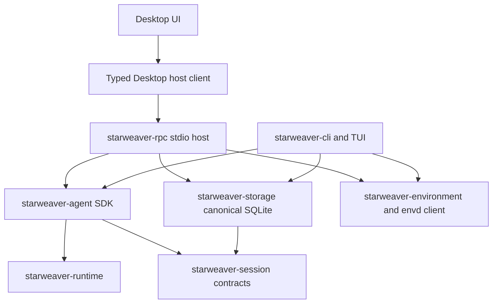

# Desktop RPC Readiness Review

Date: 2026-07-18

Status: no-go for a run-capable Desktop beta; architecture, process supervision, and typed client design may continue

Scope: CLI/RPC shared Agent SDK boundaries, canonical storage, cross-product session continuity, host protocol, and Desktop prerequisites.

## Decision

Starweaver may continue Desktop architecture and typed host-client work around the standalone `starweaver-rpc` process, but the current host contract is not ready to support a run-capable Desktop beta.

The implementation completed the original critical durability fixes for the admitted RPC run path:

- runtime checkpoints, status transitions, final evidence, replay batches, and finalization use the active admission fence;
- display replay is committed before its cursor enters the process-local live cache;
- replay persistence failure publishes no cursor and prevents a successful terminal result;
- active mount/unmount replay failure restores the provider target and environment lease and leaves binding/idempotency state unchanged;
- ordinary completed-run CLI/RPC continuation works in both directions with actual subprocesses;
- explicit legacy import, stable internal domain-error mapping, and a typed Rust v1 method/notification catalog are implemented;
- admission receipt lookup is read-only, orphaned HITL Preflight claims are recoverable by exact retry, and post-admission launch failures have one terminal-evidence owner;
- `rpc_hitl_resume` selects canonical replay before its first event, run/environment idempotency binds normalized parameters, and exact retries return original durable environment facts before readiness probing;
- provider-private environment attachment values are separated from durable and host-visible projections, and readiness probes reject client deadlines above the 60-second host maximum before taking the serialized attach lock;
- complete run evidence remains authoritative when startup cleanup releases an admission lease, so a process-local fallback cannot rewrite a committed terminal outcome;
- AgentSpec materialization hashes an allowlisted credential-free semantic projection, including safe typed provider behavior and one-way root-set identities, rather than recursively hashing arbitrary extension maps.

The remaining blockers are narrower but still product-critical. The actionable work, ownership boundaries, and completion evidence are summarized in [Remaining Work Plan](#remaining-work-plan):

- waiting/HITL continuation has product-specific implementations without proven CLI-to-RPC and RPC-to-CLI effect semantics;
- CLI and RPC do not consume one host-neutral prepared-continuation contract;
- product-neutral materialization evidence and drift policy are enforced by CLI but are not wired into RPC run admission or RPC DTOs;
- the Rust DTO catalog is not yet a concrete request/result/error corpus, schema, or generated Desktop binding, and production dispatch still parses many methods from dynamic JSON;
- crash/reconciliation behavior is covered at storage and coordinator seams, but not by a full subprocess failure/restart interoperability test.

The decision is therefore:

- **Go**: Desktop information architecture, RPC child-process supervision, typed client transport design, session browser, retained replay UI, profile selection UX, and environment attachment UX.
- **No-go**: real Agent execution from a Desktop prototype, a public Desktop beta, complete-session-interoperability claims, or freezing the current JSON shapes as a Desktop SDK.

## Target Product Boundary



Desktop launches and supervises `starweaver-rpc` through stdio. Desktop does not link CLI internals, and CLI does not become an RPC frontend. Both products independently compose the shared Agent SDK and use the same canonical storage implementation.

## Readiness Matrix

| Area                                                    | Status                                        | Evidence and limit                                                                                                                                                                                                                                                              |
| ------------------------------------------------------- | --------------------------------------------- | ------------------------------------------------------------------------------------------------------------------------------------------------------------------------------------------------------------------------------------------------------------------------------- |
| CLI/RPC product independence                            | Complete                                      | The architecture gate rejects either dependency direction                                                                                                                                                                                                                       |
| Shared Agent SDK/runtime crates                         | Complete at the SDK boundary                  | Both products compose `starweaver-agent`, runtime, model, tools, session, stream, storage, and environment contracts                                                                                                                                                            |
| Shared SQLite schema and migrations                     | Complete                                      | `starweaver-storage` is the only schema/migration owner                                                                                                                                                                                                                         |
| Shared default database path                            | Complete                                      | Both products resolve the platform config root and `starweaver.sqlite` through shared storage helpers                                                                                                                                                                           |
| Atomic run admission and deletion fencing               | Complete for managed admission                | Canonical SQLite leases, generations, revisions, read-only durable receipt lookup, recoverable orphaned Preflight claims, and transaction tests                                                                                                                                 |
| Lease-fenced RPC evidence and finalization              | Complete for admitted RPC paths               | RPC passes its admission lease into the runtime checkpoint executor, status updates, replay appends, full evidence commit, and finalization; matching-lease cleanup preserves already committed terminal evidence; unfenced store APIs remain for trusted non-managed workflows |
| Latest-checkpoint selection                             | Complete                                      | The authoritative `RunRecord.latest_checkpoint` wins; fallback uses persistence order rather than random UUID ordering                                                                                                                                                          |
| Durable-before-live replay cursor ordering              | Complete for current RPC publication paths    | `append_replay_events_fenced` succeeds before active-cache publication; terminal events are loaded from committed evidence                                                                                                                                                      |
| Replay append failure behavior                          | Complete for the original failure mode        | Fault injection proves no cursor is published and the run cannot report successful completion                                                                                                                                                                                   |
| Recoverable active environment mutation                 | Complete for current mount/unmount operations | Provider and lease rollback occurs on append failure; registry binding/version/sequence/idempotency mutate only after durable append; attachment creation is serialized and fingerprint-bound                                                                                   |
| Environment attachment confidentiality and probe bounds | Complete for current RPC projection           | Auth, raw stdio program/arguments, and arbitrary metadata remain process-private; durable/start/replay projections are sanitized; attach and health deadlines are capped at 60 seconds before lock/probe work                                                                   |
| CLI session discovery from RPC/Desktop                  | Complete for the canonical DB                 | RPC process tests list and read CLI-style session/run records                                                                                                                                                                                                                   |
| CLI replay from RPC/Desktop                             | Complete for retained display evidence        | Replay-source selection preserves cursor family and source; `rpc_hitl_resume` is pinned to canonical replay before the first event                                                                                                                                              |
| Ordinary completed-run interoperability                 | Complete                                      | Actual CLI and RPC subprocesses create, list, replay, and continue each other's completed runs                                                                                                                                                                                  |
| Waiting/HITL cross-product continuation                 | Incomplete, blocking                          | Both products have claim-aware paths, but no bidirectional waiting-run subprocess gate proves identical approved-tool effect semantics                                                                                                                                          |
| Unified checkpoint/cursor/environment resume            | Incomplete                                    | RPC HITL consumes `SessionResumeSnapshot`; ordinary RPC and CLI paths still prepare continuation independently                                                                                                                                                                  |
| Shared agent materialization semantics                  | Partial, blocking                             | Product-neutral evidence and `preserve`/`compatible`/`switch` exist; the AgentSpec digest is an allowlisted credential-free semantic projection and CLI persists/enforces it, while RPC only exposes an unused catalog helper                                                   |
| Typed RPC DTO surface                                   | Partial, blocking                             | Every current v1 method and notification has a Rust DTO/catalog entry, but production dispatch remains partly dynamic and there is no complete concrete wire/error corpus, schema, or Desktop binding                                                                           |
| Stable RPC domain errors                                | Partial                                       | `SessionStoreError` variants map to stable host codes; dedicated stdio/HTTP error vectors are still missing                                                                                                                                                                     |
| Explicit legacy project DB import                       | Complete                                      | CLI and admin-scoped RPC import call the same incremental/idempotent importer; ordinary open does not import implicitly                                                                                                                                                         |
| Cross-process live token stream                         | Not implemented by design                     | SQLite is cross-process truth; the in-memory replay bus is process-local                                                                                                                                                                                                        |
| Cross-platform product E2E                              | Complete for ordinary completed runs          | `make desktop-rpc-e2e` is wired into Linux, macOS, and Windows CI                                                                                                                                                                                                               |

## Completed Foundation

### Canonical storage and product independence

`starweaver-storage::SqliteStorage` owns one migration sequence and derives the session store, stream archive, and replay event log from one SQLite resource. WAL, foreign keys, busy timeout, versioned record codecs, immediate transactions, idempotency checks, and rollback tests support concurrent CLI and RPC processes.

CLI no longer owns a second schema or a direct `rusqlite` dependency. Its local store is a product facade over canonical storage. RPC opens the same storage directly and independently binds the resulting session store, replay log, and Agent runtime. Neither product depends on the other.

### Default database discovery

Both products use the shared platform resolver and canonical filename. The default is the same machine-local database under the Starweaver config directory. Resolution covers native Windows profile variables and fails closed when a profile directory cannot be resolved.

Product-specific config may still override the path independently. Desktop must inspect `diagnostics.get.databasePath` after startup and treat an unexpected path as a bootstrap error rather than silently presenting an empty session list.

### Ordinary completed-run portability

RPC can list, inspect, replay, and attach to retained CLI evidence. Completed-run `ResumableState` is product-neutral, so either product can restore the other product's source run, execute through its selected profile, and persist a continuation in the same session.

The real-process gate proves both directions. RPC-to-CLI continuation deliberately selects `--continuation-mode switch` because the source RPC run does not yet persist materialization evidence. This proves context portability, not materialization parity.

### RPC as a Desktop process boundary

The implemented stdio profile has the correct initial shape for a local Desktop child process:

- initialize and protocol-major negotiation;
- bounded request/response framing;
- replay-first live subscriptions;
- response-before-notification ordering;
- bounded queues, replay pages, active caches, and shutdown deadlines;
- run start/status/await/cancel/steer;
- retained replay and display/AGUI projections;
- approval and deferred record methods;
- profile selection and client-state scopes;
- environment attachment and active-mount methods.

Authenticated loopback HTTP remains useful for local integrations, but Desktop should prefer stdio until a stateful local socket or named-pipe profile is implemented.

## Fixed During This Review

### Admission-fenced checkpoints, evidence, status, replay, and finalization

The session contract now exposes fenced variants for checkpoint commit, replay append, run evidence commit, and status update. The SQLite implementation validates admission identity, host, target, fencing generation, and expiry in the same transaction as the write. RPC passes its lease through Agent runtime construction and uses fenced writes for the managed run lifecycle.

`stale_admission_cannot_commit_checkpoint_evidence_or_final_status` opens two coordinator stores, expires/reconciles the first owner, admits a second owner, and proves the stale owner cannot append a later checkpoint, commit final evidence, or finalize the run.

This closes the stale-owner write path for admitted RPC execution. It does not remove deliberately unfenced `SessionStore` methods used by trusted SDK and migration workflows, so callers outside the managed RPC path must still choose the appropriate contract.

### Durable-before-live replay publication

RPC now serializes publication through a per-run barrier. It reserves sequences without exposing them, atomically appends the batch under the active lease, and only then advances live sequence state and inserts events into the bounded active cache.

If append fails, RPC records the replay failure, interrupts the run, publishes no cursor, and terminalizes as failed rather than completed. Terminal display and marker events are not synthesized into the live cache; they are loaded back from the committed replay log before publication.

`replay_append_failure_publishes_no_cursor_and_cannot_complete_run` covers the original failure mode.

### Active mount/unmount rollback

Active mount and unmount now share the replay publication barrier. The provider target and environment-manager lease may be prepared before persistence, but append failure restores both. In-memory attachments, binding version, event sequence, cached event, and idempotency result are updated only after the fenced replay append succeeds.

The following fault-injection tests cover both directions:

- `active_mount_replay_failure_leaves_binding_and_idempotency_unchanged`;
- `active_unmount_replay_failure_leaves_binding_and_idempotency_unchanged`.

A rollback failure is surfaced as `RUN_CONFLICT`; there is not yet a crash journal for recovery between external provider mutation and rollback.

### Read-only admission replay and HITL launch recovery

`SessionStore` now exposes a read-only admission-receipt lookup for durable idempotency. Memory and SQLite implementations return an exact receipt, reject a conflicting fingerprint, and never create a run, transition a claim, acquire a lease, or change session state. Ordinary `run.start` and `run.resume` consult this receipt before environment readiness probes and lease reservations; a retry still validates access to referenced attachment leases, but a detached lease cannot invalidate an already committed receipt.

RPC HITL resume no longer uses mutating admission as a replay probe. An exact retry can recover a deterministic `Preflight` claim left by a host loss between claim commit and admission: the claim identity binds the session, source run, idempotency key, and command fingerprint, and after the full side-effect-free preflight the store atomically transitions that exact claim to `Started` with the real continuation admission. A same-key request with a changed fingerprint cannot consume the orphaned claim. `concurrent_exact_hitl_resume_executes_approved_tool_once` seeds this crash seam, rejects the changed command, and proves one approved effect. `post_admission_hitl_preparation_failure_terminalizes_related_evidence_once` proves a second materialization failure commits the continuation/source failure once, consumes the claim, and releases the admission.

A `Started` claim remains deliberately fail-closed after an actual host loss because external effects may already have occurred. Lease reconciliation cancels the orphaned continuation but does not automatically reopen or consume that claim; an operator-facing indeterminate-effect recovery policy is still required before the cross-product waiting contract can be complete.

### Canonical run and environment idempotency

Run-start aliases are parsed once into normalized attachments before fingerprinting. Omitted and explicit default modes converge, request-only auth contributes only an internal digest, and exact replay responses load original effective attachments from durable admission evidence instead of trusting retry parameters. `rpc_hitl_resume` is classified as a canonical replay producer before its first event, closing the subscribe-immediately race.

`environment.attach` serializes the bounded probe/commit section and binds each idempotency key to a normalized fingerprint, including readiness and a digest of the request-only auth token. Same-command concurrency creates one lease; changed parameters return `IDEMPOTENCY_CONFLICT`. Session-scoped keys no longer depend on the current transport connection.

### Provider-private environment bindings and bounded readiness

RPC now separates the provider attachment used inside the process from the durable and host-visible attachment projection. The safe projection preserves reviewed binding facts such as id, kind, normalized access mode, default flags, environment id, and opaque attachment lease id. It clears auth tokens and arbitrary metadata. Envd stdio endpoint refs are reduced to `stdio://<redacted>`, so executable paths and arguments do not enter run metadata, start responses, idempotent replay responses, or lifecycle diagnostics. Older durable records are sanitized again when read.

`environment.attach` and `environment.health` reject readiness deadlines above the 60-second host maximum before awaiting a provider or acquiring the global attach serialization lock. The envd probe repeats the bound defensively. The attach lock remains intentionally serialized control-plane work; the host maximum bounds one client's occupancy but does not replace a future cancellable pending-operation protocol.

### Terminal evidence authority during startup cleanup

Runtime stream draining can commit completed, failed, or cancelled run evidence before the coordinator releases the admission lease. Startup failure paths now reload the durable run and finalize with its terminal status and output when present; they synthesize `Failed` only while no terminal evidence exists. The shared memory and SQLite `SessionStore` implementations enforce the same invariant atomically: a matching owner may release its lease after complete evidence, but cannot replace that evidence with a differing process-local fallback. A stale owner still cannot release a newer generation.

The shared session-store contract commits completed evidence under an active lease, requests cleanup with a conflicting failed fallback, and proves that both backends preserve the completed result, release only the matching lease, accept an exact retry, and reject a later conflicting rewrite.

### Credential-free AgentSpec materialization digest

The AgentSpec digest is now built from a versioned semantic projection. It includes typed agent behavior, safe model generation settings, policies, stable registry identities, allowlisted built-in wrapper semantics, and explicit field-by-field projections for reviewed provider behavior such as truncation, verbosity, log probabilities, cache policy, stream transport, beta names, service tiers, additional response paths, provider item-id replay, and encrypted-reasoning replay. Skill and workspace roots contribute sorted, deduplicated, domain-separated SHA-256 set identities, so a root change changes `preserve` semantics without persisting a raw path.

The projection excludes arbitrary metadata, provider options, provider replay routing IDs, headers/body escape hatches, user/session/thread/container/cache-key routing fields, raw provider payloads, and unknown/custom wrapper params by construction. Root-set hashes avoid raw-path disclosure but are not a confidentiality boundary for guessable low-entropy paths. Custom wrapper behavior changes must roll the host `policy_version` until a dedicated stable wrapper materialization identity is added.

### Stable internal domain-error mapping

`SessionStoreError` now distinguishes stale fence and retryable storage failures in addition to not-found, already-exists, idempotency, and run conflicts. `RpcHostError` maps those variants to stable protocol codes:

- `NOT_FOUND`;
- `ALREADY_EXISTS`;
- `IDEMPOTENCY_CONFLICT`;
- `RUN_CONFLICT`;
- `STALE_FENCE`;
- `STORAGE_UNAVAILABLE`.

The mapping is unit-tested. It is not yet represented by one concrete corpus exercised through both stdio and HTTP.

### Latest checkpoint ordering

A run step can emit multiple checkpoints, such as model response, tool call, and tool return. Random checkpoint UUID ordering cannot establish which is latest. Full evidence commit now follows the authoritative `RunRecord.latest_checkpoint` reference and validates its sequence. When no authoritative reference exists, it falls back to commit persistence order. SQLite checkpoint replay uses `sequence_no`, `created_at`, and insertion `rowid` rather than checkpoint UUID.

`latest_checkpoint_uses_persistence_order_within_one_run_step` uses adversarial IDs and a reversed commit vector to protect this invariant.

### Explicit legacy import and cross-platform state replacement

Opening CLI storage no longer performs a project-local import. CLI exposes `storage import-legacy`; RPC exposes typed `storage.importLegacy`, protected by the HTTP `admin` scope. Both require an explicit source/workspace and call the same incremental/idempotent importer.

CLI and RPC state files use platform replacement semantics. The subprocess gate validates no implicit import, CLI import and retry, RPC import and retry, and visibility from both products.

## Remaining Work Plan

The P0/P1 labels in the detailed findings below describe priority for a run-capable Desktop release. They are not unresolved merge findings against the completed RPC hardening work: the reviewed worktree has no open P0-P3 code-review finding, but it does not yet satisfy the Desktop product gates.

### Workstreams required before Desktop may execute agents

| ID  | Priority | Workstream                                                   | Concrete deliverables                                                                                                                                                                                                                                                                                                        | Primary boundaries                                                                                                                                          | Completion evidence                                                                                                                                                                                                                |
| --- | -------- | ------------------------------------------------------------ | ---------------------------------------------------------------------------------------------------------------------------------------------------------------------------------------------------------------------------------------------------------------------------------------------------------------------------- | ----------------------------------------------------------------------------------------------------------------------------------------------------------- | ---------------------------------------------------------------------------------------------------------------------------------------------------------------------------------------------------------------------------------- |
| W1  | P0       | Shared continuation preparation                              | Define one host-neutral prepared-continuation result; centralize snapshot loading, approval/deferred validation, resolved tool-return projection, claim transitions, waiting-run replacement admission, started transition, and terminal claim consumption; make CLI and RPC call it rather than reimplementing the sequence | Product-neutral session/agent contracts own semantics; CLI and RPC retain only product policy, authorization, environment restoration, and presentation     | Shared memory/SQLite contract suite plus actual CLI-to-RPC and RPC-to-CLI waiting-run tests; exact retry and concurrent retry execute an approved effect at most once; denial and invalid input produce identical durable outcomes |
| W2  | P0       | RPC materialization and drift enforcement                    | Materialize after profile and environment resolution but before admission/claim side effects; persist evidence on every RPC run; add continuation mode to typed start/resume DTOs; return accepted drift; reject incompatible drift before execution                                                                         | `starweaver-agent` remains the semantic owner; `starweaver-rpc-core` owns wire DTOs; `starweaver-rpc` owns authorization and admission integration          | CLI-to-RPC and RPC-to-CLI `preserve`, `compatible`, and `switch` fixtures, including profile, toolset, policy, provider behavior, root-set, and environment-class drift                                                            |
| W3  | P0       | Consumable RPC wire contract and Desktop binding             | Replace type-name-only fixtures with canonical valid/invalid request, result, notification, and stable error frames; decode registered DTOs at dispatch; produce or verify JSON Schema and a Desktop-language binding; run one corpus through every supported transport                                                      | `starweaver-rpc-core` owns protocol types and corpus; transports may enforce additional auth/framing policy without changing domain shapes                  | The same corpus passes Rust serde, in-process dispatch, stdio, loopback HTTP, and the Desktop client; casing, optionality, unknown fields, limits, error codes, and protocol-version behavior are covered                          |
| W4  | P1       | Crash/restart and effect reconciliation                      | Add deterministic lifecycle pause points for tests; kill RPC before/after admission, claim start, replay commit, tool effect, terminal evidence, and lease release; restart on the same database; reconcile expired ownership; expose an operator-visible indeterminate-effect state for orphaned `Started` claims           | Storage/session contracts own fencing and durable state; RPC owns process recovery policy; Desktop owns operator presentation and explicit recovery actions | No stale write or duplicate approved effect after restart; retained cursors replay without gaps; exact receipts remain idempotent; `Started` claims are never silently retried or reset                                            |
| W5  | P1       | Unified ordinary resume and simultaneous-owner product proof | Make ordinary CLI and RPC continuation consume the same expanded snapshot/prepared result; report ignored or incompatible evidence; run simultaneous CLI/RPC admission and stale-owner races with real processes                                                                                                             | Shared continuation contracts own evidence interpretation; each product independently composes storage and runtime                                          | Ordinary and waiting continuation share conformance tests; simultaneous owners produce one winner; the loser cannot append, terminalize, or release the winner's lease                                                             |

W1 and W2 may proceed in parallel once their shared DTO boundaries are agreed. W3 can proceed independently and should stabilize before Desktop run-controller code is treated as production. W4 should reuse W1's deterministic effect semantics rather than inventing a second recovery model. W5 completes the cross-product proof after the shared preparation path exists.

### Desktop work that may proceed now

The following work does not require enabling Agent execution and can continue behind a non-running prototype boundary:

- RPC child-process discovery, protocol-major negotiation, stderr capture, graceful shutdown, and restart diagnostics;
- typed client request correlation, notification demultiplexing, deadlines, cancellation, and reconnect state;
- read-only session browsing, search, retained replay, run detail, and bootstrap diagnostics through RPC;
- profile-selection and environment-attachment UX that displays resolved, redacted host facts;
- schema/binding generation and wire-corpus execution from W3.

The Desktop run controller and HITL controller must remain disabled until W1-W5 and the acceptance gates pass. A prototype must not bypass the host by opening SQLite, reading `rpc.toml`, or reconstructing compatibility files.

### Explicit non-goals for this readiness phase

- Do not introduce a CLI-to-RPC or RPC-to-CLI dependency; both products continue to compose shared lower layers independently.
- Do not make Desktop UI code a SQLite client or migration owner.
- Do not add a cross-process live token bus solely for parity; retained durable replay plus process-local live streaming remains the intended boundary.
- Do not automatically reset or retry an orphaned `Started` HITL claim; it represents an indeterminate external-effect fence and requires an explicit operator policy.
- Do not freeze current dynamic JSON shapes as a public Desktop SDK before W3 is complete.

## Remaining Blocking Findings

### P0. Waiting/HITL continuation is not proven portable

RPC `run.resume` has a substantial claim-aware workflow: it loads `SessionResumeSnapshot`, validates resolved results before claim, acquires an exclusive claim, performs waiting-run replacement admission, marks execution started at the runtime boundary, and consumes related-run state through fenced evidence.

CLI also has waiting/HITL handling, but the two products still prepare and validate continuation through separate coordinator logic. There is no real bidirectional gate for these cases:

1. CLI creates a waiting run; RPC records decisions and continues it.
2. RPC creates a waiting run; CLI records decisions and continues it.
3. An exact retry after claim/start/terminal state does not execute an approved tool effect twice.
4. A denied or invalid resume terminalizes or releases the claim identically in both products.

Until those cases use one contract suite and pass actual-process tests, complete session interoperability is not established.

Required direction: move claim, validation, resolved-tool-return projection, started transition, waiting replacement admission, and atomic claim consumption behind one product-neutral continuation preparation contract. Run the same tests against memory, SQLite, CLI, and RPC entry points.

### P0. RPC does not enforce shared agent materialization semantics

`starweaver-agent` now owns safe materialization evidence containing an Agent spec digest, model profile id, toolset ids, policy version, and environment binding class. It also owns field-level drift assessment and explicit `preserve`, `compatible`, and `switch` modes.

CLI resolves this evidence, persists it, defaults continuation to `preserve`, rejects incompatible drift, and reports accepted drift. RPC's catalog can compute materialization evidence, but the helper is not called by run admission or continuation. RPC run records therefore lack equivalent evidence, `run.start`/`run.resume` DTOs expose no continuation mode, and RPC does not assess cross-product drift.

Required direction:

1. Call the shared materializer from RPC after profile/environment resolution and before admission.
2. Persist credential-free evidence on every RPC run.
3. Add an explicit continuation mode and drift result to typed RPC request/result DTOs.
4. Reject or report drift before any continuation claim or side effect.
5. Add CLI-to-RPC and RPC-to-CLI preserve/compatible/switch conformance tests.

### P0. Desktop lacks a consumable wire conformance contract

`starweaver-rpc-core` now contains concrete Rust params/results for every currently cataloged v1 method and a typed notification union for subscription readiness, stream events, run status, diagnostics, and subscription closure. The method catalog and validator cover all dispatch names.

This is necessary but not sufficient for a Desktop SDK:

- the JSON fixture lists method/type names rather than concrete valid and invalid request/result frames;
- it contains no stable domain-error vectors;
- only selected DTOs have explicit casing/shape examples;
- production dispatch still manually reads many fields from `serde_json::Value` instead of decoding the registered DTO at the boundary;
- no JSON Schema or generated/verified Desktop-language binding consumes the corpus;
- stdio and HTTP do not run the same complete wire vectors.

Required direction:

1. Add concrete canonical and invalid params/results for every method.
2. Add notification and stable error frames, including transport authorization behavior.
3. Decode registered DTOs at the dispatch boundary and validate typed results in tests.
4. Generate or verify JSON Schema and the Desktop binding from `starweaver-rpc-core`.
5. Execute one corpus through Rust, stdio, HTTP, and the Desktop client.

### P1. Resume entry points are not unified

The canonical session layer can produce a snapshot containing context, checkpoint, post-checkpoint raw records, approvals, deferred records, and cursors. RPC HITL consumes that snapshot, while ordinary RPC and CLI continuation still load and prepare evidence through product-specific paths.

Required direction: define a host-neutral `PreparedContinuation` or make all continuation entry points consume a single expanded `SessionResumeSnapshot` workflow. Environment restoration remains host-owned, but ignored or incompatible evidence must produce an explicit diagnostic.

### P1. Crash/restart reconciliation lacks a product E2E

Storage tests prove stale admission fencing, read-only receipt lookup, and Preflight-claim retry recovery. Coordinator tests prove failure behavior at admission handoff, publication, and environment mutation seams. The real-process gate currently exercises successful runs and legacy import, not process termination during execution, lease expiry, restart, retained replay catch-up, or effect reconciliation.

A claim already marked `Started` is intentionally not reset by lease expiry: the continuation becomes cancelled, the source remains waiting, and the claim remains an indeterminate-effect fence. Automatic retry would risk duplicating an approved external effect. Desktop therefore needs an explicit operator-visible reconciliation/compensation state rather than treating this as an ordinary retry.

Required direction: add a deterministic subprocess test that kills the RPC host at controlled lifecycle points, restarts it against the same database, reconciles the expired admission, proves that stale writes and duplicate approved effects are impossible, and exposes the `Started`-claim indeterminate state safely.

## Desktop Design Requirements

The first Desktop design should include these components:

1. **RPC process supervisor**: binary discovery, version/major check, stdio purity, restart policy, stderr diagnostics, graceful shutdown, and crash reporting.
2. **Typed host client**: request ids, initialization, method DTOs, notification demultiplexing, deadlines, cancellation, and reconnect state.
3. **Session repository**: paged/search views from RPC only; no direct SQLite access from UI code.
4. **Run controller**: durable `run.start`, immediate subscription, cursor persistence, replay catch-up, cancel/steer, and terminal reconciliation.
5. **HITL controller**: approval/deferred inbox and continuation state machine built only after the shared continuation contract passes cross-product gates.
6. **Agent/profile controller**: profile list/current/select, materialization fingerprints, explicit continuation mode, and cross-product drift warnings.
7. **Environment controller**: attachment leases, readiness, active bindings, redacted diagnostics, and explicit workspace grants.
8. **Bootstrap diagnostics**: resolved DB path, workspace root, protocol identity, storage migration status, profile availability, and environment health.

Desktop UI code must not open `starweaver.sqlite`, inspect `rpc.toml` directly, or reconstruct session state from product-owned compatibility files.

## Desktop Beta Acceptance Gates

| Gate                                                                           | Status                                  | Current evidence or missing proof                                                                            |
| ------------------------------------------------------------------------------ | --------------------------------------- | ------------------------------------------------------------------------------------------------------------ |
| Actual CLI run is listed, replayed, and continued by RPC                       | Passed                                  | `xtask check-desktop-rpc-e2e`                                                                                |
| Actual RPC run is listed, replayed, and continued by CLI                       | Passed                                  | `xtask check-desktop-rpc-e2e`; continuation explicitly uses `switch` until RPC persists materialization      |
| CLI waiting run is decided and continued through RPC                           | Not passed                              | No actual-process cross-product waiting fixture                                                              |
| RPC waiting run is decided and continued through CLI                           | Not passed                              | No actual-process cross-product waiting fixture                                                              |
| Simultaneous owners are fenced and a stale owner cannot append/finalize        | Partially passed                        | Two-store SQLite race covers checkpoint/evidence/finalization; no simultaneous CLI/RPC subprocess race       |
| RPC crash/lease expiry reconciles without duplicate effects                    | Not passed                              | Component tests exist; no kill/restart product gate                                                          |
| Every published live cursor survives restart                                   | Passed for current RPC publication path | Fenced durable append precedes cache publication; append-failure test publishes no cursor and fails the run  |
| Failed active mount/unmount append leaves effective state unchanged            | Passed for current operations           | Mount and unmount fault-injection tests                                                                      |
| Materialization drift is persisted and shown before cross-product continuation | Partially passed                        | Shared evidence plus CLI enforcement exist; RPC integration is missing                                       |
| Legacy import is explicit and idempotent through CLI and RPC                   | Passed                                  | Subprocess gate                                                                                              |
| Default DB and state replacement work on Linux, macOS, and Windows             | Passed in configured CI                 | `desktop-rpc-e2e` runs in all three OS jobs                                                                  |
| Every method/notification has a Desktop-consumable typed contract              | Partially passed                        | Rust DTO/catalog complete; concrete corpus/schema/binding incomplete                                         |
| Dedicated errors distinguish domain failures on both transports                | Partially passed                        | Internal mapping complete; stdio/HTTP vectors incomplete                                                     |
| Architecture, capability, formatting, code, and test gates pass                | Passed                                  | Final local validation completed on the reviewed worktree; product-readiness blockers above remain unchanged |

## Validation Evidence

The focused implementation evidence includes:

```text
cargo test -p starweaver-stream \
  steering_projection_shows_main_and_hides_all_subagent_steering_in_replay --locked: passed
cargo test -p starweaver-cli \
  tui_snapshot_hides_legacy_persisted_subagent_steering --locked: passed
cargo test -p starweaver-cli \
  repeated_interrupt_keeps_main_cancellation_pending_without_host_shutdown --locked: passed
cargo test -p starweaver-rpc --lib: passed
cargo test -p starweaver-agent materialization --lib: passed
cargo test -p starweaver-session --test session_store_contract: passed
cargo test -p starweaver-storage --test session_store_contract: passed
cargo clippy -p starweaver-agent -p starweaver-session -p starweaver-storage \
  -p starweaver-rpc --all-targets --all-features --locked -- -D warnings: passed
make desktop-rpc-e2e: passed
```

The real-process gate builds and launches actual `starweaver-cli` and `starweaver-rpc` binaries. It validates native default-path parity, explicit CLI/RPC legacy import retries, CLI-created evidence listed/replayed/continued by RPC, and RPC-created evidence listed/replayed/continued by CLI. CI invokes the same gate on Linux, macOS, and Windows.

The final validation worktree passed:

```text
make fmt-check: passed
make check: passed
make test: passed
make docs-check: passed
make scripts-check: passed
make architecture-check: passed
make capability-check: passed
make desktop-rpc-e2e: passed
git diff --check: passed
```

These green implementation gates do not override the incomplete Desktop beta acceptance gates above. The readiness decision therefore remains **NO-GO** for a run-capable Desktop shell.

## Recommended Next Implementation Order

1. **Specify shared contracts**: agree the W1 prepared-continuation boundary and W2 RPC continuation/materialization DTOs before changing either product coordinator.
2. **Implement shared semantics**: extract W1 into a lower product-neutral layer, migrate CLI and RPC callers, and add memory/SQLite contract tests.
3. **Wire materialization into RPC**: complete W2 before admission or claim side effects and add bidirectional drift-policy fixtures.
4. **Prove waiting interoperability**: add actual CLI-to-RPC and RPC-to-CLI waiting/HITL subprocess fixtures, including denial, invalid input, exact retry, concurrent retry, and approved-effect at-most-once cases.
5. **Stabilize the wire**: complete W3's concrete corpus, typed dispatch, stable error vectors, schema, and Desktop binding across stdio and loopback HTTP.
6. **Prove recovery**: complete W4 and W5 with deterministic kill/restart, lease expiry, simultaneous-owner, retained-replay, and indeterminate-effect tests.
7. **Integrate Desktop execution**: enable the run and HITL controllers only after all previously incomplete acceptance rows pass in the Desktop client.
8. **Repeat this readiness review**: update the evidence matrix and approve a run-capable Desktop shell only if no P0 workstream or partial blocking gate remains.
