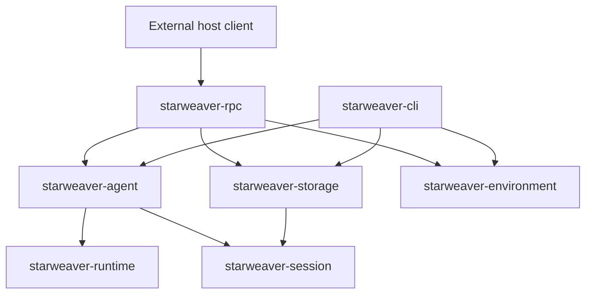
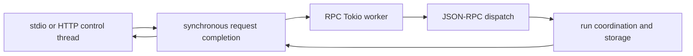

# RPC Host Architecture

Date: 2026-07-21

Scope: the standalone `starweaver-rpc` host, its durable execution boundary, its JSON-RPC v1 wire contract, and its interoperability with the independent CLI product.

## Product Boundary

`starweaver-rpc` is a standalone host process. It owns `rpc.toml`, authorization, protocol negotiation, stdio and HTTP transport behavior, process-local subscription state, active-run coordination, and environment attachment resolution. It does not import CLI configuration, TUI state, commands, or compatibility code.



The CLI and RPC products compose the same lower-layer session, storage, stream, agent, and environment contracts independently. `starweaver-storage` owns the canonical SQLite schema and migrations. Durable records are the cross-process source of truth; active task registries, subscription cursors, and environment providers are process-local reconstructions.

Host-visible evidence is credential-free. Provider credentials, routing affinity, raw endpoints, process arguments, private attachment values, and arbitrary provider extension data remain outside durable and wire projections.

## Durable Admission and Continuation

A managed run is admitted through one session-scoped fenced lease. The lease identifies its namespace, session, target run, host instance, admission id, fencing generation, expiry, and idempotency fingerprint. Checkpoints, replay batches, status transitions, final evidence, and admission finalization validate that lease in the same storage transaction as their write.

An exact idempotency retry reads the existing receipt and returns its persisted run rather than resolving profiles, probing attachments, or starting another execution. A retry with the same key and a different fingerprint fails as an idempotency conflict. A stale owner cannot append evidence, terminalize a newer run, or release a newer lease.

Waiting HITL continuations use a shared `PreparedContinuation` package from `starweaver-session`:

1. The session layer loads the canonical snapshot and validates session, run, conversation, checkpoint, durable metadata, approval, and deferred-result identity.
2. The product host completes credential-free materialization and runtime validation before it acquires a claim or admits a replacement run.
3. A replacement admission atomically changes the source claim from `Preflight` to `Admitted` and creates the target lease.
4. Immediately before an approved tool can execute, `start_hitl_resume_effect` atomically validates the live lease, target/source binding, and claim id, then changes the claim to `Started`.
5. The agent layer injects the prepared results and is the only boundary that executes an approved tool.
6. Final related-run evidence consumes the `Started` claim together with the target and source terminal updates.

This separation gives `Preflight`, `Admitted`, and `Started` distinct recovery semantics. An orphaned `Admitted` replacement has not crossed the tool-effect boundary, so expiry cancels only the replacement, consumes its claim, and leaves the source waiting for a new continuation command. An orphaned `Started` replacement is terminalized with its source and receives a typed `started`/`indeterminate` continuation-effect projection on both durable runs. Hosts return that projection from status and subscription APIs so a caller cannot mistake an interrupted approved effect for a safe retry. Both outcomes are transactionally fenced and retain their durable run evidence.

CLI, RPC, and the SDK-owned convenience continuation path use the same preparation, replacement-admission, and effect-start contract. The SDK never executes a durable HITL effect through a bare source claim. Neither product reconstructs tool returns independently from stream history.

## Materialization Evidence

Every newly admitted RPC run stores a `ResolvedAgentMaterialization` in durable metadata. The evidence contains only:

- the versioned digest of an allowlisted semantic `AgentSpec` projection;
- resolved model profile identity;
- sorted effective toolset identities;
- host-policy bundle version;
- credential-free environment binding class;
- a domain-separated digest of resolved provider/runtime behavior, including protocol and endpoint behavior without the raw endpoint;
- a domain-separated workspace-root identity digest without the raw path; and
- a SHA-256 fingerprint over those fields.

The semantic projection deliberately excludes credentials, HTTP headers, provider routing identifiers, raw provider options, arbitrary metadata, and raw workspace or skill roots. Root sets and RPC runtime bindings contribute domain-separated digests rather than endpoint or path strings.

A continuation also persists a `ContinuationMaterialization` assessment. `preserve` requires exact authenticated source evidence, `compatible` permits only an `AgentSpec` digest change, and `switch` records explicitly accepted drift. Assessment happens before admission and before any HITL claim mutation. The wire result exposes the safe target materialization and accepted field-level drift; legacy receipt replay remains readable without manufacturing new evidence.

## JSON-RPC v1 Contract

The implemented major-1 baseline remains Rust-first. `../ops/09-rpc-idl-and-client-generation.md` records the accepted clean `starweaver.host` major-2 target: one OpenRPC/JSON Schema source generates the Rust server boundary and manifest-filtered TypeScript Desktop client without treating v1 frames as wire-compatibility requirements. None of the generated major-2 target is claimed as current evidence in this review.

`starweaver-rpc-core` owns the current v1 protocol surface:

- concrete request and result DTOs for every registered method, including `session.fork` and session-scoped deferred tool definitions;
- typed notification unions and stable error-code catalog;
- strict camel-case decoding, defaults, optionals, bounds, and unknown-field rejection;
- canonical and invalid wire vectors; and
- a deterministic generated JSON Schema for the corpus.

Production JSON-RPC dispatch validates registered DTO parameters before invoking a handler and validates handler results before serializing a successful response. The same corpus exercises Rust serde, in-process JSON-RPC dispatch, stdio transport, and loopback HTTP transport. The corpus is a protocol artifact, not a client binding or a client-product dependency.

Protocol negotiation uses the `starweaver.host` family and major version. Minor fixture revisions describe the v1 corpus without changing the supported major. HTTP authorization is scoped at the host boundary; replay-only transports do not gain connection-scoped environment authority.

## Session Fork and Client-Managed Deferred Tools

`session.fork` snapshots the source session's latest successful durable context into an independent target session. A source with no runs may fork its initial state; failed/waiting-only sources are rejected. It preserves profile/workspace ownership and session-scoped deferred-tool definitions, records parent/source lineage, resets runtime ownership and pending evidence, and uses receipt-first idempotent session creation. Service-level tests prove latest-success selection in the presence of a newer failed run, failed/waiting-only rejection, exact retry after source deletion, conflict behavior, binding isolation, and continued discussion on the target.

`session.create` accepts strictly bounded client-managed deferred tool schemas. A domain-separated digest binds those definitions to the session and contributes a stable toolset identity to run materialization. The runtime emits one `deferred_requested` HITL sideband event per external call and then commits a non-terminal waiting boundary. RPC releases the worker admission without manufacturing a terminal marker. The tested client flow is `deferred.list` -> `deferred.complete`/`deferred.fail` -> explicit `run.resume` -> completed continuation.

## Explicit MCP Configuration

RPC may load one explicit strict MCP JSON document through `rpc.toml` or `STARWEAVER_RPC_MCP_CONFIG`. Profile selections are canonical duplicate-free sets. Stdio and streamable HTTP clients are discovered lazily per run without serializing unrelated run discovery; server capability declarations gate inventory requests; partial discovery failures close the service; calls share a read fence while close/replacement is exclusive. Initialization, request, and exit/cleanup each have bounded timeout policy, and close failures retain retryable ownership. Initialization lifecycle evidence carries a credential-free discovered inventory digest, while durable materialization binds the selected static configuration. Deferred records and events expose only server/tool identity, transport kind, and arguments; they never expose URLs, headers, commands, process arguments, environments, credentials, or transport-owned paths. Live inventory is deliberately dynamic per run and its digest is diagnostic rather than a `Preserve` continuation constraint.

## Request Execution Boundary

Transport threads own framing, authorization, request order, response writes, and flush barriers. They do not poll the agent materialization or run-coordination futures. Each accepted JSON-RPC frame is submitted as an owned task to the service runtime, and the transport waits only for its completion result.



The service runtime uses an explicit worker-stack budget rather than the operating system stack of the process main thread or an HTTP connection thread. Startup reconciliation, normal request dispatch, subscription tails, and coordinated shutdown use the same runtime boundary. Blocking service entry points reject calls from an RPC runtime worker so internal code cannot re-enter the synchronous completion wait.

A stdio connection still completes one request before reading the next. A subscription remains pending until its response has been written and flushed; only then does the transport activate its notification tail. Unary HTTP requests remain independently concurrent. When HTTP shutdown stops admission at the listener, the host performs a bounded drain of accepted connection handlers before final service shutdown.

Connection initialization, environment leases, and subscription cancellation live in shared connection state. Temporary request-task ownership cannot release those resources; cleanup occurs only when the final connection-state owner is dropped.

## Replay, Recovery, and Environment Attachments

Replay evidence is persisted before a cursor is published to a live cache. A replay write failure therefore cannot produce a published-but-undurable cursor or a false successful terminal result. Restart rebuilds replay state from durable cursors and retained event evidence.

Startup and admission paths reconcile expired leases deterministically. Reconciliation is fenced by the persisted owner generation and cannot alter a non-expired foreign owner. Finalization preserves already committed terminal evidence instead of replacing it with process-local fallback state.

Environment attachments have separate private, durable-safe, and wire-safe projections. Attachment authorization and normalized idempotency occur before provider allocation. Attach, mount, unmount, and health operations use bounded readiness deadlines. If durable replay publication fails, the provider target and environment lease are restored before the process-local binding or idempotency state changes.

## Interoperability

The CLI and RPC products resolve the same canonical database location and storage schema. Each can list, read, and replay the other product's completed run evidence, and each can ordinarily continue the other's completed run when the selected continuation materialization permits it. Legacy imports are explicit and idempotent; opening canonical storage never implicitly imports legacy project storage.

Real-process interoperability builds both binaries, verifies their native default database resolution, explicitly imports legacy data through each product, and exercises CLI-to-RPC and RPC-to-CLI completed-run continuation against one database. The validation runs on Linux, macOS, and Windows.

Terminal RPC projection is durable-first. `starweaver-session` owns the typed status/output/diagnostic projection, admission finalization persists it atomically, and RPC status/await responses project the diagnostic from `RunRecord`. This keeps live completion, cache eviction, remote ownership, and restart behavior identical; `output_preview` is not used as an error transport. Runtime, stream, CLI, and RPC boundaries project typed errors into stable public codes and redacted messages before persistence or wire delivery, while legacy exact evidence retries remain valid through digest-first compatibility handling.

## Validation Surface

The host architecture is covered by the repository gates below:

```text
make fmt-check
make check
make test
make coverage-ci
make rpc-contracts-check
make rpc-interop-e2e
make scripts-check
make docs-check
git diff --check
```

`make check` includes the CLI/RPC dependency-isolation and capability-registry gates. `rpc-contracts-check` is the complete standalone contract gate: it verifies deterministic schema generation and the v1 corpus across typed in-process, stdio, and HTTP dispatch. Aggregate `make ci` uses the ordered `rpc-ci-check` composition instead: workspace tests first provide the same typed in-process coverage, then `rpc-integration-check` builds the CLI and RPC together once with Cargo's normal dev profile. That command reuses the exact same binaries while exercising stdio and HTTP transport contracts followed by bidirectional CLI/RPC subprocess interoperability against shared durable storage. The standalone transport and interoperability targets remain available and self-contained.
