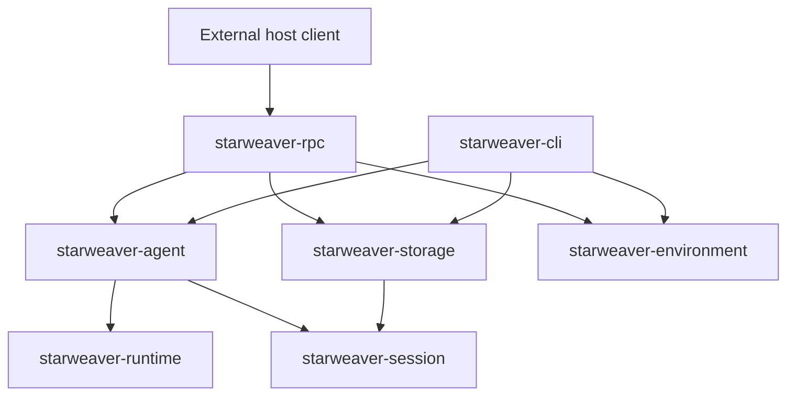
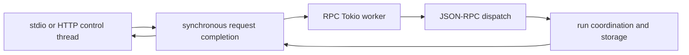

# RPC Host Architecture

Date: 2026-07-21

Scope: the standalone `starweaver-rpc` host, its durable execution boundary, its JSON-RPC v1 wire contract, and its interoperability with the independent CLI product.

## Product Boundary

`starweaver-rpc` is a standalone host process. It owns `rpc.toml`, authorization, protocol negotiation, stdio and HTTP transport behavior, process-local subscription state, active-run coordination, and environment attachment resolution. It does not import CLI configuration, TUI state, commands, or compatibility code.



The CLI and RPC products compose the same lower-layer session, storage, stream, agent, and environment contracts independently. `starweaver-storage` owns the canonical SQLite schema and migrations. Durable records are the cross-process source of truth; active task registries, subscription cursors, and environment providers are process-local reconstructions.

Host-visible evidence is credential-free. Provider credentials, routing affinity, raw endpoints, process arguments, private attachment values, and arbitrary provider extension data remain outside durable and wire projections.

## Durable Admission and Continuation

A managed run is admitted through one session-scoped fenced lease. The lease identifies its namespace, session, target run, host instance, admission id, fencing generation, expiry, and idempotency fingerprint. Checkpoints, replay batches, status transitions, final evidence, and admission finalization validate that lease in the same storage transaction as their write.

An exact idempotency retry reads the existing receipt and returns its persisted run rather than resolving profiles, probing attachments, or starting another execution. A retry with the same key and a different fingerprint fails as an idempotency conflict. A stale owner cannot append evidence, terminalize a newer run, or release a newer lease.

Waiting HITL continuations use a shared `PreparedContinuation` package from `starweaver-session`:

1. The session layer loads the canonical snapshot and validates session, run, conversation, checkpoint, durable metadata, approval, and deferred-result identity.
2. The product host completes credential-free materialization and runtime validation before it acquires a claim or admits a replacement run.
3. A replacement admission atomically changes the source claim from `Preflight` to `Admitted` and creates the target lease.
4. Immediately before an approved tool can execute, `start_hitl_resume_effect` atomically validates the live lease, target/source binding, and claim id, then changes the claim to `Started`.
5. The agent layer injects the prepared results and is the only boundary that executes an approved tool.
6. Final related-run evidence consumes the `Started` claim together with the target and source terminal updates.

This separation gives `Preflight`, `Admitted`, and `Started` distinct recovery semantics. An orphaned `Admitted` replacement has not crossed the tool-effect boundary, so expiry cancels only the replacement, consumes its claim, and leaves the source waiting for a new continuation command. An orphaned `Started` replacement is terminalized with its source and receives a typed `started`/`indeterminate` continuation-effect projection on both durable runs. Hosts return that projection from status and subscription APIs so a caller cannot mistake an interrupted approved effect for a safe retry. Both outcomes are transactionally fenced and retain their durable run evidence.

CLI, RPC, and the SDK-owned convenience continuation path use the same preparation, replacement-admission, and effect-start contract. The SDK never executes a durable HITL effect through a bare source claim. Neither product reconstructs tool returns independently from stream history.

## Materialization Evidence

Every newly admitted RPC run stores a `ResolvedAgentMaterialization` in durable metadata. The evidence contains only:

- the versioned digest of an allowlisted semantic `AgentSpec` projection;
- resolved model profile identity;
- sorted effective toolset identities;
- host-policy bundle version;
- credential-free environment binding class;
- a domain-separated digest of resolved provider/runtime behavior, including protocol and endpoint behavior without the raw endpoint;
- a domain-separated workspace-root identity digest without the raw path; and
- a SHA-256 fingerprint over those fields.

The semantic projection deliberately excludes credentials, HTTP headers, provider routing identifiers, raw provider options, arbitrary metadata, and raw workspace or skill roots. Root sets and RPC runtime bindings contribute domain-separated digests rather than endpoint or path strings.

A continuation also persists a `ContinuationMaterialization` assessment. `preserve` requires exact authenticated source evidence, `compatible` permits only an `AgentSpec` digest change, and `switch` records explicitly accepted drift. Assessment happens before admission and before any HITL claim mutation. The wire result exposes the safe target materialization and accepted field-level drift; legacy receipt replay remains readable without manufacturing new evidence.

## JSON-RPC v1 Contract

The atomic `starweaver.host` major-1 replacement is implemented. The sole `protocol/host/` OpenRPC 1.4.0 and JSON Schema Draft 7 source generates the Rust server boundary, strict request envelope, metadata, runtime validators, and manifest-filtered Desktop bridge/client surface. `starweaver-rpc-core` exports only that generated boundary; the handwritten DTO, schema, fixture, catalog, and dispatcher authority has been removed. Exact revision/schema-digest mismatch fails closed, with no old-frame compatibility, parallel dispatch, fallback parser, or staged migration.

The generated Rust boundary includes:

- closed request/result/notification DTOs for all 36 methods;
- exhaustive method, transport, scope, feature, event-class, and event-profile metadata;
- typed public errors registered at the protocol root;
- raw-value runtime validation generated from every retained schema constraint, including inline string and integer bounds, array bounds and uniqueness, enums, constants, patterns, UTC timestamps, decimal values, closed objects, and exact-one unions; and
- validation before typed request deserialization and after result/notification serialization, so public Rust fields cannot bypass the wire contract.

Production dispatch carries one immutable admission context per stateful stdio connection: trusted authority, transport, scopes, and negotiated features. Every method is admitted from generated metadata immediately before generated dispatch. Replay and subscription admit the complete generated event profile before storage work, using the same scope/feature eligibility and exact cursor-bound view. A second stdio `initialize` is rejected, required features must also be client-supported, and stateless HTTP uses its authenticated scopes plus server-effective features for each unary request. The canonical IDL owns the `FeatureId` grammar and declares strict UTF-8-byte ascending feature arrays; generated Rust and TypeScript validators reject malformed, duplicate, or non-canonical declarations rather than normalizing them.

Session mutation, run admission, and run interrupt/steer receipt storage keys are domain-separated with the trusted transport authority before durable lookup or insertion; the public receipt continues to expose only the client key. Generated-adapter regressions exercise interrupt and steer independently: an exact same-authority retry replays, another authority using the same client key receives an independent operation and receipt, both wire receipts retain the client key, and changed parameters conflict within one authority. HTTP authorization is scoped at the transport and service boundaries. HTTP cannot request connection-scoped environment authority.

## Session Fork and Client-Managed Deferred Tools

`session.fork` snapshots the source session's latest successful durable context into an independent target session. A source with no runs may fork its initial state; failed/waiting-only sources are rejected. It preserves profile/workspace ownership and session-scoped deferred-tool definitions, records parent/source lineage, resets runtime ownership and pending evidence, and uses receipt-first idempotent session creation. Service-level tests prove latest-success selection in the presence of a newer failed run, failed/waiting-only rejection, exact retry after source deletion, conflict behavior, binding isolation, and continued discussion on the target.

`session.create` accepts strictly bounded client-managed deferred tool schemas. A domain-separated digest binds those definitions to the session and contributes a stable toolset identity to run materialization. The runtime emits one `deferred_requested` HITL sideband event per external call and then commits a non-terminal waiting boundary. RPC releases the worker admission without manufacturing a terminal marker. The tested client flow is `deferred.list` -> `deferred.complete`/`deferred.fail` -> explicit `run.resume` -> completed continuation.

## Explicit MCP Configuration

RPC may load one explicit strict MCP JSON document through `rpc.toml` or `STARWEAVER_RPC_MCP_CONFIG`. Profile selections are canonical duplicate-free sets. Stdio and streamable HTTP clients are discovered lazily per run without serializing unrelated run discovery; server capability declarations gate inventory requests; partial discovery failures close the service; calls share a read fence while close/replacement is exclusive. Initialization, request, and exit/cleanup each have bounded timeout policy, and close failures retain retryable ownership. Initialization lifecycle evidence carries a credential-free discovered inventory digest, while durable materialization binds the selected static configuration. Deferred records and events expose only server/tool identity, transport kind, and arguments; they never expose URLs, headers, commands, process arguments, environments, credentials, or transport-owned paths. Live inventory is deliberately dynamic per run and its digest is diagnostic rather than a `Preserve` continuation constraint.

## Request Execution Boundary

Transport threads own framing, authorization, request order, response writes, and flush barriers. They do not poll the agent materialization or run-coordination futures. Each accepted JSON-RPC frame is submitted as an owned task to the service runtime, and the transport waits only for its completion result.



The service runtime uses an explicit worker-stack budget rather than the operating system stack of the process main thread or an HTTP connection thread. Startup reconciliation, normal request dispatch, subscription tails, and coordinated shutdown use the same runtime boundary. Blocking service entry points reject calls from an RPC runtime worker so internal code cannot re-enter the synchronous completion wait.

A stdio connection still completes one request before reading the next. A subscription remains pending until its response has been written and flushed; only then does the transport activate its notification tail. Unary HTTP requests remain independently concurrent. When HTTP shutdown stops admission at the listener, the host performs a bounded drain of accepted connection handlers before final service shutdown.

Both inbound and outbound JSON-RPC frames have one transport-neutral 8 MiB limit. The stdio reader bounds allocation before UTF-8 or JSON decoding, and the HTTP body limit is independent from the separately bounded header. Response and notification encoding checks the same limit before enqueue or write. Stdio reads run through a bounded reader queue so notification flush failure is observable while stdin is idle; failed notification delivery closes the logical connection and the complete transport, forcing cursor-based recovery instead of leaving a silent live connection. A two-process regression establishes a subscription, keeps subscriber stdin open and idle, closes only its stdout reader, publishes one durable event through a second host, and verifies the subscriber fails through the notification-transport path while revoking its connection attachment.

Connection initialization, generated admission evidence, owned environment attachments, and subscription cancellation live in shared connection state. The transport invokes an explicit idempotent close path before waiting for notification workers: it cancels every active tail and revokes connection-owned durable attachments, so a tail cannot keep its own cancellation authority alive. One storage-owned immediate transaction verifies the complete connection attachment set and commits every detach revision, receipt, and host-event publication together; an injected late-update failure rolls the entire aggregate back. Connection-scoped durable attachments carry an opaque owner connection identity, are hidden from sibling connections sharing the same local authority, cannot be created over stateless HTTP, and are detached when the connection closes. A subprocess regression covers active subscription plus connection attachment followed by stdin EOF.

## Replay, Recovery, and Environment Attachments

The lower storage boundary now owns a product-neutral canonical host-event record distinct from internal `ReplayEvent` evidence. `RunEvidenceCommit` can atomically persist run/session state with deterministic per-transition host-event outbox entries. Terminal output availability is ordered before the terminal `run_changed` record so a finite live tail delivers output before observing its close condition. Memory and SQLite stores materialize those entries idempotently into one storage-domain monotonic log, preserve stable event identity, and query global/session/run scopes with persisted event-class filtering before pagination. Public opaque cursor encoding, admitted-view authorization, live delivery sequencing, and generated wire projection remain RPC-layer work.

Crash tests cover rollback before the state transaction commits, restart after state/outbox commit but before event materialization, materialization failure with outbox retention, and restart after durable append but before process-local live emission. Exact state retries do not recreate a drained outbox, and restart replay returns the one materialized record. Managed session tombstones retain audit evidence; explicit physical run pruning or session deletion removes matching materialized and pending host-event evidence in the same transaction without reusing log or outbox sequence values.

Legacy internal replay evidence is persisted before its cursor is published to a live cache. A replay write failure therefore cannot produce a published-but-undurable cursor or a false successful terminal result. Restart rebuilds legacy replay state from durable cursors and retained event evidence while the generated host boundary is replaced.

Startup and admission paths reconcile expired leases deterministically. Reconciliation is fenced by the persisted owner generation and cannot alter a non-expired foreign owner. Finalization preserves already committed terminal evidence instead of replacing it with process-local fallback state.

Environment attachments have separate private, durable-safe, and wire-safe projections. Attachment authorization and normalized idempotency occur before provider allocation. `environment.attach` first queries the durable authority/key/fingerprint receipt namespace; an exact retry reconstructs the original result without re-resolving current configuration or probing a provider, while a conflicting key fails before external work. Only a new command resolves and probes configured local/envd readiness before atomically committing `ready`, its event, and its receipt. Every environment event is projected by storage from the transaction-final attachment, never from a caller-computed revision; a synchronized concurrent-mount regression proves emitted decimal revisions `2` and `3` match the committed final revision `3`. `environment.health` performs the same bounded live probe before returning the durable projection, and run materialization probes again before installing provider authority. Connection-scoped idempotency and attachment identities include the owner connection, all direct attachment operations recheck that owner, list queries hide foreign connection records before pagination, and teardown detachment commits the corresponding durable event atomically. Durable resource mounts require session/run scope, avoiding connection teardown ownership ambiguity.

## Interoperability

The CLI and RPC products resolve the same canonical database location and storage schema. Each can list, read, and replay the other product's completed run evidence, and each can ordinarily continue the other's completed run when the selected continuation materialization permits it. Legacy imports are explicit and idempotent; opening canonical storage never implicitly imports legacy project storage.

Real-process interoperability builds both binaries, verifies their native default database resolution, explicitly imports legacy data through each product, and exercises CLI-to-RPC and RPC-to-CLI completed-run continuation against one database. The validation runs on Linux, macOS, and Windows.

Terminal RPC projection is durable-first. `starweaver-session` owns the typed status/output/diagnostic projection, admission finalization persists it atomically, and RPC status/await responses project the diagnostic from `RunRecord`. This keeps live completion, cache eviction, remote ownership, and restart behavior identical; `output_preview` is not used as an error transport. Runtime, stream, CLI, and RPC boundaries project typed errors into stable public codes and redacted messages before persistence or wire delivery, while legacy exact evidence retries remain valid through digest-first compatibility handling.

## Desktop Generated Client and Local Supervisor

The canonical IDL now also generates a strict Rust client boundary in `starweaver-rpc-core` and a manifest-filtered Desktop bridge. Request encoding returns inseparable response-correlation evidence; server-frame decoding accepts only strict generated responses or notifications, resolves results exhaustively by the correlated method, and preserves only method-eligible typed public errors. The public `starweaver.rpc.launch` version-1 schema is part of `protocol/host/`, and both Desktop and `starweaver-rpc` decode it through generated validators rather than a private configuration model.

The reviewed Desktop surface contains 26 user-intent operations. Initialize, shutdown, replay, host subscribe/unsubscribe, and environment attach remain backend-owned. Generated closed renderer DTOs cannot provide request IDs, idempotency keys, execution domains, host subscription IDs, cursors, delivery sequences, fingerprints, or diagnostic references. The Rust backend constructs complete generated `HostRequest` values and projects typed results and the approved conversation-event classes before IPC.

`LocalHostSupervisor` verifies an absolute managed executable against its exact SHA-256 digest, accepts only an absolute public launch envelope, copies both exact artifacts on a bounded blocking worker into a private executable app-local staging root, launches directly without a shell or `PATH`, clears and allowlists the child environment, bounds NDJSON frames to 8 MiB and stderr retention to 64 KiB, and admits operations only after exact protocol/revision/schema, runtime build, launch digest/generation, workspace/domain, feature, and storage compatibility checks. Its generation-fenced actor owns pending request correlation, including exact `events.unsubscribe` request/result subscription identity binding, ordinary typed remote-error handling, generation-scoped subscription registration and contiguous delivery sequencing, replay-to-live recovery, fatal framing behavior, and a shutdown response/process-tree-reap barrier. Unix children run in an owned process group and Windows children in a kill-on-close Job Object; forced replacement waits for the wrapper's complete tree barrier. Native local shell is rejected in both Desktop verification and RPC launch materialization.

Renderer event recovery is application-acknowledged at-least-once. Replay is streamed page by page from the last Desktop-persisted opaque cursor before each live subscription. Before replay sends its first delivery, Rust sends a backend-issued cancellation token over a dedicated ready channel; the generated client returns that handle without waiting for the subscribe command to finish, so setup-time handler or acknowledgement failure can cancel the pending delivery without a token/acknowledgement cycle. Deliveries are serialized behind an in-flight barrier, callbacks stop when close begins, and `close()` immediately requests backend cancellation even when awaited from inside the active handler; `done` remains the final handler/no-more-callbacks barrier, and handler/acknowledgement or cleanup failures reject it observably. The generated client acknowledges a backend-issued single-use event token only after the renderer handler succeeds; Rust persists the corresponding host cursor and bounded event-ID deduplication state before releasing the next delivery. Renderer or actor failure before that acknowledgement may redeliver the event, but cannot advance past it or expose the host cursor. Concurrent unsubscribe calls share one cancellation/completion tombstone until the remote close and no-more-writes barrier completes. At the host boundary, terminal close and unsubscribe response frames may legally cross; the supervisor correlates both orders through a generation-bound, 128-entry recently closed ledger, delivers the first close, ignores only a duplicate close for the same retained identity, and continues to reject unknown, stale-generation, post-close event, or non-contiguous delivery frames.

Every generated Desktop invocation has a distinct logical operation ID. The backend first constructs and canonically decodes the complete generated request; invalid renderer intents roll back their provisional in-memory admission and never consume durable uncertainty capacity. Before the first valid mutation frame, the backend creates and durably persists an immutable operation-ID/domain/fingerprint/idempotency-key binding in app-local state. Retries after response loss, child replacement, or Desktop restart reuse that binding; equal payloads with different operation IDs receive different keys, and reuse of an ID with another payload or domain fails closed. The bounded ledger never silently evicts unresolved identity evidence.

Verified subprocess regressions prove initialize admission, an ordinary method error that leaves the child ready, all response/terminal-close unsubscribe interleavings (including a duplicate close) without shared-transport failure, clean shutdown/reaping, shutdown-versus-transport-failure fencing, failure responses held until child reap, and descendant termination before the process-tree barrier releases. Generated bridge and backend tests prove renderer-owned idempotency injection is rejected, logical operation bindings survive restart without merging equal payloads, mutation receipt projection omits idempotency fingerprints and keys, host pagination cursors are replaced by operation/domain/generation-bound Desktop tokens, event acknowledgements persist across Desktop restart, duplicate unsubscribe callers share completion, and cross-chunk credential values are redacted before bounded stderr retention. `check-desktop` enforces the 26-operation inventory, forbidden lifecycle methods, generated capabilities, CSP, renderer import confinement, and product dependency boundary.

Normal Desktop startup remains `unconfigured`: runtime download, staged activation, rollback, and the trusted configuration owner belong to the later updater phase and cannot be substituted with private `rpc.toml`, CLI handlers, or an unverified fallback.

## Validation Surface

The host architecture is covered by the repository gates below:

```text
make fmt-check
make check
make test
make coverage-ci
make rpc-idl-check
make rpc-contracts-check
make rpc-interop-e2e
make rpc-independent-client-check
make scripts-check
make docs-check
git diff --check
```

`make check` includes the CLI/RPC dependency-isolation and capability-registry gates. `rpc-idl-check` generates the complete TypeScript surface into isolated temporary state, compiles every generated module in strict NodeNext mode with the workspace-pinned TypeScript compiler, and executes all canonical request examples plus every invalid-params fixture through the generated codec under Node. The runtime gate also covers UTC RFC 3339 timestamp semantics and canonical `DecimalU64` bounds, including the non-canonical feature fixtures. `rpc-contracts-check` is the complete standalone contract gate: it verifies deterministic schema generation and the v1 corpus across typed in-process, stdio, and HTTP dispatch. Aggregate `make ci` uses the ordered `rpc-ci-check` composition instead: workspace tests first provide the same typed in-process coverage, then `rpc-integration-check` builds the CLI and RPC together once with Cargo's normal dev profile. That command reuses the exact same binaries while exercising stdio and HTTP transport contracts followed by bidirectional CLI/RPC subprocess interoperability against shared durable storage. The standalone transport and interoperability targets remain available and self-contained. `.github/workflows/protocol-ci.yml` separates source/profile validation, three-platform generated drift, Rust, ephemeral TypeScript, cross-language fixtures, host transports, Desktop authority, and the bundle-only Python client behind one aggregate acceptance job. The independent client reads only the public OpenRPC bundle and exercises exact initialize, session create/list/get, typed errors, run start/status, replay, stdio subscribe/unsubscribe with cursor reconnect, unary HTTP, and shutdown.
