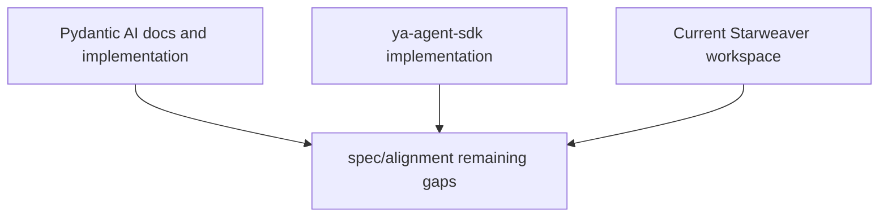

# Alignment Review

## Source Snapshots

| Source       | Local path          | Commit                                     | Role                                                                                                                             |
| ------------ | ------------------- | ------------------------------------------ | -------------------------------------------------------------------------------------------------------------------------------- |
| Pydantic AI  | `refs/pydantic-ai`  | `e356f32cf20fab8fd0c50df7526a43892402b51d` | Bottom-up abstraction baseline: agent loop, messages, models, tools, output, usage, retries, streaming                           |
| ya-agent-sdk | `refs/ya-agent-sdk` | `bb4443634a89699358163726898b2419b332905b` | Application SDK baseline: `create_agent`, `stream_agent`, context/state restore, environments, toolsets, HITL, subagents, skills |

## Method

This directory records remaining non-aligned behavior, product decisions, and verification gates that still need work.

## Documents

| File                                        | Remaining non-aligned area                                               |
| ------------------------------------------- | ------------------------------------------------------------------------ |
| `01-pydantic-ai-core-abstractions.md`       | Pydantic AI core abstraction decisions and provider replay status        |
| `02-agent-sdk-surface-parity.md`            | ya-agent-sdk `create_agent` / `stream_agent` API gaps                    |
| `03-runtime-context-session-streaming.md`   | runtime, context, session, live stream, durable session gaps             |
| `04-tools-toolsets-hitl.md`                 | tool metadata, HITL, MCP, and event taxonomy gaps                        |
| `05-models-output-provider-alignment.md`    | provider replay evidence, output exactness, usage, and media-output gaps |
| `06-subagents-environments-skills-media.md` | subagent, environment/resource, and media workflow gaps                  |
| `07-gap-matrix-and-roadmap.md`              | prioritized remaining roadmap                                            |

## Remaining Theme

The remaining asymmetry is mostly exact SDK contract parity:

- Python-style decorator syntax is intentionally mapped to Rust-native builders; multi-output selector ergonomics are not yet mirrored.
- External resource adapter breadth remains weaker than the reference SDKs; MCP stdio, streamable HTTP, session reinitialization, and protocol-level HITL/deferred paths have direct `rmcp` evidence.
- Durable SDK HITL orchestration, live interruption recovery, provider stream resume, replay-cursor transport, and typed resource restore seams now have store-bound service-level evidence; concrete external resource adapters remain product-owned.
- Subagents now materialize from `SubagentSpec`/`AgentSpec` projections for executable child agents, including registered skill roots, capability bundles, approval presets, child-owned environment providers, declarative hook/capability inheritance, built-in/deferred toolset wrappers, host-defined toolset wrapper factories, and typed `SubagentExecutionHook` callbacks, while product-owned built-in subagents are explicit registry entries rather than an implicit flag.
- Provider replay coverage now proves known provider-private continuation payloads for OpenAI Responses and Anthropic; future adapters must add same-provider private replay fixtures before claiming parity.
- Future non-HTTP/SSE provider cancellation/resume adapters, true real-time subagent stream interleaving, older standalone MCP SSE support, optional MCP roots/logging/completions/notifications host contracts, browser/remote-storage/media resource adapters, and live OS process reattachment need product-level APIs.
